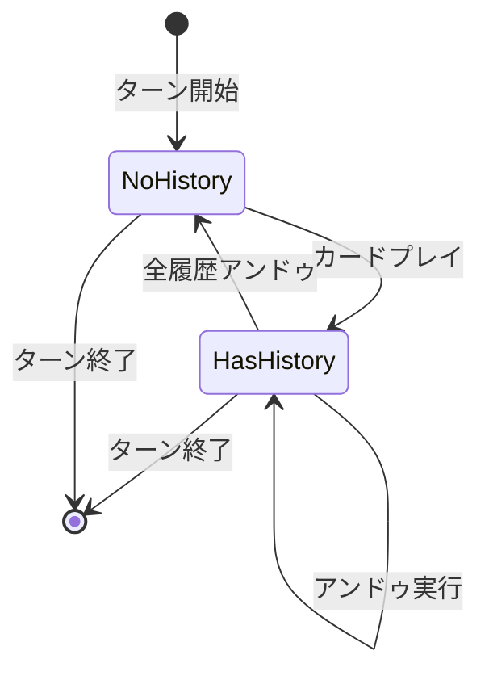
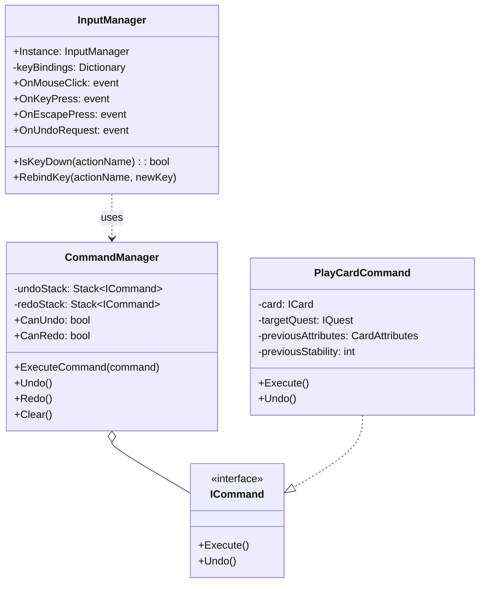

# 入力システム設計

## 概要

本ドキュメントは、ゲーム「アトリエ」の入力システム設計を定義するのだ。

**関連要件**: REQ-005, REQ-047-1
**技術設計参照**: [04-ui-input.md](../../../spec/design/04-ui-input.md)

---

## 対応デバイス

🔵 **キーボード + マウス対応** (REQ-005)

| デバイス | 用途 | 備考 |
|----------|------|------|
| マウス | UI操作、カードドラッグ&ドロップ | 左クリック、ドラッグ |
| キーボード | ショートカット、メニュー操作 | カスタマイズ可能 |

---

## デフォルトキーバインド

### グローバルアクション

| アクション | デフォルトキー | 説明 |
|-----------|---------------|------|
| Confirm | Enter | 決定・確認 |
| Cancel | Escape | キャンセル・メニュー |
| Undo | Ctrl + Z | 直前操作を取り消し |

### 依頼画面専用アクション

| アクション | デフォルトキー | 説明 |
|-----------|---------------|------|
| CardSlot1 | 1 | 手札1枚目を選択 |
| CardSlot2 | 2 | 手札2枚目を選択 |
| CardSlot3 | 3 | 手札3枚目を選択 |
| CardSlot4 | 4 | 手札4枚目を選択 |
| CardSlot5 | 5 | 手札5枚目を選択 |
| NextQuest | Tab | 次の依頼にフォーカス |
| EndTurn | Space | ターン終了 |

### マップ画面専用アクション

| アクション | デフォルトキー | 説明 |
|-----------|---------------|------|
| ZoomIn | + / = | マップ拡大 |
| ZoomOut | - | マップ縮小 |

---

## マウス操作

### 左クリック

| 対象 | アクション |
|------|----------|
| ボタン | ボタン押下 |
| カード（手札） | カード選択 |
| カード（ダブルクリック） | 選択中の依頼にプレイ |
| 依頼カード | 依頼選択 |
| マップノード | ノード選択・移動 |

### ドラッグ&ドロップ

| ドラッグ元 | ドロップ先 | アクション |
|-----------|-----------|----------|
| 手札カード | 依頼カード | その依頼にカードをプレイ |
| 手札カード | 錬金釜 | 選択中の依頼にカードをプレイ |
| 手札カード | 手札エリア外 | キャンセル（元の位置に戻る） |

### ホバー

| 対象 | アクション |
|------|----------|
| カード | ツールチップ表示（0.3秒後） |
| 依頼カード | 詳細情報表示 |
| UI要素 | ホバーエフェクト |

---

## アンドゥシステム

🔵 **ターン内限定のアンドゥ機能** (REQ-047-1)

### 仕様

| 項目 | 値 | 備考 |
|------|-----|------|
| アンドゥ範囲 | 現在ターン内 | ターン終了でリセット |
| 最大履歴数 | 50 | 🔴 推測値 |
| 対象操作 | カードプレイ | 他の操作は対象外 |

### アンドゥ対象

| 操作 | アンドゥ可能 | 備考 |
|------|-------------|------|
| カードプレイ | ✅ | 属性値・安定値を復元 |
| ターン終了 | ❌ | 次ターン開始後は不可 |
| 依頼達成 | ❌ | 報酬受け取り後は不可 |
| 暴発発生 | ❌ | 暴発後は不可 |

### 状態遷移



---

## キーバインドカスタマイズ

🟡 **カスタマイズ機能** (要件定義書から妥当な推測)

### カスタマイズ可能なアクション

| カテゴリ | アクション一覧 |
|----------|--------------|
| グローバル | Confirm, Cancel, Undo |
| 依頼画面 | CardSlot1-5, NextQuest, EndTurn |
| マップ画面 | ZoomIn, ZoomOut |

### 制約事項

- Escapeキーは変更不可（システム予約）
- 同一キーへの複数アクション割り当て禁止
- 修飾キー（Ctrl, Shift, Alt）との組み合わせ可能

---

## 入力優先度

入力が競合した場合の優先度を定義するのだ。

```
1. システムダイアログ（最優先）
   └─ エラーダイアログ、確認ダイアログ

2. モーダルUI
   └─ 設定画面、ポーズメニュー

3. メインUI
   └─ ゲーム内操作（カードプレイ、ボタン操作）

4. ショートカット
   └─ キーボードショートカット
```

---

## フォーカス管理

### キーボードフォーカス

| キー | アクション |
|------|----------|
| Tab | 次の要素にフォーカス移動 |
| Shift + Tab | 前の要素にフォーカス移動 |
| Enter | フォーカス中要素を実行 |
| 矢印キー | リスト/グリッド内移動 |

### フォーカス表示

- フォーカス中の要素には明確な枠線を表示
- 色: #FFD700 (ゴールド)
- 太さ: 2px

---

## 入力無効化

特定の状況で入力を無効化するのだ。

| 状況 | 無効化される入力 |
|------|----------------|
| アニメーション再生中 | すべての入力（スキップ可能な場合はクリックで解除） |
| ローディング中 | すべての入力 |
| ダイアログ表示中 | ダイアログ外の入力 |
| エネルギー不足時 | コスト超過カードの選択 |

---

## アクセシビリティ

🔵 **最低限のアクセシビリティ対応** (REQ-048)

| 対応項目 | 実装方法 |
|----------|----------|
| キーボード完全対応 | 全操作をキーボードで実行可能 |
| フォーカス表示 | 明確な視覚的フィードバック |
| 操作確認 | 重要操作は確認ダイアログ |

---

## 実装クラス図



---

## 変更履歴

| 日付 | バージョン | 変更内容 |
|------|----------|---------|
| 2025-12-20 | 1.0 | 初版作成 |
