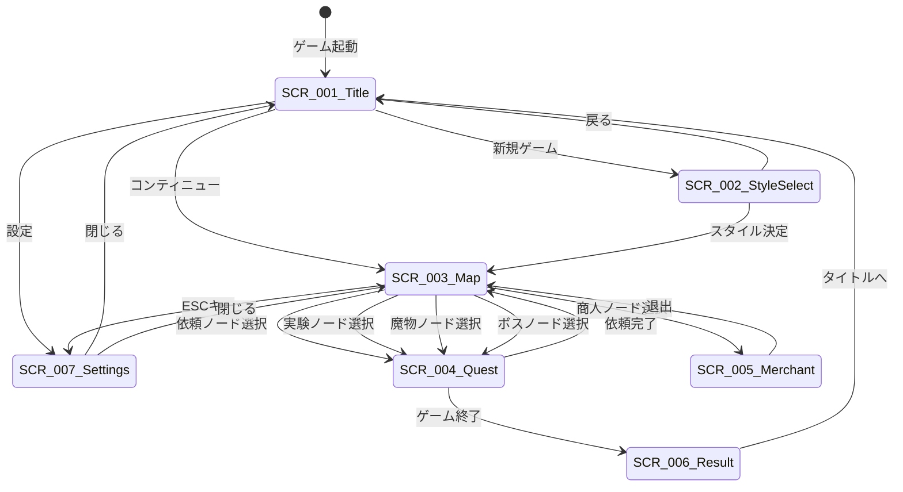

# UI設計概要

## 概要

本ドキュメントは、錬金術×ローグライク×デッキ構築ゲーム「アトリエ」のUI設計概要を定義するのだ。

**関連要件**: REQ-003, REQ-005, REQ-045〜048

---

## 画面一覧

| 画面ID | 画面名 | 説明 | 詳細ファイル |
|--------|--------|------|-------------|
| SCR-001 | タイトル画面 | ゲーム起動時の初期画面 | [title.md](screens/title.md) |
| SCR-002 | スタイル選択画面 | 錬金スタイルを選択 | [style-select.md](screens/style-select.md) |
| SCR-003 | マップ画面 | ノード進行型マップ | [map.md](screens/map.md) |
| SCR-004 | 依頼画面 | 依頼達成（戦闘）画面 | [quest.md](screens/quest.md) |
| SCR-005 | 商人画面 | カード購入・強化・削除 | [merchant.md](screens/merchant.md) |
| SCR-006 | リザルト画面 | ゲーム終了時の結果表示 | [result.md](screens/result.md) |
| SCR-007 | 設定画面 | 音量・キーバインド設定 | （ダイアログ） |

---

## 画面遷移図



---

## 共通UIコンポーネント

### ボタン

| タイプ | 用途 | スタイル |
|--------|------|---------|
| プライマリ | 確定アクション（決定、開始） | 背景色: プライマリ、文字: 白 |
| セカンダリ | キャンセル、戻る | 背景色: グレー、文字: 白 |
| 危険 | 削除など不可逆アクション | 背景色: 赤、文字: 白 |
| ゴースト | 補助的なアクション | 背景色: 透明、枠線のみ |

### ダイアログ

| タイプ | 用途 | ボタン構成 |
|--------|------|-----------|
| 確認ダイアログ | ユーザーの意思確認 | OK / キャンセル |
| 情報ダイアログ | 情報提示 | 閉じる |
| エラーダイアログ | エラー表示 | 閉じる / リトライ |
| 入力ダイアログ | シード値入力など | 決定 / キャンセル |

### カード表示

```
┌────────────────┐
│ [属性アイコン] │
│                │
│   [カード画像]  │
│                │
├────────────────┤
│ カード名       │
│ コスト: X      │
├────────────────┤
│ 火:X 水:X      │
│ 地:X 風:X      │
│ 安定:X 品質:X  │
└────────────────┘
```

### トランジション

| トリガー | アニメーション | 時間 |
|----------|---------------|------|
| 画面遷移（入） | フェードイン | 0.3s |
| 画面遷移（出） | フェードアウト | 0.3s |
| ダイアログ表示 | スケールイン | 0.2s |
| ダイアログ非表示 | スケールアウト | 0.2s |
| カードプレイ | 移動 + 回転 | 0.3s |

---

## デザイン規約

### カラーパレット

| 用途 | カラーコード | 説明 |
|------|-------------|------|
| プライマリ | #8B4513 | 茶色（錬金術のイメージ） |
| セカンダリ | #DAA520 | ゴールド（報酬のイメージ） |
| 背景（メイン） | #2C1810 | ダークブラウン |
| 背景（サブ） | #3D2817 | ミディアムブラウン |
| テキスト（メイン） | #F5DEB3 | ベージュ |
| テキスト（サブ） | #D2B48C | タン |
| エラー | #CD5C5C | インディアンレッド |
| 成功 | #32CD32 | ライムグリーン |
| 警告 | #FFA500 | オレンジ |

### 属性カラー

| 属性 | カラーコード | アイコン形状 |
|------|-------------|-------------|
| 火 | #FF4500 | 炎 |
| 水 | #1E90FF | 水滴 |
| 地 | #8B4513 | 山 |
| 風 | #90EE90 | 渦巻き |
| 毒 | #9400D3 | 骸骨 |

### フォント設定

| 用途 | フォント | サイズ | ウェイト |
|------|---------|--------|---------|
| タイトル | PixelMplus12 | 48px | Bold |
| 見出し | PixelMplus12 | 24px | Bold |
| 本文 | PixelMplus10 | 16px | Regular |
| キャプション | PixelMplus10 | 12px | Light |
| カード名 | PixelMplus12 | 14px | Bold |

### 余白・間隔

| 名称 | 値 | 用途 |
|------|-----|------|
| xs | 4px | 極小間隔 |
| sm | 8px | 小間隔（アイコンとテキスト） |
| md | 16px | 標準間隔（要素間） |
| lg | 24px | 大間隔（セクション間） |
| xl | 32px | 極大間隔（エリア間） |

---

## 解像度対応

🔵 **フルHD固定** (REQ-003)

| 項目 | 値 |
|------|-----|
| 解像度 | 1920 x 1080 |
| アスペクト比 | 16:9 |
| スケーリング | 固定（ピクセルパーフェクト） |

### レイアウトグリッド

```
┌──────────────────────────────────────────────────────────┐
│                      ヘッダーエリア (80px)                │
├──────────────────────────────────────────────────────────┤
│                                                          │
│                                                          │
│                   メインコンテンツエリア                   │
│                      (920px)                             │
│                                                          │
│                                                          │
├──────────────────────────────────────────────────────────┤
│                      フッターエリア (80px)                │
└──────────────────────────────────────────────────────────┘
        左マージン(32px)                    右マージン(32px)
```

---

## アクセシビリティ

🔵 **最低限のアクセシビリティ対応** (REQ-048)

🔵 **色覚多様性対応** (REQ-048-1)

### 対応項目

| 項目 | 対応方法 |
|------|----------|
| 属性識別 | 色だけでなくアイコンでも識別可能 |
| テキストコントラスト | WCAG AA基準（4.5:1以上） |
| フォーカス表示 | キーボード操作時に明確な枠線 |
| 効果音フィードバック | 重要なアクションに音を付与 |

---

## 変更履歴

| 日付 | バージョン | 変更内容 |
|------|----------|---------|
| 2025-12-20 | 1.0 | 初版作成 |
