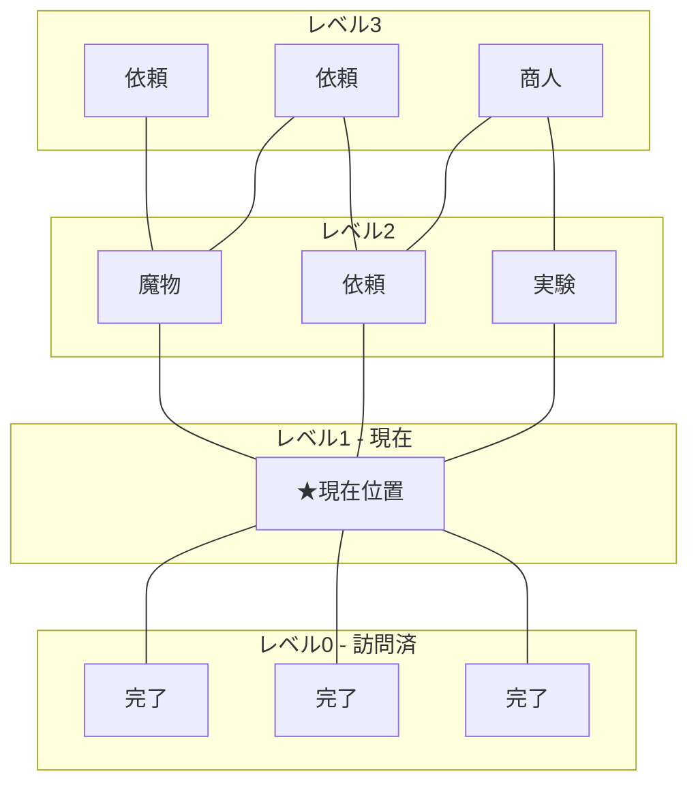

# マップ画面 詳細設計

## 基本情報

| 項目 | 値 |
|------|-----|
| 画面ID | SCR-003 |
| 親画面 | スタイル選択画面、タイトル画面（コンティニュー時） |
| 子画面 | 依頼画面、商人画面 |

---

## ワイヤーフレーム

```
┌─────────────────────────────────────────────────────────┐
│ レベル: 3/10    名声: 15    ゴールド: 250    [メニュー] │
├─────────────────────────────────────────────────────────┤
│                                                         │
│     [依頼]────[依頼]────[商人]                          │
│        \        |        /                              │
│         \       |       /                               │
│    [魔物]────[依頼]────[実験]     ← 選択可能ノード      │
│            \    |    /                                  │
│             \   |   /                                   │
│         [現在位置 ★]            ← 現在位置              │
│              /  |  \                                    │
│             /   |   \                                   │
│    [完了]─────[完了]─────[完了]   ← 訪問済みノード      │
│                                                         │
│     凡例: [依頼] [商人] [実験] [魔物] [ボス]            │
├─────────────────────────────────────────────────────────┤
│  選択中: 依頼ノード (★★☆☆☆)                           │
│  「村人Aが回復薬を求めています」                         │
│                                                         │
│  [デッキ確認]           [進む]                          │
└─────────────────────────────────────────────────────────┘
```

---

## UI要素

| 要素ID | 種類 | 説明 | 状態 |
|--------|------|------|------|
| txt-level | テキスト | 現在レベル/最大レベル | - |
| txt-fame | テキスト | 現在の名声値 | - |
| txt-gold | テキスト | 現在のゴールド | - |
| btn-menu | ボタン | ポーズメニューを開く | 常に有効 |
| pnl-map | パネル | マップ表示エリア | - |
| btn-node-* | ボタン | 各ノード（動的生成） | 到達可能時のみ有効 |
| img-player | 画像 | プレイヤー位置マーカー | - |
| pnl-preview | パネル | 選択中ノードプレビュー | - |
| btn-deck | ボタン | デッキ確認画面を開く | 常に有効 |
| btn-proceed | ボタン | 選択中ノードへ移動 | ノード選択時のみ有効 |

---

## ノードアイコン

🔵 **色覚多様性対応** (REQ-048-1)

| ノードタイプ | アイコン | 色 | 形状 |
|-------------|---------|-----|------|
| 依頼 | 📋 | 青 | 四角 |
| 商人 | 🛒 | 黄 | 六角 |
| 実験 | ⚗️ | 紫 | ひし形 |
| 魔物 | 👹 | 赤 | 円 |
| ボス | 👑 | 金 | 星 |
| 現在位置 | ★ | 緑 | 星 |
| 訪問済み | ✓ | グレー | 元の形状 |

---

## 状態遷移

### 初期状態
- マップを描画
- 現在位置を強調表示
- 到達可能なノードをハイライト

### ノード選択状態
- 選択中ノードの詳細をプレビューパネルに表示
- 「進む」ボタンを有効化

### ポーズ状態
- メニューオーバーレイ表示
- セーブ、設定、タイトルへ戻るを選択可能

---

## アニメーション

| トリガー | アニメーション | 時間 | イージング |
|----------|---------------|------|-----------|
| 画面表示時 | マップ展開アニメーション | 0.5s | ease-out |
| ノードホバー | パルスアニメーション | 0.3s loop | ease-in-out |
| ノード選択時 | 選択枠表示 | 0.2s | ease-out |
| 移動確定時 | プレイヤーマーカー移動 | 0.5s | ease-in-out |
| 画面遷移時 | フェードアウト | 0.3s | ease-in |

---

## イベント

| イベント名 | トリガー | 処理内容 |
|-----------|----------|----------|
| OnMenuClicked | btn-menu押下 / ESCキー | ポーズメニュー表示 |
| OnNodeHovered | ノードにマウスオーバー | プレビューパネル更新 |
| OnNodeClicked | ノードクリック | ノードを選択状態に |
| OnDeckClicked | btn-deck押下 | デッキ確認オーバーレイ表示 |
| OnProceedClicked | btn-proceed押下 | 選択ノードへ移動、対応画面へ遷移 |

---

## マップ生成表示



---

## アクセシビリティ

- [x] キーボード操作対応（矢印キーでノード選択、Enterで決定）
- [x] ノードタイプをアイコンと色の両方で識別可能
- [x] 到達不可ノードの明示（グレーアウト + 点線接続）

---

## 変更履歴

| 日付 | バージョン | 変更内容 |
|------|----------|---------|
| 2025-12-20 | 1.0 | 初版作成 |
