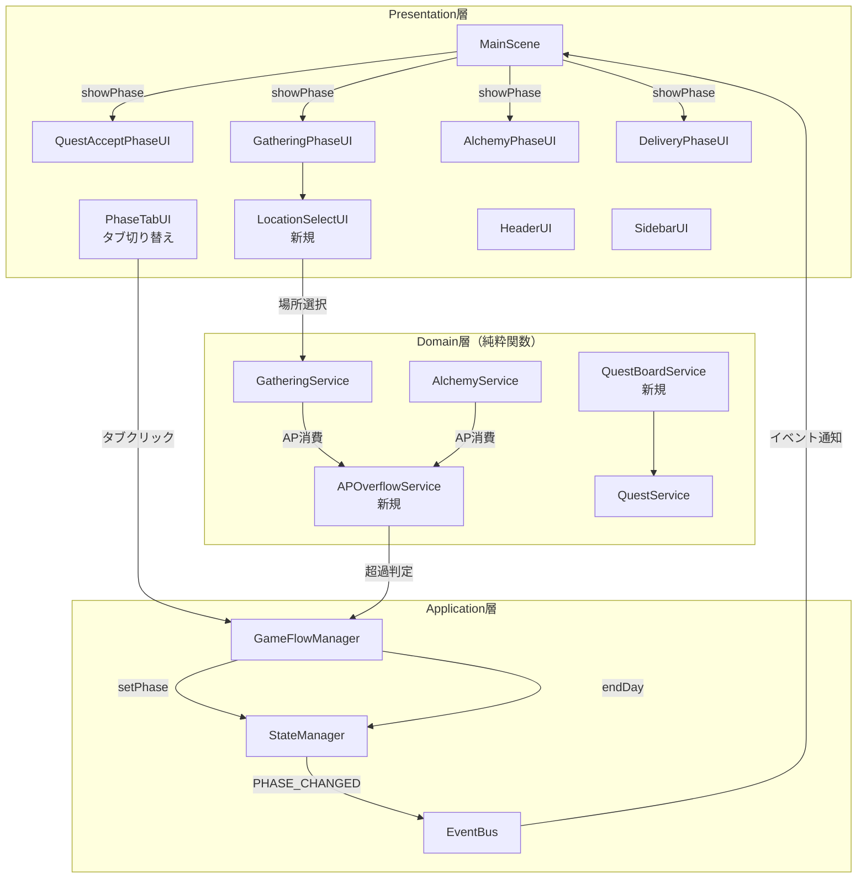

# フェーズ自由遷移システム アーキテクチャ設計

**作成日**: 2026-02-19
**関連要件定義**: [requirements.md](../../spec/free-phase-navigation/requirements.md)
**ヒアリング記録**: [design-interview.md](design-interview.md)

**【信頼性レベル凡例】**:
- 🔵 **青信号**: EARS要件定義書・設計文書・ユーザヒアリングを参考にした確実な設計
- 🟡 **黄信号**: EARS要件定義書・設計文書・ユーザヒアリングから妥当な推測による設計
- 🔴 **赤信号**: EARS要件定義書・設計文書・ユーザヒアリングにない推測による設計

---

## システム概要 🔵

**信頼性**: 🔵 *要件定義書REQ-001〜REQ-006・ヒアリング記録より*

現在の固定フェーズ進行（依頼受注→採取→調合→納品）を、プレイヤーが自由にフェーズを切り替えられるシステムに変更する。加えて、採取を「場所選択→ドラフト採取」の2段階に分割し、採取・調合のAP消費による自動日数進行を導入する。

### 変更の目的

- プレイヤーの戦略的自由度の向上
- 日数管理のリアリティ向上（行動にかかる時間の表現）
- 採取体験の深化（場所選択という意思決定の追加）

---

## アーキテクチャパターン 🔵

**信頼性**: 🔵 *CLAUDE.md技術スタック・既存設計 `docs/design/atelier-guild-rank/dataflow.md` より*

- **パターン**: Feature-Based Architecture + Functional Core / Imperative Shell
- **選択理由**: 既存プロジェクトのアーキテクチャを継承。機能単位の高凝集・低結合を維持しつつ、ビジネスロジックの純粋関数化によるテスト容易性を確保

### レイヤー構成（既存踏襲）

| レイヤー | 責務 | 変更内容 |
|---------|------|---------|
| **Presentation** | UI表示・ユーザー操作受付 | FooterUI→タブUI化、GatheringPhaseUI→場所選択追加 |
| **Application** | フロー制御・状態管理 | GameFlowManager→AP超過自動日進行、フェーズ自由遷移 |
| **Domain** | ビジネスロジック（純粋関数） | AP超過計算、日進行計算（新規追加） |
| **Infrastructure** | 永続化・外部連携 | セーブデータ構造の拡張 |

---

## コンポーネント構成

### 変更対象コンポーネント一覧 🔵

**信頼性**: 🔵 *要件定義書「影響を受ける既存コンポーネント」表・既存実装調査より*

| コンポーネント | レイヤー | 変更種別 | 影響度 |
|---------------|---------|---------|--------|
| **VALID_PHASE_TRANSITIONS** | Application | 修正 | 高 |
| **StateManager** | Application | 修正（軽微） | 低 |
| **GameFlowManager** | Application | 大幅修正 | 高 |
| **MainScene** | Presentation | 修正 | 中 |
| **FooterUI → PhaseTabUI** | Presentation | 新規置換 | 高 |
| **GatheringPhaseUI** | Presentation | 大幅修正 | 高 |
| **LocationSelectUI** | Presentation | 新規追加 | 高 |
| **APOverflowService** | Domain | 新規追加 | 高 |
| **QuestBoardService** | Domain | 新規追加 | 中 |
| **QuestService** | Domain | 修正 | 中 |

---

### 1. フェーズ遷移システム（Application層） 🔵

**信頼性**: 🔵 *REQ-001・ヒアリングQ1「完全自由切り替え」より*

#### VALID_PHASE_TRANSITIONS の変更

```
変更前（線形遷移）:
  QUEST_ACCEPT → [GATHERING]
  GATHERING → [ALCHEMY]
  ALCHEMY → [DELIVERY]
  DELIVERY → [QUEST_ACCEPT]

変更後（自由遷移）:
  QUEST_ACCEPT → [GATHERING, ALCHEMY, DELIVERY]
  GATHERING → [QUEST_ACCEPT, ALCHEMY, DELIVERY]
  ALCHEMY → [QUEST_ACCEPT, GATHERING, DELIVERY]
  DELIVERY → [QUEST_ACCEPT, GATHERING, ALCHEMY]
```

#### StateManager.setPhase() 🔵

**信頼性**: 🔵 *既存実装 `src/shared/services/state-manager/StateManager.ts` より*

- 既存のバリデーションロジック（`canTransitionTo()`）はそのまま活用
- VALID_PHASE_TRANSITIONS の値を更新するだけで対応可能
- PHASE_CHANGED イベントの発行も既存のまま

#### GameFlowManager の変更 🔵

**信頼性**: 🔵 *REQ-001・REQ-003・REQ-004・既存実装 `src/shared/services/game-flow/game-flow-manager.ts` より*

**変更内容:**
- `endPhase()`: 次フェーズの自動決定ロジックを廃止。代わりに `switchPhase(targetPhase)` メソッドを新設
- `startDay()`: AP回復ロジックを変更（MAX_AP - 前日超過分）
- `endDay()`: 既存処理を維持（依頼期限-1、手札補充、AP回復、ランク判定）
- 新規: `processAPOverflow(consumedAP)` メソッド追加

```
新しいフェーズ遷移フロー:
  ユーザー操作（タブクリック）
    → switchPhase(targetPhase)
      → 現フェーズの終了処理（セッション中断確認等）
      → StateManager.setPhase(targetPhase)
      → PHASE_CHANGED イベント発行
      → MainScene.showPhase(targetPhase)
```

---

### 2. AP超過自動日進行システム（Domain層 + Application層） 🔵

**信頼性**: 🔵 *REQ-003・ヒアリングQ2/Q3/Q5/Q8より*

#### APOverflowService（新規 Domain層） 🔵

**信頼性**: 🔵 *REQ-003-01〜REQ-003-06・ヒアリングQ5より*

純粋関数として実装。副作用なし。

**責務:**
- AP超過判定: 消費AP > 残AP かを判定
- 日数消費計算: 超過APから必要な日数消費を計算
- 翌日AP計算: MAX_AP - 超過分の残り

```
計算ロジック:
  消費AP = baseCost + additionalCost
  超過AP = max(0, 消費AP - 現在AP)
  消費日数 = ceil(超過AP / MAX_AP)  ※超過が0なら0日
  翌日AP = MAX_AP - (超過AP % MAX_AP)  ※超過が0ならMAX_AP
```

**例:**
| 現在AP | 消費AP | 超過AP | 消費日数 | 翌日AP |
|--------|--------|--------|---------|--------|
| 3 | 2 | 0 | 0 | (そのまま1残) |
| 3 | 4 | 1 | 1 | 2 |
| 3 | 6 | 3 | 1 | 3(=MAX) |
| 3 | 7 | 4 | 2 | 2 |

#### GameFlowManager での自動日進行処理 🔵

**信頼性**: 🔵 *REQ-003-02・ヒアリングQ10「既存処理を維持」より*

```
AP消費アクション実行
  → APOverflowService.calculate(currentAP, consumedAP)
  → 超過あり？
    → Yes: AP超過プレビュー表示（NFR-102）
      → 確認後、消費日数分 endDay() を順次実行（EDGE-002）
      → 翌日AP を設定
      → ゲームオーバー判定（REQ-003-04）
    → No: AP を減算、通常続行
```

---

### 3. 採取2段階化（Presentation層 + Domain層） 🔵

**信頼性**: 🔵 *REQ-002・ヒアリングQ4より*

#### 場所選択ステージ（LocationSelectUI - 新規） 🔵

**信頼性**: 🔵 *REQ-002-01〜REQ-002-05・ヒアリングQ4「採取地一覧、マップ表示、移動日数表示、素材プレビュー、手札連動」より*

**責務:**
- 採取地カード（手札内）の一覧表示
- 各採取地の情報表示（移動APコスト、採取可能素材プレビュー）
- 採取地選択 → ドラフト採取セッション開始

#### GatheringPhaseUI の状態遷移変更 🔵

**信頼性**: 🔵 *既存設計 `docs/design/atelier-guild-rank/ui-design/screens/gathering.md` より*

```
変更前:
  HandView → LocationDetail → DraftSession → GatherResult

変更後:
  LocationSelect（新規）→ DraftSession → GatherResult
  ※ HandView と LocationDetail は LocationSelectUI に統合
```

#### フェーズ離脱時の採取セッション処理 🟡

**信頼性**: 🟡 *EDGE-001・既存GatheringPhaseUIの状態管理から妥当な推測*

- ドラフト採取セッション進行中にフェーズ切り替えが発生した場合:
  - 確認ダイアログを表示
  - 「中断する」→ セッション破棄、場所選択に戻る
  - 「キャンセル」→ フェーズ切り替えをキャンセル

---

### 4. タブ切り替えUI（Presentation層） 🔵

**信頼性**: 🔵 *REQ-006・ヒアリングQ9「タブ切り替えUIに変更」より*

#### PhaseTabUI（FooterUIの置換） 🔵

**信頼性**: 🔵 *REQ-006-01〜REQ-006-03より*

**責務:**
- 4つのタブ（依頼・採取・調合・納品）を表示
- アクティブタブの視覚的強調
- タブクリックによるフェーズ切り替え
- 「日終了」ボタンの配置

#### FooterUI のレイアウト変更 🟡

**信頼性**: 🟡 *既存 `docs/design/atelier-guild-rank/ui-design/screens/main.md` から妥当な推測*

```
変更前（FooterUI）:
  [フェーズインジケーター(プログレスバー)] [手札カード] [休憩][次へ]

変更後（FooterUI + PhaseTabUI）:
  [依頼|採取|調合|納品](タブ) [手札カード] [日終了]
```

- プログレスバー → クリック可能なタブに変更
- 「次へ」ボタン → 廃止（タブ切り替えで代替）
- 「休憩」ボタン → 「日終了」ボタンに名称変更・機能維持

---

### 5. 依頼掲示板システム（Domain層） 🔵

**信頼性**: 🔵 *REQ-005・ヒアリングQ6「訪問+掲示板の両方」より*

#### QuestBoardService（新規） 🟡

**信頼性**: 🟡 *REQ-005-01〜REQ-005-03から妥当な推測*

**責務:**
- 掲示板依頼の管理（累積、期限切れ削除）
- 訪問依頼の管理（数日ごとに更新）
- 依頼受注処理（既存QuestService.acceptQuest()を活用）

#### QuestService の変更 🔵

**信頼性**: 🔵 *REQ-005・既存実装より*

- `generateDailyQuests()` → 掲示板更新と訪問更新に分離
- `updateDeadlines()` → 掲示板依頼の期限切れ処理を追加

---

### 6. 明示的日終了（Application層） 🔵

**信頼性**: 🔵 *REQ-004・ヒアリングQ7「両方あり」より*

- 既存の `endDay()` ロジックをそのまま活用
- 「日終了」ボタン押下 → 残AP破棄 → endDay() 実行
- AP超過による自動日進行と共存

---

## システム構成図 🔵

**信頼性**: 🔵 *既存設計・要件定義より*



---

## ディレクトリ構造 🔵

**信頼性**: 🔵 *既存プロジェクト構造より*

### 新規ファイル

```
src/
├── features/
│   ├── gathering/
│   │   ├── components/
│   │   │   └── LocationSelectUI.ts      # 新規: 採取場所選択UI
│   │   └── services/
│   │       └── ap-overflow-service.ts    # 新規: AP超過計算（純粋関数）
│   └── quest/
│       └── services/
│           └── quest-board-service.ts    # 新規: 掲示板管理
├── shared/
│   ├── components/
│   │   └── PhaseTabUI.ts                # 新規: タブ切り替えUI
│   └── presentation/ui/phases/
│       └── components/
│           └── APOverflowPreview.ts     # 新規: AP超過プレビュー表示
```

### 修正ファイル

```
src/
├── shared/
│   ├── services/
│   │   ├── state-manager/
│   │   │   └── initial-state.ts         # VALID_PHASE_TRANSITIONS更新
│   │   └── game-flow/
│   │       └── game-flow-manager.ts     # フェーズ自由遷移・AP超過対応
│   └── components/
│       └── FooterUI.ts                  # プログレスバー→タブUI連携
├── features/
│   ├── gathering/
│   │   └── components/
│   │       └── GatheringPhaseUI.ts      # 場所選択ステージ統合
│   └── quest/
│       └── services/
│           └── quest-service.ts         # 掲示板方式対応
└── scenes/
    └── MainScene.ts                     # タブ切り替え連携
```

---

## 非機能要件の実現方法

### パフォーマンス 🟡

**信頼性**: 🟡 *NFR-001・NFR-002から妥当な推測*

- **フェーズ切り替え < 200ms**: 既存の `showPhase()` は各フェーズUIの `setVisible()` 切り替えのみで高速。タブUI追加後も同等の速度を維持
- **自動日進行 < 500ms**: 既存 `endDay()` + `startDay()` の直列実行。複数日分の場合は順次実行だが、1日あたりの処理が軽量なため500ms以内を達成可能
- **最適化戦略**: フェーズUIは初回表示時のみ生成し、非表示時はオブジェクトを保持（プーリングと同等の効果）

### セキュリティ 🔵

**信頼性**: 🔵 *既存セキュリティルール・クライアントサイドゲームの特性より*

- クライアントサイドゲームのため、サーバーサイドセキュリティは対象外
- セーブデータのバリデーション: 新規フィールド（AP超過値、掲示板依頼リスト）にも既存の検証パターンを適用
- ゲーム状態の整合性チェック: AP値の範囲チェック、フェーズ遷移の妥当性チェック

### ユーザビリティ 🟡

**信頼性**: 🟡 *NFR-101・NFR-102から妥当な推測*

- **自動日進行通知**: DAY_STARTEDイベントに連動した視覚的トースト通知
- **AP超過プレビュー**: 行動実行前に消費AP・翌日APを表示する確認ダイアログ
- **タブUI**: アクティブタブの強調表示（既存PHASE_COLORSを活用）

---

## 技術的制約 🔵

**信頼性**: 🔵 *CLAUDE.md・既存実装より*

### フレームワーク制約

- Phaser 3.87+ のシーン・ゲームオブジェクトシステムに依存
- rexUIプラグインのスクロールパネル・ラベル・ダイアログを活用
- UIコンポーネントは BaseComponent 継承パターンに従う

### 状態管理制約

- StateManager のイミュータブル更新パターンを維持
- EventBus による疎結合通信パターンを維持
- DIコンテナ（tsyringe）によるサービス注入を維持

### 既存仕様維持制約

- 同時依頼受注上限: 3件（REQ-401）
- AP上限: 3/日（REQ-402）
- デッキシステム: 初期15枚、上限30枚、手札上限7枚（REQ-403）
- ギルドランクシステム: G〜S、昇格ゲージ、昇格試験（REQ-404）
- ショップシステム: カード/素材/強化/アーティファクト（REQ-405）

---

## 関連文書

- **データフロー**: [dataflow.md](dataflow.md)
- **型定義**: [interfaces.ts](interfaces.ts)
- **要件定義**: [requirements.md](../../spec/free-phase-navigation/requirements.md)
- **ユーザストーリー**: [user-stories.md](../../spec/free-phase-navigation/user-stories.md)
- **受け入れ基準**: [acceptance-criteria.md](../../spec/free-phase-navigation/acceptance-criteria.md)
- **ヒアリング記録（要件）**: [interview-record.md](../../spec/free-phase-navigation/interview-record.md)
- **設計ヒアリング記録**: [design-interview.md](design-interview.md)
- **既存設計（データフロー）**: [dataflow.md](../atelier-guild-rank/dataflow.md)
- **既存設計（コアサービス）**: [core-systems-core-services.md](../atelier-guild-rank/core-systems-core-services.md)
- **既存設計（メイン画面）**: [main.md](../atelier-guild-rank/ui-design/screens/main.md)
- **既存設計（採取画面）**: [gathering.md](../atelier-guild-rank/ui-design/screens/gathering.md)

---

## 信頼性レベルサマリー

- 🔵 青信号: 22件 (85%)
- 🟡 黄信号: 4件 (15%)
- 🔴 赤信号: 0件 (0%)

**品質評価**: ✅ 高品質
