# フェーズ自由遷移システム データフロー図

**作成日**: 2026-02-19
**関連アーキテクチャ**: [architecture.md](architecture.md)
**関連要件定義**: [requirements.md](../../spec/free-phase-navigation/requirements.md)

**【信頼性レベル凡例】**:
- 🔵 **青信号**: EARS要件定義書・設計文書・ユーザヒアリングを参考にした確実なフロー
- 🟡 **黄信号**: EARS要件定義書・設計文書・ユーザヒアリングから妥当な推測によるフロー
- 🔴 **赤信号**: EARS要件定義書・設計文書・ユーザヒアリングにない推測によるフロー

---

## 1. システム全体のデータフロー 🔵

**信頼性**: 🔵 *既存設計 `docs/design/atelier-guild-rank/dataflow.md` v2.0.0・要件定義より*

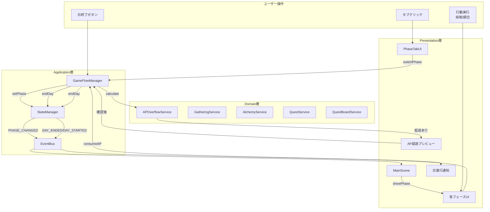

---

## 2. フェーズ自由遷移フロー 🔵

**信頼性**: 🔵 *REQ-001・REQ-001-01〜REQ-001-03・ヒアリングQ1より*

### 2.1 通常のフェーズ切り替え

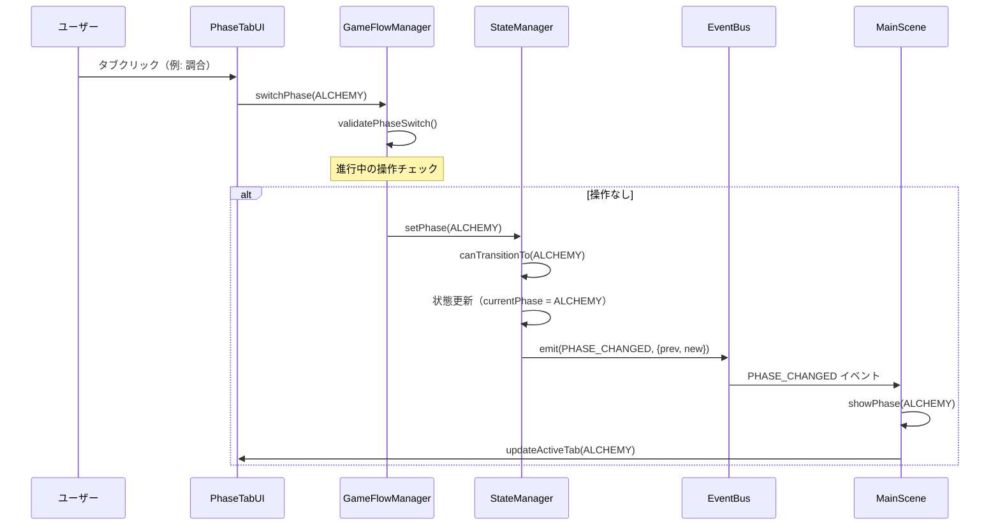

**詳細ステップ**:
1. ユーザーがフッターのフェーズタブをクリック
2. PhaseTabUI が GameFlowManager.switchPhase() を呼び出し
3. GameFlowManager が現在の進行中操作をチェック
4. 操作がなければ StateManager.setPhase() で状態更新
5. PHASE_CHANGED イベントが EventBus 経由で全コンポーネントに通知
6. MainScene が showPhase() で対応するフェーズUIを表示

### 2.2 採取セッション中のフェーズ切り替え 🟡

**信頼性**: 🟡 *EDGE-001・REQ-001-03から妥当な推測*

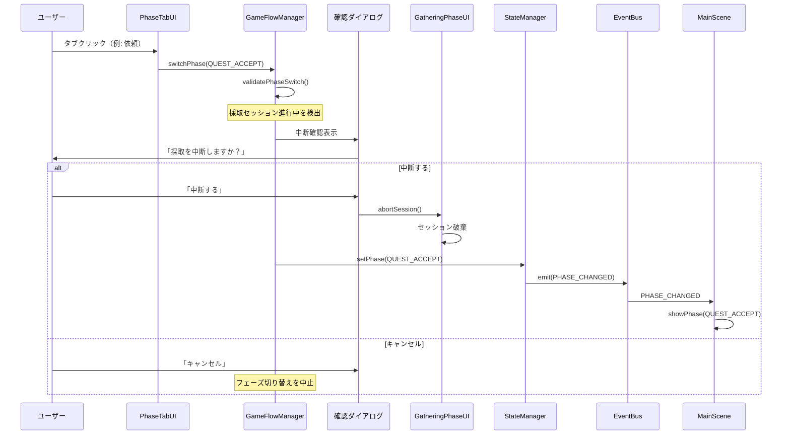

---

## 3. AP超過自動日進行フロー 🔵

**信頼性**: 🔵 *REQ-003・REQ-003-01〜REQ-003-06・ヒアリングQ2/Q5/Q10より*

### 3.1 採取でのAP超過 🔵

**信頼性**: 🔵 *REQ-003-05・ヒアリングQ2/Q3より*

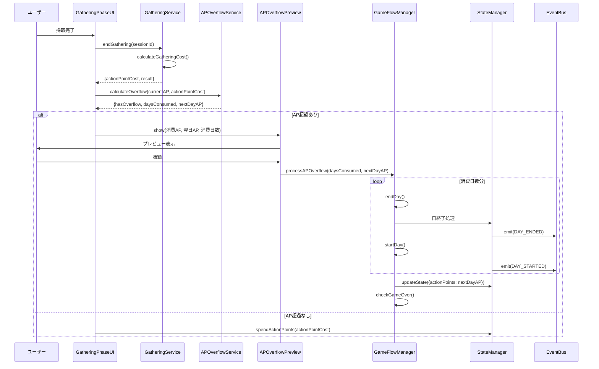

### 3.2 調合でのAP超過 🔵

**信頼性**: 🔵 *REQ-003-06・ヒアリングQ8より*

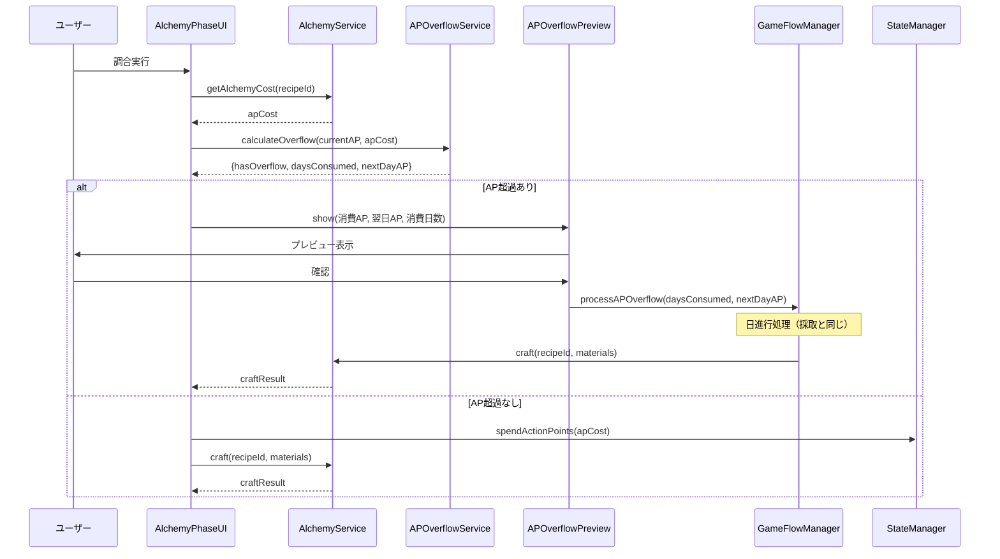

### 3.3 複数日消費のケース 🟡

**信頼性**: 🟡 *REQ-003-03・EDGE-002から妥当な推測*

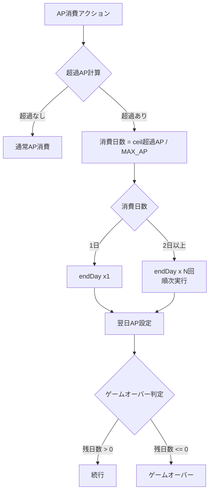

**各endDay()で実行される処理** 🔵:
1. 残り日数を1減算
2. 依頼期限を更新（`updateDeadlines()`）
3. 手札補充（`refillHand()`）
4. 掲示板更新（訪問依頼の更新判定）
5. ランク判定
6. セーブ

---

## 4. 採取2段階化フロー 🔵

**信頼性**: 🔵 *REQ-002・REQ-002-01〜REQ-002-05・ヒアリングQ4・既存設計より*

### 4.1 場所選択→ドラフト採取

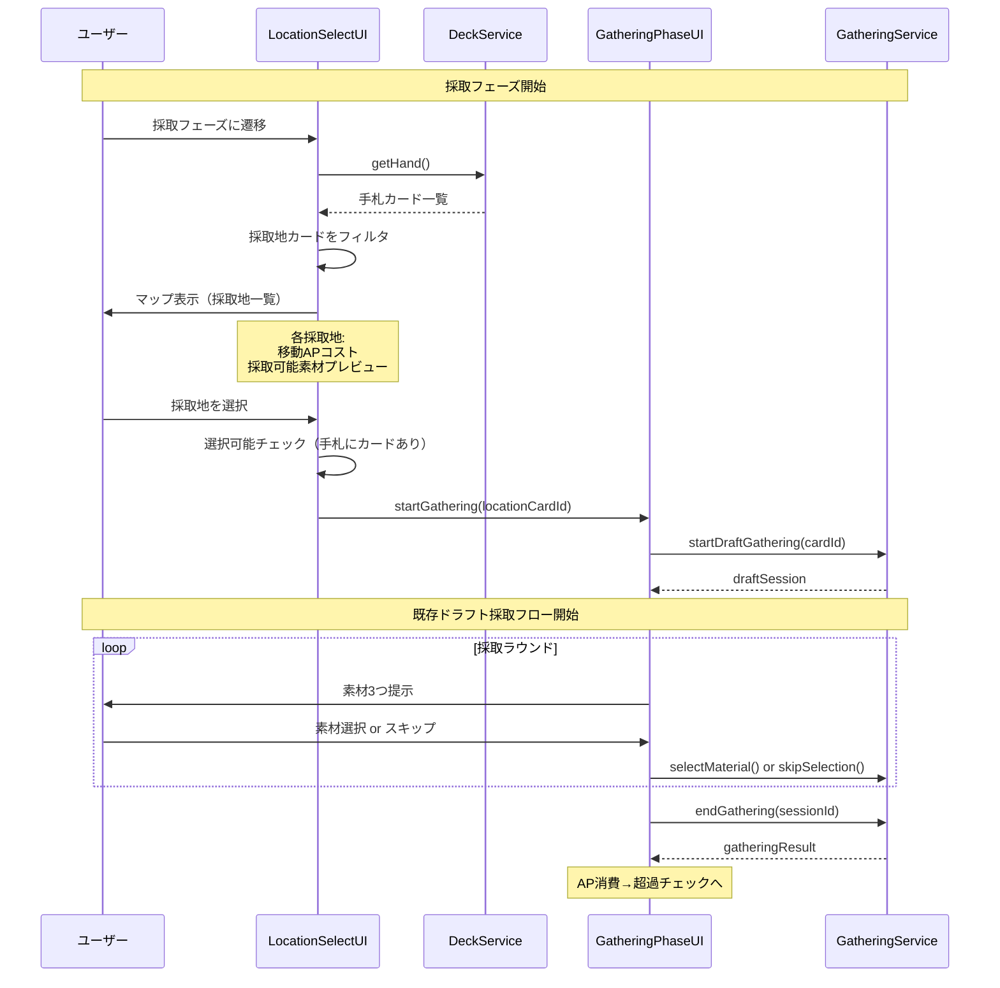

### 4.2 場所選択画面の状態遷移 🔵

**信頼性**: 🔵 *REQ-002-01〜REQ-002-04・ヒアリングQ4より*

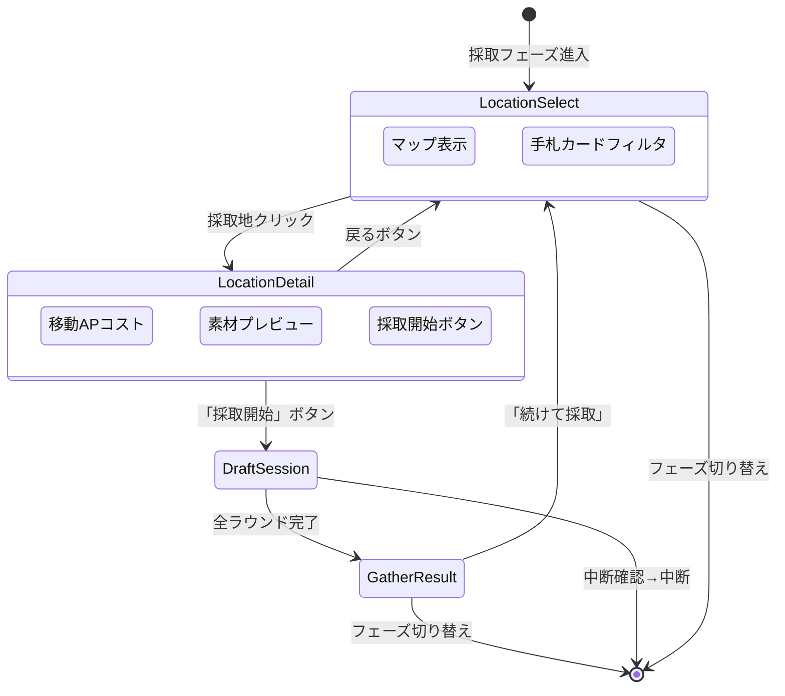

---

## 5. 明示的日終了フロー 🔵

**信頼性**: 🔵 *REQ-004・REQ-004-01・ヒアリングQ7より*

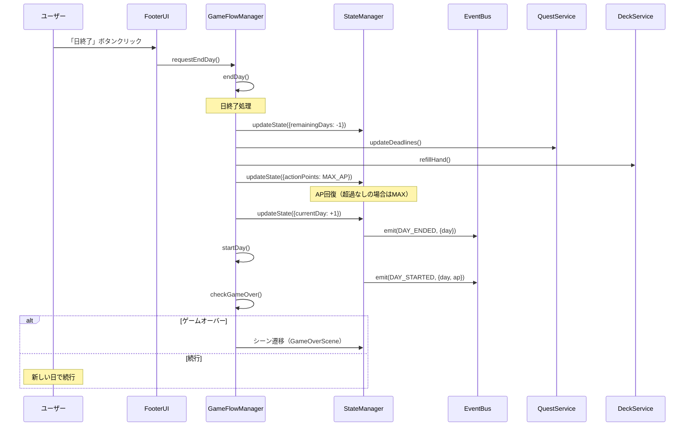

---

## 6. 依頼掲示板フロー 🔵

**信頼性**: 🔵 *REQ-005・REQ-005-01〜REQ-005-03・ヒアリングQ6より*

### 6.1 掲示板更新フロー

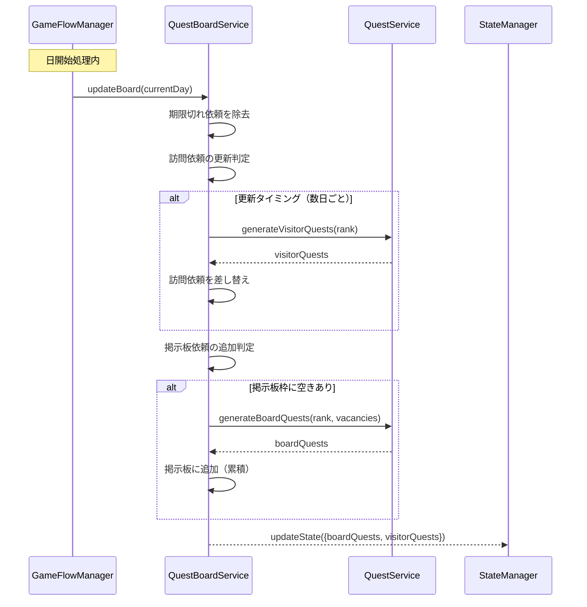

### 6.2 依頼受注フロー 🔵

**信頼性**: 🔵 *REQ-005・既存QuestService.acceptQuest()より*

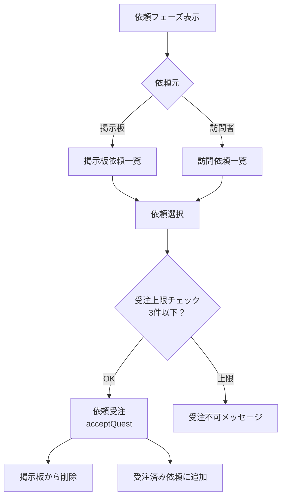

---

## 7. IGameState 変更点 🔵

**信頼性**: 🔵 *既存設計・要件定義より*

### 新規追加フィールド 🟡

**信頼性**: 🟡 *要件から妥当な推測（具体的なフィールド名は推測）*

```typescript
// 既存フィールド（変更なし）
currentDay: number;
remainingDays: number;
currentPhase: GamePhase;
gold: number;
actionPoints: number;   // 既存（AP残量管理）

// 新規追加フィールド
apOverflow: number;            // 前日のAP超過分（翌日AP回復時に差し引き）
boardQuests: Quest[];          // 掲示板依頼（累積）
visitorQuests: Quest[];        // 訪問依頼
lastVisitorUpdateDay: number;  // 訪問依頼の最終更新日
```

### 削除・変更フィールド 🔵

**信頼性**: 🔵 *要件定義・既存設計より*

```typescript
// 変更なし
// currentPhaseは既存のまま（GamePhaseの4値）
// actionPointsの回復ロジックのみ変更（MAX_AP - apOverflow）
```

---

## 8. エラーハンドリングフロー 🟡

**信頼性**: 🟡 *既存実装パターン・EDGE-001〜EDGE-103から妥当な推測*

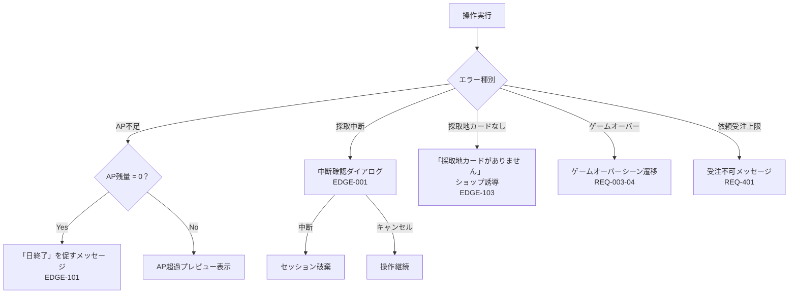

---

## 9. 状態管理フロー

### フェーズ状態遷移 🔵

**信頼性**: 🔵 *REQ-001・REQ-006より*

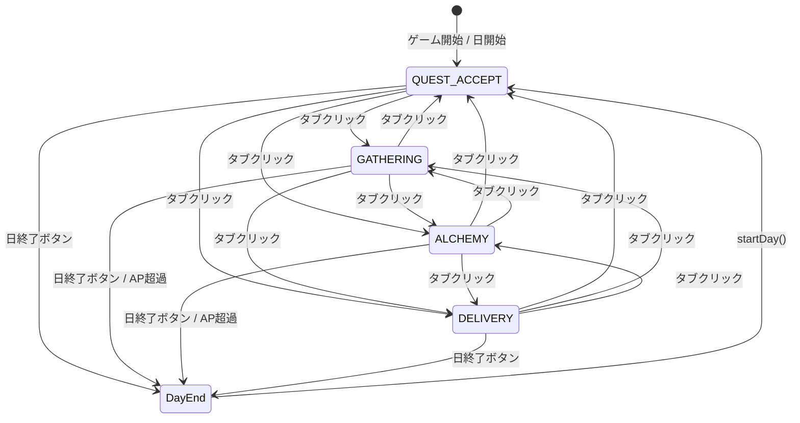

### AP状態遷移 🔵

**信頼性**: 🔵 *REQ-003・REQ-003-01・ヒアリングQ5より*

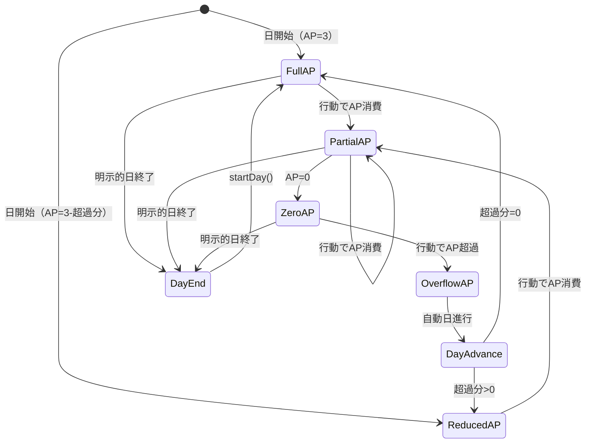

---

## 関連文書

- **アーキテクチャ**: [architecture.md](architecture.md)
- **型定義**: [interfaces.ts](interfaces.ts)
- **要件定義**: [requirements.md](../../spec/free-phase-navigation/requirements.md)
- **ユーザストーリー**: [user-stories.md](../../spec/free-phase-navigation/user-stories.md)
- **受け入れ基準**: [acceptance-criteria.md](../../spec/free-phase-navigation/acceptance-criteria.md)

---

## 信頼性レベルサマリー

- 🔵 青信号: 18件 (82%)
- 🟡 黄信号: 4件 (18%)
- 🔴 赤信号: 0件 (0%)

**品質評価**: ✅ 高品質
