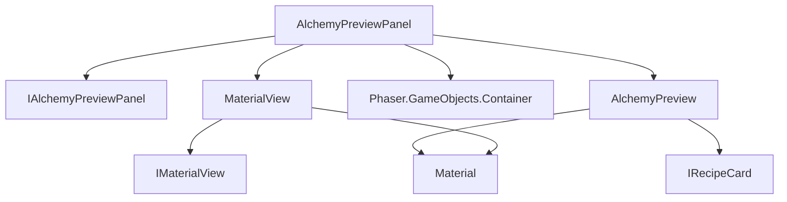

# TASK-0226: AlchemyPreviewPanel 要件定義書

**タスクID**: TASK-0226
**作成日**: 2026-01-10
**バージョン**: 1.0

## 1. 概要

### 1.1 目的
調合フェーズにおいて、プレイヤーが選択したレシピと素材から調合結果を事前に確認できるプレビューパネルを提供する。これにより、プレイヤーは調合実行前に結果を把握し、より戦略的な素材選択が可能になる。

### 1.2 スコープ
- 調合プレビュー情報の表示
- 予測品質の視覚化
- 選択素材リストの表示
- 継承特性の表示
- 調合可否インジケーター
- リアルタイム更新機能

## 2. 機能要件（EARS記法）

### 2.1 プレビュー表示（Ubiquitous）

**REQ-226-001**: [Ubiquitous] システムは、AlchemyPreviewPanelコンポーネントを通じて調合プレビュー情報を表示できるものとする。

**REQ-226-002**: [Ubiquitous] プレビューパネルは、レシピ名、予測品質、選択素材リスト、継承特性、調合可否を表示する領域を持つものとする。

**REQ-226-003**: [Ubiquitous] パネルサイズは幅250px、高さ350pxを標準とし、Phaserコンテナとして実装されるものとする。

### 2.2 プレビュー設定（Event-driven）

**REQ-226-004**: [Event-driven] `setPreview(preview)` が呼び出されたとき、システムはプレビュー情報を解析し、各セクションに適切な内容を表示するものとする。

**REQ-226-005**: [Event-driven] `setPreview(null)` が呼び出されたとき、システムは空の初期状態（「レシピを選択してください」）を表示するものとする。

**REQ-226-006**: [Event-driven] レシピ名が設定されたとき、システムはパネル上部にレシピ名を金色（#ffd700）で表示するものとする。

### 2.3 品質表示（State-driven）

**REQ-226-007**: [State-driven] 予測品質が設定されている間、システムは品質名をテキストで表示し、品質レベルに応じた色で装飾するものとする。

**REQ-226-008**: [State-driven] 品質ゲージが表示されている間、システムは6段階の品質レベル（poor, normal, good, rare, epic, legendary）に応じた塗りつぶし幅でゲージを描画するものとする。

品質カラーマッピング:
| 品質 | カラーコード | 説明 |
|------|--------------|------|
| legendary | #ffd700 | 金色 |
| epic | #a335ee | 紫色 |
| rare | #0070dd | 青色 |
| good | #1eff00 | 緑色 |
| normal | #ffffff | 白色 |
| poor | #9d9d9d | 灰色 |

### 2.4 素材リスト表示（State-driven）

**REQ-226-009**: [State-driven] 素材が選択されている間、システムはMaterialViewコンポーネントをコンパクトモードで使用して素材を表示するものとする。

**REQ-226-010**: [State-driven] 素材が5つ以上選択されている間、システムは最初の4つをグリッド表示し、残りを「+N more」形式で表示するものとする。

**REQ-226-011**: [State-driven] 素材が選択されていない間、システムは「素材を選択してください」メッセージを表示するものとする。

### 2.5 特性表示（State-driven）

**REQ-226-012**: [State-driven] 継承特性が存在する間、システムは最大3つの特性をリスト形式で表示するものとする。

**REQ-226-013**: [State-driven] 継承特性が存在しない間、システムは「継承特性なし」メッセージを表示するものとする。

### 2.6 調合可否インジケーター（State-driven）

**REQ-226-014**: [State-driven] `canCraft`がtrueの間、システムは「調合可能」ステータスを緑色で表示するものとする。

**REQ-226-015**: [State-driven] `missingMaterials`配列に要素が存在する間、システムは「素材不足」ステータスを赤色で表示するものとする。

**REQ-226-016**: [State-driven] レシピが未選択または判定待ちの間、システムは「待機中」ステータスを灰色で表示するものとする。

### 2.7 リアルタイム更新（Event-driven）

**REQ-226-017**: [Event-driven] `addMaterial(material)` が呼び出されたとき、システムはプレビューの素材リストに新しい素材を追加し、表示を更新するものとする。

**REQ-226-018**: [Event-driven] `removeMaterial(material)` が呼び出されたとき、システムはプレビューの素材リストから該当素材を削除し、表示を更新するものとする。

**REQ-226-019**: [Event-driven] `clearMaterials()` が呼び出されたとき、システムはプレビューの素材リストをすべてクリアし、空状態を表示するものとする。

### 2.8 表示制御（Event-driven）

**REQ-226-020**: [Event-driven] `setVisible(visible)` が呼び出されたとき、システムはパネル全体の表示/非表示を切り替えるものとする。

**REQ-226-021**: [Event-driven] `setEnabled(enabled)` が呼び出されたとき、システムはパネルの有効/無効状態を切り替え、無効時は透明度を0.5に設定するものとする。

### 2.9 リソース管理（Event-driven）

**REQ-226-022**: [Event-driven] `destroy()` が呼び出されたとき、システムはすべてのMaterialViewインスタンスとPhaserコンテナを適切に破棄するものとする。

## 3. 非機能要件

### 3.1 パフォーマンス

**NFR-226-001**: プレビュー更新処理は16ms以内に完了するものとする（60FPS維持）。

**NFR-226-002**: MaterialViewの生成・破棄は必要最小限に抑え、可能な場合は再利用するものとする。

**NFR-226-003**: 素材変更時のリアルタイム更新は、ユーザーが遅延を感じない程度（100ms以内）に完了するものとする。

### 3.2 保守性

**NFR-226-004**: コンポーネントはIAlchemyPreviewPanelインターフェースに準拠し、テスト可能な設計とするものとする。

**NFR-226-005**: 品質カラーマッピングは定数として外部化し、変更が容易な構造とするものとする。

**NFR-226-006**: 各UIセクションは独立したメソッドで構築し、変更影響範囲を限定するものとする。

### 3.3 ユーザビリティ

**NFR-226-007**: 品質情報は色と文字の両方で表現し、色覚特性に配慮するものとする。

**NFR-226-008**: 空状態や未選択状態でも適切なガイダンスメッセージを表示するものとする。

**NFR-226-009**: ステータスインジケーターは絵文字とテキストの組み合わせで直感的に状態を伝えるものとする。

## 4. インターフェース設計

### 4.1 AlchemyPreview型

```typescript
/**
 * 調合プレビュー情報
 *
 * 調合結果の予測情報を保持する。
 * プレビューパネルの表示に使用される。
 */
export interface AlchemyPreview {
  /** 選択中のレシピカード */
  recipe: IRecipeCard;

  /** 選択された素材リスト */
  materials: Material[];

  /**
   * 予測品質
   * 'legendary' | 'epic' | 'rare' | 'good' | 'normal' | 'poor'
   */
  predictedQuality: string;

  /** 継承される特性リスト */
  predictedTraits: string[];

  /** 調合可能フラグ */
  canCraft: boolean;

  /** 不足している素材名リスト */
  missingMaterials: string[];
}
```

### 4.2 AlchemyPreviewPanelOptions型

```typescript
/**
 * AlchemyPreviewPanel作成オプション
 */
export interface AlchemyPreviewPanelOptions {
  /** X座標（デフォルト: 0） */
  x?: number;

  /** Y座標（デフォルト: 0） */
  y?: number;

  /** 幅（デフォルト: 250） */
  width?: number;

  /** 高さ（デフォルト: 350） */
  height?: number;
}
```

### 4.3 IAlchemyPreviewPanelインターフェース

```typescript
import Phaser from 'phaser';
import { Material } from '@domain/material/MaterialEntity';

/**
 * 調合プレビューパネルインターフェース
 *
 * 調合結果のプレビュー表示を担当するコンポーネント。
 * 選択中のレシピと素材から予測結果を表示する。
 */
export interface IAlchemyPreviewPanel {
  /** Phaserコンテナへの参照（読み取り専用） */
  readonly container: Phaser.GameObjects.Container;

  // ========================================
  // プレビュー設定
  // ========================================

  /**
   * プレビュー情報を設定する
   * @param preview プレビュー情報（nullで初期状態に戻る）
   */
  setPreview(preview: AlchemyPreview | null): void;

  /**
   * 現在のプレビュー情報を取得する
   * @returns 現在のプレビュー情報
   */
  getPreview(): AlchemyPreview | null;

  // ========================================
  // 素材操作（リアルタイム更新用）
  // ========================================

  /**
   * 素材を追加する
   * プレビューの素材リストに素材を追加し、表示を更新する。
   * @param material 追加する素材
   */
  addMaterial(material: Material): void;

  /**
   * 素材を削除する
   * プレビューの素材リストから素材を削除し、表示を更新する。
   * @param material 削除する素材
   */
  removeMaterial(material: Material): void;

  /**
   * すべての素材をクリアする
   * プレビューの素材リストを空にし、表示を更新する。
   */
  clearMaterials(): void;

  // ========================================
  // 表示制御
  // ========================================

  /**
   * 表示・非表示を設定する
   * @param visible true: 表示、false: 非表示
   */
  setVisible(visible: boolean): void;

  /**
   * 有効・無効状態を設定する
   * @param enabled true: 有効、false: 無効（グレーアウト）
   */
  setEnabled(enabled: boolean): void;

  // ========================================
  // ライフサイクル
  // ========================================

  /**
   * リソースを破棄する
   * すべての子要素とMaterialViewを適切に破棄する。
   */
  destroy(): void;
}
```

## 5. コンポーネント構成

### 5.1 ファイル構成

```
src/game/ui/alchemy/
├── IAlchemyPreviewPanel.ts      # インターフェース定義
├── AlchemyPreviewPanel.ts       # 実装
└── AlchemyPreviewPanelConstants.ts  # 定数定義（必要に応じて）

tests/unit/game/ui/alchemy/
└── AlchemyPreviewPanel.test.ts  # テストファイル
```

### 5.2 パネルレイアウト

```
┌──────────────────────────────────┐
│     🔮 調合プレビュー              │  タイトル (15px from top)
├──────────────────────────────────┤
│        [レシピ名]                 │  レシピ名 (45px from top, 金色)
├──────────────────────────────────┤
│  予測品質                         │  セクションラベル (80px)
│  [RARE]                          │  品質テキスト (色分け)
│  [━━━━━━━━━━━━━━━━━━━━]          │  品質ゲージ (200px幅)
├──────────────────────────────────┤
│  使用素材                         │  セクションラベル (150px)
│  ┌────┐ ┌────┐                   │
│  │素材1│ │素材2│                   │  MaterialView (compact)
│  └────┘ └────┘                   │  2列グリッド
│  ┌────┐ ┌────┐                   │
│  │素材3│ │素材4│                   │
│  └────┘ └────┘                   │
│  +N more                         │  超過表示 (5つ以上の場合)
├──────────────────────────────────┤
│  継承特性                         │  セクションラベル (260px)
│  • 特性1                         │
│  • 特性2                         │  リスト形式 (最大3つ)
│  • 特性3                         │
├──────────────────────────────────┤
│      ✅ 調合可能                  │  ステータスインジケーター
│      ❌ 素材不足                  │  (高さ-30px、中央配置)
│      ⏳ 待機中                    │
└──────────────────────────────────┘
```

### 5.3 依存関係



### 5.4 内部構造

```typescript
class AlchemyPreviewPanel implements IAlchemyPreviewPanel {
  // パブリック
  readonly container: Phaser.GameObjects.Container;

  // プライベート - 状態
  private scene: Phaser.Scene;
  private preview: AlchemyPreview | null;

  // プライベート - UI要素
  private background: Phaser.GameObjects.Graphics;
  private titleText: Phaser.GameObjects.Text;
  private recipeNameText: Phaser.GameObjects.Text;
  private qualitySection: Phaser.GameObjects.Container;
  private materialsSection: Phaser.GameObjects.Container;
  private traitsSection: Phaser.GameObjects.Container;
  private statusIndicator: Phaser.GameObjects.Container;
  private materialViews: MaterialView[];

  // プライベート - 構築メソッド
  private create(): void;
  private createQualitySection(): void;
  private createMaterialsSection(): void;
  private createTraitsSection(): void;
  private createStatusIndicator(): void;

  // プライベート - 更新メソッド
  private showEmptyState(): void;
  private updateQualityDisplay(quality: string): void;
  private updateMaterialsList(materials: Material[]): void;
  private updateTraitsList(traits: string[]): void;
  private updateStatusIndicator(canCraft: boolean, missing: string[]): void;
  private clearSection(section: Container, keepFirst: number): void;
}
```

## 6. 受け入れ基準

### 6.1 機能テスト基準

| ID | テスト項目 | 期待結果 |
|----|-----------|----------|
| AC-001 | `setPreview(preview)` を呼び出す | プレビュー内容が正しく表示される |
| AC-002 | `setPreview(null)` を呼び出す | 空状態が表示される |
| AC-003 | `getPreview()` を呼び出す | 現在のプレビューが返される |
| AC-004 | 品質が'rare'のプレビューを設定 | 青色(#0070dd)で品質が表示される |
| AC-005 | 品質が'legendary'のプレビューを設定 | 金色(#ffd700)で品質が表示される |
| AC-006 | 3つの素材を含むプレビューを設定 | 3つのMaterialViewが表示される |
| AC-007 | 6つの素材を含むプレビューを設定 | 4つのMaterialViewと「+2 more」が表示される |
| AC-008 | 2つの特性を含むプレビューを設定 | 2つの特性がリスト表示される |
| AC-009 | `canCraft=true` のプレビューを設定 | 「調合可能」が緑色で表示される |
| AC-010 | `missingMaterials=['素材A']` のプレビューを設定 | 「素材不足」が赤色で表示される |
| AC-011 | `addMaterial(material)` を呼び出す | 素材リストに追加され表示更新される |
| AC-012 | `removeMaterial(material)` を呼び出す | 素材リストから削除され表示更新される |
| AC-013 | `clearMaterials()` を呼び出す | 素材リストがクリアされ空状態になる |
| AC-014 | `setVisible(false)` を呼び出す | パネルが非表示になる |
| AC-015 | `setEnabled(false)` を呼び出す | パネルがグレーアウトされる |
| AC-016 | `destroy()` を呼び出す | すべてのリソースが破棄される |

### 6.2 統合テスト基準

| ID | テスト項目 | 期待結果 |
|----|-----------|----------|
| IT-001 | MaterialViewとの連携 | MaterialViewがコンパクトモードで正しく表示される |
| IT-002 | 素材追加・削除の連続操作 | 高速な操作でも表示が正しく更新される |
| IT-003 | プレビュー切り替え | 異なるレシピのプレビューが正しく切り替わる |

### 6.3 非機能テスト基準

| ID | テスト項目 | 期待結果 |
|----|-----------|----------|
| NFT-001 | プレビュー更新のパフォーマンス | 16ms以内に処理完了 |
| NFT-002 | メモリリーク確認 | destroy後にリソースが解放される |
| NFT-003 | 空状態の表示 | ガイダンスメッセージが表示される |

## 7. 参照ドキュメント

- タスク定義: `docs/tasks/atelier-guild-rank-phaser/TASK-0226.md`
- タスクノート: `docs/implements/atelier-guild-rank-phaser/TASK-0226/note.md`
- UI設計概要: `docs/design/atelier-guild-rank-phaser/ui-design/overview.md`
- MaterialView設計: `docs/tasks/atelier-guild-rank-phaser/TASK-0199.md`
- QuestPanel実装（参考）: `src/game/ui/quest/QuestPanel.ts`

## 8. 変更履歴

| バージョン | 日付 | 変更内容 |
|-----------|------|----------|
| 1.0 | 2026-01-10 | 初版作成 |
