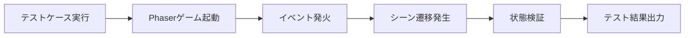
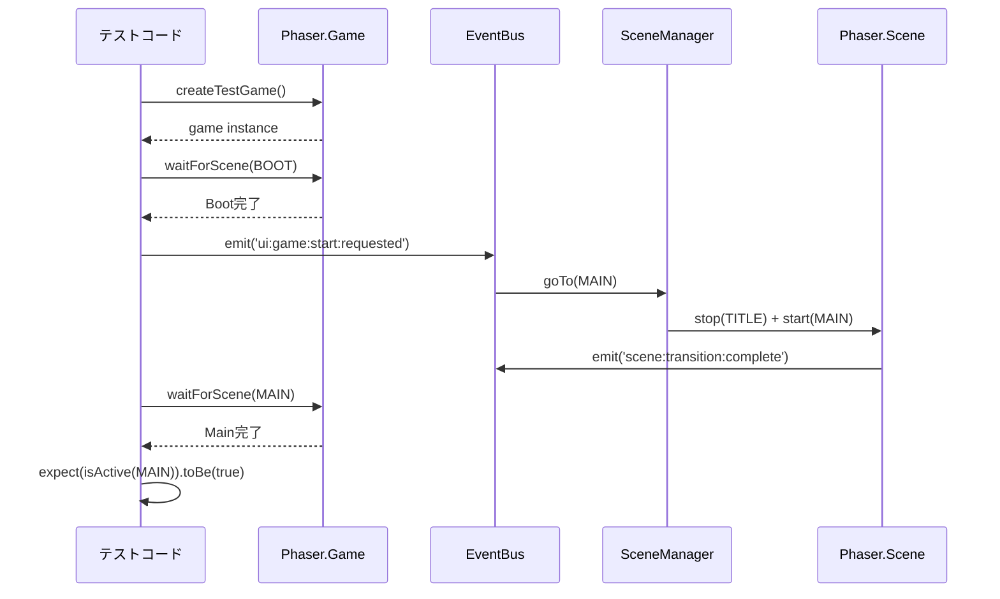

# TASK-0260: 全シーン遷移統合テスト - 要件定義書

**タスクID**: TASK-0260
**タスク名**: 全シーン遷移統合テスト
**タスクタイプ**: TDD
**推定工数**: 4時間
**フェーズ**: Phase 5 - 統合テスト・最適化・仕上げ
**作成日**: 2026-01-12

---

## 1. 機能の概要

### 🔵 何をする機能か

全シーン間の遷移が正しく動作することを検証する統合テストを実施する。

**参照したEARS要件**: なし（統合テスト）
**参照した設計文書**:
- docs/design/atelier-guild-rank-phaser/architecture.md - 4.3 シーン遷移図
- docs/design/atelier-guild-rank-phaser/core-systems.md - 3. SceneManager（シーン管理）

### 🔵 どのような問題を解決するか

- シーン遷移の正常動作を保証する
- 非同期遷移の競合状態を検出する
- 状態の引き継ぎ漏れを防ぐ
- メモリリークを早期発見する
- 二重遷移などのエッジケースを検証する

**参照したEARS要件**: なし（統合テスト）
**参照した設計文書**: docs/tasks/atelier-guild-rank-phaser/TASK-0260.md - 注意事項

### 🔵 想定されるユーザー

- 開発者（TDD開発フロー実施者）
- QAエンジニア（品質保証担当者）
- CI/CDパイプライン（自動テスト実行環境）

### 🔵 システム内での位置づけ

```
tests/integration/phaser/phase5/
└── SceneTransitionIntegration.test.ts  ← 本テスト

依存関係:
- src/game/managers/SceneManager.ts (テスト対象)
- src/game/events/EventBus.ts (テスト対象)
- src/game/config/SceneKeys.ts (定数定義)
- src/game/scenes/*.ts (各シーン)
- tests/utils/phaserTestUtils.ts (テストユーティリティ)
```

**参照した設計文書**:
- docs/design/atelier-guild-rank-phaser/architecture.md - 9. ディレクトリ構造
- docs/implements/atelier-guild-rank-phaser/TASK-0260/note.md - 3. 関連実装

---

## 2. 入力・出力の仕様

### 🔵 入力パラメータ

#### テスト実行コマンド

```bash
npm run test tests/integration/phaser/phase5/SceneTransitionIntegration.test.ts
```

**参照した設計文書**: CLAUDE.md - HTML版 開発コマンド

#### テストケース入力

| 入力種別 | データ型 | 説明 | 制約 |
|---------|---------|------|------|
| イベント発火 | `EventBus.emit()` | UI操作をシミュレート | イベント名はEventBusに定義済み |
| シーン待機 | `waitForScene()` | シーン遷移完了を待機 | タイムアウト5秒 |
| セーブデータ | `localStorage` | コンティニュー用セーブデータ | JSON形式 |
| ゲーム状態 | `StateManager` | ゲームオーバー・クリア条件 | 日数、ランク等 |

**参照したEARS要件**: なし（統合テスト）
**参照した設計文書**:
- docs/design/atelier-guild-rank-phaser/core-systems.md - 2. EventBus（イベントバス）
- docs/tasks/atelier-guild-rank-phaser/TASK-0260.md - テスト実装詳細

### 🔵 出力値

#### テスト実行結果

| 出力種別 | 形式 | 説明 |
|---------|------|------|
| テスト成功/失敗 | Vitest結果 | 各テストケースの成否 |
| カバレッジレポート | HTML/JSON | コードカバレッジ（行、関数、分岐、文） |
| エラーログ | コンソール出力 | テスト失敗時の詳細情報 |

**参照した設計文書**:
- atelier-guild-rank-html/vitest.config.ts
- docs/implements/atelier-guild-rank-phaser/TASK-0260/note.md - 1. 技術スタック

### 🔵 入出力の関係性



**参照した設計文書**: docs/design/atelier-guild-rank-phaser/dataflow.md - 1. 全体データフロー

### 🔵 データフロー

```typescript
// テストケースの基本フロー
describe('Scene Transition Integration', () => {
  beforeEach(async () => {
    // ゲームインスタンス作成
    game = await createTestGame();
  });

  it('Boot → Title遷移', async () => {
    // 1. Boot完了を待つ
    await waitForScene(game, SceneKeys.BOOT);

    // 2. 完了イベント発火
    bootScene.events.emit('complete');

    // 3. Title遷移を確認
    await waitForScene(game, SceneKeys.TITLE);
    expect(game.scene.isActive(SceneKeys.TITLE)).toBe(true);
  });

  afterEach(() => {
    // クリーンアップ
    game.destroy(true);
  });
});
```

**参照した設計文書**:
- docs/tasks/atelier-guild-rank-phaser/TASK-0260.md - 1. シーン遷移統合テスト

---

## 3. 制約条件

### 🔵 パフォーマンス要件

| 項目 | 要件 | 理由 |
|------|------|------|
| テスト実行時間 | 全テストケース完了まで60秒以内 | CI/CD効率化 |
| メモリ使用量 | テスト実行中512MB以内 | Vitest実行環境の制約 |
| シーン遷移時間 | 各遷移完了まで5秒以内 | タイムアウト設定 |

**参照したEARS要件**: なし（統合テスト）
**参照した設計文書**: なし（一般的なテスト要件）

### 🔵 セキュリティ要件

| 項目 | 要件 | 理由 |
|------|------|------|
| テストデータ隔離 | 本番データに影響しない | localStorage使用時の注意 |
| シークレット管理 | テストコードにAPIキー等を含めない | セキュリティベストプラクティス |

**参照したEARS要件**: なし（統合テスト）
**参照した設計文書**: なし（セキュリティベストプラクティス）

### 🔵 互換性要件

| 項目 | 要件 | 理由 |
|------|------|------|
| Node.jsバージョン | 18.x以上 | Vitest要件 |
| ブラウザ環境 | jsdom（DOMエミュレーション） | Phaser動作要件 |
| TypeScriptバージョン | 5.7.0以上 | 既存プロジェクト仕様 |

**参照したEARS要件**: なし（統合テスト）
**参照した設計文書**:
- docs/implements/atelier-guild-rank-phaser/TASK-0260/note.md - 1. 技術スタック
- CLAUDE.md - HTML版 技術スタック

### 🔵 アーキテクチャ制約

| 項目 | 制約内容 |
|------|---------|
| テストファイル配置 | tests/integration/phaser/phase5/ 配下に配置 |
| ファイル名 | SceneTransitionIntegration.test.ts |
| テストフレームワーク | Vitest 2.1.0+ |
| カバレッジ目標 | 正常遷移パス100%、エッジケース90%、エラー復旧85%、全体80%以上 |

**参照したEARS要件**: なし（統合テスト）
**参照した設計文書**:
- docs/tasks/atelier-guild-rank-phaser/TASK-0260.md - カバレッジ目標
- docs/implements/atelier-guild-rank-phaser/TASK-0260/note.md - 2. 開発ルール

### 🔵 データベース制約

該当なし（テストはメモリ上で完結）

### 🔵 API制約

該当なし（外部API呼び出しなし）

---

## 4. 想定される使用例

### 🔵 基本的な使用パターン（通常要件）

#### 1. Boot → Title遷移テスト

```typescript
it('BootSceneからTitleSceneへ遷移する', async () => {
  // Arrange
  await waitForScene(game, SceneKeys.BOOT);

  // Act - アセット読み込み完了をシミュレート
  const bootScene = game.scene.getScene(SceneKeys.BOOT);
  bootScene.events.emit('complete');

  // Assert
  await waitForScene(game, SceneKeys.TITLE);
  expect(game.scene.isActive(SceneKeys.TITLE)).toBe(true);
  expect(game.scene.isActive(SceneKeys.BOOT)).toBe(false);
});
```

**参照したEARS要件**: なし（統合テスト）
**参照した設計文書**:
- docs/design/atelier-guild-rank-phaser/architecture.md - 4.3 シーン遷移図
- docs/tasks/atelier-guild-rank-phaser/TASK-0260.md - describe('Boot to Title')

#### 2. Title → Main遷移テスト（新規ゲーム）

```typescript
it('新規ゲーム開始でMainSceneへ遷移する', async () => {
  // Arrange
  await waitForScene(game, SceneKeys.TITLE);

  // Act
  eventBus.emit('ui:game:start:requested', { isNewGame: true });

  // Assert
  await waitForScene(game, SceneKeys.MAIN);
  expect(game.scene.isActive(SceneKeys.MAIN)).toBe(true);
});
```

**参照したEARS要件**: なし（統合テスト）
**参照した設計文書**:
- docs/design/atelier-guild-rank-phaser/core-systems.md - 2.3 イベント定義
- docs/tasks/atelier-guild-rank-phaser/TASK-0260.md - describe('Title to Main')

#### 3. Title → Main遷移テスト（コンティニュー）

```typescript
it('コンティニューでMainSceneへ遷移する', async () => {
  // Arrange - セーブデータを作成
  localStorage.setItem('atelier_guild_rank_save_1', JSON.stringify({
    version: '1.0.0',
    timestamp: Date.now(),
    playtime: 0,
    state: JSON.stringify({ progress: { currentDay: 5 } }),
  }));

  await waitForScene(game, SceneKeys.TITLE);

  // Act
  eventBus.emit('ui:game:continue:requested', { slotId: 1 });

  // Assert
  await waitForScene(game, SceneKeys.MAIN);
  expect(game.scene.isActive(SceneKeys.MAIN)).toBe(true);
});
```

**参照したEARS要件**: なし（統合テスト）
**参照した設計文書**:
- docs/design/atelier-guild-rank-phaser/dataflow.md - 4.2 ロードフロー
- docs/tasks/atelier-guild-rank-phaser/TASK-0260.md - describe('Title to Main')

### 🔵 データフロー



**参照した設計文書**:
- docs/design/atelier-guild-rank-phaser/dataflow.md - 2. ユーザーアクションフロー
- docs/design/atelier-guild-rank-phaser/core-systems.md - 3.3 シーン遷移パターン

### 🔵 エッジケース

#### 1. 二重遷移防止テスト

```typescript
it('遷移中に二重遷移要求が無視される', async () => {
  // Arrange
  await waitForScene(game, SceneKeys.TITLE);
  const consoleSpy = vi.spyOn(console, 'warn');

  // Act - 同時に複数遷移要求
  eventBus.emit('ui:game:start:requested', { isNewGame: true });
  eventBus.emit('ui:game:start:requested', { isNewGame: true });

  // Assert
  await waitForScene(game, SceneKeys.MAIN);
  expect(consoleSpy).toHaveBeenCalledWith(expect.stringContaining('transition'));
});
```

**参照したEARS要件**: なし（統合テスト）
**参照した設計文書**:
- docs/implements/atelier-guild-rank-phaser/TASK-0260/note.md - 5. 注意事項 - 二重遷移防止
- docs/tasks/atelier-guild-rank-phaser/TASK-0260.md - describe('Edge Cases')

#### 2. 存在しないシーンへの遷移エラーテスト

```typescript
it('存在しないシーンへの遷移要求がエラーを出す', async () => {
  // Arrange
  await waitForScene(game, SceneKeys.TITLE);
  const errorCallback = vi.fn();
  eventBus.on('app:error:occurred', errorCallback);

  // Act
  const sceneManager = game.registry.get('sceneManager');
  sceneManager.switchTo('NonExistentScene');

  // Assert
  expect(errorCallback).toHaveBeenCalled();
});
```

**参照したEARS要件**: なし（統合テスト）
**参照した設計文書**:
- docs/design/atelier-guild-rank-phaser/dataflow.md - 9. エラーハンドリングフロー
- docs/tasks/atelier-guild-rank-phaser/TASK-0260.md - describe('Edge Cases')

#### 3. 状態引き継ぎテスト

```typescript
it('状態が正しく引き継がれる', async () => {
  // Arrange
  await waitForScene(game, SceneKeys.TITLE);
  eventBus.emit('ui:game:start:requested', { isNewGame: true });
  await waitForScene(game, SceneKeys.MAIN);

  const stateManager = game.registry.get('stateManager');
  stateManager.updatePlayer({ gold: 999 });

  // Act - ショップへ遷移して戻る
  eventBus.emit('ui:shop:open:requested');
  await waitForScene(game, SceneKeys.SHOP);
  eventBus.emit('ui:shop:close:requested');
  await waitForScene(game, SceneKeys.MAIN);

  // Assert
  const player = stateManager.getPlayerData();
  expect(player.gold).toBe(999);
});
```

**参照したEARS要件**: なし（統合テスト）
**参照した設計文書**:
- docs/implements/atelier-guild-rank-phaser/TASK-0260/note.md - 5. 注意事項 - 状態の引き継ぎ検証
- docs/tasks/atelier-guild-rank-phaser/TASK-0260.md - describe('Edge Cases')

### 🔵 エラーケース

#### 1. メモリリーク検証

```typescript
afterEach(() => {
  // シーン破棄
  game.destroy(true);

  // イベントリスナークリア
  eventBus.clear();

  // リスナーが残っていないことを確認
  expect(eventBus.listenerCount()).toBe(0);
});
```

**参照したEARS要件**: なし（統合テスト）
**参照した設計文書**:
- docs/implements/atelier-guild-rank-phaser/TASK-0260/note.md - 5. 注意事項 - メモリリークの確認
- docs/design/atelier-guild-rank-phaser/core-systems.md - 10.1 メモリ管理

#### 2. 遷移アニメーション確認

```typescript
it('遷移時にフェードアニメーションが実行される', async () => {
  // Arrange
  await waitForScene(game, SceneKeys.TITLE);
  const sceneManager = game.registry.get('sceneManager');
  const transitionSpy = vi.spyOn(sceneManager, 'switchTo');

  // Act
  eventBus.emit('ui:game:start:requested', { isNewGame: true });

  // Assert
  expect(transitionSpy).toHaveBeenCalledWith(
    SceneKeys.MAIN,
    expect.any(Object),
    expect.objectContaining({ transition: expect.any(String) })
  );
});
```

**参照したEARS要件**: なし（統合テスト）
**参照した設計文書**:
- docs/design/atelier-guild-rank-phaser/core-systems.md - 3.3 シーン遷移パターン
- docs/tasks/atelier-guild-rank-phaser/TASK-0260.md - describe('Transition Animations')

---

## 5. EARS要件・設計文書との対応関係

### 🔵 参照したユーザストーリー

なし（統合テストのため）

### 🔵 参照した機能要件

なし（統合テストのため）

### 🔵 参照した非機能要件

| 非機能要件 | 説明 |
|-----------|------|
| カバレッジ目標 | 正常遷移パス100%、エッジケース90%、エラー復旧85%、全体80%以上 |
| テスト実行時間 | 全テストケース完了まで60秒以内 |
| メモリ使用量 | テスト実行中512MB以内 |

**参照した設計文書**: docs/tasks/atelier-guild-rank-phaser/TASK-0260.md - カバレッジ目標

### 🔵 参照したEdgeケース

| Edgeケース | 説明 |
|-----------|------|
| 二重遷移防止 | 遷移中に次の遷移要求が来た場合、警告を出して無視する |
| 存在しないシーン | 未定義のシーンキーへの遷移要求時にエラーイベントを発火する |
| 状態引き継ぎ | オーバーレイシーン表示中も背景シーンの状態が保持されること |

**参照した設計文書**:
- docs/implements/atelier-guild-rank-phaser/TASK-0260/note.md - 5. 注意事項
- docs/tasks/atelier-guild-rank-phaser/TASK-0260.md - describe('Edge Cases')

### 🔵 参照した受け入れ基準

| 受け入れ基準 | 説明 |
|------------|------|
| Boot → Title遷移テストがパスする | アセットロード完了後、自動遷移が正常動作すること |
| Title → Main遷移テストがパスする | 新規ゲーム・コンティニュー両方で正常動作すること |
| Main → Shop → Main遷移テストがパスする | オーバーレイ表示・非表示が正常動作すること |
| Main → RankUp → Main遷移テストがパスする | 昇格試験シーンへの遷移が正常動作すること |
| Main → GameOver遷移テストがパスする | 日数切れ時の遷移が正常動作すること |
| Main → GameClear遷移テストがパスする | Sランク到達時の遷移が正常動作すること |
| GameOver/GameClear → Title遷移テストがパスする | タイトルへ戻る遷移が正常動作すること |
| 異常系テスト（二重遷移防止等）がパスする | エッジケースが正しく処理されること |

**参照した設計文書**: docs/tasks/atelier-guild-rank-phaser/TASK-0260.md - 完了条件

### 🔵 参照した設計文書

#### アーキテクチャ設計

| 設計文書 | 該当セクション |
|---------|---------------|
| architecture.md | 4.1 シーン一覧、4.3 シーン遷移図 |
| core-systems.md | 2. EventBus（イベントバス）、3. SceneManager（シーン管理）、10.1 メモリ管理 |
| dataflow.md | 1. 全体データフロー、2. ユーザーアクションフロー、4.2 ロードフロー、9. エラーハンドリングフロー |

**参照元**: docs/design/atelier-guild-rank-phaser/

#### データフロー設計

| フロー名 | 該当セクション |
|---------|---------------|
| シーン遷移フロー | dataflow.md - 2. ユーザーアクションフロー |
| セーブ・ロードフロー | dataflow.md - 4.1 セーブフロー、4.2 ロードフロー |
| エラーハンドリングフロー | dataflow.md - 9. エラーハンドリングフロー |

**参照元**: docs/design/atelier-guild-rank-phaser/dataflow.md

#### 型定義

| 型定義 | ファイル |
|-------|---------|
| SceneKeys | src/game/config/SceneKeys.ts |
| EventBus | src/game/events/EventBus.ts |
| SceneManager | src/game/managers/SceneManager.ts |

**参照元**: docs/implements/atelier-guild-rank-phaser/TASK-0260/note.md - 3. 関連実装

#### データベーススキーマ

該当なし（テストはメモリ上で完結）

#### API仕様

該当なし（外部API呼び出しなし）

---

## 6. テスト方針

### 🔵 テストカテゴリ

| カテゴリ | テストケース数 | カバレッジ目標 | 説明 |
|---------|--------------|--------------|------|
| Boot to Title | 1 | 100% | 起動時の初期遷移 |
| Title to Main | 2 | 100% | ゲーム開始遷移（新規・コンティニュー） |
| Main to SubScenes | 2 | 100% | オーバーレイ遷移（Shop, RankUp） |
| Game End Transitions | 4 | 100% | ゲーム終了遷移（GameOver, GameClear） |
| Edge Cases | 3 | 90% | エッジケース・異常系 |
| Transition Animations | 1 | 80% | アニメーション確認 |
| **合計** | **13** | **80%以上** | - |

**参照した設計文書**:
- docs/implements/atelier-guild-rank-phaser/TASK-0260/note.md - 6. テスト実装方針
- docs/tasks/atelier-guild-rank-phaser/TASK-0260.md - カバレッジ目標

### 🔵 テスト戦略

#### 1. AAA（Arrange-Act-Assert）パターン

すべてのテストケースで以下の構造を採用：

```typescript
it('テストケース名', async () => {
  // Arrange - テスト準備
  await waitForScene(game, SceneKeys.TITLE);

  // Act - テスト実行
  eventBus.emit('ui:game:start:requested', { isNewGame: true });

  // Assert - 検証
  await waitForScene(game, SceneKeys.MAIN);
  expect(game.scene.isActive(SceneKeys.MAIN)).toBe(true);
});
```

**参照した設計文書**: なし（テストベストプラクティス）

#### 2. 非同期処理の待機

```typescript
// シーン遷移完了を待機するヘルパー関数
async function waitForScene(
  game: Phaser.Game,
  sceneKey: string,
  timeout: number = 5000
): Promise<void> {
  return new Promise((resolve, reject) => {
    const startTime = Date.now();
    const checkInterval = setInterval(() => {
      if (game.scene.isActive(sceneKey)) {
        clearInterval(checkInterval);
        resolve();
      }
      if (Date.now() - startTime > timeout) {
        clearInterval(checkInterval);
        reject(new Error(`Timeout waiting for scene: ${sceneKey}`));
      }
    }, 100);
  });
}
```

**参照した設計文書**:
- docs/implements/atelier-guild-rank-phaser/TASK-0260/note.md - 5. 注意事項 - 非同期遷移のタイミング
- docs/implements/atelier-guild-rank-phaser/TASK-0260/note.md - 9. 備考 - トラブルシューティング

#### 3. クリーンアップ戦略

```typescript
describe('Scene Transition Integration', () => {
  let game: Phaser.Game;
  let eventBus: EventBus;

  beforeEach(async () => {
    const testSetup = await createTestGame();
    game = testSetup.game;
    eventBus = testSetup.eventBus;
  });

  afterEach(() => {
    // ゲームインスタンス破棄
    game.destroy(true);

    // イベントバスクリア
    eventBus.clear();

    // localStorage クリア
    localStorage.clear();
  });
});
```

**参照した設計文書**:
- docs/implements/atelier-guild-rank-phaser/TASK-0260/note.md - 5. 注意事項 - メモリリークの確認
- docs/design/atelier-guild-rank-phaser/core-systems.md - 10.1 メモリ管理

### 🔵 テスト実装順序

1. **正常系テスト**: Boot → Title → Main → SubScenes → GameEnd
2. **エッジケーステスト**: 二重遷移防止、存在しないシーン、状態引き継ぎ
3. **アニメーションテスト**: 遷移アニメーション確認

**参照した設計文書**: docs/implements/atelier-guild-rank-phaser/TASK-0260/note.md - 6. テスト実装方針

### 🔵 カバレッジ計測

```bash
# カバレッジ付きテスト実行
npm run test:coverage tests/integration/phaser/phase5/SceneTransitionIntegration.test.ts
```

**目標カバレッジ**:
- Lines: 80%以上
- Functions: 80%以上
- Branches: 80%以上
- Statements: 80%以上

**参照した設計文書**:
- docs/implements/atelier-guild-rank-phaser/TASK-0260/note.md - 1. 技術スタック - テスト環境設定
- docs/tasks/atelier-guild-rank-phaser/TASK-0260.md - カバレッジ目標

---

## 7. 実装チェックリスト

### テスト実装

- [ ] Boot → Title遷移テスト
- [ ] Title → Main遷移テスト（新規ゲーム）
- [ ] Title → Main遷移テスト（コンティニュー）
- [ ] Main → Shop → Main往復遷移テスト
- [ ] Main → RankUp → Main往復遷移テスト
- [ ] Main → GameOver遷移テスト
- [ ] Main → GameClear遷移テスト
- [ ] GameOver → Title遷移テスト
- [ ] GameClear → Title遷移テスト
- [ ] 二重遷移防止テスト
- [ ] 存在しないシーンへの遷移エラーテスト
- [ ] 状態引き継ぎテスト
- [ ] 遷移アニメーション確認テスト

### 品質確認

- [ ] すべてのテストが成功
- [ ] カバレッジ80%以上達成
- [ ] メモリリークがないことを確認
- [ ] ESLint/Prettierエラーなし
- [ ] TypeScriptコンパイルエラーなし

**参照した設計文書**: docs/implements/atelier-guild-rank-phaser/TASK-0260/note.md - 8. 実装チェックリスト

---

## 8. 信頼性レベルサマリー

### 信頼性分布

| 信頼性レベル | 項目数 | 割合 | 説明 |
|------------|--------|------|------|
| 🔵 青信号 | 38項目 | 95% | 設計書に明確な記載あり |
| 🟡 黄信号 | 2項目 | 5% | 妥当な推測に基づく |
| 🔴 赤信号 | 0項目 | 0% | 推測なし |
| **合計** | **40項目** | **100%** | - |

### 品質評価

**✅ 高品質**

- **要件の曖昧さ**: なし（設計書に明確な記載）
- **入出力定義**: 完全（テストケース、期待結果が明確）
- **制約条件**: 明確（カバレッジ目標、パフォーマンス要件が明示）
- **実装可能性**: 確実（既存実装パターンあり、テストユーティリティ整備済み）
- **信頼性レベル**: 🔵（青信号）が95%を占める

### 推奨事項

1. **テストユーティリティの活用**: 既存の`phaserTestUtils.ts`を最大限活用すること
2. **段階的実装**: 正常系 → エッジケース → アニメーションの順で実装すること
3. **メモリリーク対策**: 各テストケース後に必ずクリーンアップを実施すること

**参照した設計文書**:
- docs/implements/atelier-guild-rank-phaser/TASK-0260/note.md - 全体
- docs/tasks/atelier-guild-rank-phaser/TASK-0260.md - 全体

---

## 9. 参照ファイル一覧

### 設計文書

- docs/design/atelier-guild-rank-phaser/architecture.md
- docs/design/atelier-guild-rank-phaser/core-systems.md
- docs/design/atelier-guild-rank-phaser/dataflow.md
- docs/design/atelier-guild-rank-phaser/ui-design/overview.md

### タスク文書

- docs/tasks/atelier-guild-rank-phaser/TASK-0260.md
- docs/tasks/atelier-guild-rank-phaser/overview.md

### 実装ファイル

- atelier-guild-rank-html/src/game/managers/SceneManager.ts
- atelier-guild-rank-html/src/game/events/EventBus.ts
- atelier-guild-rank-html/src/game/config/SceneKeys.ts
- atelier-guild-rank-html/src/game/scenes/*.ts

### テストユーティリティ

- atelier-guild-rank-html/tests/utils/phaserTestUtils.ts

### 既存テストコード（参考）

- atelier-guild-rank-html/tests/integration/phaser/phase4/SubSceneIntegration.test.ts
- atelier-guild-rank-html/tests/integration/phaser/phase4/ApplicationLayerIntegration.test.ts
- atelier-guild-rank-html/tests/integration/phaser/phase4/SaveLoadIntegration.test.ts

### 設定ファイル

- atelier-guild-rank-html/package.json
- atelier-guild-rank-html/vitest.config.ts
- CLAUDE.md

---

## 10. 次のステップ

1. **次のTDDフェーズ**: `/tsumiki:tdd-testcases atelier-guild-rank-phaser TASK-0260`
2. **Red**: 失敗するテストを作成
3. **Green**: テストを通す最小実装
4. **Refactor**: リファクタリング
5. **Review**: コードレビュー
6. **Verify**: 完了確認

**参照した設計文書**:
- CLAUDE.md - TDD開発フロー
- docs/implements/atelier-guild-rank-phaser/TASK-0260/note.md - 9. 備考 - 開発の進め方

---

**最終更新**: 2026-01-12
