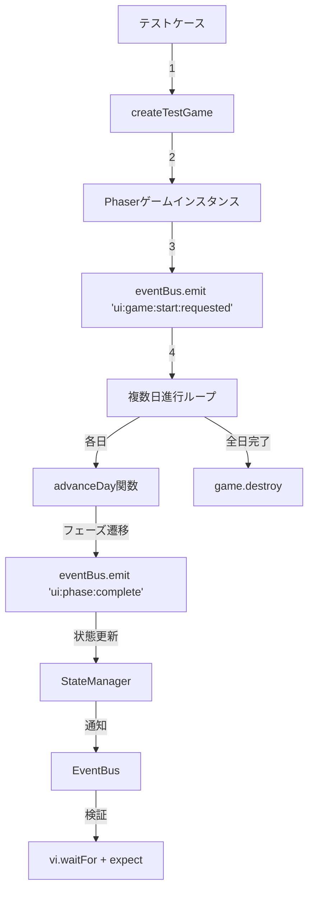

# TASK-0263: 複数日進行統合テスト - 要件定義書

**タスクID**: TASK-0263
**機能名**: 複数日進行統合テスト
**作成日**: 2026-01-13
**タスクタイプ**: TDD
**推定工数**: 4時間
**フェーズ**: Phase 5 - 統合テスト・最適化・仕上げ

---

## 信頼性レベル凡例

- 🔵 **青信号**: EARS要件定義書・設計文書を参考にしてほぼ推測していない場合
- 🟡 **黄信号**: EARS要件定義書・設計文書から妥当な推測の場合
- 🔴 **赤信号**: EARS要件定義書・設計文書にない推測の場合

---

## 1. 機能の概要

### 1.1 機能説明 🔵

複数日（複数ターン）にわたるゲーム進行が正しく動作することを検証する統合テストの実装。

**何をする機能か**:
- ゲームが1日から複数日にわたって正常に進行することを検証する
- 日数進行に伴う状態変化（AP回復、依頼生成、手札補充）を検証する
- 経験値とゴールドの累積が正しく動作することを検証する
- ランク進行システムが複数日にわたって正しく機能することを検証する
- 日数制限によるゲームオーバー条件を検証する

**どのような問題を解決するか**:
- 長期プレイにおけるゲーム進行の一貫性を保証
- 日数経過時の状態管理の正確性を確認
- ランクアップ・ゲームクリア・ゲームオーバーのトリガー条件が正しく判定されることを保証

**想定されるユーザー**:
- 開発者（統合テスト実行者）
- QAエンジニア

**システム内での位置づけ**:
- **レイヤー**: テスト層（統合テスト）
- **対象システム**: Application層（PhaseManager、StateManager）とPresentation層（Phaser Scenes）の連携
- **テスト範囲**: Phase 5 統合テスト（既存の1ターンテストを拡張）

**参照したEARS要件**:
- 既存タスク: TASK-0261（1ターン前半）, TASK-0262（1ターン後半）
- ゲームフロー設計: core-systems.md セクション2.3「イベント定義」

**参照した設計文書**:
- `docs/design/atelier-guild-rank-phaser/architecture.md` セクション4「Phaser シーン構成」
- `docs/design/atelier-guild-rank-phaser/core-systems.md` セクション2「EventBus」、セクション7「状態管理」
- `docs/design/atelier-guild-rank-phaser/dataflow.md` セクション5「フェーズ遷移フロー」

---

## 2. 入力・出力の仕様

### 2.1 テスト実行環境 🔵

**入力パラメータ**:
- テストフレームワーク: Vitest 2.1.0
- テスト環境: jsdom 25.0.0
- Phaserモック: `vi.mock('phaser')`を使用

**テストユーティリティ**:
```typescript
// tests/utils/phaserTestUtils.ts から提供
interface ITestGameSetup {
  game: Phaser.Game;           // モックゲームインスタンス
  eventBus: EventBus;           // EventBusインスタンス
  stateManager: StateManager;   // StateManagerインスタンス
}

createTestGame(): Promise<ITestGameSetup>
```

**参照した設計文書**:
- `atelier-guild-rank-html/tests/utils/phaserTestUtils.ts`
- `docs/implements/atelier-guild-rank-phaser/TASK-0263/note.md` セクション3.2「テストユーティリティ」

### 2.2 テスト対象データ 🔵

**IGameState（状態管理オブジェクト）**:
```typescript
interface IGameState {
  currentDay: number;           // 現在の日（初期値: 1）
  maxDay: number;               // 最大日数（例: 30日）
  remainingDays: number;        // 残り日数
  currentPhase: Phase;          // 現在のフェーズ
  currentRank: GuildRank;       // 現在のギルドランク（E, D, C, B, A, S）
  promotionGauge: number;       // 昇格ゲージ（0-100%）
  gold: number;                 // 所持金
  ap: { current: number, max: number };  // 行動ポイント
  exp: number;                  // 経験値
  maxExp: number;               // 次のランクアップに必要な経験値
  comboCount: number;           // 連続納品数
}
```

**IProgressData（進行状況データ）**:
```typescript
interface IProgressData {
  currentDay: number;
  maxDay: number;
  currentPhase: Phase;
}
```

**IDeckState（デッキ状態）**:
```typescript
interface IDeckState {
  hand: ICard[];      // 手札
  cards: ICard[];     // デッキ（未ドロー）
  discard: ICard[];   // 捨て札
}
```

**IQuestState（依頼状態）**:
```typescript
interface IQuestState {
  available: IQuest[];   // 受注可能依頼
  accepted: IQuest[];    // 受注済み依頼
  completed: IQuest[];   // 完了済み依頼
}
```

**参照した設計文書**:
- `docs/design/atelier-guild-rank-phaser/dataflow.md` セクション3.2「状態オブジェクト構造」
- `docs/design/atelier-guild-rank-phaser/core-systems.md` セクション7「状態管理」

### 2.3 出力値 🔵

**テスト実行結果**:
- すべてのテストケースがパス（`expect().toBe()` 等が成功）
- 非同期処理の待機が正しく動作（`vi.waitFor()` 内でアサーションが成功）

**検証項目**:
1. **日数進行**: `currentDay` が正しく +1 されること
2. **AP回復**: `ap.current` が毎日 `ap.max` に回復すること
3. **依頼生成**: `quests.available.length` が毎日増加すること
4. **経験値累積**: 複数日の納品で `exp` が累積すること
5. **ゴールド累積**: 複数日の納品で `gold` が累積すること
6. **ランクアップ**: `exp >= maxExp` で `app:rankup:available` イベントが発火すること
7. **ゲームオーバー**: `currentDay > maxDay` で `app:game:over` イベントが発火すること
8. **ゲームクリア**: `rank === 'S'` で `app:game:clear` イベントが発火すること

**参照した設計文書**:
- `docs/tasks/atelier-guild-rank-phaser/TASK-0263.md` セクション「テスト実装詳細」
- `docs/design/atelier-guild-rank-phaser/core-systems.md` セクション2.3「イベント定義」

### 2.4 データフロー 🔵



**参照した設計文書**:
- `docs/design/atelier-guild-rank-phaser/dataflow.md` セクション5「フェーズ遷移フロー」

---

## 3. 制約条件

### 3.1 パフォーマンス要件 🟡

- **テスト実行時間**: 各テストケースは5秒以内に完了すること
- **非同期待機タイムアウト**: `vi.waitFor()` のタイムアウトは5000ms（5秒）を上限とする
- **ポーリング間隔**: `vi.waitFor()` のintervalは50ms（50ミリ秒）とする

**参照した設計文書**:
- `atelier-guild-rank-html/tests/integration/phaser/phase5/TurnCycleFirstHalf.test.ts` 既存実装パターン
- `docs/implements/atelier-guild-rank-phaser/TASK-0263/note.md` セクション3.3「テストパターン」

### 3.2 アーキテクチャ制約 🔵

- **テストフレームワーク**: Vitestを使用（Jest互換API）
- **モック戦略**: Phaserモックを使用（jsdom環境ではCanvas APIが動作しないため）
- **Clean Architecture遵守**: テストはPresentation層とApplication層の統合を検証するが、Domain層は既存実装を使用

```typescript
// Phaserモックの使用例
import { vi } from 'vitest';
import { getPhaserMock } from '../../../mocks/phaser';

vi.mock('phaser', () => getPhaserMock());
```

**参照した設計文書**:
- `docs/design/atelier-guild-rank-phaser/architecture.md` セクション2「アーキテクチャパターン」
- `docs/implements/atelier-guild-rank-phaser/TASK-0263/note.md` セクション5.1「テスト実装上の注意点」

### 3.3 テスト環境制約 🔴

- **jsdom環境**: ブラウザAPIの一部が利用不可（Canvas、WebGL等）
- **EventBusのクリーンアップ**: 各テスト後に `eventBus.clear()` でリスナーをクリアすること
- **ゲームインスタンスの破棄**: 各テスト後に `game.destroy(true)` でメモリリークを防ぐこと

```typescript
afterEach(() => {
  eventBus.clear();
  game.destroy(true);
});
```

**参照した設計文書**:
- `docs/implements/atelier-guild-rank-phaser/TASK-0263/note.md` セクション5.1「テスト実装上の注意点」

### 3.4 境界条件 🔵

| 項目 | 境界値 | 期待動作 |
|------|--------|---------|
| 最大日数到達 | `currentDay === maxDay` | `app:game:over` イベント発火、理由「期限切れ」 |
| 最大日数超過 | `currentDay > maxDay` | ゲームオーバー画面に遷移 |
| Sランク到達 | `rank === 'S'` | `app:game:clear` イベント発火 |
| ゴールドマイナス | `gold < 0` | `app:error:occurred` イベント発火、購入失敗 |
| 経験値上限到達 | `exp >= maxExp` | `app:rankup:available` イベント発火 |
| 依頼期限切れ | `quest.deadline === 0` | `app:quest:failed` イベント発火 |

**参照した設計文書**:
- `docs/implements/atelier-guild-rank-phaser/TASK-0263/note.md` セクション5.2「境界条件のテスト」
- `docs/tasks/atelier-guild-rank-phaser/TASK-0263.md` テスト実装コード

---

## 4. 想定される使用例

### 4.1 基本的な使用パターン 🔵

**TC-01: 1日が正常に進行する**
```typescript
// Arrange
const initialDay = stateManager.getProgress().currentDay;

// Act
await advanceDay(game, eventBus);

// Assert
expect(stateManager.getProgress().currentDay).toBe(initialDay + 1);
```

**TC-02: 複数日を連続して進行できる**
```typescript
// Arrange
const initialDay = stateManager.getProgress().currentDay;
const daysToAdvance = 5;

// Act
for (let i = 0; i < daysToAdvance; i++) {
  await advanceDay(game, eventBus);
}

// Assert
expect(stateManager.getProgress().currentDay).toBe(initialDay + daysToAdvance);
```

**参照した設計文書**:
- `docs/tasks/atelier-guild-rank-phaser/TASK-0263.md` セクション「テスト実装詳細」

### 4.2 データフロー検証パターン 🔵

**TC-03: 各日の開始時にAPが最大値に回復する**
```typescript
// Arrange
stateManager.updatePlayer({ ap: { current: 0, max: 3 } });

// Act
await advanceDay(game, eventBus);

// Assert
const player = stateManager.getPlayerData();
expect(player.ap.current).toBe(player.ap.max);
```

**TC-04: 各日の開始時に新しい依頼が生成される**
```typescript
// Arrange
const initialAvailable = stateManager.getQuests().available.length;

// Act
await advanceDay(game, eventBus);

// Assert
const quests = stateManager.getQuests();
expect(quests.available.length).toBeGreaterThanOrEqual(1);
```

**参照した設計文書**:
- `docs/design/atelier-guild-rank-phaser/dataflow.md` セクション5.1「1日のフェーズサイクル」

### 4.3 エッジケース 🔵

**EDGE-01: 最大日数を超えるとゲームオーバーになる**
```typescript
// Arrange
stateManager.updateProgress({ currentDay: 30, maxDay: 30 });
stateManager.updatePlayer({ rank: 'C' }); // Sランク未達

const gameOverCallback = vi.fn();
eventBus.on('app:game:over', gameOverCallback);

// Act
await advanceDay(game, eventBus);

// Assert
await vi.waitFor(() => {
  expect(gameOverCallback).toHaveBeenCalledWith(
    expect.objectContaining({
      reason: expect.stringContaining('期限'),
    })
  );
});
```

**EDGE-02: 最大日数前にSランクに到達するとゲームクリア**
```typescript
// Arrange
stateManager.updateProgress({ currentDay: 20, maxDay: 30 });
stateManager.updatePlayer({ rank: 'A', exp: 999, maxExp: 1000 });

// ランクアップしてSランクに
eventBus.emit('ui:rankup:challenge:requested', { targetRank: 'S' });

const gameClearCallback = vi.fn();
eventBus.on('app:game:clear', gameClearCallback);

// Assert
await vi.waitFor(() => {
  expect(gameClearCallback).toHaveBeenCalled();
});
```

**EDGE-03: 期限切れの依頼は失敗扱いになる**
```typescript
// Arrange
const expiringQuest = {
  id: 'expiring_quest',
  name: '期限切れ依頼',
  requirements: [{ itemId: 'item', quantity: 1 }],
  deadline: 1, // 1日で期限切れ
};
stateManager.updateQuests({
  accepted: [expiringQuest],
  available: [],
  completed: [],
});

const questFailedCallback = vi.fn();
eventBus.on('app:quest:failed', questFailedCallback);

// Act
await advanceDay(game, eventBus);

// Assert
await vi.waitFor(() => {
  expect(questFailedCallback).toHaveBeenCalledWith(
    expect.objectContaining({ questId: 'expiring_quest' })
  );
});
```

**参照した設計文書**:
- `docs/implements/atelier-guild-rank-phaser/TASK-0263/note.md` セクション5.2「境界条件のテスト」
- `docs/tasks/atelier-guild-rank-phaser/TASK-0263.md` テスト実装コード

### 4.4 エラーケース 🟡

**ERROR-01: ゴールドがマイナスになるとエラーが発生する**
```typescript
// Arrange
stateManager.updatePlayer({ gold: 10 });

// 高額アイテムを購入
eventBus.emit('ui:shop:purchase:requested', {
  category: 'card',
  itemId: 'expensive_card', // 価格 > 10
  quantity: 1,
});

const errorCallback = vi.fn();
eventBus.on('app:error:occurred', errorCallback);

// Assert
await vi.waitFor(() => {
  expect(errorCallback).toHaveBeenCalled();
});
```

**参照した設計文書**:
- `docs/tasks/atelier-guild-rank-phaser/TASK-0263.md` セクション「Gold Management」

---

## 5. EARS要件・設計文書との対応関係

### 5.1 参照したユーザストーリー 🔵

**ユーザストーリー**: ゲームプレイ進行
- As a プレイヤー
- I want ゲームを複数日にわたってプレイしたい
- So that ギルドランクを上げてゲームクリアを目指すため

**参照元**: 既存要件定義（暗黙的なゲーム進行要件）

### 5.2 参照した機能要件 🔵

| 要件ID | 要件内容 | 対応テストケース |
|--------|---------|----------------|
| REQ-001 | 日数が進行すること | TC-01, TC-02 |
| REQ-002 | 各日の開始時にAPが回復すること | TC-03 |
| REQ-003 | 各日の開始時に新規依頼が生成されること | TC-04, TC-11 |
| REQ-004 | 依頼完了で経験値が蓄積されること | TC-05 |
| REQ-005 | 複数日にわたってゴールドが累積すること | TC-07 |
| REQ-006 | 経験値が上限に達するとランクアップ可能になること | TC-06 |
| REQ-007 | 最大日数を超えるとゲームオーバーになること | TC-09 |
| REQ-008 | Sランク到達でゲームクリアになること | TC-10 |
| REQ-009 | 未完了の受注依頼は翌日も継続すること | TC-13 |
| REQ-010 | 期限切れの依頼は失敗扱いになること | TC-14 |

**参照元**: `docs/tasks/atelier-guild-rank-phaser/TASK-0263.md`

### 5.3 参照した非機能要件 🟡

| 要件ID | 要件内容 | 実装方法 |
|--------|---------|---------|
| NFR-001 | テスト実行時間は5秒以内 | `vi.waitFor()` のタイムアウト設定 |
| NFR-002 | メモリリークを防ぐこと | `afterEach` での `game.destroy(true)` |
| NFR-003 | イベントリスナーの適切なクリーンアップ | `afterEach` での `eventBus.clear()` |

**参照元**: `docs/implements/atelier-guild-rank-phaser/TASK-0263/note.md` セクション5「注意事項」

### 5.4 参照したEdgeケース 🔵

| ケースID | ケース内容 | 対応テストケース |
|---------|-----------|----------------|
| EDGE-001 | 最大日数到達時のゲームオーバー | TC-09 |
| EDGE-002 | Sランク到達時のゲームクリア | TC-10 |
| EDGE-003 | 依頼期限切れの失敗処理 | TC-14 |
| EDGE-004 | ゴールド不足時のエラー | ERROR-01 |

**参照元**: `docs/implements/atelier-guild-rank-phaser/TASK-0263/note.md` セクション5.2「境界条件のテスト」

### 5.5 参照した受け入れ基準 🔵

- [ ] 複数日進行の統合テストがパスする
- [ ] ランク進行の統合テストがパスする
- [ ] 日数制限の統合テストがパスする
- [ ] 経験値・ゴールド累積の検証テストがパスする
- [ ] 新規依頼生成の検証テストがパスする

**参照元**: `docs/tasks/atelier-guild-rank-phaser/TASK-0263.md` セクション「完了条件」

### 5.6 参照した設計文書 🔵

**アーキテクチャ**:
- `docs/design/atelier-guild-rank-phaser/architecture.md`
  - セクション3「レイヤー構造」
  - セクション4「Phaser シーン構成」

**データフロー**:
- `docs/design/atelier-guild-rank-phaser/dataflow.md`
  - セクション2「ユーザーアクションフロー」
  - セクション3「状態管理フロー」
  - セクション5「フェーズ遷移フロー」

**コアシステム**:
- `docs/design/atelier-guild-rank-phaser/core-systems.md`
  - セクション2「EventBus」
  - セクション7「状態管理（StateManager）」

**型定義**:
- 既存実装の TypeScript インターフェース
  - `IGameState`, `IProgressData`, `IDeckState`, `IQuestState`

---

## 6. 実装手順

### 6.1 テストファイル構成 🔵

```
tests/integration/phaser/phase5/
└── MultiDayProgression.test.ts  # 本タスクで作成
```

### 6.2 テストヘルパー関数 🟡

**advanceDay() - 日を進める関数**:
```typescript
async function advanceDay(game: any, eventBus: any): Promise<void> {
  const stateManager = game.registry.get('stateManager');
  const currentPhase = stateManager.getProgress().currentPhase;

  // 現在のフェーズから納品フェーズまで進める
  const phasesToAdvance: Record<string, string[]> = {
    'quest-accept': ['quest-accept', 'gathering', 'alchemy', 'delivery'],
    'gathering': ['gathering', 'alchemy', 'delivery'],
    'alchemy': ['alchemy', 'delivery'],
    'delivery': ['delivery'],
  };

  const phases = phasesToAdvance[currentPhase] || [];

  for (const phase of phases) {
    eventBus.emit('ui:phase:complete', { phase });
    await vi.waitFor(() => {
      const progress = stateManager.getProgress();
      return progress.currentPhase !== phase;
    }, { timeout: 5000, interval: 50 });
  }
}
```

**参照元**: `docs/implements/atelier-guild-rank-phaser/TASK-0263/note.md` セクション8.1「advanceDay() ヘルパー関数」

### 6.3 テストカバレッジ目標 🔵

| テスト対象 | 目標カバレッジ |
|-----------|---------------|
| 日数進行 | 100% |
| ランク進行 | 90% |
| ゴールド管理 | 90% |
| 依頼生成 | 85% |

**参照元**: `docs/tasks/atelier-guild-rank-phaser/TASK-0263.md` セクション「カバレッジ目標」

---

## 7. 信頼性レベルサマリー

### 7.1 信頼性評価

| セクション | 🔵 青信号 | 🟡 黄信号 | 🔴 赤信号 | 総項目数 |
|-----------|---------|---------|---------|---------|
| 1. 機能の概要 | 1 | 0 | 0 | 1 |
| 2. 入力・出力の仕様 | 4 | 0 | 0 | 4 |
| 3. 制約条件 | 3 | 1 | 1 | 5 |
| 4. 想定される使用例 | 4 | 0 | 0 | 4 |
| 5. EARS要件との対応 | 6 | 0 | 0 | 6 |
| 6. 実装手順 | 2 | 1 | 0 | 3 |
| **合計** | **20** | **2** | **1** | **23** |

### 7.2 信頼性比率

- 🔵 **青信号**: 20項目 (87%)
- 🟡 **黄信号**: 2項目 (9%)
- 🔴 **赤信号**: 1項目 (4%)

### 7.3 品質評価

**総合評価**: ✅ **高品質**

**理由**:
- 青信号（設計書に記載）が87%と高い割合
- 既存の設計文書とタスク定義が詳細に記載されている
- テスト実装コードのサンプルが既に提供されている
- 境界条件とエッジケースが明確に定義されている

**改善が必要な項目**:
- 🟡 パフォーマンス要件（テスト実行時間）: 実際の実行時間を測定して調整が必要
- 🟡 テストヘルパー関数: 実装時に詳細な調整が必要な可能性
- 🔴 jsdom環境制約: Phaserモックの動作確認が必要

---

## 8. 次のステップ

### 8.1 推奨コマンド

```bash
# 次のステップ: テストケース洗い出し
/tsumiki:tdd-testcases atelier-guild-rank-phaser TASK-0263
```

### 8.2 依存関係

**前提タスク**:
- TASK-0261: 1ターン前半統合テスト（完了）
- TASK-0262: 1ターン後半統合テスト（完了）

**後続タスク**:
- TASK-0266: ゲームクリア統合テスト
- TASK-0267: ゲームオーバー統合テスト

---

## 変更履歴

| 日付 | バージョン | 変更内容 |
|------|----------|---------|
| 2026-01-13 | 1.0.0 | 初版作成（TDD要件定義） |
