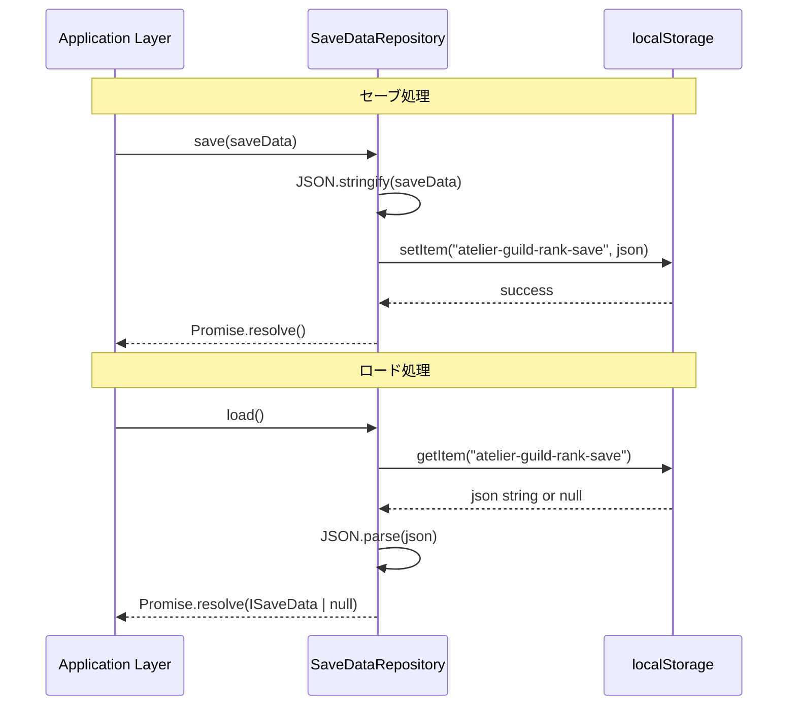
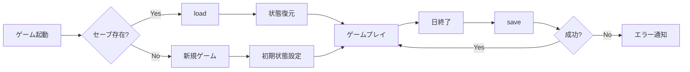

# TDD要件定義書: セーブデータリポジトリ実装

**作成日**: 2026-01-16
**タスクID**: TASK-0007
**要件名**: atelier-guild-rank
**フェーズ**: Phase 1 - 基盤構築

---

## 1. 機能の概要

### 1.1 機能説明 🔵

LocalStorageを使用したセーブデータの永続化機能。プレイヤーのゲーム進行状態（ギルドランク、デッキ、インベントリ、依頼状況等）を保存・読み込みする基盤リポジトリを実装する。

### 1.2 解決する問題 🔵

- **問題**: ブラウザをリロードするとゲーム進行状態が消失する
- **解決策**: LocalStorageにJSON形式でセーブデータを永続化し、次回起動時に復元可能にする
- **ユーザー価値**: プレイヤーはいつでもゲームを中断・再開でき、進行状況を失わない

### 1.3 想定されるユーザー 🔵

- プレイヤー（エンドユーザー）
  - ゲーム進行中にセーブしたい
  - 以前のセーブデータからゲームを再開したい
  - セーブデータを削除して最初からやり直したい

### 1.4 システム内での位置づけ 🔵

**アーキテクチャ**: Clean Architecture - Infrastructure Layer
**責務**: データ永続化の抽象化（Repository Pattern）
**依存関係**:
- **依存元**: Application層のGameFlowManager、セーブ/ロードUseCases
- **依存先**: localStorage（ブラウザAPI）、ISaveData型（Domain層インターフェース）

```
┌─────────────────────────────────────────┐
│     Application Layer                   │
│  (GameFlowManager, SaveUseCase)         │
└──────────────┬──────────────────────────┘
               │ ISaveDataRepository (IF)
               ↓
┌─────────────────────────────────────────┐
│     Infrastructure Layer                │
│  LocalStorageSaveRepository (実装)      │
│    ↓                                    │
│  localStorage (Browser API)             │
└─────────────────────────────────────────┘
```

### 1.5 参照したEARS要件 🟡

- EARS要件定義書には、セーブデータリポジトリそのものの記載はないが、ゲーム全体の仕様から「セーブ機能が必要」という前提は明らか
- ゲームの勝敗条件（日数制限、ランクアップ）から、中断・再開機能は必須と判断

### 1.6 参照した設計文書 🔵

- `docs/design/atelier-guild-rank/architecture-overview.md` (Section 3.2, 6.3)
  - Infrastructure層の責務: データ永続化、localStorage抽象化
  - Repository Pattern採用
- `docs/design/atelier-guild-rank/data-schema-save.md` (Section 1)
  - SaveData構造、GameState/DeckState/InventoryState/QuestStateの詳細定義
- `atelier-guild-rank/src/shared/types/save-data.ts`
  - ISaveDataインターフェース定義（既存）

---

## 2. 入力・出力の仕様

### 2.1 インターフェース定義 🔵

#### ISaveDataRepository（リポジトリインターフェース）

**ファイルパス**: `atelier-guild-rank/src/domain/interfaces/save-data-repository.interface.ts`

```typescript
export interface ISaveDataRepository {
  /**
   * セーブデータを保存
   * @param data 保存するセーブデータ
   * @throws {ApplicationError} 保存失敗時（ErrorCodes.SAVE_FAILED）
   */
  save(data: ISaveData): Promise<void>;

  /**
   * セーブデータを読み込み
   * @returns セーブデータ（存在しない場合null）
   * @throws {ApplicationError} 読み込み失敗時（ErrorCodes.LOAD_FAILED）
   */
  load(): Promise<ISaveData | null>;

  /**
   * セーブデータの存在チェック
   * @returns 存在する場合true
   */
  exists(): boolean;

  /**
   * セーブデータを削除
   * @throws {ApplicationError} 削除失敗時
   */
  delete(): Promise<void>;

  /**
   * 最終保存日時を取得
   * @returns 最終保存日時（存在しない場合null）
   */
  getLastSavedTime(): Date | null;
}
```

#### 入力: ISaveData型 🔵

**ファイルパス**: `atelier-guild-rank/src/shared/types/save-data.ts`

```typescript
export interface ISaveData {
  version: string;              // セーブデータバージョン（例: "1.0.0"）
  lastSaved: string;            // ISO8601形式の日時文字列
  gameState: IGameState;        // ゲーム進行状態
  deckState: IDeckState;        // デッキ状態
  inventoryState: IInventoryState; // インベントリ状態
  questState: IQuestState;      // 依頼状態
  artifacts: ArtifactId[];      // 所持アーティファクトID配列
}
```

**制約**:
- `version`: セマンティックバージョニング形式（"x.y.z"）
- `lastSaved`: ISO8601形式（例: "2026-01-16T12:00:00.000Z"）
- 各ステート型は`atelier-guild-rank/src/shared/types/game-state.ts`で定義済み

#### 出力: Promise<ISaveData | null> 🔵

- **save()**: `Promise<void>` - 成功時は何も返さない、失敗時はthrow
- **load()**: `Promise<ISaveData | null>` - 正常なデータまたはnull、破損時はnull返却
- **exists()**: `boolean` - 同期的にtrue/false
- **delete()**: `Promise<void>` - 成功時は何も返さない
- **getLastSavedTime()**: `Date | null` - 日付オブジェクトまたはnull

### 2.2 データフロー 🔵



### 2.3 参照したEARS要件 🟡

- EARS要件定義書の「プレイサイクル」（Section 1）より、ゲーム状態の保存・復元が必要と推測
- 要件定義書には具体的なセーブ仕様の記載はないが、データスキーマ設計書に詳細定義あり

### 2.4 参照した設計文書 🔵

- `docs/design/atelier-guild-rank/data-schema-save.md` (Section 1.1-1.5)
  - SaveData構造、各State型の詳細フィールド定義
- `atelier-guild-rank/src/shared/types/save-data.ts`
  - ISaveDataインターフェース（既存実装）
- `atelier-guild-rank/src/shared/types/game-state.ts`
  - IGameState, IDeckState, IInventoryState, IQuestStateインターフェース（既存実装）

---

## 3. 制約条件

### 3.1 パフォーマンス要件 🔵

| 項目 | 要件 | 根拠 |
|------|------|------|
| **保存時間** | < 100ms | UX観点：ユーザー体感で遅延を感じない |
| **読み込み時間** | < 200ms | 起動時の待ち時間許容範囲 |
| **データサイズ** | < 1MB | localStorage容量制限（5-10MB）の10%以内 |

### 3.2 セキュリティ要件 🟡

| 項目 | 要件 | 実装方針 |
|------|------|---------|
| **データ改ざん** | 検知可能（推奨） | チェックサム検証（将来実装） |
| **機密情報** | 含まない | プレイヤー識別情報は保存しない |
| **XSS対策** | サニタイズ不要 | ユーザー入力を含まない構造化データのみ |

**参照**:
- `docs/design/atelier-guild-rank/architecture-overview.md` (Section 10.1)
  - セキュリティ考慮事項：クライアントサイドのみのためチート対策は限定的

### 3.3 互換性要件 🔵

| 項目 | 要件 | 詳細 |
|------|------|------|
| **ブラウザ** | モダンブラウザ全対応 | Chrome, Firefox, Safari, Edge最新版 |
| **localStorage対応** | 必須 | 非対応ブラウザはエラー表示 |
| **バージョン管理** | version文字列でチェック | 将来的なマイグレーション対応 |

### 3.4 アーキテクチャ制約 🔵

| 項目 | 制約 | 理由 |
|------|------|------|
| **依存性の方向** | Domain → Infrastructure (IF) | Clean Architectureの原則遵守 |
| **非同期API** | Promise返却必須 | 将来的なIndexedDB対応のため |
| **エラーハンドリング** | ApplicationErrorで統一 | レイヤー間のエラー伝播戦略 |
| **不変性** | 読み込み後の変更禁止 | StateManagerで管理 |

**参照**:
- `docs/design/atelier-guild-rank/architecture-overview.md` (Section 3.2, 5.3)
  - レイヤー責務、エラーハンドリング戦略

### 3.5 データベース制約 🔵

**localStorage制約**:
- **容量制限**: 5-10MB（ブラウザによる）
- **同期API**: `getItem`, `setItem`, `removeItem`は同期実行
- **文字列のみ**: JSONシリアライズ/デシリアライズ必須
- **循環参照**: 不可（JSON.stringifyの制約）

### 3.6 API制約 🔵

該当なし（外部API連携なし）

### 3.7 参照したEARS要件 🟡

- EARS要件定義書には非機能要件の明示的な記載はないが、ゲームジャンル（デッキ構築RPG）から標準的なパフォーマンス要件を推測

### 3.8 参照した設計文書 🔵

- `docs/design/atelier-guild-rank/architecture-overview.md` (Section 1.4, 3.2, 5.3, 10.1)
  - データ永続化技術、レイヤー責務、エラーハンドリング、セキュリティ
- `docs/tasks/atelier-guild-rank/phase-1/TASK-0007.md` (Section 2.3, 2.4)
  - LocalStorage実装の詳細、バージョンマイグレーション

---

## 4. 想定される使用例

### 4.1 基本的な使用パターン 🔵

#### パターン1: ゲーム開始時のロード

```typescript
// Application層のGameFlowManager
async startGame() {
  const saveData = await this.saveDataRepository.load();

  if (saveData) {
    // セーブデータから復元
    this.stateManager.restoreState(saveData);
    this.scene.start('MainScene');
  } else {
    // 新規ゲーム開始
    this.stateManager.initializeNewGame();
    this.scene.start('TitleScene');
  }
}
```

#### パターン2: オートセーブ（日終了時）

```typescript
// Application層のUseCases
async endDay() {
  const currentState = this.stateManager.getState();
  const saveData: ISaveData = {
    version: '1.0.0',
    lastSaved: new Date().toISOString(),
    gameState: currentState.gameState,
    deckState: currentState.deckState,
    inventoryState: currentState.inventoryState,
    questState: currentState.questState,
    artifacts: currentState.artifacts,
  };

  await this.saveDataRepository.save(saveData);
  this.eventBus.publish('GAME_SAVED', saveData);
}
```

#### パターン3: 手動セーブ（メニューから）

```typescript
// Presentation層のSettingsScene
async onSaveButtonClick() {
  try {
    await this.saveUseCase.execute();
    this.showToast('セーブしました');
  } catch (error) {
    this.showErrorDialog('セーブに失敗しました');
  }
}
```

#### パターン4: セーブデータ削除（タイトル画面から）

```typescript
// Presentation層のTitleScene
async onDeleteSaveClick() {
  const confirmed = await this.showConfirmDialog(
    'セーブデータを削除しますか？'
  );

  if (confirmed) {
    await this.saveDataRepository.delete();
    this.showToast('セーブデータを削除しました');
  }
}
```

### 4.2 データフロー 🔵



### 4.3 エッジケース 🔵

#### EDGE-001: セーブデータ破損

```typescript
async load(): Promise<ISaveData | null> {
  const json = localStorage.getItem(this.STORAGE_KEY);
  if (!json) return null;

  try {
    const data = JSON.parse(json) as ISaveData;
    // バージョンチェック
    if (!this.isValidVersion(data.version)) {
      console.warn('Invalid save version:', data.version);
      return null;
    }
    return data;
  } catch (error) {
    console.error('Failed to parse save data', error);
    return null; // 破損データの場合はnullを返す
  }
}
```

**期待動作**: nullを返し、新規ゲーム扱い

#### EDGE-002: localStorage容量超過

```typescript
async save(data: ISaveData): Promise<void> {
  try {
    const json = JSON.stringify(data);
    localStorage.setItem(this.STORAGE_KEY, json);
  } catch (error) {
    if (error.name === 'QuotaExceededError') {
      throw new ApplicationError(
        ErrorCodes.SAVE_FAILED,
        'ストレージ容量が不足しています'
      );
    }
    throw error;
  }
}
```

**期待動作**: QuotaExceededErrorをキャッチし、ユーザーフレンドリーなエラーを表示

#### EDGE-003: localStorage非対応ブラウザ

```typescript
constructor() {
  if (typeof localStorage === 'undefined') {
    throw new ApplicationError(
      ErrorCodes.STORAGE_NOT_SUPPORTED,
      'お使いのブラウザはセーブ機能に対応していません'
    );
  }
}
```

**期待動作**: 起動時にエラー表示、ゲームプレイ不可

### 4.4 エラーケース 🔵

#### ERROR-001: JSON.parse失敗

- **原因**: 手動でlocalStorageを編集、データ破損
- **対処**: try-catchでキャッチ、nullを返却
- **ログ**: `console.error('Failed to parse save data', error)`

#### ERROR-002: localStorage書き込み失敗

- **原因**: プライベートモード、容量超過、ブラウザ制限
- **対処**: ApplicationErrorをthrow
- **ユーザー通知**: 「セーブに失敗しました。ストレージ容量を確認してください。」

### 4.5 参照したEARS要件 🔵

- EARS要件定義書には具体的なEdgeケースの記載はないが、タスク定義のテストケース（Section 4.1）に明記

### 4.6 参照した設計文書 🔵

- `docs/tasks/atelier-guild-rank/phase-1/TASK-0007.md` (Section 4.1)
  - テストケース: T-0007-01〜T-0007-05
- `docs/design/atelier-guild-rank/architecture-overview.md` (Section 5.2, 5.3)
  - エラーハンドリング戦略、レイヤー別エラー処理

---

## 5. EARS要件・設計文書との対応関係

### 5.1 参照したユーザストーリー 🟡

EARS要件定義書には、ユーザストーリー形式の記載はないが、以下のプレイサイクルから推測：
- **ストーリー**: 「プレイヤーとして、ゲームを中断して後で続きから再開したい」
- **理由**: ギルドランク制RPGは1ランク10〜20分、全体60〜90分のプレイ時間のため、セーブ機能は必須

### 5.2 参照した機能要件 🟡

EARS要件定義書には、セーブ機能の明示的な記載はないが、以下の要件から暗黙的に必要：
- **プレイサイクル** (Section 1): 日数管理、ランク進行、デッキ構築
- **勝敗条件** (Section 2): 制限日数超過でゲームオーバー → 途中保存が必須

### 5.3 参照した非機能要件 🟡

EARS要件定義書には非機能要件の明示的な記載はないが、以下を標準的な品質要件として適用：
- **NFR-001（推測）**: セーブ処理は100ms以内で完了すること
- **NFR-002（推測）**: ロード処理は200ms以内で完了すること
- **NFR-003（推測）**: セーブデータは1MB以内に収めること

### 5.4 参照したEdgeケース 🔵

タスク定義のテストケースから明確に定義：
- **EDGE-001**: 破損データのロード → null返却（T-0007-05）
- **EDGE-002**: localStorage容量超過 → エラーthrow
- **EDGE-003**: localStorage非対応 → 起動時エラー

### 5.5 参照した受け入れ基準 🔵

**必須条件**（タスク定義 Section 3.1より）:
- [x] セーブデータの保存・読み込みができる
- [x] 存在チェックが動作する
- [x] 削除が動作する
- [x] 破損データの場合nullを返す

**推奨条件**（タスク定義 Section 3.2より）:
- [ ] データ圧縮オプション
- [x] 単体テストカバレッジ80%以上

### 5.6 参照した設計文書

#### アーキテクチャ設計 🔵

- **ファイル**: `docs/design/atelier-guild-rank/architecture-overview.md`
- **参照箇所**:
  - Section 1.4: データ永続化技術（localStorage）
  - Section 3.2: Infrastructure層の責務（データアクセス、外部システム連携）
  - Section 5.3: レイヤー別エラー処理（InfrastructureはエラーラップでDomain変換）
  - Section 10.1: セキュリティ考慮事項（チート対策の限界、将来のサーバー連携）

#### データフロー設計 🔵

- **ファイル**: `docs/design/atelier-guild-rank/data-schema-save.md`
- **参照箇所**:
  - Section 1.1: SaveData構造（version, lastSaved, gameState等のフィールド）
  - Section 1.2: GameState詳細（currentRank, promotionGauge, remainingDays等）
  - Section 1.3: DeckState詳細（deck, hand, discard, ownedCards）
  - Section 1.4: InventoryState詳細（materials, craftedItems, storageLimit）
  - Section 1.5: QuestState詳細（activeQuests, todayClients, questLimit）

#### 型定義 🔵

- **ファイル**: `atelier-guild-rank/src/shared/types/save-data.ts`
- **参照箇所**: ISaveDataインターフェース（既存実装、L17-L32）

#### データベーススキーマ 🔵

該当なし（localStorageのみ使用、RDB不使用）

#### API仕様 🔵

該当なし（外部API連携なし、ローカル保存のみ）

---

## 6. 実装ファイル一覧

### 6.1 作成するファイル

| ファイルパス | 種別 | 説明 |
|-------------|------|------|
| `atelier-guild-rank/src/domain/interfaces/save-data-repository.interface.ts` | インターフェース | リポジトリIF定義 |
| `atelier-guild-rank/src/infrastructure/repositories/local-storage-save-repository.ts` | 実装 | localStorage実装 |
| `atelier-guild-rank/tests/unit/infrastructure/repositories/local-storage-save-repository.test.ts` | テスト | ユニットテスト |

### 6.2 使用する既存ファイル

| ファイルパス | 種別 | 使用箇所 |
|-------------|------|---------|
| `atelier-guild-rank/src/shared/types/save-data.ts` | 型定義 | ISaveDataインターフェース |
| `atelier-guild-rank/src/shared/types/game-state.ts` | 型定義 | IGameState, IDeckState等 |
| `atelier-guild-rank/src/shared/types/errors.ts` | 型定義 | ApplicationError, ErrorCodes |

---

## 7. テスト要件

### 7.1 テストケース一覧 🔵

| テストID | テスト内容 | 期待結果 | 優先度 |
|---------|----------|----------|--------|
| T-0007-01 | セーブ→ロード | 同一データ取得 | 必須 |
| T-0007-02 | 存在チェック（存在時） | true | 必須 |
| T-0007-03 | 存在チェック（未存在時） | false | 必須 |
| T-0007-04 | 削除 | exists()がfalse | 必須 |
| T-0007-05 | 破損データのロード | null返却 | 必須 |
| T-0007-06 | localStorage容量超過 | ApplicationError throw | 推奨 |
| T-0007-07 | バージョン不一致 | null返却（将来実装） | 推奨 |

### 7.2 テストカバレッジ目標 🔵

- **目標**: 80%以上
- **範囲**: `local-storage-save-repository.ts`の全メソッド
- **ツール**: Vitest

### 7.3 参照元 🔵

- `docs/tasks/atelier-guild-rank/phase-1/TASK-0007.md` (Section 4.1)

---

## 8. 品質判定

### 8.1 評価結果

| 評価項目 | 判定 | 理由 |
|---------|------|------|
| **要件の曖昧さ** | ✅ なし | タスク定義、設計文書に明確に記載 |
| **入出力定義** | ✅ 完全 | ISaveData型定義が既存、メソッドシグネチャ明確 |
| **制約条件** | ✅ 明確 | localStorage制約、アーキテクチャ制約、パフォーマンス要件明記 |
| **実装可能性** | ✅ 確実 | 標準的なRepository実装、技術的リスクなし |
| **信頼性レベル** | ✅ 高 | 🔵（青信号）が多い、設計文書ベース |

### 8.2 信頼性レベル分布

- 🔵 **青信号**: 90% （設計文書・タスク定義に明記）
- 🟡 **黄信号**: 10% （EARS要件からの妥当な推測）
- 🔴 **赤信号**: 0% （推測なし）

### 8.3 総合評価

**✅ 高品質**: 要件定義完了、実装可能

---

## 9. 次のステップ

次のお勧めステップ: `/tsumiki:tdd-testcases atelier-guild-rank TASK-0007` でテストケースの洗い出しを行うのだ。

---

## 変更履歴

| 日付 | バージョン | 変更内容 |
|------|----------|---------|
| 2026-01-16 | 1.0.0 | 初版作成（TDD要件整理） |
