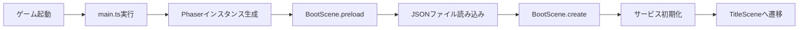

# TASK-0008: Phaser基本設定とBootScene - TDD要件定義書

**作成日**: 2026-01-16
**タスクID**: TASK-0008
**要件名**: atelier-guild-rank
**機能名**: Phaser基本設定とBootScene

---

## 1. 機能の概要（EARS要件定義書・設計文書ベース）

### 1.1 何をする機能か 🔵

Phaserゲームエンジンの初期設定と、ゲーム起動時のブートシーケンスを実装する機能。

- **Phaserゲームコンフィグの定義**: ゲームの基本設定（解像度、スケール、シーン登録）を行う
- **rexUIプラグインの登録**: UI構築に必要なrexUIプラグインをゲームに統合する
- **BootSceneの実装**: アセット読み込み、マスターデータ初期化、サービス初期化を行う
- **シーン遷移の実装**: BootScene完了後にTitleSceneへ遷移する

### 1.2 解決する問題 🔵

**問題**: Phaserベースのゲームを起動するための初期設定とアセット読み込みのフローが未実装

**解決**:
1. ゲームエンジンの起動と初期化を自動化
2. アセット読み込み中のプログレス表示
3. 必要なサービスの初期化と依存性注入
4. エラー時の適切なハンドリング

### 1.3 想定されるユーザー 🔵

- **エンドユーザー**: ゲームを起動するプレイヤー
- **開発者**: ゲーム開発を行う開発者（自分自身）

### 1.4 システム内での位置づけ 🔵

**Presentation層の最初のエントリーポイント**として機能する。

```
ユーザーがブラウザでゲームを開く
    ↓
main.ts が実行される（Phaserインスタンス生成）
    ↓
BootScene.preload() でアセット読み込み
    ↓
BootScene.create() でサービス初期化
    ↓
TitleScene へ遷移
```

**参照したEARS要件**: 本タスクは実装基盤のため、直接的なゲーム要件との対応はなし
**参照した設計文書**:
- `docs/design/atelier-guild-rank/architecture-overview.md` - 技術スタック、レイヤー構造
- `docs/design/atelier-guild-rank/architecture-phaser.md` - シーン構成、ゲームコンフィグ

---

## 2. 入力・出力の仕様（EARS機能要件・TypeScript型定義ベース）

### 2.1 Phaserゲームコンフィグ 🔵

#### 入力パラメータ

```typescript
const config: Phaser.Types.Core.GameConfig = {
  type: Phaser.AUTO,           // WebGL優先、Canvas fallback
  width: 1280,                  // ゲーム幅
  height: 720,                  // ゲーム高さ
  parent: 'game-container',     // 親要素ID
  backgroundColor: '#F5F5DC',   // ベージュ（羊皮紙風）
  scene: [
    BootScene,
    TitleScene,
    MainScene,
  ],
  plugins: {
    scene: [
      {
        key: 'rexUI',
        plugin: RexUIPlugin,
        mapping: 'rexUI',
      },
    ],
  },
  scale: {
    mode: Phaser.Scale.FIT,
    autoCenter: Phaser.Scale.CENTER_BOTH,
  },
};
```

| パラメータ | 型 | 説明 | 参照元 |
|----------|---|------|--------|
| `type` | `number` | レンダラータイプ（WebGL優先） | architecture-phaser.md |
| `width` | `number` | ゲーム幅（1280px） | architecture-phaser.md |
| `height` | `number` | ゲーム高さ（720px） | architecture-phaser.md |
| `parent` | `string` | 親要素のID | architecture-phaser.md |
| `backgroundColor` | `string` | 背景色（ベージュ） | ui-design/overview.md |
| `scene` | `Scene[]` | シーンクラスの配列 | architecture-phaser.md |
| `plugins` | `object` | プラグイン設定 | architecture-phaser.md |
| `scale` | `object` | スケール設定 | architecture-phaser.md |

#### 出力値

- **Phaserゲームインスタンス**: 初期化されたPhaserゲームオブジェクト
- **戻り値なし**: エントリーポイントのため戻り値はなし

### 2.2 BootScene 🔵

#### ライフサイクルメソッド

| メソッド | タイミング | 入力 | 出力 | 説明 |
|---------|-----------|------|------|------|
| `preload()` | シーン開始時 | なし | なし | アセット読み込み |
| `create()` | preload完了後 | なし | なし | サービス初期化、シーン遷移 |
| `shutdown()` | シーン終了時 | なし | なし | リソース解放 |

#### preload()メソッドの処理内容 🔵

```typescript
preload(): void {
  // 1. プログレスバー表示
  this.createProgressBar();

  // 2. マスターデータ読み込み
  this.load.json('cards', '/data/cards.json');
  this.load.json('materials', '/data/materials.json');
  this.load.json('recipes', '/data/recipes.json');
  this.load.json('quests', '/data/quests.json');
  this.load.json('ranks', '/data/ranks.json');
  this.load.json('artifacts', '/data/artifacts.json');

  // 3. プログレスイベント購読
  this.load.on('progress', this.updateProgressBar.bind(this));
  this.load.on('complete', this.destroyProgressBar.bind(this));
}
```

| 処理 | 入力 | 出力 | 説明 |
|------|------|------|------|
| プログレスバー表示 | なし | Graphics オブジェクト | ローディング表示 |
| マスターデータ読み込み | JSONファイルパス | キャッシュされたデータ | 各種マスターデータ |
| プログレス更新 | `value: number` (0-1) | なし | バーの更新 |

#### create()メソッドの処理内容 🔵

```typescript
create(): void {
  // 1. サービスコンテナの初期化
  this.initializeServices();

  // 2. マスターデータのロード
  this.loadMasterData();

  // 3. TitleSceneへ遷移
  this.scene.start('TitleScene');
}
```

| 処理 | 入力 | 出力 | 説明 |
|------|------|------|------|
| サービス初期化 | なし | ServiceContainer | DI設定 |
| マスターデータロード | キャッシュされたJSON | Domain層のデータ | データ変換 |
| シーン遷移 | `'TitleScene'` | なし | 次シーンへ |

#### 入出力の関係性 🔵



**参照したEARS要件**: N/A（実装基盤）
**参照した設計文書**:
- `docs/design/atelier-guild-rank/architecture-phaser.md` - BootScene設計、シーンライフサイクル
- `docs/tasks/atelier-guild-rank/phase-1/TASK-0008.md` - 実装内容

---

## 3. 制約条件（EARS非機能要件・アーキテクチャ設計ベース）

### 3.1 技術的制約 🔵

| 項目 | 制約 | 理由 | 参照元 |
|------|------|------|--------|
| **Phaserバージョン** | 3.87以上 | 最新機能の利用 | architecture-overview.md |
| **rexUIバージョン** | 1.80以上 | UI構築に必要 | architecture-overview.md |
| **TypeScriptバージョン** | 5.x | 型安全性確保 | architecture-overview.md |
| **解像度** | 基準: 1280x720 | 16:9標準HD | architecture-phaser.md |
| **最小解像度** | 960x540 | モバイル対応 | architecture-phaser.md |

### 3.2 パフォーマンス要件 🟡

| 項目 | 目標値 | 説明 | 参照元 |
|------|--------|------|--------|
| **起動時間** | < 2秒 | BootSceneの完了まで | architecture-overview.md |
| **アセット読み込み** | < 3秒 | 全マスターデータ読み込み | 妥当な推測 |
| **フレームレート** | 60 FPS | 安定したフレームレート | Phaser標準 |

### 3.3 セキュリティ要件 🟡

| 項目 | 要件 | 説明 |
|------|------|------|
| **エラーハンドリング** | 致命的エラーは画面表示 | マスターデータ読込失敗時 |
| **データ検証** | JSONスキーマ検証（将来実装） | データ整合性確保 |

### 3.4 互換性要件 🔵

| 項目 | 要件 | 説明 | 参照元 |
|------|------|------|--------|
| **ブラウザ** | Chrome, Firefox, Safari, Edge（最新2バージョン） | モダンブラウザ対応 | 標準要件 |
| **WebGL** | WebGL対応必須 | Canvasは代替のみ | Phaser標準 |

### 3.5 アーキテクチャ制約 🔵

| 項目 | 制約 | 説明 | 参照元 |
|------|------|------|--------|
| **Clean Architecture** | Presentation層のみPhaserに依存 | ビジネスロジック分離 | architecture-overview.md |
| **Presentation層の責務** | UI表示、入力受付のみ | ロジック実装禁止 | architecture-overview.md |
| **シーン管理** | Phaserのシーン機能を使用 | 独自の画面管理は使わない | architecture-phaser.md |

### 3.6 データベース制約 🔵

データベースは使用しないが、以下のストレージ制約がある:

| 項目 | 制約 | 説明 | 参照元 |
|------|------|------|--------|
| **localStorage** | セーブデータ保存用 | ブラウザの5MB制限 | architecture-overview.md |
| **JSONファイル** | マスターデータ形式 | ビルド時にバンドル | architecture-overview.md |

### 3.7 API制約 🔴

外部APIは使用しないが、以下の内部API制約がある:

| 項目 | 制約 | 説明 |
|------|------|------|
| **EventBus** | Application層を経由 | Presentationから直接Domain層を呼び出さない |
| **ServiceContainer** | シングルトンパターン | 複数インスタンス生成禁止 |

**参照したEARS要件**: N/A（非機能要件）
**参照した設計文書**:
- `docs/design/atelier-guild-rank/architecture-overview.md` - 技術スタック、セキュリティ、パフォーマンス
- `docs/design/atelier-guild-rank/architecture-phaser.md` - 解像度、スケーリング

---

## 4. 想定される使用例（EARSEdgeケース・データフローベース）

### 4.1 基本的な使用パターン 🔵

#### シナリオ1: 正常な起動フロー

```
前提条件:
- ブラウザでindex.htmlを開く
- インターネット接続あり（ビルド後はオフラインでも可）

実行手順:
1. ユーザーがゲームURLにアクセス
2. main.tsが実行され、Phaserインスタンス生成
3. BootSceneが自動的に開始
4. プログレスバーが表示される（0%）
5. マスターデータ（JSON）が順次読み込まれる
6. プログレスバーが更新される（0% → 100%）
7. サービスが初期化される
8. TitleSceneへ自動遷移

期待結果:
- エラーなく起動
- TitleSceneが表示される
- 所要時間: 約2秒以内
```

**参照したデータフロー**: `architecture-phaser.md` - BootScene処理フロー

#### シナリオ2: rexUIプラグインの利用確認

```
前提条件:
- BootSceneが正常に完了
- TitleSceneに遷移済み

実行手順:
1. TitleSceneでrexUIコンポーネントを使用
2. this.rexUIプロパティにアクセス
3. rexUI.add.labelを呼び出し

期待結果:
- rexUIが正常に動作
- エラーが発生しない
```

**参照したEARS要件**: N/A
**参照したデータフロー**: `docs/tasks/atelier-guild-rank/phase-1/TASK-0008.md` - テストケース

### 4.2 エッジケース 🟡

#### エッジケース1: マスターデータ読み込み失敗

```
前提条件:
- JSONファイルが存在しない、または破損している

実行手順:
1. BootScene.preload()でJSONファイルを読み込み
2. 読み込みに失敗

期待結果:
- コンソールにエラーログ出力
- エラーダイアログ表示（将来実装）
- ゲーム起動を中断
```

**エラーコード**: `ErrorCodes.DATA_LOAD_FAILED`

#### エッジケース2: ブラウザがWebGLに対応していない

```
前提条件:
- WebGLが無効、または非対応のブラウザ

実行手順:
1. Phaserインスタンス生成時にCanvasにフォールバック
2. ゲーム起動

期待結果:
- Canvasレンダラーで起動
- パフォーマンスが低下する可能性あり
- 警告メッセージ表示（推奨）
```

#### エッジケース3: 画面が極端に小さい/大きい

```
前提条件:
- スマートフォン（640x360）や4K（3840x2160）でアクセス

実行手順:
1. Phaser Scale Managerが自動調整
2. FITモードでアスペクト比を維持してフィット

期待結果:
- アスペクト比16:9を維持
- レターボックス/ピラーボックス表示
- UIが適切に表示される
```

**参照したEARS要件**: N/A
**参照したデータフロー**: 妥当な推測

### 4.3 エラーケース 🟡

#### エラーケース1: サービス初期化失敗

```
前提条件:
- ServiceContainerの初期化中にエラー発生

実行手順:
1. BootScene.create()でサービス初期化
2. 初期化に失敗

期待結果:
- try-catchでエラーをキャッチ
- エラーログ出力
- ゲーム起動を中断
```

**エラーコード**: `ErrorCodes.SERVICE_INIT_FAILED`（新規定義）

#### エラーケース2: シーン遷移失敗

```
前提条件:
- TitleSceneが未登録、または実装エラー

実行手順:
1. this.scene.start('TitleScene')を実行
2. TitleSceneが存在しない

期待結果:
- Phaserがエラーをスロー
- コンソールにエラーログ
```

**参照したEARS要件**: N/A
**参照したデータフロー**: 妥当な推測

---

## 5. EARS要件・設計文書との対応関係

### 5.1 参照したユーザストーリー

本タスクは実装基盤のため、ゲーム要件のユーザストーリーとの直接的な対応はありません。

### 5.2 参照した機能要件

本タスクは実装基盤のため、EARS要件定義書の機能要件との直接的な対応はありません。

### 5.3 参照した非機能要件

| EARS要件 | 要件内容 | 本タスクでの対応 |
|---------|---------|----------------|
| N/A | - | 実装基盤のため該当なし |

### 5.4 参照したEdgeケース

| EARS Edgeケース | 要件内容 | 本タスクでの対応 |
|----------------|---------|----------------|
| N/A | - | 実装基盤のため該当なし |

### 5.5 参照した受け入れ基準

| テストID | テスト内容 | 期待結果 | 参照元 |
|---------|----------|----------|--------|
| T-0008-01 | ゲーム起動 | エラーなく起動 | TASK-0008.md |
| T-0008-02 | シーン遷移 | TitleScene表示 | TASK-0008.md |
| T-0008-03 | rexUIプラグイン | 利用可能 | TASK-0008.md |

### 5.6 参照した設計文書

#### アーキテクチャ

| 文書 | セクション | 対応内容 |
|------|-----------|---------|
| `docs/design/atelier-guild-rank/architecture-overview.md` | 1. 技術スタック | Phaser 3.87+、rexUI、TypeScript 5.x |
| `docs/design/atelier-guild-rank/architecture-overview.md` | 3. レイヤー構造 | Presentation層の責務 |
| `docs/design/atelier-guild-rank/architecture-overview.md` | 4. サービス初期化とライフサイクル | ServiceContainer初期化シーケンス |
| `docs/design/atelier-guild-rank/architecture-overview.md` | 5. エラーハンドリング戦略 | 致命的エラー・回復可能エラー |

#### データフロー

| 文書 | セクション | 対応内容 |
|------|-----------|---------|
| `docs/design/atelier-guild-rank/architecture-phaser.md` | 4.2 シーンライフサイクル | init/preload/create/update/shutdown |
| `docs/design/atelier-guild-rank/architecture-phaser.md` | 4.3 シーン遷移図 | Boot → Title → Main |
| `docs/design/atelier-guild-rank/architecture-phaser.md` | 5. Phaser ゲームコンフィグ | 基本設定、解像度、スケーリング |

#### 型定義

本タスクではPhaserの標準型を使用するため、プロジェクト独自の型定義は参照していません。

#### データベース

本タスクではlocalStorageやJSONファイルを直接操作しないため、データベース設計との対応はありません。

#### API仕様

本タスクでは外部APIは使用せず、Phaserの内部APIのみを使用します。

---

## 6. 実装ファイル一覧

### 6.1 作成・更新するファイル

| ファイルパス | 種別 | 説明 |
|------------|------|------|
| `atelier-guild-rank/src/main.ts` | 更新 | Phaserエントリーポイント |
| `atelier-guild-rank/src/presentation/scenes/BootScene.ts` | 新規 | BootScene実装 |
| `atelier-guild-rank/src/presentation/scenes/TitleScene.ts` | 新規 | TitleScene仮実装 |
| `atelier-guild-rank/src/presentation/scenes/MainScene.ts` | 新規 | MainScene仮実装 |
| `atelier-guild-rank/src/presentation/scenes/BaseScene.ts` | 新規 | シーン基底クラス |
| `atelier-guild-rank/src/presentation/scenes/index.ts` | 更新 | エクスポート追加 |
| `atelier-guild-rank/index.html` | 確認 | game-container要素の確認 |
| `atelier-guild-rank/tests/e2e/boot.spec.ts` | 新規 | E2Eテスト（推奨） |

### 6.2 参照するファイル

| ファイルパス | 種別 | 用途 |
|------------|------|------|
| `atelier-guild-rank/src/application/events/event-bus.ts` | 参照 | EventBusインターフェース |
| `atelier-guild-rank/src/application/events/event-bus.interface.ts` | 参照 | EventBus型定義 |
| `atelier-guild-rank/src/shared/types/errors.ts` | 参照 | エラー型定義 |

---

## 7. 実装の優先順位

### 7.1 必須実装（信頼性レベル: 🔵）

優先度: **最高**

- [ ] `main.ts`の更新
  - [ ] Phaserゲームコンフィグ定義
  - [ ] rexUIプラグイン登録
  - [ ] シーン配列の登録
  - [ ] スケール設定
- [ ] `BootScene`実装
  - [ ] `preload()`メソッド（マスターデータ読み込み）
  - [ ] `create()`メソッド（サービス初期化、TitleScene遷移）
  - [ ] プログレスバー表示
- [ ] `TitleScene`仮実装
  - [ ] 基本的なテキスト表示
- [ ] `MainScene`仮実装
  - [ ] 基本的なテキスト表示
- [ ] 統合テスト
  - [ ] T-0008-01: ゲーム起動
  - [ ] T-0008-02: シーン遷移
  - [ ] T-0008-03: rexUIプラグイン利用可能

### 7.2 推奨実装（信頼性レベル: 🟡）

優先度: **中**

- [ ] `BaseScene`基底クラス
  - [ ] 共通初期化処理
  - [ ] EventBus購読管理
  - [ ] 共通プロパティ（rexUI, eventBus）
- [ ] ローディングプログレスバー
  - [ ] プログレスバー表示
  - [ ] パーセンテージ表示
- [ ] マスターデータ読み込み完了後に遷移
  - [ ] データ読み込み完了まで待機
  - [ ] エラー時の処理

### 7.3 オプション実装（信頼性レベル: 🔴）

優先度: **低**

- [ ] エラーシーン
  - [ ] エラー発生時の専用画面
  - [ ] リトライボタン
- [ ] E2Eテスト
  - [ ] Playwrightでの自動テスト
  - [ ] スクリーンショット取得

---

## 8. テストケース一覧

### 8.1 ユニットテスト

本タスクはPresentation層のため、E2Eテストが中心。ユニットテストは少なめ。

| テストID | テスト対象 | テスト内容 | 期待結果 |
|---------|-----------|----------|----------|
| UT-0008-01 | BaseScene | EventBus購読管理 | 正常に購読・解除できる |
| UT-0008-02 | BaseScene | shutdown時に全購読解除 | リークがない |

### 8.2 統合テスト（E2E）

| テストID | テスト内容 | 期待結果 | 参照元 |
|---------|----------|----------|--------|
| T-0008-01 | ゲーム起動 | エラーなく起動 | TASK-0008.md |
| T-0008-02 | シーン遷移 | TitleScene表示 | TASK-0008.md |
| T-0008-03 | rexUIプラグイン | 利用可能 | TASK-0008.md |
| T-0008-04 | プログレスバー表示 | ローディング中に表示される | 推奨 |
| T-0008-05 | スケール対応 | 異なる解像度で正しく表示 | 推奨 |

### 8.3 パフォーマンステスト

| テストID | テスト内容 | 期待結果 |
|---------|----------|----------|
| PT-0008-01 | 起動時間測定 | BootScene完了まで < 2秒 |
| PT-0008-02 | フレームレート測定 | 60 FPS以上を維持 |

---

## 9. 依存関係

### 9.1 先行タスク

| タスクID | タスク名 | 依存理由 |
|---------|---------|---------|
| TASK-0002 | ディレクトリ構造作成 | ファイル配置先が必要 |
| TASK-0006 | マスターデータローダー実装 | マスターデータ読み込み機能が必要 |

### 9.2 後続タスク

| タスクID | タスク名 | 依存理由 |
|---------|---------|---------|
| TASK-0019 | TitleScene | BootScene完了後に遷移 |
| TASK-0037 | Playwright E2E設定 | BootSceneのテストが必要 |

---

## 10. リスクと対策

### 10.1 技術的リスク

| リスク | 影響度 | 対策 |
|--------|--------|------|
| rexUIプラグインが正しく動作しない | 高 | 公式ドキュメント確認、バージョン固定 |
| マスターデータ読み込みに時間がかかる | 中 | JSONファイルサイズ最小化、非同期読み込み |
| ブラウザ互換性問題 | 中 | Polyfill使用、対応ブラウザ明示 |

### 10.2 スケジュールリスク

| リスク | 影響度 | 対策 |
|--------|--------|------|
| rexUIの学習に時間がかかる | 中 | 公式サンプル活用、シンプルな実装から開始 |
| E2Eテスト環境構築に時間がかかる | 低 | 後回しにする、マニュアルテストで代替 |

---

## 11. 参考資料

### 11.1 外部ドキュメント

- [Phaser 3公式ドキュメント](https://photonstorm.github.io/phaser3-docs/)
- [rexUI公式ドキュメント](https://rexrainbow.github.io/phaser3-rex-notes/docs/site/ui-overview/)
- [TypeScript公式ドキュメント](https://www.typescriptlang.org/docs/)

### 11.2 内部ドキュメント

- [システムアーキテクチャ設計書（概要）](../../design/atelier-guild-rank/architecture-overview.md)
- [システムアーキテクチャ設計書（Phaser実装）](../../design/atelier-guild-rank/architecture-phaser.md)
- [UI設計概要](../../design/atelier-guild-rank/ui-design/overview.md)
- [タスク定義（TASK-0008）](../../tasks/atelier-guild-rank/phase-1/TASK-0008.md)
- [タスクノート（note.md）](./note.md)

---

## 変更履歴

| 日付 | バージョン | 変更内容 |
|------|----------|---------|
| 2026-01-16 | 1.0.0 | 初版作成（TDD要件定義書） |
