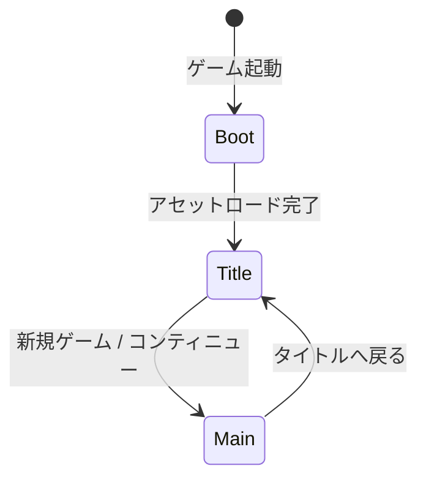

# TASK-0008: Phaser基本設定とBootScene - 開発ノート

**作成日**: 2026-01-16
**タスクID**: TASK-0008
**要件名**: atelier-guild-rank

---

## 1. 技術スタック

### 使用技術・フレームワーク
- **言語**: TypeScript 5.x
- **ゲームFW**: Phaser 3.87+
- **UIプラグイン**: rexUI（phaser3-rex-plugins 1.80+）
- **スタイリング**: Tailwind CSS 4.x
- **ビルド**: Vite 5.4.0
- **パッケージ管理**: pnpm 9.15.0
- **Lint/Format**: Biome 2.x
- **テスト**: Vitest 4.x（ユニットテスト）
- **E2Eテスト**: Playwright（最新）
- **Git Hooks**: Lefthook 2.x

### アーキテクチャパターン
- **Clean Architecture**: 4層構造（Presentation/Application/Domain/Infrastructure）
- **Scene-based Architecture**: Phaserのシーン管理を活用
- **イベント駆動設計**: EventBusによる疎結合な通信
- **Repository Pattern**: データアクセスの抽象化

### 参照元
- `docs/design/atelier-guild-rank/architecture-overview.md`
- `docs/design/atelier-guild-rank/architecture-phaser.md`
- `atelier-guild-rank/package.json`

---

## 2. 開発ルール

### プロジェクト固有ルール
- **応答は日本語で行う**
- **ずんだもん口調で喋る**（語尾は「なのだ。」）
- **Clean Architectureの原則に従う**
  - Domain/Application層はPhaserに依存しない
  - Presentation層のみPhaserを使用
  - ビジネスロジックはフレームワークに依存しない
- **Biomeによる一貫したコードスタイル**
- **Lefthookによるコミット前の品質チェック自動化**

### コーディング規約
- **エクスポート形式**: 名前付きエクスポートを使用
- **エラーハンドリング**: ApplicationErrorを使用し、ErrorCodesで定義されたコードを使う
- **型安全性**: 厳密な型定義、unknown型の使用
- **クラス名**: PascalCase（例: `BootScene`, `TitleScene`）
- **シーンキー**: 文字列でPascalCase（例: `'BootScene'`, `'TitleScene'`）
- **インターフェース名**: `I`プレフィックスを使用（例: `IEventBus`）
- **型定義の場所**: `src/shared/types/` に集約

### 参照元
- `CLAUDE.md`
- `docs/design/atelier-guild-rank/architecture-overview.md`

---

## 3. 関連実装

### 類似機能の実装例

#### 既存のmain.ts（参考パターン）
- **ファイル**: `atelier-guild-rank/src/main.ts`
- **実装パターン**:
  - Phaserのゲームコンフィグ定義
  - シーン配列の登録
  - scale設定（FITモード、CENTER_BOTH）
  - 基準解像度: 1280x720

#### EventBus実装（参考パターン）
- **ファイル**: `atelier-guild-rank/src/application/events/event-bus.ts`
- **実装パターン**:
  - インターフェースを`src/application/events/event-bus.interface.ts`に定義
  - 実装を`src/application/events/event-bus.ts`に配置
  - `on()`, `once()`, `off()`, `emit()`メソッド
  - 型安全なイベント発行・購読

#### 既存の型定義
- **エラー型**: `atelier-guild-rank/src/shared/types/errors.ts`
  - `ApplicationError`クラス
  - `ErrorCodes.DATA_LOAD_FAILED`, `ErrorCodes.DATA_NOT_LOADED`

### Phaserシーンの基本構造
```typescript
export class ExampleScene extends Phaser.Scene {
  constructor() {
    super({ key: 'ExampleScene' });
  }

  // 1. シーン初期化（データ受け取り）
  init(data?: unknown): void {
    // 初期化処理
  }

  // 2. アセット読み込み
  preload(): void {
    // this.load.image()等
  }

  // 3. オブジェクト生成
  create(): void {
    // this.add.text()等
  }

  // 4. フレーム更新（必要な場合のみ）
  update(time: number, delta: number): void {
    // 毎フレーム実行される処理
  }

  // 5. 後片付け
  shutdown(): void {
    // リソース解放、イベント購読解除等
  }
}
```

### 参照元
- `atelier-guild-rank/src/main.ts`
- `atelier-guild-rank/src/application/events/event-bus.ts`
- `atelier-guild-rank/src/application/events/event-bus.interface.ts`
- `atelier-guild-rank/src/shared/types/errors.ts`

---

## 4. 設計文書

### Phaserゲームコンフィグ設計

#### 基本設定
```typescript
const config: Phaser.Types.Core.GameConfig = {
  type: Phaser.AUTO,           // WebGL優先、Canvas fallback
  width: 1280,                  // ゲーム幅
  height: 720,                  // ゲーム高さ
  parent: 'game-container',     // 親要素ID
  backgroundColor: '#F5F5DC',   // ベージュ（羊皮紙風）
  scene: [
    BootScene,
    TitleScene,
    MainScene,
  ],
  plugins: {
    scene: [
      {
        key: 'rexUI',
        plugin: RexUIPlugin,
        mapping: 'rexUI',
      },
    ],
  },
  scale: {
    mode: Phaser.Scale.FIT,     // 画面にフィット
    autoCenter: Phaser.Scale.CENTER_BOTH,
  },
};
```

### BootScene設計

#### 責務
- マスターデータの読み込み
- アセットのプリロード
- サービスの初期化
- ローディングプログレスバーの表示
- TitleSceneへの遷移

#### BootSceneの処理フロー
```mermaid
sequenceDiagram
    participant Boot as BootScene
    participant Loader as AssetLoader
    participant Service as ServiceContainer
    participant Title as TitleScene

    Boot->>Boot: preload()
    Boot->>Loader: load master data
    Boot->>Loader: load assets
    Loader-->>Boot: loading progress
    Boot->>Boot: update progress bar

    Boot->>Boot: create()
    Boot->>Service: initialize services
    Service-->>Boot: ready

    Boot->>Title: scene.start('TitleScene')
```

#### BootSceneで読み込むもの
- マスターデータ（JSON）
  - カードマスター
  - 素材マスター
  - レシピマスター
  - 依頼マスター
  - ランクマスター
  - アーティファクトマスター
- 画像アセット（将来実装）
  - スプライトシート
  - UI画像
- 音声アセット（将来実装）

### シーン遷移設計



### 参照元
- `docs/design/atelier-guild-rank/architecture-phaser.md`
- `docs/design/atelier-guild-rank/ui-design/overview.md`
- `docs/tasks/atelier-guild-rank/phase-1/TASK-0008.md`

---

## 5. 注意事項

### 技術的制約
- **Phaserのバージョン**: 3.87以上を使用
- **rexUIプラグイン**: phaser3-rex-plugins 1.80以上
- **DOM要素**: Phaserのcanvas内でUIを構築（HTML Overlayは最小限）
- **解像度**: 基準解像度 1280x720、最小解像度 960x540

### エラーハンドリング
- **致命的エラー**: マスターデータ読込失敗 → エラーシーン表示
- **回復可能エラー**: アセット読込失敗 → デフォルト値で続行、警告表示
- **エラーコード**:
  - `ErrorCodes.DATA_LOAD_FAILED`: データ読み込み失敗
  - `ErrorCodes.DATA_NOT_LOADED`: データ未読み込み

### 実装上の注意
- **シーンキーの統一**: 文字列のシーンキーを一貫して使用
- **プラグイン初期化**: rexUIプラグインはゲームコンフィグで登録
- **シーン遷移**: `this.scene.start()`を使用
- **リソース管理**: BootSceneで読み込んだアセットは他のシーンで再利用可能
- **プログレスバー**: Phaserのローダーイベント（`progress`, `complete`）を使用

### テスト要件（タスク定義より）
| テストID | テスト内容 | 期待結果 |
|---------|----------|----------|
| T-0008-01 | ゲーム起動 | エラーなく起動 |
| T-0008-02 | シーン遷移 | TitleScene表示 |
| T-0008-03 | rexUIプラグイン | 利用可能 |

### 参照元
- `docs/design/atelier-guild-rank/architecture-overview.md`
- `docs/tasks/atelier-guild-rank/phase-1/TASK-0008.md`

---

## 6. 実装ファイル一覧

### 作成するファイル

#### エントリーポイント
- `atelier-guild-rank/src/main.ts` - **更新**（既存ファイルを更新）

#### シーン
- `atelier-guild-rank/src/presentation/scenes/BootScene.ts` - **新規**
- `atelier-guild-rank/src/presentation/scenes/TitleScene.ts` - **新規**
- `atelier-guild-rank/src/presentation/scenes/MainScene.ts` - **新規**（仮実装）
- `atelier-guild-rank/src/presentation/scenes/BaseScene.ts` - **新規**（共通基底クラス）

#### インデックスファイル
- `atelier-guild-rank/src/presentation/scenes/index.ts` - **更新**

#### HTML
- `atelier-guild-rank/index.html` - **更新**（game-container要素の確認）

#### テスト（推奨）
- `atelier-guild-rank/tests/e2e/boot.spec.ts` - **新規**（E2Eテスト）

### 参照元
- `docs/tasks/atelier-guild-rank/phase-1/TASK-0008.md`

---

## 7. 依存関係

### タスク依存
- **依存元**:
  - TASK-0002（アーキテクチャ設計文書作成） - 完了済み
  - TASK-0006（マスターデータローダー実装） - 完了済み

### インポート依存
```typescript
// Phaser本体
import Phaser from 'phaser';

// rexUIプラグイン
import RexUIPlugin from 'phaser3-rex-plugins/templates/ui/ui-plugin';

// 既存の型定義・サービス（将来使用）
import type { IEventBus } from '@application/events/event-bus.interface';
```

### 参照元
- `docs/tasks/atelier-guild-rank/phase-1/TASK-0008.md`

---

## 8. 実装チェックリスト

### 必須実装（信頼性レベル: 🔵）
- [ ] `main.ts`の更新
  - [ ] Phaserゲームコンフィグ定義
  - [ ] rexUIプラグイン登録
  - [ ] シーン配列の登録
  - [ ] スケール設定
- [ ] `BootScene`実装
  - [ ] `preload()`メソッド（マスターデータ読み込み）
  - [ ] `create()`メソッド（サービス初期化、TitleScene遷移）
  - [ ] プログレスバー表示
- [ ] `TitleScene`仮実装
  - [ ] 基本的なテキスト表示
- [ ] `MainScene`仮実装
  - [ ] 基本的なテキスト表示
- [ ] 統合テスト
  - [ ] T-0008-01: ゲーム起動
  - [ ] T-0008-02: シーン遷移
  - [ ] T-0008-03: rexUIプラグイン利用可能

### 推奨実装（信頼性レベル: 🟡）
- [ ] `BaseScene`基底クラス
  - [ ] 共通初期化処理
  - [ ] EventBus購読管理
  - [ ] 共通プロパティ（rexUI, eventBus）
- [ ] ローディングプログレスバー
  - [ ] プログレスバー表示
  - [ ] パーセンテージ表示
- [ ] マスターデータ読み込み完了後に遷移
  - [ ] データ読み込み完了まで待機
  - [ ] エラー時の処理

---

## 9. 実装の流れ

1. **main.tsの更新**
   - Phaserゲームコンフィグを定義
   - rexUIプラグイン登録
   - シーン配列を設定（BootScene, TitleScene, MainScene）

2. **BootSceneの実装**
   - `preload()`でマスターデータ読み込み
   - プログレスバー表示
   - `create()`でサービス初期化
   - TitleSceneへ遷移

3. **TitleScene/MainSceneの仮実装**
   - 基本的なテキスト表示のみ
   - 詳細実装は後続タスクで行う

4. **動作確認**
   - ブラウザでゲーム起動
   - BootScene → TitleSceneへの遷移確認
   - rexUIプラグインの利用可能性確認

5. **テスト実施**
   - E2Eテストで基本動作確認
   - ビルド確認

---

## 10. 参考リンク

### 設計文書
- アーキテクチャ設計（概要）: `docs/design/atelier-guild-rank/architecture-overview.md`
- アーキテクチャ設計（Phaser）: `docs/design/atelier-guild-rank/architecture-phaser.md`
- UI設計概要: `docs/design/atelier-guild-rank/ui-design/overview.md`

### タスク定義
- TASK-0008定義: `docs/tasks/atelier-guild-rank/phase-1/TASK-0008.md`

### 要件定義
- 要件定義書: `docs/spec/atelier-guild-rank-requirements.md`

### 既存実装
- メインエントリーポイント: `atelier-guild-rank/src/main.ts`
- EventBus: `atelier-guild-rank/src/application/events/event-bus.ts`
- エラー型定義: `atelier-guild-rank/src/shared/types/errors.ts`

### 外部ドキュメント
- Phaser 3公式ドキュメント: https://photonstorm.github.io/phaser3-docs/
- rexUI公式ドキュメント: https://rexrainbow.github.io/phaser3-rex-notes/docs/site/ui-overview/

---

## 11. Phaserシーンライフサイクル

### ライフサイクルメソッド

| メソッド | タイミング | 用途 |
|---------|----------|------|
| `init(data?)` | シーン開始時（最初） | データ受け取り、初期化 |
| `preload()` | init後 | アセット読み込み |
| `create()` | preload後 | GameObjectの生成 |
| `update(time, delta)` | 毎フレーム | フレーム更新処理 |
| `shutdown()` | シーン終了時 | 後片付け、リソース解放 |

### シーン遷移のパターン

```typescript
// 現在のシーンを停止して新しいシーンを開始
this.scene.start('TitleScene');

// 現在のシーンを一時停止して新しいシーンを開始（オーバーレイ）
this.scene.launch('ShopScene');

// 一時停止したシーンを再開
this.scene.resume('MainScene');

// シーンを停止
this.scene.stop('ShopScene');

// データを渡してシーン遷移
this.scene.start('MainScene', { saveSlot: 1 });
```

---

## 12. rexUIプラグインの基本

### プラグインの登録（main.tsで実施）

```typescript
plugins: {
  scene: [
    {
      key: 'rexUI',
      plugin: RexUIPlugin,
      mapping: 'rexUI',
    },
  ],
},
```

### シーン内での使用

```typescript
class ExampleScene extends Phaser.Scene {
  private rexUI!: RexUIPlugin;

  create(): void {
    // this.rexUI経由でrexUIコンポーネントにアクセス
    const label = this.rexUI.add.label({
      background: this.rexUI.add.roundRectangle(0, 0, 0, 0, 8, 0x8B4513),
      text: this.add.text(0, 0, 'ボタン', { fontSize: '16px' }),
    });
  }
}
```

---

## 補足情報

### BootSceneでのローディングプログレスバー実装例

```typescript
preload(): void {
  // プログレスバー背景
  const progressBar = this.add.graphics();
  const progressBox = this.add.graphics();
  progressBox.fillStyle(0x222222, 0.8);
  progressBox.fillRect(240, 270, 800, 50);

  // ローディングテキスト
  const loadingText = this.add.text(640, 240, 'Loading...', {
    fontSize: '20px',
    color: '#ffffff',
  }).setOrigin(0.5);

  // プログレスバー更新
  this.load.on('progress', (value: number) => {
    progressBar.clear();
    progressBar.fillStyle(0xDAA520, 1);
    progressBar.fillRect(250, 280, 780 * value, 30);
  });

  // 読み込み完了
  this.load.on('complete', () => {
    progressBar.destroy();
    progressBox.destroy();
    loadingText.destroy();
  });

  // マスターデータ読み込み
  this.load.json('cards', '/data/cards.json');
  this.load.json('materials', '/data/materials.json');
  // ...
}
```

### TitleSceneの仮実装例

```typescript
export class TitleScene extends Phaser.Scene {
  constructor() {
    super({ key: 'TitleScene' });
  }

  create(): void {
    const centerX = this.cameras.main.centerX;
    const centerY = this.cameras.main.centerY;

    this.add
      .text(centerX, centerY - 50, 'Atelier Guild Rank', {
        fontSize: '48px',
        color: '#8B4513',
      })
      .setOrigin(0.5);

    this.add
      .text(centerX, centerY + 50, 'Press SPACE to start', {
        fontSize: '24px',
        color: '#666666',
      })
      .setOrigin(0.5);

    // スペースキーで開始（仮実装）
    this.input.keyboard?.once('keydown-SPACE', () => {
      this.scene.start('MainScene');
    });
  }
}
```

---

**最終更新**: 2026-01-16
