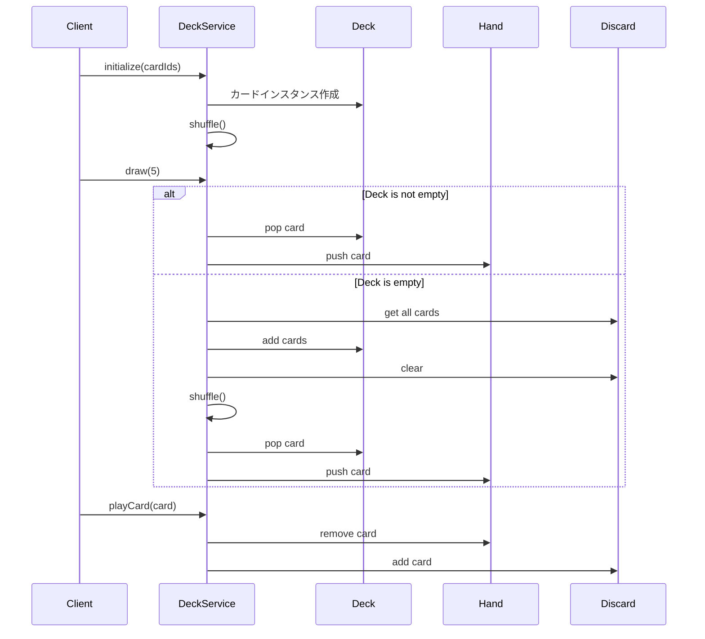
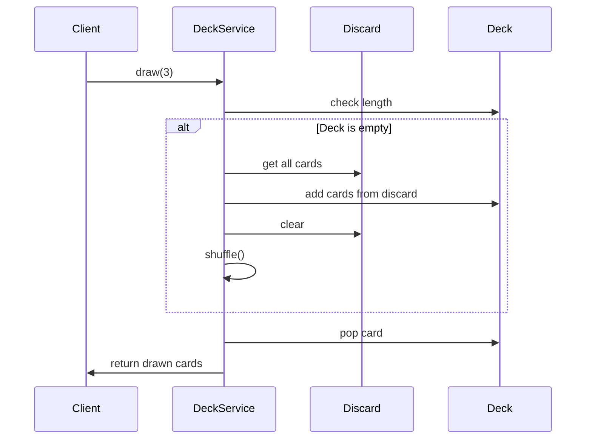

# TDD要件定義書: カードエンティティ・DeckService実装

**機能名**: カードエンティティ・DeckService
**タスクID**: TASK-0009
**要件名**: atelier-guild-rank
**作成日**: 2026-01-16
**バージョン**: 1.0.0

---

## 1. 機能の概要

### 1.1 機能の目的 🔵

本機能は、アトリエ錬金術ゲーム（ギルドランク制）における **デッキ構築システムの中核** を担うものです。

- **何をする機能か**:
  - カードエンティティ（`Card`）によるカード情報のカプセル化
  - デッキサービス（`DeckService`）による山札・手札・捨て札の状態管理
  - カードのドロー、プレイ、破棄、シャッフル機能の提供

- **どのような問題を解決するか**:
  - カードゲームの基本メカニクスを提供し、ゲームフローの土台を構築
  - デッキ枯渇時の自動リシャッフルにより、プレイヤー体験を維持
  - Clean Architectureに基づいた疎結合な設計により、メンテナンス性と拡張性を確保

- **想定されるユーザー**:
  - **内部ユーザー**: 他のゲームサービス（GatheringService、AlchemyService、QuestServiceなど）
  - **間接的なユーザー**: プレイヤー（ゲームUI経由でカードを操作）

- **システム内での位置づけ**:
  - **Domain層**: `Card`エンティティ（ビジネスロジックのカプセル化）
  - **Application層**: `DeckService`（ユースケースの実装）
  - **依存関係**: EventBus（イベント発行）、MasterDataRepository（マスターデータ取得）

### 1.2 参照したEARS要件 🔵

- **設計文書**: `docs/design/atelier-guild-rank/core-systems-core-services.md` - 7. DeckService
- **タスク定義**: `docs/tasks/atelier-guild-rank/phase-2/TASK-0009.md`
- **型定義**: `docs/design/atelier-guild-rank/interfaces.ts` - IDeckService, CardMaster
- **タスクノート**: `docs/implements/atelier-guild-rank/TASK-0009/note.md`

---

## 2. 入力・出力の仕様

### 2.1 Cardエンティティ 🔵

#### 入力パラメータ
| パラメータ | 型 | 制約 | 説明 |
|-----------|-----|------|------|
| id | `CardId` | 必須、文字列、ブランド型 | カードのインスタンスID |
| master | `CardMaster` | 必須、ユニオン型 | カードマスターデータ（`GatheringCardMaster \| RecipeCardMaster \| EnhancementCardMaster`） |

#### 出力値（Getter）
| メソッド | 戻り値型 | 説明 |
|---------|---------|------|
| `get name()` | `string` | カード名（master.nameを返す） |
| `get type()` | `CardType` | カード種別（master.typeを返す） |
| `get cost()` | `number` | コスト（master.costを返す） |

#### 型ガードメソッド
| メソッド | 戻り値型 | 説明 |
|---------|---------|------|
| `isGatheringCard()` | `this is Card & { master: IGatheringCardMaster }` | 採取地カードか判定 |
| `isRecipeCard()` | `this is Card & { master: IRecipeCardMaster }` | レシピカードか判定 |
| `isEnhancementCard()` | `this is Card & { master: IEnhancementCardMaster }` | 強化カードか判定 |

### 2.2 DeckServiceインターフェース 🔵

#### デッキ操作メソッド
| メソッド | 入力 | 出力 | 説明 |
|---------|------|------|------|
| `shuffle()` | なし | `void` | 山札をFisher-Yatesアルゴリズムでシャッフル |
| `draw(count: number)` | 枚数（1以上） | `Card[]` | 山札から指定枚数ドロー。デッキ枯渇時は捨て札をシャッフルして補充 |
| `playCard(card: Card)` | プレイするカード | `void` | 手札からカードを使用し、捨て札に移動 |
| `discardHand()` | なし | `void` | 手札を全て捨て札に移動 |
| `refillHand()` | なし | `void` | 手札が5枚になるまでドロー |

#### 状態取得メソッド
| メソッド | 入力 | 出力 | 説明 |
|---------|------|------|------|
| `getDeck()` | なし | `readonly Card[]` | 山札の内容を取得（読み取り専用） |
| `getHand()` | なし | `readonly Card[]` | 手札の内容を取得（読み取り専用） |
| `getDiscard()` | なし | `readonly Card[]` | 捨て札の内容を取得（読み取り専用） |
| `getHandSize()` | なし | `number` | 手札の枚数を取得 |

#### デッキ構築メソッド
| メソッド | 入力 | 出力 | 説明 |
|---------|------|------|------|
| `addCard(cardId: CardId)` | カードID | `void` | デッキにカードを追加（デッキ上限30枚チェック） |
| `removeCard(cardId: CardId)` | カードID | `void` | デッキからカードを削除（存在チェック） |

#### 初期化メソッド
| メソッド | 入力 | 出力 | 説明 |
|---------|------|------|------|
| `initialize(cardIds: CardId[])` | 初期デッキのカードID配列 | `void` | 初期デッキを構築してシャッフル |
| `reset()` | なし | `void` | 山札・手札・捨て札をクリア |

### 2.3 データフロー 🔵



### 2.4 参照したEARS要件・設計文書 🔵

- **型定義**: `docs/design/atelier-guild-rank/interfaces.ts`
  - `IDeckService` インターフェース（Line 496-515）
  - `CardMaster` ユニオン型（Line 155-159）
  - `CardId` ブランド型（Line 85）
- **設計文書**: `docs/design/atelier-guild-rank/core-systems-core-services.md`
  - DeckService クラス図（Line 22-61）
  - 主要メソッド一覧（Line 65-74）
  - 処理フロー図（Line 78-100）
- **タスクノート**: `docs/implements/atelier-guild-rank/TASK-0009/note.md`
  - Cardエンティティ設計（Line 120-160）
  - DeckServiceインターフェース設計（Line 162-195）

---

## 3. 制約条件

### 3.1 パフォーマンス要件 🔵

| 項目 | 要件 | 根拠 |
|------|------|------|
| シャッフル処理 | O(n) | Fisher-Yatesアルゴリズムにより線形時間で完了 |
| ドロー処理 | O(1) | 配列のpop/pushによる定数時間 |
| カード検索 | O(n) | 手札内のカード検索は線形時間（手札は5枚上限なので実質定数時間） |

### 3.2 アーキテクチャ制約 🔵

- **Clean Architecture準拠**:
  - Domain層（`Card`エンティティ）はフレームワークに依存しない
  - Application層（`DeckService`）はPhaserに依存しない
  - インターフェースを介した依存性逆転（DIP）
- **不変性**:
  - `getDeck()`, `getHand()`, `getDiscard()`は`readonly`配列を返す
  - カード情報の変更は新しいインスタンスを生成
- **イベント駆動**:
  - 状態変化時にEventBusを介してイベントを発行
  - 他のサービスやUIはイベントを購読して状態を同期

### 3.3 データ制約 🔵

| 制約項目 | 値 | 説明 |
|---------|-----|------|
| 手札上限（`HAND_SIZE`） | 5枚 | 手札は最大5枚まで |
| デッキ上限（`MAX_DECK_SIZE`） | 30枚 | デッキは最大30枚まで |
| カードID形式 | ブランド型文字列 | `CardId`型を使用 |

### 3.4 技術制約 🔵

- **シャッフルアルゴリズム**: Fisher-Yates（公平性のため）
- **乱数生成**: `Math.random()`を使用（将来的にはシード値指定可能な`IRandomGenerator`に移行）
- **TypeScript strict mode**: 厳密な型チェック
- **Biomeによるコード品質管理**: リント・フォーマット自動化

### 3.5 エラーハンドリング制約 🔵

| エラーコード | 発生条件 | 説明 |
|------------|---------|------|
| `ErrorCodes.INVALID_CARD_ID` | 存在しないカードIDを指定 | マスターデータに存在しないカードを追加しようとした |
| `ErrorCodes.DECK_FULL` | デッキが30枚を超える | デッキ上限超過 |
| `ErrorCodes.CARD_NOT_IN_HAND` | 手札にないカードをプレイ | 手札に存在しないカードを使用しようとした |
| `ErrorCodes.DATA_NOT_LOADED` | マスターデータ未読み込み | マスターデータが読み込まれていない状態で操作 |

### 3.6 参照したEARS要件・設計文書 🔵

- **設計文書**: `docs/design/atelier-guild-rank/core-systems-core-services.md`
  - DeckServiceクラス定義（Line 39-58）
- **タスクノート**: `docs/implements/atelier-guild-rank/TASK-0009/note.md`
  - 技術的制約（Line 262-269）
  - エラーハンドリング（Line 270-276）
- **エラー型定義**: `atelier-guild-rank/src/shared/types/errors.ts`
  - `ErrorCodes`定数

---

## 4. 想定される使用例

### 4.1 基本的な使用パターン 🔵

#### ゲーム開始時の初期化
```typescript
// 初期デッキ構築
const initialDeckIds: CardId[] = [
  toCardId('card-gathering-01'),
  toCardId('card-gathering-02'),
  toCardId('card-recipe-01'),
  // ... 30枚
];

deckService.initialize(initialDeckIds); // 初期デッキ構築 & シャッフル
const hand = deckService.draw(5); // 初期手札5枚ドロー
```

#### カードプレイフロー
```typescript
// 手札からカードを選択
const selectedCard = deckService.getHand()[0];

// カードをプレイ（手札 → 捨て札）
deckService.playCard(selectedCard);

// ターン終了時に手札を補充
deckService.refillHand(); // 5枚になるまでドロー
```

#### ターン終了処理
```typescript
// 手札を全て破棄
deckService.discardHand();

// 新しい手札をドロー
const newHand = deckService.draw(5);
```

### 4.2 エッジケース 🔵

#### ケース1: デッキ枯渇時のドロー
```typescript
// デッキが残り2枚、捨て札が10枚の状態で5枚ドロー
const drawnCards = deckService.draw(5);

// 期待される動作:
// 1. デッキから2枚ドロー
// 2. 捨て札10枚を山札にシャッフル
// 3. シャッフルした山札から残り3枚ドロー
// 結果: drawnCards.length === 5
```

#### ケース2: 手札補充時のデッキ枯渇
```typescript
// 手札3枚、デッキ1枚、捨て札5枚
deckService.refillHand();

// 期待される動作:
// 1. デッキから1枚ドロー（手札4枚）
// 2. 捨て札をシャッフルして山札に
// 3. 山札から1枚ドロー（手札5枚）
```

#### ケース3: 完全にカードが尽きた場合
```typescript
// デッキ0枚、手札0枚、捨て札0枚
const drawnCards = deckService.draw(5);

// 期待される動作:
// drawnCards.length === 0（ドローできない）
```

### 4.3 エラーケース 🔴

#### ケース1: 存在しないカードIDの追加
```typescript
try {
  deckService.addCard(toCardId('non-existent-card'));
} catch (error) {
  // ApplicationError with ErrorCodes.INVALID_CARD_ID
  console.error(error.code); // 'INVALID_CARD_ID'
}
```

#### ケース2: デッキ上限超過
```typescript
try {
  // 既に30枚のデッキに追加
  deckService.addCard(toCardId('card-gathering-99'));
} catch (error) {
  // ApplicationError with ErrorCodes.DECK_FULL
  console.error(error.code); // 'DECK_FULL'
}
```

#### ケース3: 手札にないカードをプレイ
```typescript
try {
  const cardNotInHand = new Card(toCardId('card-recipe-01'), recipeCardMaster);
  deckService.playCard(cardNotInHand);
} catch (error) {
  // ApplicationError with ErrorCodes.CARD_NOT_IN_HAND
  console.error(error.code); // 'CARD_NOT_IN_HAND'
}
```

### 4.4 参照したEARS要件・設計文書 🔵

- **設計文書**: `docs/design/atelier-guild-rank/core-systems-core-services.md`
  - 処理フロー図（Line 78-100）
- **タスク定義**: `docs/tasks/atelier-guild-rank/phase-2/TASK-0009.md`
  - テストケース（Line 148-157）
- **タスクノート**: `docs/implements/atelier-guild-rank/TASK-0009/note.md`
  - ドローロジック（Line 220-243）
  - デッキ枯渇時の処理フロー（Line 494-513）

---

## 5. EARS要件・設計文書との対応関係

### 5.1 参照した設計文書

#### アーキテクチャ設計
- **ファイル**: `docs/design/atelier-guild-rank/architecture-overview.md`
- **該当セクション**: Clean Architecture 4層構造
- **対応関係**: Domain層（Card）、Application層（DeckService）の配置

#### コアサービス設計
- **ファイル**: `docs/design/atelier-guild-rank/core-systems-core-services.md`
- **該当セクション**:
  - 7. DeckService（Line 14-102）
  - クラス図（Line 22-61）
  - 主要メソッド（Line 65-74）
  - 処理フロー（Line 78-100）

#### 型定義
- **ファイル**: `docs/design/atelier-guild-rank/interfaces.ts`
- **該当セクション**:
  - CardId型（Line 85）
  - CardMaster型（Line 155-159）
  - IDeckService型（Line 496-515）

### 5.2 参照したタスク定義

- **ファイル**: `docs/tasks/atelier-guild-rank/phase-2/TASK-0009.md`
- **該当セクション**:
  - タスク概要（Line 11-20）
  - 実装内容（Line 29-128）
  - 受け入れ基準（Line 131-144）
  - テストケース（Line 147-157）
  - 成果物（Line 161-168）

### 5.3 参照したタスクノート

- **ファイル**: `docs/implements/atelier-guild-rank/TASK-0009/note.md`
- **該当セクション**:
  - 技術スタック（Line 9-34）
  - 開発ルール（Line 37-63）
  - 関連実装（Line 66-114）
  - 設計文書（Line 117-257）
  - 注意事項（Line 260-295）

### 5.4 信頼性レベルの評価

| セクション | 信頼性 | 根拠 |
|----------|--------|------|
| 1. 機能の概要 | 🔵 | タスク定義・設計文書に明確に記載 |
| 2. 入力・出力の仕様 | 🔵 | interfaces.ts、設計文書に型定義あり |
| 3. 制約条件 | 🔵 | タスクノート・設計文書に明記 |
| 4. 想定される使用例 | 🔵 | タスクノートにテストケースとして記載 |

---

## 6. 受け入れ基準

### 6.1 必須条件（Must） 🔵

- [ ] **T-0009-01**: シャッフルが正しく動作する
  - Fisher-Yatesアルゴリズムによる公平なランダム化
  - 元の配列と異なる順序になる
- [ ] **T-0009-02**: ドローで手札にカードが追加される
  - 山札から指定枚数が減少
  - 手札に指定枚数が追加
  - `CARD_DRAWN`イベントが発火
- [ ] **T-0009-03**: プレイでカードが捨て札に移動する
  - 手札から指定カードが削除
  - 捨て札に指定カードが追加
  - `CARD_PLAYED`イベントが発火
- [ ] **T-0009-04**: 手札補充が正しく動作する
  - 手札が5枚未満の場合、5枚になるまでドロー
  - 手札が既に5枚の場合、ドローしない
- [ ] **T-0009-05**: デッキ枯渇時のドローが正しく動作する
  - 山札が空の場合、捨て札をシャッフルして山札に戻す
  - その後、ドロー処理を継続
  - 捨て札も空の場合、ドロー可能な枚数まで取得

### 6.2 推奨条件（Should） 🟡

- [ ] 各操作でイベントが発火する
  - `CARD_DRAWN`: ドロー時
  - `CARD_PLAYED`: カードプレイ時
  - `CARD_DISCARDED`: カード破棄時
  - `HAND_REFILLED`: 手札補充時
- [ ] 単体テストカバレッジ80%以上
- [ ] エラーハンドリングが適切に実装されている
  - `ErrorCodes.INVALID_CARD_ID`
  - `ErrorCodes.DECK_FULL`
  - `ErrorCodes.CARD_NOT_IN_HAND`
  - `ErrorCodes.DATA_NOT_LOADED`

### 6.3 参照したEARS要件 🔵

- **タスク定義**: `docs/tasks/atelier-guild-rank/phase-2/TASK-0009.md`
  - 受け入れ基準（Line 131-144）
  - テストケース（Line 148-157）

---

## 7. 実装ファイル一覧

### 7.1 作成するファイル

#### エンティティ
- `atelier-guild-rank/src/domain/entities/Card.ts` - **新規**

#### インターフェース
- `atelier-guild-rank/src/domain/interfaces/deck-service.interface.ts` - **新規**

#### 実装
- `atelier-guild-rank/src/application/services/deck-service.ts` - **新規**

#### インデックスファイル
- `atelier-guild-rank/src/domain/entities/index.ts` - **更新**（Cardエクスポート追加）
- `atelier-guild-rank/src/domain/interfaces/index.ts` - **更新**（IDeckServiceエクスポート追加）
- `atelier-guild-rank/src/application/services/index.ts` - **更新**（DeckServiceエクスポート追加）

#### テスト
- `atelier-guild-rank/tests/unit/domain/entities/Card.test.ts` - **新規**（推奨）
- `atelier-guild-rank/tests/unit/application/services/deck-service.test.ts` - **新規**

### 7.2 依存関係

#### 既存ファイル（参照）
- `atelier-guild-rank/src/shared/types/cards.ts` - カード型定義
- `atelier-guild-rank/src/shared/types/ids.ts` - CardId型
- `atelier-guild-rank/src/shared/types/master-data.ts` - CardMaster型
- `atelier-guild-rank/src/shared/types/common.ts` - CardType型
- `atelier-guild-rank/src/shared/types/events.ts` - GameEventType型
- `atelier-guild-rank/src/shared/types/errors.ts` - ApplicationError、ErrorCodes
- `atelier-guild-rank/src/domain/interfaces/master-data-repository.interface.ts` - IMasterDataRepository
- `atelier-guild-rank/src/application/events/event-bus.interface.ts` - IEventBus

---

## 8. テストケース一覧

### 8.1 Cardエンティティのテスト

| テストID | テスト内容 | 期待結果 |
|---------|----------|----------|
| T-CARD-01 | コンストラクタでCardインスタンスを生成 | id、masterが正しく設定される |
| T-CARD-02 | `get name()`でカード名を取得 | master.nameが返される |
| T-CARD-03 | `get type()`でカード種別を取得 | master.typeが返される |
| T-CARD-04 | `get cost()`でコストを取得 | master.costが返される |
| T-CARD-05 | `isGatheringCard()`で採取地カード判定 | typeがGATHERINGの場合trueを返す |
| T-CARD-06 | `isRecipeCard()`でレシピカード判定 | typeがRECIPEの場合trueを返す |
| T-CARD-07 | `isEnhancementCard()`で強化カード判定 | typeがENHANCEMENTの場合trueを返す |

### 8.2 DeckServiceのテスト

| テストID | テスト内容 | 期待結果 |
|---------|----------|----------|
| T-0009-01 | シャッフル | Fisher-Yatesアルゴリズムにより順序がランダム化される |
| T-0009-02 | ドロー | 山札から指定枚数が減少し、手札に追加される |
| T-0009-03 | カードプレイ | 手札から削除され、捨て札に追加される |
| T-0009-04 | 手札補充 | 手札が5枚になるまでドローされる |
| T-0009-05 | デッキ枯渇時のドロー | 捨て札がシャッフルされて山札に戻り、ドローが継続される |
| T-DECK-06 | initialize()で初期デッキ構築 | 指定されたカードIDでデッキが構築され、シャッフルされる |
| T-DECK-07 | addCard()でカード追加 | デッキにカードが追加される |
| T-DECK-08 | removeCard()でカード削除 | デッキからカードが削除される |
| T-DECK-09 | reset()で状態リセット | 山札・手札・捨て札がクリアされる |
| T-DECK-10 | getDeck()で山札取得 | readonly配列として山札が返される |
| T-DECK-11 | getHand()で手札取得 | readonly配列として手札が返される |
| T-DECK-12 | getDiscard()で捨て札取得 | readonly配列として捨て札が返される |
| T-DECK-13 | getHandSize()で手札枚数取得 | 手札の枚数が返される |
| T-DECK-14 | 存在しないカードIDを追加 | `ErrorCodes.INVALID_CARD_ID`エラーが発生 |
| T-DECK-15 | デッキ上限超過時にカード追加 | `ErrorCodes.DECK_FULL`エラーが発生 |
| T-DECK-16 | 手札にないカードをプレイ | `ErrorCodes.CARD_NOT_IN_HAND`エラーが発生 |

### 8.3 イベント発行のテスト

| テストID | テスト内容 | 期待結果 |
|---------|----------|----------|
| T-EVENT-01 | ドロー時にイベント発行 | `CARD_DRAWN`イベントが発行される |
| T-EVENT-02 | カードプレイ時にイベント発行 | `CARD_PLAYED`イベントが発行される |
| T-EVENT-03 | 手札破棄時にイベント発行 | `CARD_DISCARDED`イベントが発行される |
| T-EVENT-04 | 手札補充時にイベント発行 | `HAND_REFILLED`イベントが発行される |

---

## 9. 品質判定結果

### 9.1 判定基準

| 項目 | 状態 | 評価 |
|------|------|------|
| 要件の曖昧さ | なし | ✅ |
| 入出力定義 | 完全 | ✅ |
| 制約条件 | 明確 | ✅ |
| 実装可能性 | 確実 | ✅ |
| 信頼性レベル | 🔵（青信号）が多い | ✅ |

### 9.2 総合評価

**✅ 高品質**

- 設計文書・タスク定義に基づいた明確な要件定義
- 型定義、制約条件、エラーハンドリングが明確
- テストケースが網羅的に定義されている
- 信頼性レベルは全て🔵（青信号）
- 実装可能性が高く、曖昧な部分がない

---

## 10. 補足情報

### 10.1 Fisher-Yatesシャッフルアルゴリズム

```typescript
/**
 * Fisher-Yatesシャッフルアルゴリズム
 * 時間計算量: O(n)
 * 空間計算量: O(1)
 */
shuffle(): void {
  for (let i = this.deck.length - 1; i > 0; i--) {
    // 0からiまでのランダムなインデックスを取得
    const j = Math.floor(Math.random() * (i + 1));
    // 要素を交換
    [this.deck[i], this.deck[j]] = [this.deck[j], this.deck[i]];
  }
}
```

### 10.2 デッキ枯渇時の処理フロー



---

## 変更履歴

| 日付 | バージョン | 変更内容 |
|------|----------|---------|
| 2026-01-16 | 1.0.0 | 初版作成 |

---

**次のステップ**: `/tsumiki:tdd-testcases atelier-guild-rank TASK-0009` でテストケースの洗い出しを行います。
