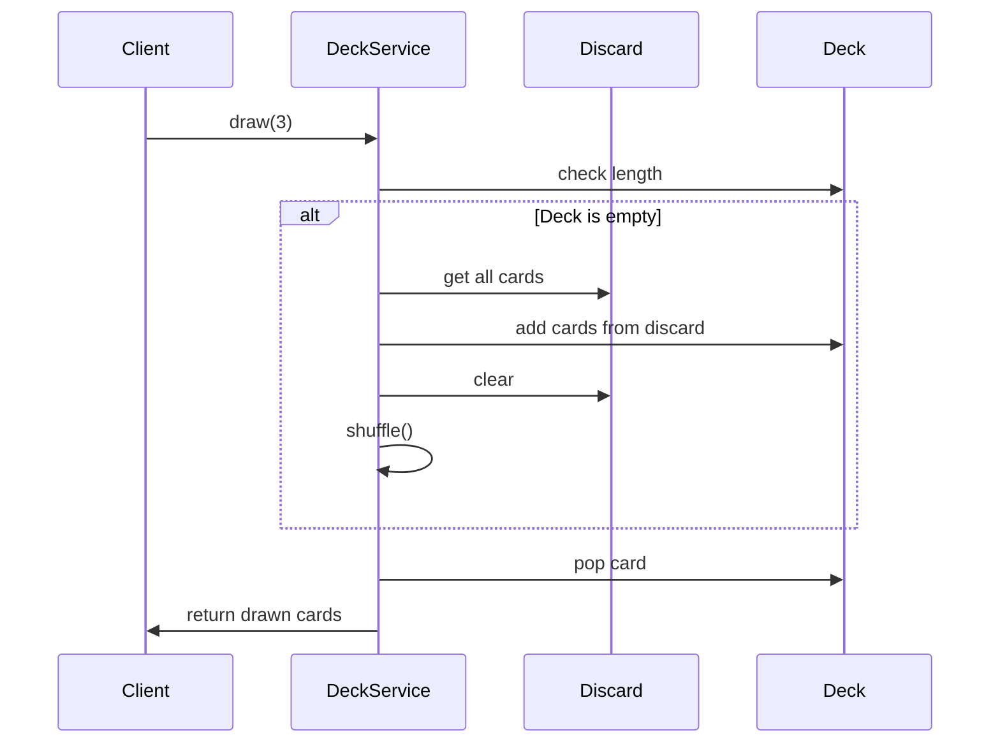

# TASK-0009: カードエンティティ・DeckService実装 - 開発ノート

**作成日**: 2026-01-16
**タスクID**: TASK-0009
**要件名**: atelier-guild-rank

---

## 1. 技術スタック

### 使用技術・フレームワーク
- **言語**: TypeScript 5.x
- **ゲームFW**: Phaser 3.87+
- **UIプラグイン**: rexUI（phaser3-rex-plugins 1.80+）
- **スタイリング**: Tailwind CSS 4.x
- **ビルド**: Vite 5.4.0
- **パッケージ管理**: pnpm 9.15.0
- **Lint/Format**: Biome 2.x
- **テスト**: Vitest 4.x（ユニットテスト）
- **E2Eテスト**: Playwright（最新）
- **Git Hooks**: Lefthook 2.x

### アーキテクチャパターン
- **Clean Architecture**: 4層構造（Presentation/Application/Domain/Infrastructure）
- **Entity-Based Design**: ドメインエンティティによるビジネスロジックのカプセル化
- **Repository Pattern**: データアクセスの抽象化
- **イベント駆動設計**: EventBusによる疎結合な通信
- **Fisher-Yatesアルゴリズム**: デッキシャッフルの実装

### 参照元
- `docs/design/atelier-guild-rank/architecture-overview.md`
- `docs/design/atelier-guild-rank/core-systems-core-services.md`
- `atelier-guild-rank/package.json`

---

## 2. 開発ルール

### プロジェクト固有ルール
- **応答は日本語で行う**
- **ずんだもん口調で喋る**（語尾は「なのだ。」）
- **Clean Architectureの原則に従う**
  - Domain/Application層はPhaserに依存しない
  - ビジネスロジックはフレームワークに依存しない
  - エンティティはドメイン層に配置
  - サービスはApplication層に配置
- **Biomeによる一貫したコードスタイル**
- **Lefthookによるコミット前の品質チェック自動化**

### コーディング規約
- **エクスポート形式**: 名前付きエクスポートを使用
- **エラーハンドリング**: ApplicationErrorを使用し、ErrorCodesで定義されたコードを使う
- **型安全性**: 厳密な型定義、unknown型の使用
- **不変性**: 状態更新時は新しいオブジェクトを作成（配列のスプレッド演算子など）
- **クラス名**: PascalCase（例: `Card`, `DeckService`）
- **インターフェース名**: `I`プレフィックスを使用（例: `IDeckService`）
- **型定義の場所**: `src/shared/types/` に集約
- **エンティティ**: 不変オブジェクトとして設計、getterで属性を公開

### 参照元
- `CLAUDE.md`
- `docs/design/atelier-guild-rank/architecture-overview.md`
- `docs/design/atelier-guild-rank/core-systems-core-services.md`

---

## 3. 関連実装

### 類似機能の実装例

#### 既存のEventBus実装（参考パターン）
- **ファイル**: `atelier-guild-rank/src/application/events/event-bus.ts`
- **実装パターン**:
  - インターフェースを`src/application/events/event-bus.interface.ts`に定義
  - 実装を`src/application/events/event-bus.ts`に配置
  - 型安全なイベント発行・購読
  - イベント名とペイロードの型定義

#### 既存のマスターデータリポジトリ（参考パターン）
- **ファイル**: `atelier-guild-rank/src/infrastructure/repositories/master-data-repository.ts`
- **実装パターン**:
  - コンストラクタで依存を受け取る
  - `Map`を使ったインデックスでO(1)アクセス
  - 読み込み済みフラグで二重読み込み防止
  - `ensureLoaded()`で未読み込み時にエラー

#### 既存の型定義
- **カード型**: `atelier-guild-rank/src/shared/types/cards.ts`
  - `Card`ユニオン型（`IGatheringCard | IRecipeCard | IEnhancementCard`）
  - `isGatheringCard()`, `isRecipeCard()`, `isEnhancementCard()`型ガード関数
- **ID型**: `atelier-guild-rank/src/shared/types/ids.ts`
  - `CardId`ブランド型、`toCardId()`変換関数
- **マスターデータ型**: `atelier-guild-rank/src/shared/types/master-data.ts`
  - `CardMaster`ユニオン型（`IGatheringCardMaster | IRecipeCardMaster | IEnhancementCardMaster`）
- **共通型**: `atelier-guild-rank/src/shared/types/common.ts`
  - `CardType`, `Rarity`, `Quality`列挙型
- **イベント型**: `atelier-guild-rank/src/shared/types/events.ts`
  - `GameEventType`列挙型
  - `IGameEvent`インターフェース
- **エラー型**: `atelier-guild-rank/src/shared/types/errors.ts`
  - `ApplicationError`クラス
  - `ErrorCodes`定数

### 参照元
- `atelier-guild-rank/src/application/events/event-bus.ts`
- `atelier-guild-rank/src/application/events/event-bus.interface.ts`
- `atelier-guild-rank/src/infrastructure/repositories/master-data-repository.ts`
- `atelier-guild-rank/src/domain/interfaces/master-data-repository.interface.ts`
- `atelier-guild-rank/src/shared/types/cards.ts`
- `atelier-guild-rank/src/shared/types/ids.ts`
- `atelier-guild-rank/src/shared/types/master-data.ts`
- `atelier-guild-rank/src/shared/types/common.ts`
- `atelier-guild-rank/src/shared/types/events.ts`
- `atelier-guild-rank/src/shared/types/errors.ts`

---

## 4. 設計文書

### Cardエンティティ設計

#### 責務
- カードID（インスタンスID）とカードマスター（静的データ）を保持
- カードの属性（name, type, cost）をgetterで公開
- マスターデータへの参照を保持

#### Cardエンティティの構造
```typescript
export class Card {
  constructor(
    public readonly id: CardId,
    public readonly master: CardMaster,
  ) {}

  get name(): string {
    return this.master.name;
  }

  get type(): CardType {
    return this.master.type;
  }

  get cost(): number {
    return this.master.cost;
  }

  // 型ガードメソッド
  isGatheringCard(): this is Card & { master: IGatheringCardMaster } {
    return this.master.type === CardType.GATHERING;
  }

  isRecipeCard(): this is Card & { master: IRecipeCardMaster } {
    return this.master.type === CardType.RECIPE;
  }

  isEnhancementCard(): this is Card & { master: IEnhancementCardMaster } {
    return this.master.type === CardType.ENHANCEMENT;
  }
}
```

### DeckServiceインターフェース設計

#### 責務
- デッキ（山札・手札・捨て札）の状態管理
- カードのドロー、プレイ、破棄
- シャッフルロジック
- 手札補充
- デッキ構築（カード追加・削除）

#### IDeckServiceメソッド定義
```typescript
export interface IDeckService {
  // デッキ操作
  shuffle(): void;
  draw(count: number): Card[];
  playCard(card: Card): void;
  discardHand(): void;
  refillHand(): void;

  // 状態取得
  getDeck(): readonly Card[];
  getHand(): readonly Card[];
  getDiscard(): readonly Card[];
  getHandSize(): number;

  // デッキ構築
  addCard(cardId: CardId): void;
  removeCard(cardId: CardId): void;

  // 初期化
  initialize(cardIds: CardId[]): void;
  reset(): void;
}
```

### DeckService実装設計

#### 主要プロパティ
| プロパティ | 型 | 説明 |
|-----------|-----|------|
| deck | Card[] | 山札（プライベート） |
| hand | Card[] | 手札（プライベート） |
| discard | Card[] | 捨て札（プライベート） |
| HAND_SIZE | number | 手札上限（定数: 5） |
| MAX_DECK_SIZE | number | デッキ上限（定数: 30） |
| masterDataRepo | IMasterDataRepository | マスターデータ参照 |
| eventBus | IEventBus | イベント発行 |

#### シャッフルロジック（Fisher-Yates）
```typescript
shuffle(): void {
  for (let i = this.deck.length - 1; i > 0; i--) {
    const j = Math.floor(Math.random() * (i + 1));
    [this.deck[i], this.deck[j]] = [this.deck[j], this.deck[i]];
  }
}
```

#### ドローロジック（デッキ枯渇時の自動シャッフル）
```typescript
draw(count: number): Card[] {
  const drawn: Card[] = [];

  for (let i = 0; i < count; i++) {
    // デッキが空なら捨て札をシャッフルして補充
    if (this.deck.length === 0 && this.discard.length > 0) {
      this.reshuffleDiscard();
    }

    // デッキが空なら終了
    if (this.deck.length === 0) {
      break;
    }

    const card = this.deck.pop()!;
    this.hand.push(card);
    drawn.push(card);
  }

  this.eventBus.emit(GameEventType.CARD_DRAWN, { cards: drawn });
  return drawn;
}
```

#### 捨て札シャッフル処理
```typescript
private reshuffleDiscard(): void {
  this.deck = [...this.discard];
  this.discard = [];
  this.shuffle();
}
```

### 参照元
- `docs/design/atelier-guild-rank/core-systems-core-services.md` (DeckService設計)
- `docs/tasks/atelier-guild-rank/phase-2/TASK-0009.md`

---

## 5. 注意事項

### 技術的制約
- **手札上限**: 5枚（定数: `HAND_SIZE`）
- **デッキ上限**: 30枚（定数: `MAX_DECK_SIZE`）
- **シャッフルアルゴリズム**: Fisher-Yatesを使用（公平性のため）
- **デッキ枯渇時**: 自動的に捨て札をシャッフルしてデッキに戻す
- **イベント発行**: カードドロー時に`CARD_DRAWN`イベントを発行

### エラーハンドリング
- **存在しないカードID**: `addCard()`や`removeCard()`で存在しないCardIdを渡された場合はエラー
- **エラーコード**:
  - `ErrorCodes.INVALID_CARD_ID`: 存在しないカードID
  - `ErrorCodes.DECK_FULL`: デッキが上限に達している
  - `ErrorCodes.DATA_NOT_LOADED`: マスターデータ未読み込み

### 実装上の注意
- **不変性**: `getDeck()`, `getHand()`, `getDiscard()`は`readonly`配列を返す（外部からの変更を防ぐ）
- **カードインスタンス**: 同じCardIdでも異なるCardインスタンスとして扱う（デッキに同じカードが複数枚ある場合）
- **イベント発行**: 状態変化時に適切なイベントを発行（`CARD_DRAWN`, `CARD_PLAYED`, `CARD_DISCARDED`など）
- **テストカバレッジ**: 80%以上を目標
- **テストパターン**: vitestを使用、`vi.fn()`でモック作成

### テスト要件（タスク定義より）
| テストID | テスト内容 | 期待結果 |
|---------|----------|----------|
| T-0009-01 | シャッフル | 順序がランダム化 |
| T-0009-02 | ドロー | 手札に追加、デッキから減少 |
| T-0009-03 | カードプレイ | 手札から削除、捨て札に追加 |
| T-0009-04 | 手札補充 | 5枚になるまでドロー |
| T-0009-05 | デッキ枯渇時のドロー | 捨て札をシャッフルしてデッキに |

### 参照元
- `docs/design/atelier-guild-rank/core-systems-core-services.md`
- `docs/tasks/atelier-guild-rank/phase-2/TASK-0009.md`

---

## 6. 実装ファイル一覧

### 作成するファイル

#### エンティティ
- `atelier-guild-rank/src/domain/entities/Card.ts` - **新規**

#### インターフェース
- `atelier-guild-rank/src/domain/interfaces/deck-service.interface.ts` - **新規**

#### 実装
- `atelier-guild-rank/src/application/services/deck-service.ts` - **新規**

#### インデックスファイル
- `atelier-guild-rank/src/domain/entities/index.ts` - **更新**（Cardエクスポート追加）
- `atelier-guild-rank/src/domain/interfaces/index.ts` - **更新**（IDeckServiceエクスポート追加）
- `atelier-guild-rank/src/application/services/index.ts` - **更新**（DeckServiceエクスポート追加）

#### テスト
- `atelier-guild-rank/tests/unit/domain/entities/Card.test.ts` - **新規**（推奨）
- `atelier-guild-rank/tests/unit/application/services/deck-service.test.ts` - **新規**

### 参照元
- `docs/tasks/atelier-guild-rank/phase-2/TASK-0009.md`

---

## 7. 依存関係

### タスク依存
- **依存元**:
  - TASK-0003（共通型定義） - 完了済み
  - TASK-0004（EventBus実装） - 完了済み
  - TASK-0006（マスターデータローダー実装） - 完了済み

### インポート依存
```typescript
// エンティティ（Card.ts）
import type { CardId, CardMaster, CardType } from '@shared/types';
import { CardType as CardTypeEnum } from '@shared/types';

// インターフェース（deck-service.interface.ts）
import type { Card } from '@domain/entities/Card';
import type { CardId } from '@shared/types';

// 実装（deck-service.ts）
import type { IDeckService } from '@domain/interfaces/deck-service.interface';
import type { IMasterDataRepository } from '@domain/interfaces/master-data-repository.interface';
import type { IEventBus } from '@application/events/event-bus.interface';
import { Card } from '@domain/entities/Card';
import type { CardId, CardMaster } from '@shared/types';
import { GameEventType } from '@shared/types';
```

### 参照元
- `docs/tasks/atelier-guild-rank/phase-2/TASK-0009.md`

---

## 8. 実装チェックリスト

### 必須実装（信頼性レベル: 🔵）
- [ ] Cardエンティティ実装
  - [ ] コンストラクタ（id, master）
  - [ ] getterメソッド（name, type, cost）
  - [ ] 型ガードメソッド（isGatheringCard, isRecipeCard, isEnhancementCard）
- [ ] IDeckServiceインターフェース定義
  - [ ] デッキ操作メソッド（shuffle, draw, playCard, discardHand, refillHand）
  - [ ] 状態取得メソッド（getDeck, getHand, getDiscard, getHandSize）
  - [ ] デッキ構築メソッド（addCard, removeCard）
  - [ ] 初期化メソッド（initialize, reset）
- [ ] DeckService実装
  - [ ] コンストラクタ（masterDataRepo, eventBus依存注入）
  - [ ] プライベートプロパティ（deck, hand, discard）
  - [ ] shuffle()メソッド（Fisher-Yates）
  - [ ] draw()メソッド（デッキ枯渇時の自動シャッフル対応）
  - [ ] playCard()メソッド（手札→捨て札）
  - [ ] discardHand()メソッド（手札全破棄）
  - [ ] refillHand()メソッド（手札を5枚まで補充）
  - [ ] addCard()メソッド（デッキにカード追加）
  - [ ] removeCard()メソッド（デッキからカード削除）
  - [ ] initialize()メソッド（初期デッキ構築）
  - [ ] reset()メソッド（状態リセット）
  - [ ] reshuffleDiscard()プライベートメソッド
- [ ] 単体テスト
  - [ ] T-0009-01: シャッフル
  - [ ] T-0009-02: ドロー
  - [ ] T-0009-03: カードプレイ
  - [ ] T-0009-04: 手札補充
  - [ ] T-0009-05: デッキ枯渇時のドロー

### 推奨実装（信頼性レベル: 🟡）
- [ ] イベント発行
  - [ ] `CARD_DRAWN`イベント
  - [ ] `CARD_PLAYED`イベント
  - [ ] `CARD_DISCARDED`イベント
  - [ ] `HAND_REFILLED`イベント
- [ ] エラーハンドリング
  - [ ] 存在しないカードID時のエラー
  - [ ] デッキ上限超過時のエラー
  - [ ] マスターデータ未読み込み時のエラー
- [ ] テストカバレッジ80%以上

---

## 9. 実装の流れ

1. **Cardエンティティの実装**
   - `src/domain/entities/Card.ts`を作成
   - コンストラクタとgetterメソッドを実装
   - 型ガードメソッドを実装
   - `src/domain/entities/index.ts`にエクスポート追加

2. **IDeckServiceインターフェースの定義**
   - `src/domain/interfaces/deck-service.interface.ts`を作成
   - メソッドシグネチャを定義
   - `src/domain/interfaces/index.ts`にエクスポート追加

3. **DeckServiceの実装**
   - `src/application/services/deck-service.ts`を作成
   - コンストラクタと依存注入
   - プライベートプロパティの定義
   - 各メソッドを実装
     1. shuffle()
     2. draw()
     3. playCard()
     4. discardHand()
     5. refillHand()
     6. addCard()
     7. removeCard()
     8. initialize()
     9. reset()
     10. reshuffleDiscard()（プライベート）
   - `src/application/services/index.ts`にエクスポート追加

4. **テストの実装**
   - `tests/unit/domain/entities/Card.test.ts`を作成（推奨）
   - `tests/unit/application/services/deck-service.test.ts`を作成
   - 全テストケース実装
   - カバレッジ確認

5. **動作確認**
   - `pnpm test`でユニットテスト実行
   - `pnpm lint`でコード品質確認

---

## 10. 参考リンク

### 設計文書
- コアサービス設計（DeckService）: `docs/design/atelier-guild-rank/core-systems-core-services.md`
- アーキテクチャ設計（概要）: `docs/design/atelier-guild-rank/architecture-overview.md`

### タスク定義
- TASK-0009定義: `docs/tasks/atelier-guild-rank/phase-2/TASK-0009.md`

### 要件定義
- 要件定義書: `docs/spec/atelier-guild-rank-requirements.md`

### 既存実装
- EventBus: `atelier-guild-rank/src/application/events/event-bus.ts`
- マスターデータリポジトリ: `atelier-guild-rank/src/infrastructure/repositories/master-data-repository.ts`
- カード型定義: `atelier-guild-rank/src/shared/types/cards.ts`
- ID型定義: `atelier-guild-rank/src/shared/types/ids.ts`

### テスト参考
- EventBusテスト: `atelier-guild-rank/tests/unit/application/events/event-bus.test.ts`

### 外部ドキュメント
- Fisher-Yatesアルゴリズム: https://en.wikipedia.org/wiki/Fisher%E2%80%93Yates_shuffle

---

## 11. 補足情報

### Fisher-Yatesシャッフルアルゴリズム

Fisher-Yatesアルゴリズムは、配列をランダムにシャッフルするための最も公平なアルゴリズムです。

```typescript
/**
 * Fisher-Yatesシャッフルアルゴリズム
 * 時間計算量: O(n)
 * 空間計算量: O(1)
 */
shuffle(): void {
  for (let i = this.deck.length - 1; i > 0; i--) {
    // 0からiまでのランダムなインデックスを取得
    const j = Math.floor(Math.random() * (i + 1));
    // 要素を交換
    [this.deck[i], this.deck[j]] = [this.deck[j], this.deck[i]];
  }
}
```

### デッキ枯渇時の処理フロー



### Cardエンティティの実装例

```typescript
export class Card {
  constructor(
    public readonly id: CardId,
    public readonly master: CardMaster,
  ) {}

  get name(): string {
    return this.master.name;
  }

  get type(): CardType {
    return this.master.type;
  }

  get cost(): number {
    return this.master.cost;
  }

  isGatheringCard(): this is Card & { master: IGatheringCardMaster } {
    return this.master.type === 'GATHERING';
  }

  isRecipeCard(): this is Card & { master: IRecipeCardMaster } {
    return this.master.type === 'RECIPE';
  }

  isEnhancementCard(): this is Card & { master: IEnhancementCardMaster } {
    return this.master.type === 'ENHANCEMENT';
  }
}
```

### DeckServiceの初期化例

```typescript
// 初期デッキ構築
initialize(cardIds: CardId[]): void {
  this.reset();

  for (const cardId of cardIds) {
    const cardMaster = this.masterDataRepo.getCardById(cardId);
    if (!cardMaster) {
      throw new ApplicationError(
        ErrorCodes.INVALID_CARD_ID,
        `Card not found: ${cardId}`,
      );
    }

    const card = new Card(cardId, cardMaster);
    this.deck.push(card);
  }

  this.shuffle();
}
```

### テストの実装例

```typescript
describe('DeckService', () => {
  let deckService: IDeckService;
  let mockMasterDataRepo: IMasterDataRepository;
  let mockEventBus: IEventBus;

  beforeEach(() => {
    mockMasterDataRepo = createMockMasterDataRepository();
    mockEventBus = new EventBus();
    deckService = new DeckService(mockMasterDataRepo, mockEventBus);
  });

  describe('T-0009-02: ドロー', () => {
    it('手札に追加され、デッキから減少する', () => {
      // テスト実装
    });
  });
});
```

---

**最終更新**: 2026-01-16
