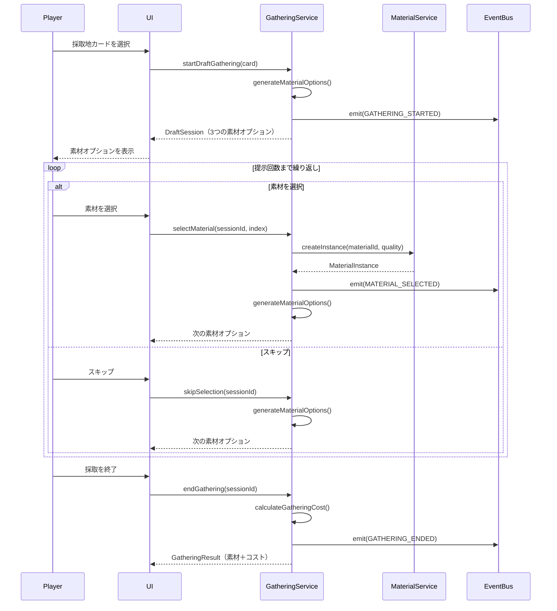

# TASK-0011: GatheringService（ドラフト採取）要件定義書

**バージョン**: 1.0.0
**作成日**: 2026-01-16
**タスクID**: TASK-0011
**要件名**: atelier-guild-rank
**機能名**: GatheringService（ドラフト採取）

---

## 1. 機能の概要（EARS要件定義書・設計文書ベース）

### 1.1 機能説明 🔵

GatheringServiceは、採取地カードを使用してドラフト形式で素材を獲得する機能を提供する。プレイヤーは採取地カードを選択すると、素材プールから3つの素材がランダムに提示され、その中から1つを選んで獲得できる。このプロセスは採取地カードごとに設定された提示回数（2〜5回）まで繰り返し可能で、最終的に選択した素材の個数に応じた行動ポイントコストが計算される。

### 1.2 解決する問題 🔵

- **戦略的選択の提供**: プレイヤーに「何を選ぶか」という意思決定を迫り、ゲームの戦略性を高める
- **素材獲得のランダム性**: 完全ランダムではなく、提示された選択肢から選ぶことで適度なランダム性を実現
- **コストとリスクの管理**: 素材を多く獲得するほどコストが増加し、7個以上で翌日持越しペナルティが発生する仕組み
- **採取地による差別化**: 採取地ごとに提示回数、素材プール、レア出現率が異なり、採取地の選択にも戦略性を持たせる

### 1.3 想定ユーザー 🔵

- **プレイヤー（錬金術師）**: 依頼を達成するために素材を採取し、調合を行ってギルドランクを上げていくプレイヤー

### 1.4 システム内での位置づけ 🔵

- **レイヤー**: Application層（ビジネスロジック）
- **依存関係**:
  - `IMaterialService`: 素材インスタンス生成
  - `IMasterDataRepository`: マスターデータ参照（採取地カード定義、素材定義）
  - `IEventBus`: イベント発行（採取開始、素材選択、採取終了）
- **使用シーン**: 採取フェーズ（1日のゲームループの2番目のフェーズ）

### 1.5 参照したEARS要件 🔵

- **セクション 1.2**: ランク内のメインループ（1日: 30秒〜1分）
  - ② 採取フェーズ: ドラフト採取の基本フロー
- **セクション 3.2**: 採取フェーズの操作
  - 採取地カードを使う、素材を選ぶ、採取を続ける、採取を終える

### 1.6 参照した設計文書 🔵

- **ゲームメカニクス設計書 (game-mechanics.md)**:
  - セクション 1.4: ドラフト採取システム
  - 採取地カード一覧、採取コスト計算
- **コアサービス設計書 (core-systems-core-services.md)**:
  - セクション 8: GatheringService
  - クラス図、メソッド定義、処理フロー
- **タスクノート (TASK-0011/note.md)**:
  - セクション 4: 設計文書（ドラフト採取システム概要、実装設計）

---

## 2. 入力・出力の仕様（EARS機能要件・TypeScript型定義ベース）

### 2.1 主要インターフェース 🔵

#### IGatheringService

```typescript
export interface IGatheringService {
  // ドラフト採取セッション管理
  startDraftGathering(card: Card, enhancementCards?: Card[]): DraftSession;
  selectMaterial(sessionId: string, materialIndex: number): MaterialInstance;
  skipSelection(sessionId: string): void;
  endGathering(sessionId: string): GatheringResult;

  // 状態取得
  getCurrentSession(): DraftSession | null;
  canGather(card: Card): boolean;

  // コスト計算
  calculateGatheringCost(baseCost: number, selectedCount: number): GatheringCostResult;
}
```

### 2.2 入力パラメータ仕様 🔵

#### startDraftGathering()

| パラメータ | 型 | 必須 | 説明 | 制約 |
|-----------|-----|------|------|------|
| card | Card | ✅ | 採取地カード | `card.type === 'GATHERING'` でなければエラー |
| enhancementCards | Card[] | - | 強化カード（配列） | 「精霊の導き」「幸運のお守り」など |

**入力例**:
```typescript
const card = new Card({
  id: 'gathering_forest',
  name: '近くの森',
  type: 'GATHERING',
  effect: {
    baseCost: 0,
    maxRounds: 3,
    materials: ['herb', 'mushroom', 'wood', 'clear_water'],
    rareRate: 10,
  },
});
const session = gatheringService.startDraftGathering(card);
```

#### selectMaterial()

| パラメータ | 型 | 必須 | 説明 | 制約 |
|-----------|-----|------|------|------|
| sessionId | string | ✅ | セッションID | 有効なセッションIDでなければエラー |
| materialIndex | number | ✅ | 素材オプションのインデックス | 0〜2の範囲内でなければエラー |

**入力例**:
```typescript
const material = gatheringService.selectMaterial(session.sessionId, 0);
```

#### skipSelection()

| パラメータ | 型 | 必須 | 説明 | 制約 |
|-----------|-----|------|------|------|
| sessionId | string | ✅ | セッションID | 有効なセッションIDでなければエラー |

#### endGathering()

| パラメータ | 型 | 必須 | 説明 | 制約 |
|-----------|-----|------|------|------|
| sessionId | string | ✅ | セッションID | 有効なセッションIDでなければエラー |

**入力例**:
```typescript
const result = gatheringService.endGathering(session.sessionId);
```

#### calculateGatheringCost()

| パラメータ | 型 | 必須 | 説明 | 制約 |
|-----------|-----|------|------|------|
| baseCost | number | ✅ | 採取地の基本コスト | 0以上の整数 |
| selectedCount | number | ✅ | 選択した素材の個数 | 0以上の整数 |

**入力例**:
```typescript
const cost = gatheringService.calculateGatheringCost(0, 3);
// => { actionPointCost: 2, extraDays: 0 }
```

### 2.3 出力値仕様 🔵

#### DraftSession

```typescript
export interface DraftSession {
  sessionId: string;              // セッションID（一意）
  card: Card;                     // 使用した採取地カード
  currentRound: number;           // 現在のラウンド（1〜maxRounds）
  maxRounds: number;              // 最大ラウンド数（採取地により異なる）
  selectedMaterials: MaterialInstance[]; // 選択済み素材
  currentOptions: MaterialOption[];      // 現在の素材オプション（3つ）
  isComplete: boolean;            // 採取完了フラグ
}
```

**出力例**:
```typescript
{
  sessionId: 'draft_session_abc123',
  card: Card { id: 'gathering_forest', ... },
  currentRound: 1,
  maxRounds: 3,
  selectedMaterials: [],
  currentOptions: [
    { materialId: 'herb', quality: 'NORMAL', quantity: 1 },
    { materialId: 'mushroom', quality: 'HIGH', quantity: 1 },
    { materialId: 'wood', quality: 'LOW', quantity: 1 },
  ],
  isComplete: false,
}
```

#### MaterialInstance

```typescript
export interface MaterialInstance {
  id: string;                     // インスタンスID（一意）
  materialId: MaterialId;         // 素材マスターID
  quality: Quality;               // 品質（LOW, NORMAL, HIGH, EXCELLENT）
  quantity: number;               // 数量
  attributes?: Attribute[];       // 属性（オプション）
}
```

#### GatheringResult

```typescript
export interface GatheringResult {
  materials: MaterialInstance[];  // 獲得した素材のリスト
  cost: GatheringCostResult;      // 採取コスト
}
```

**出力例**:
```typescript
{
  materials: [
    MaterialInstance { id: 'mat_001', materialId: 'herb', quality: 'NORMAL', quantity: 1 },
    MaterialInstance { id: 'mat_002', materialId: 'mushroom', quality: 'HIGH', quantity: 1 },
    MaterialInstance { id: 'mat_003', materialId: 'clear_water', quality: 'NORMAL', quantity: 1 },
  ],
  cost: {
    actionPointCost: 2,  // 基本コスト0 + 追加コスト2（3個選択）
    extraDays: 0,
  },
}
```

#### GatheringCostResult

```typescript
export interface GatheringCostResult {
  actionPointCost: number;        // 行動ポイントコスト
  extraDays: number;              // 追加日数（7個以上で+1日）
}
```

### 2.4 データフロー 🔵



### 2.5 参照したEARS要件 🔵

- **セクション 1.3**: フェーズ別行動コスト - 採取コスト計算
- **セクション 3.2**: 採取フェーズの操作 - ドラフト採取の流れ

### 2.6 参照した設計文書 🔵

- **インターフェース定義 (interfaces.ts)**: 型定義（CardType, Quality, Attribute等）
- **タスクノート (TASK-0011/note.md)**: セクション 4.2（IGatheringServiceインターフェース設計）
- **コアサービス設計書 (core-systems-core-services.md)**: セクション 8（処理フロー）

---

## 3. 制約条件（EARS非機能要件・アーキテクチャ設計ベース）

### 3.1 採取地による制約 🔵

| 採取地 | 基本コスト | 提示回数 | 素材プール | レア出現率 |
|--------|-----------|---------|-----------|-----------|
| **裏庭** | 0 | 2回 | 雑草、水 | 0% |
| **近くの森** | 0 | 3回 | 薬草、キノコ、木材、清水 | 10% |
| **川辺** | 0 | 3回 | 魚、水草、砂、清水 | 10% |
| **山麓の岩場** | 1 | 4回 | 鉱石、石、レア鉱石 | 15% |
| **奥地の洞窟** | 1 | 4回 | レア苔、鉱石、魔法素材 | 20% |
| **火山地帯** | 2 | 5回 | 火山石、灰、溶岩石 | 25% |
| **古代遺跡** | 2 | 5回 | 魔法素材、古代の欠片 | 30% |

### 3.2 採取コスト制約 🔵

**採取コスト = 基本コスト（採取地の距離） + 追加コスト（選択個数）**

| 選択個数 | 追加コスト | 追加日数 | 備考 |
|---------|-----------|---------|------|
| 0個（偵察のみ） | 0 | 0 | 何も採らない場合 |
| 1〜2個 | 1 | 0 | 軽い採取 |
| 3〜4個 | 2 | 0 | 普通の採取 |
| 5〜6個 | 3 | 0 | 重い採取 |
| 7個以上 | 3 | +1日 | 大量採取（翌日持越し） |

### 3.3 ドラフト採取ルール 🔵

- **素材オプション数**: 常に3つ
- **提示回数**: 採取地カードごとに設定（2〜5回）
- **強化カード効果**:
  - 「精霊の導き」: 提示回数+1
  - 「幸運のお守り」: レア出現率+30%
- **アーティファクト効果**:
  - 「古代の地図」: 提示回数+1

### 3.4 アーキテクチャ制約 🔵

- **Clean Architecture遵守**: Domain/Application層はPhaserに依存しない
- **インターフェース配置**: `src/domain/interfaces/gathering-service.interface.ts`
- **実装配置**: `src/application/services/gathering-service.ts`
- **依存注入**: コンストラクタで依存関係を注入
- **イベント駆動**: EventBusを使用した疎結合な通信

### 3.5 エラーハンドリング制約 🔵

以下のエラーコードを使用してエラーをハンドリングする：

| エラーコード | 説明 | 発生条件 |
|------------|------|---------|
| `SESSION_NOT_FOUND` | 存在しないセッションID | `selectMaterial()`, `skipSelection()`, `endGathering()`で無効なセッションIDを指定 |
| `INVALID_SELECTION` | 無効な選択 | `selectMaterial()`で範囲外のインデックスを指定 |
| `INVALID_CARD_TYPE` | 採取地カード以外のカード | `startDraftGathering()`で採取地カード以外を指定 |
| `DATA_NOT_LOADED` | マスターデータ未読み込み | マスターデータが読み込まれていない状態で操作を実行 |

**注意**: 現在の`errors.ts`には上記のエラーコードのうち`SESSION_NOT_FOUND`, `INVALID_SELECTION`, `INVALID_CARD_TYPE`が定義されていないため、実装時に追加する必要がある。🟡

### 3.6 パフォーマンス要件 🟡

- **素材オプション生成**: O(1)で実行（配列からランダム選択）
- **セッション管理**: `Map`を使用してO(1)アクセス
- **メモリ管理**: 終了したセッションは必ず削除

### 3.7 参照したEARS要件 🔵

- **セクション 1.3**: フェーズ別行動コスト - 採取コスト計算

### 3.8 参照した設計文書 🔵

- **ゲームメカニクス設計書 (game-mechanics.md)**: セクション 1.4（採取地カード一覧、採取コスト計算）
- **アーキテクチャ設計書 (architecture-overview.md)**: Clean Architectureの原則
- **タスクノート (TASK-0011/note.md)**: セクション 5（注意事項 - 技術的制約、エラーハンドリング）

---

## 4. 想定される使用例（EARSEdgeケース・データフローベース）

### 4.1 基本的な使用パターン 🔵

#### ケース1: 通常の採取（3回提示、3個選択）

```typescript
// 1. 採取開始
const card = masterDataRepo.getCard('gathering_forest'); // 近くの森（提示回数3回）
const session = gatheringService.startDraftGathering(card);
// => currentOptions: [herb, mushroom, wood]

// 2. 素材選択（1回目）
const material1 = gatheringService.selectMaterial(session.sessionId, 0); // herbを選択
// => currentOptions: [clear_water, mushroom, wood]

// 3. 素材選択（2回目）
const material2 = gatheringService.selectMaterial(session.sessionId, 1); // mushroomを選択
// => currentOptions: [wood, clear_water, herb]

// 4. 素材選択（3回目）
const material3 = gatheringService.selectMaterial(session.sessionId, 2); // herbを選択
// => isComplete: true

// 5. 採取終了
const result = gatheringService.endGathering(session.sessionId);
// => materials: [herb, mushroom, herb], cost: { actionPointCost: 2, extraDays: 0 }
```

#### ケース2: 偵察（何も選ばない）

```typescript
// 1. 採取開始
const card = masterDataRepo.getCard('gathering_backyard'); // 裏庭（提示回数2回）
const session = gatheringService.startDraftGathering(card);

// 2. スキップ（1回目）
gatheringService.skipSelection(session.sessionId);

// 3. スキップ（2回目）
gatheringService.skipSelection(session.sessionId);
// => isComplete: true

// 4. 採取終了
const result = gatheringService.endGathering(session.sessionId);
// => materials: [], cost: { actionPointCost: 0, extraDays: 0 }（偵察のみ）
```

### 4.2 強化カード使用パターン 🟡

#### ケース3: 「精霊の導き」使用（提示回数+1）

```typescript
// 1. 採取開始（強化カード指定）
const card = masterDataRepo.getCard('gathering_forest'); // 近くの森（基本3回）
const enhancementCards = [masterDataRepo.getCard('enhancement_spirit_guide')];
const session = gatheringService.startDraftGathering(card, enhancementCards);
// => maxRounds: 4（3回 + 1回）

// 2〜5. 素材選択（4回）
// ...

// 6. 採取終了
const result = gatheringService.endGathering(session.sessionId);
```

#### ケース4: 「幸運のお守り」使用（レア出現率+30%）

```typescript
// 1. 採取開始（強化カード指定）
const card = masterDataRepo.getCard('gathering_mountain'); // 山麓の岩場（レア出現率15%）
const enhancementCards = [masterDataRepo.getCard('enhancement_lucky_charm')];
const session = gatheringService.startDraftGathering(card, enhancementCards);
// => レア出現率: 45%（15% + 30%）

// 2. 素材選択
// レア素材が出現しやすくなる
```

### 4.3 エッジケース 🟡

#### ケース5: 大量採取（7個以上で翌日持越し）

```typescript
// 1. 採取開始
const card = masterDataRepo.getCard('gathering_ancient_ruins'); // 古代遺跡（提示回数5回）
const session = gatheringService.startDraftGathering(card);

// 2〜8. 素材選択（7回）
for (let i = 0; i < 5; i++) {
  gatheringService.selectMaterial(session.sessionId, 0);
}

// 9. 採取終了
const result = gatheringService.endGathering(session.sessionId);
// => materials: [7個], cost: { actionPointCost: 5, extraDays: 1 }
// （基本コスト2 + 追加コスト3 + 翌日持越し）
```

#### ケース6: 早期終了（提示回数上限前に終了）

```typescript
// 1. 採取開始
const card = masterDataRepo.getCard('gathering_forest'); // 近くの森（提示回数3回）
const session = gatheringService.startDraftGathering(card);

// 2. 素材選択（1回のみ）
gatheringService.selectMaterial(session.sessionId, 0);

// 3. 早期終了
const result = gatheringService.endGathering(session.sessionId);
// => materials: [1個], cost: { actionPointCost: 1, extraDays: 0 }
```

### 4.4 エラーケース 🔵

#### ケース7: 存在しないセッションID

```typescript
try {
  gatheringService.selectMaterial('invalid_session_id', 0);
} catch (error) {
  // ApplicationError: SESSION_NOT_FOUND
  console.error(error.code); // 'SESSION_NOT_FOUND'
}
```

#### ケース8: 無効な素材インデックス

```typescript
const session = gatheringService.startDraftGathering(card);

try {
  gatheringService.selectMaterial(session.sessionId, 5); // 範囲外（0〜2が正常）
} catch (error) {
  // ApplicationError: INVALID_SELECTION
  console.error(error.code); // 'INVALID_SELECTION'
}
```

#### ケース9: 採取地カード以外のカード

```typescript
const recipeCard = masterDataRepo.getCard('recipe_potion'); // レシピカード

try {
  gatheringService.startDraftGathering(recipeCard);
} catch (error) {
  // ApplicationError: INVALID_CARD_TYPE
  console.error(error.code); // 'INVALID_CARD_TYPE'
}
```

### 4.5 参照したEARS要件 🔵

- **セクション 3.2**: 採取フェーズの操作 - ドラフト採取の流れ

### 4.6 参照した設計文書 🔵

- **ゲームメカニクス設計書 (game-mechanics.md)**: セクション 1.4（採取の例）
- **タスクノート (TASK-0011/note.md)**: セクション 4.3〜4.6（実装ロジック）

---

## 5. EARS要件・設計文書との対応関係

### 5.1 参照したユーザストーリー 🔵

- 「プレイヤーは採取地カードを使用して素材を獲得できる」
- 「プレイヤーは提示された素材から選んで獲得できる」
- 「プレイヤーは採取個数に応じたコストを支払う」

### 5.2 参照した機能要件（推定） 🟡

EARS形式の要件IDは明示的に定義されていないが、以下の機能要件に対応すると推定される：

- **REQ-001**: プレイヤーは採取地カードを使用してドラフト採取を開始できる
- **REQ-002**: 素材プールから3つの素材がランダムに提示される
- **REQ-003**: プレイヤーは提示された素材から1つを選んで獲得できる
- **REQ-004**: 採取地カードごとに提示回数が設定される（2〜5回）
- **REQ-005**: 選択個数に応じて行動ポイントコストが計算される
- **REQ-006**: 7個以上選択すると翌日持越しペナルティが発生する

### 5.3 参照した非機能要件（推定） 🟡

- **NFR-001**: 素材オプション生成は効率的に実行される（O(1)）
- **NFR-002**: セッション管理は効率的に実行される（Map使用、O(1)アクセス）
- **NFR-003**: 終了したセッションは必ず削除される（メモリリーク防止）

### 5.4 参照したEdgeケース（推定） 🟡

- **EDGE-001**: 存在しないセッションIDを指定した場合
- **EDGE-002**: 範囲外の素材インデックスを指定した場合
- **EDGE-003**: 採取地カード以外のカードを指定した場合
- **EDGE-004**: 7個以上選択した場合（翌日持越し）
- **EDGE-005**: 提示回数上限前に早期終了した場合
- **EDGE-006**: 何も選ばずに終了した場合（偵察のみ）

### 5.5 参照した受け入れ基準 🔵

タスク定義書（TASK-0011.md）に記載された受け入れ基準：

- ✅ ドラフト採取が開始できる
- ✅ 素材プールから選択できる
- ✅ 選択した素材がインベントリに追加される
- ✅ 選択回数制限が機能する
- ✅ カード効果による採取数変動
- ✅ 単体テストカバレッジ80%以上

### 5.6 参照した設計文書の詳細 🔵

#### アーキテクチャ (architecture-overview.md)

- **Clean Architecture**: 4層構造（Presentation/Application/Domain/Infrastructure）
- **依存関係の原則**: Domain層はフレームワークに依存しない

#### データフロー (dataflow.md)

- **採取フェーズのデータフロー**: UI → GatheringService → MaterialService → EventBus

#### 型定義 (interfaces.ts)

- **CardType**: 'GATHERING' | 'RECIPE' | 'ENHANCEMENT'
- **Quality**: 'LOW' | 'NORMAL' | 'HIGH' | 'EXCELLENT'
- **Attribute**: 'FIRE' | 'WATER' | 'EARTH' | 'WIND' | 'LIGHT' | 'DARK'

#### データベース (なし)

このプロジェクトではデータベースを使用せず、マスターデータはJSONファイルで管理される。

#### API仕様 (なし)

このプロジェクトはクライアントサイドのみで完結するため、APIエンドポイントは存在しない。

---

## 6. 実装チェックリスト

### 6.1 必須実装（信頼性レベル: 🔵）

- [ ] IGatheringServiceインターフェース定義
  - [ ] startDraftGathering()メソッド
  - [ ] selectMaterial()メソッド
  - [ ] skipSelection()メソッド
  - [ ] endGathering()メソッド
  - [ ] getCurrentSession()メソッド
  - [ ] canGather()メソッド
  - [ ] calculateGatheringCost()メソッド
- [ ] DraftSession, MaterialOption, GatheringResult, GatheringCostResult型定義
- [ ] GatheringService実装
  - [ ] コンストラクタ（materialService, masterDataRepo, eventBus依存注入）
  - [ ] startDraftGathering()メソッド（セッション開始）
  - [ ] selectMaterial()メソッド（素材選択）
  - [ ] skipSelection()メソッド（スキップ）
  - [ ] endGathering()メソッド（採取終了）
  - [ ] calculateGatheringCost()メソッド（コスト計算）
  - [ ] generateMaterialOptions()メソッド（素材オプション生成）
- [ ] 単体テスト
  - [ ] T-0011-01: ドラフト採取開始（プール3個生成、提示回数設定）
  - [ ] T-0011-02: 素材選択（プール-1、獲得+1、ラウンド+1）
  - [ ] T-0011-03: 選択回数上限（上限到達で選択不可）
  - [ ] T-0011-04: 採取終了（獲得素材リスト返却、コスト計算）
  - [ ] T-0011-05: カード効果適用（提示回数が効果通り）

### 6.2 推奨実装（信頼性レベル: 🟡）

- [ ] 強化カード効果の適用
  - [ ] 「精霊の導き」（提示回数+1）
  - [ ] 「幸運のお守り」（レア出現率+30%）
- [ ] アーティファクト効果の適用
  - [ ] 「古代の地図」（提示回数+1）
- [ ] エラーハンドリング
  - [ ] errors.tsに必要なエラーコードを追加（SESSION_NOT_FOUND, INVALID_SELECTION, INVALID_CARD_TYPE）
  - [ ] 存在しないセッションID時のエラー
  - [ ] 無効な素材インデックス時のエラー
  - [ ] 採取地カード以外のカード時のエラー
- [ ] テストカバレッジ80%以上

---

## 7. 備考

### 7.1 今後の拡張可能性 🟡

- **セッションの有効期限**: 長時間放置されたセッションを自動削除する機能（将来拡張）
- **複数セッション同時進行**: 現在は1つのセッションのみを想定しているが、複数のセッションを同時進行できるように拡張可能
- **採取ログの記録**: 採取履歴を記録して統計情報を表示する機能（将来拡張）

### 7.2 実装時の注意事項 🔵

- **セッションIDの一意性**: `generateUniqueId('draft_session')`で生成すること
- **イベント発行タイミング**: 採取開始・素材選択・採取終了時に必ずイベントを発行すること
- **セッション削除**: `endGathering()`でセッションを必ず削除すること（メモリリーク防止）
- **テストパターン**: vitestを使用し、`vi.fn()`でモックを作成すること

---

**最終更新**: 2026-01-16
