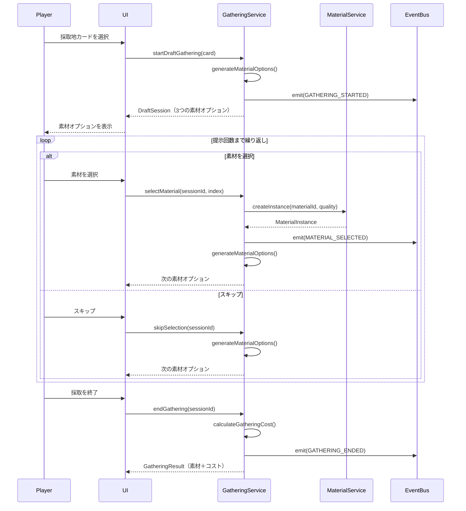

# TASK-0011: GatheringService実装（ドラフト採取） - 開発ノート

**作成日**: 2026-01-16
**タスクID**: TASK-0011
**要件名**: atelier-guild-rank

---

## 1. 技術スタック

### 使用技術・フレームワーク
- **言語**: TypeScript 5.x
- **ゲームFW**: Phaser 3.87+
- **UIプラグイン**: rexUI（phaser3-rex-plugins 1.80+）
- **スタイリング**: Tailwind CSS 4.x
- **ビルド**: Vite 5.4.0
- **パッケージ管理**: pnpm 9.15.0
- **Lint/Format**: Biome 2.x
- **テスト**: Vitest 4.x（ユニットテスト）
- **E2Eテスト**: Playwright（最新）
- **Git Hooks**: Lefthook 2.x

### アーキテクチャパターン
- **Clean Architecture**: 4層構造（Presentation/Application/Domain/Infrastructure）
- **Entity-Based Design**: ドメインエンティティによるビジネスロジックのカプセル化
- **Service Layer Pattern**: ビジネスロジックをサービス層に集約
- **Repository Pattern**: データアクセスの抽象化
- **イベント駆動設計**: EventBusによる疎結合な通信

### 参照元
- `docs/design/atelier-guild-rank/architecture-overview.md`
- `docs/design/atelier-guild-rank/core-systems-core-services.md`
- `atelier-guild-rank/package.json`

---

## 2. 開発ルール

### プロジェクト固有ルール
- **応答は日本語で行う**
- **ずんだもん口調で喋る**（語尾は「なのだ。」）
- **Clean Architectureの原則に従う**
  - Domain/Application層はPhaserに依存しない
  - ビジネスロジックはフレームワークに依存しない
  - インターフェースはdomain/interfacesに配置
  - サービス実装はApplication層に配置
- **Biomeによる一貫したコードスタイル**
- **Lefthookによるコミット前の品質チェック自動化**

### コーディング規約
- **エクスポート形式**: 名前付きエクスポートを使用
- **エラーハンドリング**: ApplicationErrorを使用し、ErrorCodesで定義されたコードを使う
- **型安全性**: 厳密な型定義、unknown型の使用
- **不変性**: 状態更新時は新しいオブジェクトを作成（配列のスプレッド演算子など）
- **クラス名**: PascalCase（例: `GatheringService`, `DraftSession`）
- **インターフェース名**: `I`プレフィックスを使用（例: `IGatheringService`）
- **型定義の場所**: `src/shared/types/` に集約

### 参照元
- `CLAUDE.md`
- `docs/design/atelier-guild-rank/architecture-overview.md`
- `docs/design/atelier-guild-rank/core-systems-core-services.md`

---

## 3. 関連実装

### 類似機能の実装例

#### TASK-0009: カードエンティティ・DeckService実装（完了済み、参考にできる）
- **サービス実装**: `atelier-guild-rank/src/application/services/deck-service.ts`
  - インターフェースを実装
  - コンストラクタで依存注入
  - イベント発行によるUI連携
  - Fisher-Yatesアルゴリズムでシャッフル
  - 状態管理（山札・手札・捨て札）

#### TASK-0010: 素材エンティティ・MaterialService実装（完了済み、参考にできる）
- **エンティティ実装**: `atelier-guild-rank/src/domain/entities/MaterialInstance.ts`
  - 不変オブジェクトとして設計
  - マスターデータへの参照を保持
  - getterメソッドで属性を公開
- **サービス実装**: `atelier-guild-rank/src/application/services/material-service.ts`
  - インターフェースを実装
  - コンストラクタで依存注入
  - 素材インスタンス生成
  - ランダム品質生成（基準±1段階）

#### 既存のEventBus実装（参考パターン）
- **ファイル**: `atelier-guild-rank/src/application/events/event-bus.ts`
- **実装パターン**:
  - インターフェースを`src/application/events/event-bus.interface.ts`に定義
  - 実装を`src/application/events/event-bus.ts`に配置
  - 型安全なイベント発行・購読

#### 既存のマスターデータリポジトリ（参考パターン）
- **ファイル**: `atelier-guild-rank/src/infrastructure/repositories/master-data-repository.ts`
- **実装パターン**:
  - コンストラクタで依存を受け取る
  - `Map`を使ったインデックスでO(1)アクセス
  - 読み込み済みフラグで二重読み込み防止

### 参照元
- `atelier-guild-rank/src/domain/entities/MaterialInstance.ts`
- `atelier-guild-rank/src/application/services/deck-service.ts`
- `atelier-guild-rank/src/application/services/material-service.ts`
- `atelier-guild-rank/src/shared/types/materials.ts`
- `atelier-guild-rank/src/shared/types/cards.ts`

---

## 4. 設計文書

### ドラフト採取システム概要 🔵

#### ゲームデザインの意図
- プレイヤーに「何を選ぶか」という戦略的選択を迫る
- 素材プールから3つ提示され、1つ選んで獲得する方式
- 提示回数は採取地により異なる（裏庭2回〜古代遺跡5回）
- 選択個数に応じて行動ポイントコストが増加
- 7個以上採取すると翌日持ち越しペナルティ

#### ドラフト採取の流れ 🔵
```
1. プレイヤーは採取地カードを選択
   ↓
2. 素材プール（6つ）から3つの素材がランダム提示
   ↓
3. 1つ選ぶ or スキップ（何も選ばない）
   ↓
4. 「続ける」→ 2に戻る（提示回数上限まで）
   「終わる」→ 採取終了、コスト計算
   ↓
5. 基本コスト＋追加コストを消費して素材獲得
```

### 採取地カード一覧 🔵

| 採取地 | 基本コスト | 提示回数 | 素材プール | レア出現率 |
|--------|-----------|---------|-----------|-----------|
| **裏庭** | 0 | 2回 | 雑草、水 | 0% |
| **近くの森** | 0 | 3回 | 薬草、キノコ、木材、清水 | 10% |
| **川辺** | 0 | 3回 | 魚、水草、砂、清水 | 10% |
| **山麓の岩場** | 1 | 4回 | 鉱石、石、レア鉱石 | 15% |
| **奥地の洞窟** | 1 | 4回 | レア苔、鉱石、魔法素材 | 20% |
| **火山地帯** | 2 | 5回 | 火山石、灰、溶岩石 | 25% |
| **古代遺跡** | 2 | 5回 | 魔法素材、古代の欠片 | 30% |

### 採取コスト計算 🔵

**採取コスト = 基本コスト（採取地の距離） + 追加コスト（選択個数）**

| 選択個数 | 追加コスト | 追加日数 | 備考 |
|---------|-----------|---------|------|
| 0個（偵察のみ） | 0 | 0 | 何も採らない場合 |
| 1〜2個 | 1 | 0 | 軽い採取 |
| 3〜4個 | 2 | 0 | 普通の採取 |
| 5〜6個 | 3 | 0 | 重い採取 |
| 7個以上 | 3 | +1日 | 大量採取（翌日持越し） |

### IGatheringServiceインターフェース設計 🔵

#### 責務
- ドラフト採取セッション管理
- 素材オプション生成
- 採取コスト計算
- 強化カード・アーティファクトの効果適用

#### メソッド定義
```typescript
export interface IGatheringService {
  // ドラフト採取セッション管理
  startDraftGathering(card: Card, enhancementCards?: Card[]): DraftSession;
  selectMaterial(sessionId: string, materialIndex: number): MaterialInstance;
  skipSelection(sessionId: string): void;
  endGathering(sessionId: string): GatheringResult;

  // 状態取得
  getCurrentSession(): DraftSession | null;
  canGather(card: Card): boolean;

  // コスト計算
  calculateGatheringCost(baseCost: number, selectedCount: number): GatheringCostResult;
}

export interface DraftSession {
  sessionId: string;
  card: Card;
  currentRound: number;
  maxRounds: number;
  selectedMaterials: MaterialInstance[];
  currentOptions: MaterialOption[];
  isComplete: boolean;
}

export interface MaterialOption {
  materialId: MaterialId;
  quality: Quality;
  quantity: number;
}

export interface GatheringResult {
  materials: MaterialInstance[];
  cost: GatheringCostResult;
}

export interface GatheringCostResult {
  actionPointCost: number;
  extraDays: number;
}
```

### GatheringService実装設計 🔵

#### 主要プロパティ
| プロパティ | 型 | 説明 |
|-----------|-----|------|
| materialService | IMaterialService | 素材インスタンス生成 |
| masterDataRepo | IMasterDataRepository | マスターデータ参照 |
| eventBus | IEventBus | イベント発行 |
| activeSessions | Map<string, DraftSession> | アクティブなセッション管理 |

#### ドラフト採取セッション開始ロジック 🔵
```typescript
startDraftGathering(card: Card, enhancementCards?: Card[]): DraftSession {
  // カードタイプチェック
  if (!card.isGatheringCard()) {
    throw new ApplicationError(
      ErrorCodes.INVALID_CARD_TYPE,
      'Card is not a gathering card',
    );
  }

  // セッションID生成
  const sessionId = generateUniqueId('draft_session');

  // 提示回数の決定（カード基本値 + 強化カード + アーティファクト）
  const maxRounds = this.calculateMaxRounds(card, enhancementCards);

  // 素材オプション生成（3つ）
  const currentOptions = this.generateMaterialOptions(card, enhancementCards);

  // セッション作成
  const session: DraftSession = {
    sessionId,
    card,
    currentRound: 1,
    maxRounds,
    selectedMaterials: [],
    currentOptions,
    isComplete: false,
  };

  // セッションを保存
  this.activeSessions.set(sessionId, session);

  // イベント発行
  this.eventBus.emit(GameEventType.GATHERING_STARTED, { session });

  return session;
}
```

#### 素材オプション生成ロジック 🔵
```typescript
generateMaterialOptions(card: Card, enhancementCards?: Card[]): MaterialOption[] {
  const options: MaterialOption[] = [];
  const materialPool = card.effect.materials; // カードに設定された素材プール

  // 強化カード「幸運のお守り」の効果
  const rareChanceBonus = this.getEnhancementValue(enhancementCards, 'RARE_CHANCE_UP');
  const adjustedRareRate = card.effect.rareRate + rareChanceBonus;

  // 3つの素材オプションを生成
  for (let i = 0; i < 3; i++) {
    // レア素材の判定
    const isRare = Math.random() < (adjustedRareRate / 100);

    // 素材をランダム選択（レアor通常）
    const selectedMaterial = isRare
      ? this.selectRareMaterial(materialPool)
      : this.selectNormalMaterial(materialPool);

    // MaterialServiceを使用して品質を決定
    const quality = this.materialService.generateRandomQuality(
      selectedMaterial.baseQuality
    );

    options.push({
      materialId: selectedMaterial.id,
      quality: quality,
      quantity: 1,
    });
  }

  return options;
}
```

#### 素材選択ロジック 🔵
```typescript
selectMaterial(sessionId: string, materialIndex: number): MaterialInstance {
  // セッション取得
  const session = this.activeSessions.get(sessionId);
  if (!session) {
    throw new ApplicationError(
      ErrorCodes.SESSION_NOT_FOUND,
      'Gathering session not found',
    );
  }

  // インデックスチェック
  if (materialIndex < 0 || materialIndex >= session.currentOptions.length) {
    throw new ApplicationError(
      ErrorCodes.INVALID_SELECTION,
      'Invalid material index',
    );
  }

  // 選択された素材オプション
  const option = session.currentOptions[materialIndex];

  // MaterialServiceで素材インスタンスを生成
  const materialInstance = this.materialService.createInstance(
    option.materialId,
    option.quality,
  );

  // セッションに追加
  session.selectedMaterials.push(materialInstance);

  // ラウンドを進める
  session.currentRound++;

  // 最終ラウンドか判定
  if (session.currentRound > session.maxRounds) {
    session.isComplete = true;
    session.currentOptions = [];
  } else {
    // 次のラウンドの素材オプションを生成
    session.currentOptions = this.generateMaterialOptions(
      session.card,
      undefined,
    );
  }

  // イベント発行
  this.eventBus.emit(GameEventType.MATERIAL_SELECTED, {
    material: materialInstance
  });

  return materialInstance;
}
```

#### 採取終了ロジック 🔵
```typescript
endGathering(sessionId: string): GatheringResult {
  // セッション取得
  const session = this.activeSessions.get(sessionId);
  if (!session) {
    throw new ApplicationError(
      ErrorCodes.SESSION_NOT_FOUND,
      'Gathering session not found',
    );
  }

  // コスト計算
  const cost = this.calculateGatheringCost(
    session.card.effect.baseCost,
    session.selectedMaterials.length,
  );

  // セッションを削除
  this.activeSessions.delete(sessionId);

  // イベント発行
  this.eventBus.emit(GameEventType.GATHERING_ENDED, {
    materials: session.selectedMaterials,
    cost,
  });

  return {
    materials: session.selectedMaterials,
    cost,
  };
}
```

#### 採取コスト計算ロジック 🔵
```typescript
calculateGatheringCost(baseCost: number, selectedCount: number): GatheringCostResult {
  let additionalCost: number;
  let extraDays = 0;

  if (selectedCount === 0) {
    additionalCost = 0; // 偵察のみ
  } else if (selectedCount <= 2) {
    additionalCost = 1; // 軽い採取
  } else if (selectedCount <= 4) {
    additionalCost = 2; // 普通の採取
  } else if (selectedCount <= 6) {
    additionalCost = 3; // 重い採取
  } else {
    additionalCost = 3; // 大量採取
    extraDays = 1; // 翌日持越し
  }

  return {
    actionPointCost: baseCost + additionalCost,
    extraDays,
  };
}
```

### 参照元
- `docs/spec/atelier-guild-rank-requirements.md` (セクション1.2 ドラフト採取)
- `docs/design/atelier-guild-rank/game-mechanics.md` (セクション1.4 ドラフト採取システム)
- `docs/design/atelier-guild-rank/core-systems-core-services.md` (セクション8. GatheringService)
- `docs/tasks/atelier-guild-rank/phase-2/TASK-0011.md`

---

## 5. 注意事項

### 技術的制約
- **提示回数は採取地により異なる**: 裏庭2回〜古代遺跡5回
- **素材オプションは常に3つ**: ドラフト採取の基本ルール
- **選択個数に応じたコスト増加**: 0個→0、1-2個→1、3-4個→2、5-6個→3、7個以上→3+1日
- **セッション管理**: 複数の採取セッションを同時進行できる可能性（実装時は1つのみ）
- **強化カード効果**: 「精霊の導き」（提示回数+1）、「幸運のお守り」（レア出現率+30%）
- **アーティファクト効果**: 「古代の地図」（提示回数+1）

### エラーハンドリング
- **存在しないセッションID**: `endGathering()`や`selectMaterial()`で存在しないセッションIDを渡された場合はエラー
- **無効な素材インデックス**: `selectMaterial()`で範囲外のインデックスを渡された場合はエラー
- **採取地カード以外のカード**: `startDraftGathering()`で採取地カード以外を渡された場合はエラー
- **エラーコード**:
  - `ErrorCodes.SESSION_NOT_FOUND`: 存在しないセッションID
  - `ErrorCodes.INVALID_SELECTION`: 無効な選択
  - `ErrorCodes.INVALID_CARD_TYPE`: 採取地カード以外のカードを使用
  - `ErrorCodes.DATA_NOT_LOADED`: マスターデータ未読み込み

### 実装上の注意
- **セッションの一意性**: セッションIDは`generateUniqueId()`で生成
- **イベント発行**: 採取開始・素材選択・採取終了時にイベントを発行
- **状態管理**: DraftSessionは不変オブジェクトではなく、内部で状態を更新
- **テストカバレッジ**: 80%以上を目標
- **テストパターン**: vitestを使用、`vi.fn()`でモック作成

### セキュリティ・パフォーマンス要件
- **セッションの有効期限**: 長時間放置されたセッションは削除（将来拡張）
- **素材オプション生成の効率**: ランダム選択はO(1)で実行
- **メモリ管理**: 終了したセッションは必ず削除

### テスト要件（タスク定義より）
| テストID | テスト内容 | 期待結果 |
|---------|----------|----------|
| T-0011-01 | ドラフト採取開始 | プール3個生成、提示回数設定 |
| T-0011-02 | 素材選択 | プール-1、獲得+1、ラウンド+1 |
| T-0011-03 | 選択回数上限 | 上限到達で選択不可 |
| T-0011-04 | 採取終了 | 獲得素材リスト返却、コスト計算 |
| T-0011-05 | カード効果適用 | 提示回数が効果通り |

### 参照元
- `docs/design/atelier-guild-rank/game-mechanics.md`
- `docs/tasks/atelier-guild-rank/phase-2/TASK-0011.md`

---

## 6. 実装ファイル一覧

### 作成するファイル

#### インターフェース
- `atelier-guild-rank/src/domain/interfaces/gathering-service.interface.ts` - **新規**

#### 実装
- `atelier-guild-rank/src/application/services/gathering-service.ts` - **新規**

#### インデックスファイル
- `atelier-guild-rank/src/domain/interfaces/index.ts` - **更新**（IGatheringServiceエクスポート追加）
- `atelier-guild-rank/src/application/services/index.ts` - **更新**（GatheringServiceエクスポート追加）

#### テスト
- `atelier-guild-rank/tests/unit/application/services/gathering-service.test.ts` - **新規**

### 参照元
- `docs/tasks/atelier-guild-rank/phase-2/TASK-0011.md`

---

## 7. 依存関係

### タスク依存
- **依存元**:
  - TASK-0003（共通型定義） - 完了済み
  - TASK-0004（EventBus実装） - 完了済み
  - TASK-0009（カードエンティティ・DeckService実装） - 完了済み
  - TASK-0010（素材エンティティ・MaterialService実装） - 完了済み

### インポート依存
```typescript
// インターフェース（gathering-service.interface.ts）
import type { Card } from '@domain/entities/Card';
import type { MaterialInstance } from '@domain/entities/MaterialInstance';
import type { MaterialId, Quality } from '@shared/types';

// 実装（gathering-service.ts）
import type { IGatheringService } from '@domain/interfaces/gathering-service.interface';
import type { IMaterialService } from '@domain/interfaces/material-service.interface';
import type { IMasterDataRepository } from '@domain/interfaces/master-data-repository.interface';
import type { IEventBus } from '@application/events/event-bus.interface';
import { Card } from '@domain/entities/Card';
import { MaterialInstance } from '@domain/entities/MaterialInstance';
import type { MaterialId, Quality } from '@shared/types';
import { ApplicationError, ErrorCodes } from '@shared/types/errors';
import { GameEventType } from '@shared/types/events';
import { generateUniqueId } from '@shared/utils';
```

### 参照元
- `docs/tasks/atelier-guild-rank/phase-2/TASK-0011.md`

---

## 8. 実装チェックリスト

### 必須実装（信頼性レベル: 🔵）
- [ ] IGatheringServiceインターフェース定義
  - [ ] startDraftGathering()メソッド
  - [ ] selectMaterial()メソッド
  - [ ] skipSelection()メソッド
  - [ ] endGathering()メソッド
  - [ ] canGather()メソッド
  - [ ] calculateGatheringCost()メソッド
- [ ] DraftSession型定義
  - [ ] sessionId, card, currentRound, maxRounds
  - [ ] selectedMaterials, currentOptions, isComplete
- [ ] GatheringService実装
  - [ ] コンストラクタ（materialService, masterDataRepo, eventBus依存注入）
  - [ ] startDraftGathering()メソッド（セッション開始）
  - [ ] selectMaterial()メソッド（素材選択）
  - [ ] skipSelection()メソッド（スキップ）
  - [ ] endGathering()メソッド（採取終了）
  - [ ] calculateGatheringCost()メソッド（コスト計算）
  - [ ] generateMaterialOptions()メソッド（素材オプション生成）
- [ ] 単体テスト
  - [ ] T-0011-01: ドラフト採取開始
  - [ ] T-0011-02: 素材選択
  - [ ] T-0011-03: 選択回数上限
  - [ ] T-0011-04: 採取終了
  - [ ] T-0011-05: カード効果適用

### 推奨実装（信頼性レベル: 🟡）
- [ ] 強化カード効果の適用
  - [ ] 「精霊の導き」（提示回数+1）
  - [ ] 「幸運のお守り」（レア出現率+30%）
- [ ] アーティファクト効果の適用
  - [ ] 「古代の地図」（提示回数+1）
- [ ] エラーハンドリング
  - [ ] 存在しないセッションID時のエラー
  - [ ] 無効な素材インデックス時のエラー
  - [ ] 採取地カード以外のカード時のエラー
- [ ] テストカバレッジ80%以上

---

## 9. 実装の流れ

1. **IGatheringServiceインターフェースの定義**
   - `src/domain/interfaces/gathering-service.interface.ts`を作成
   - DraftSession, MaterialOption, GatheringResult, GatheringCostResult型を定義
   - メソッドシグネチャを定義
   - `src/domain/interfaces/index.ts`にエクスポート追加

2. **GatheringServiceの実装**
   - `src/application/services/gathering-service.ts`を作成
   - コンストラクタと依存注入
   - 各メソッドを実装
     1. startDraftGathering()
     2. selectMaterial()
     3. skipSelection()
     4. endGathering()
     5. calculateGatheringCost()
     6. generateMaterialOptions()
   - `src/application/services/index.ts`にエクスポート追加

3. **テストの実装**
   - `tests/unit/application/services/gathering-service.test.ts`を作成
   - 全テストケース実装
   - カバレッジ確認

4. **動作確認**
   - `pnpm test`でユニットテスト実行
   - `pnpm lint`でコード品質確認

---

## 10. 参考リンク

### 設計文書
- ゲームメカニクス設計（ドラフト採取）: `docs/design/atelier-guild-rank/game-mechanics.md`
- コアサービス設計（GatheringService）: `docs/design/atelier-guild-rank/core-systems-core-services.md`
- アーキテクチャ設計（概要）: `docs/design/atelier-guild-rank/architecture-overview.md`

### タスク定義
- TASK-0011定義: `docs/tasks/atelier-guild-rank/phase-2/TASK-0011.md`
- TASK-0009定義: `docs/tasks/atelier-guild-rank/phase-2/TASK-0009.md`
- TASK-0010定義: `docs/tasks/atelier-guild-rank/phase-2/TASK-0010.md`

### 要件定義
- 要件定義書: `docs/spec/atelier-guild-rank-requirements.md`

### 既存実装
- DeckService: `atelier-guild-rank/src/application/services/deck-service.ts`
- MaterialService: `atelier-guild-rank/src/application/services/material-service.ts`
- MaterialInstance: `atelier-guild-rank/src/domain/entities/MaterialInstance.ts`
- Card: `atelier-guild-rank/src/domain/entities/Card.ts`
- EventBus: `atelier-guild-rank/src/application/events/event-bus.ts`
- マスターデータリポジトリ: `atelier-guild-rank/src/infrastructure/repositories/master-data-repository.ts`

### テスト参考
- DeckServiceテスト: `atelier-guild-rank/tests/unit/application/services/deck-service.test.ts`
- MaterialServiceテスト: `atelier-guild-rank/tests/unit/application/services/material-service.test.ts`

---

## 11. 補足情報

### ドラフト採取の処理フロー図



### 採取コスト計算の具体例

| 採取地 | 基本コスト | 選択個数 | 追加コスト | 総コスト | 追加日数 |
|--------|-----------|---------|-----------|---------|---------|
| 近くの森 | 0 | 2個 | 1 | 1 | 0 |
| 近くの森 | 0 | 3個 | 2 | 2 | 0 |
| 山麓の岩場 | 1 | 4個 | 2 | 3 | 0 |
| 火山地帯 | 2 | 5個 | 3 | 5 | 0 |
| 古代遺跡 | 2 | 7個 | 3 | 5 | +1日 |

### セッション管理の実装例

```typescript
export class GatheringService implements IGatheringService {
  private activeSessions: Map<string, DraftSession> = new Map();

  startDraftGathering(card: Card, enhancementCards?: Card[]): DraftSession {
    // セッションID生成
    const sessionId = generateUniqueId('draft_session');

    // セッション作成
    const session: DraftSession = {
      sessionId,
      card,
      currentRound: 1,
      maxRounds: this.calculateMaxRounds(card, enhancementCards),
      selectedMaterials: [],
      currentOptions: this.generateMaterialOptions(card, enhancementCards),
      isComplete: false,
    };

    // セッションを保存
    this.activeSessions.set(sessionId, session);

    return session;
  }

  endGathering(sessionId: string): GatheringResult {
    // セッション取得
    const session = this.activeSessions.get(sessionId);
    if (!session) {
      throw new ApplicationError(
        ErrorCodes.SESSION_NOT_FOUND,
        'Gathering session not found',
      );
    }

    // コスト計算
    const cost = this.calculateGatheringCost(
      session.card.effect.baseCost,
      session.selectedMaterials.length,
    );

    // セッションを削除
    this.activeSessions.delete(sessionId);

    return {
      materials: session.selectedMaterials,
      cost,
    };
  }
}
```

### テストの実装例

```typescript
import { describe, it, expect, beforeEach, vi } from 'vitest';
import { GatheringService } from '@application/services/gathering-service';
import type { IGatheringService } from '@domain/interfaces/gathering-service.interface';
import type { IMaterialService } from '@domain/interfaces/material-service.interface';
import type { IMasterDataRepository } from '@domain/interfaces/master-data-repository.interface';
import type { IEventBus } from '@application/events/event-bus.interface';
import { Card } from '@domain/entities/Card';

describe('GatheringService', () => {
  let gatheringService: IGatheringService;
  let mockMaterialService: IMaterialService;
  let mockMasterDataRepo: IMasterDataRepository;
  let mockEventBus: IEventBus;
  let testCard: Card;

  beforeEach(() => {
    mockMaterialService = createMockMaterialService();
    mockMasterDataRepo = createMockMasterDataRepository();
    mockEventBus = createMockEventBus();
    gatheringService = new GatheringService(
      mockMaterialService,
      mockMasterDataRepo,
      mockEventBus,
    );

    testCard = createTestGatheringCard();
  });

  describe('T-0011-01: ドラフト採取開始', () => {
    it('プール3個生成、提示回数設定', () => {
      const session = gatheringService.startDraftGathering(testCard);

      expect(session.currentOptions).toHaveLength(3);
      expect(session.maxRounds).toBeGreaterThan(0);
      expect(session.currentRound).toBe(1);
      expect(session.selectedMaterials).toHaveLength(0);
      expect(session.isComplete).toBe(false);
    });
  });

  describe('T-0011-02: 素材選択', () => {
    it('プール-1、獲得+1、ラウンド+1', () => {
      const session = gatheringService.startDraftGathering(testCard);
      const initialRound = session.currentRound;

      const material = gatheringService.selectMaterial(session.sessionId, 0);

      expect(material).toBeDefined();
      expect(session.selectedMaterials).toHaveLength(1);
      expect(session.currentRound).toBe(initialRound + 1);
    });
  });

  describe('T-0011-04: 採取終了', () => {
    it('獲得素材リスト返却、コスト計算', () => {
      const session = gatheringService.startDraftGathering(testCard);
      gatheringService.selectMaterial(session.sessionId, 0);
      gatheringService.selectMaterial(session.sessionId, 1);

      const result = gatheringService.endGathering(session.sessionId);

      expect(result.materials).toHaveLength(2);
      expect(result.cost.actionPointCost).toBeGreaterThan(0);
      expect(result.cost.extraDays).toBeGreaterThanOrEqual(0);
    });
  });
});
```

---

**最終更新**: 2026-01-16
