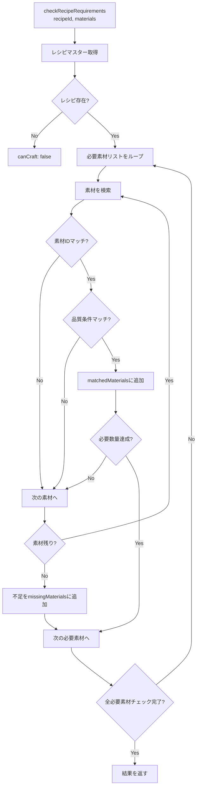
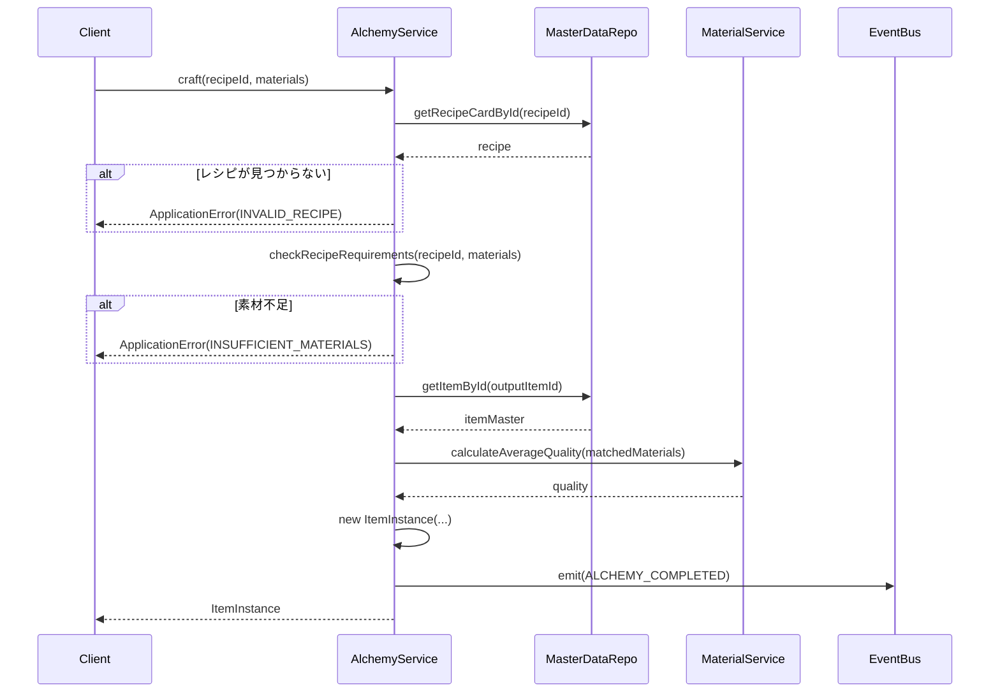

# TASK-0012: アイテムエンティティ・AlchemyService実装 - 開発ノート

**作成日**: 2026-01-17
**タスクID**: TASK-0012
**要件名**: atelier-guild-rank

---

## 1. 技術スタック

### 使用技術・フレームワーク
- **言語**: TypeScript 5.x
- **ゲームFW**: Phaser 3.87+
- **UIプラグイン**: rexUI（phaser3-rex-plugins 1.80+）
- **スタイリング**: Tailwind CSS 4.x
- **ビルド**: Vite 5.4.0
- **パッケージ管理**: pnpm 9.15.0
- **Lint/Format**: Biome 2.x
- **テスト**: Vitest 4.x（ユニットテスト）
- **E2Eテスト**: Playwright（最新）
- **Git Hooks**: Lefthook 2.x

### アーキテクチャパターン
- **Clean Architecture**: 4層構造（Presentation/Application/Domain/Infrastructure）
- **Entity-Based Design**: ドメインエンティティによるビジネスロジックのカプセル化
- **Value Object Pattern**: 品質値オブジェクトによる品質比較ロジックのカプセル化
- **Repository Pattern**: データアクセスの抽象化
- **イベント駆動設計**: EventBusによる疎結合な通信

### 参照元
- `docs/design/atelier-guild-rank/architecture-overview.md`
- `docs/design/atelier-guild-rank/data-schema-master-game.md`
- `atelier-guild-rank/package.json`

---

## 2. 開発ルール

### プロジェクト固有ルール
- **応答は日本語で行う**
- **ずんだもん口調で喋る**（語尾は「なのだ。」）
- **Clean Architectureの原則に従う**
  - Domain/Application層はPhaserに依存しない
  - ビジネスロジックはフレームワークに依存しない
  - エンティティはドメイン層に配置
  - サービスはApplication層に配置
  - 値オブジェクトはdomain/value-objectsに配置
- **Biomeによる一貫したコードスタイル**
- **Lefthookによるコミット前の品質チェック自動化**

### コーディング規約
- **エクスポート形式**: 名前付きエクスポートを使用
- **エラーハンドリング**: ApplicationErrorを使用し、ErrorCodesで定義されたコードを使う
- **型安全性**: 厳密な型定義、unknown型の使用
- **不変性**: 状態更新時は新しいオブジェクトを作成（配列のスプレッド演算子など）
- **クラス名**: PascalCase（例: `ItemInstance`, `AlchemyService`）
- **インターフェース名**: `I`プレフィックスを使用（例: `IAlchemyService`）
- **型定義の場所**: `src/shared/types/` に集約
- **エンティティ**: 不変オブジェクトとして設計、getterで属性を公開

### 参照元
- `CLAUDE.md`
- `docs/design/atelier-guild-rank/architecture-overview.md`
- `docs/design/atelier-guild-rank/data-schema-master-game.md`

---

## 3. 関連実装

### 類似機能の実装例

#### TASK-0010: 素材エンティティ・MaterialService実装（完了済み、参考にできる）
- **エンティティ実装**: `atelier-guild-rank/src/domain/entities/MaterialInstance.ts`
  - 不変オブジェクトとして設計
  - マスターデータへの参照を保持
  - getterメソッドで属性を公開
- **サービス実装**: `atelier-guild-rank/src/application/services/material-service.ts`
  - インターフェースを実装
  - コンストラクタで依存注入（MasterDataRepository, EventBus）
  - 品質計算ロジック（calculateAverageQuality）

#### MaterialInstance.ts（参考パターン）
```typescript
export class MaterialInstance {
  constructor(
    public readonly instanceId: string,
    public readonly master: IMaterial,
    public readonly quality: Quality,
  ) {}

  get materialId(): MaterialId {
    return this.master.id;
  }

  get name(): string {
    return this.master.name;
  }

  get baseQuality(): Quality {
    return this.master.baseQuality;
  }

  get attributes(): Attribute[] {
    return this.master.attributes;
  }
}
```

#### MaterialService.ts（参考パターン）
```typescript
export class MaterialService implements IMaterialService {
  constructor(
    private readonly masterDataRepo: IMasterDataRepository,
    _eventBus: IEventBus,
  ) {}

  createInstance(materialId: MaterialId, quality: Quality): MaterialInstance {
    const master = this.masterDataRepo.getMaterialById(materialId);
    if (!master) {
      throw new ApplicationError(
        ErrorCodes.INVALID_MATERIAL_ID,
        `Material not found: ${materialId}`,
      );
    }
    const instanceId = generateUniqueId('material');
    return new MaterialInstance(instanceId, master, quality);
  }

  calculateAverageQuality(materials: MaterialInstance[]): Quality {
    if (materials.length === 0) {
      throw new ApplicationError(
        ErrorCodes.INVALID_MATERIALS,
        'Cannot calculate average quality of empty array',
      );
    }
    const sum = materials.reduce((acc, m) => acc + QUALITY_ORDER[m.quality], 0);
    const average = sum / materials.length;
    return orderToQuality(Math.round(average));
  }
}
```

### 既存の型定義
- **素材型**: `atelier-guild-rank/src/shared/types/materials.ts`
  - `IItem`インターフェース（アイテムマスター）
  - `ICraftedItem`インターフェース（調合済みアイテム）
  - `IUsedMaterial`インターフェース（使用素材情報）
- **マスターデータ型**: `atelier-guild-rank/src/shared/types/master-data.ts`
  - `IRecipeCardMaster`インターフェース（レシピカードマスター）
  - `IRecipeRequiredMaterial`インターフェース（必要素材）
  - `ItemMaster`型エイリアス
- **共通型**: `atelier-guild-rank/src/shared/types/common.ts`
  - `Quality`列挙型（D, C, B, A, S）
  - `ItemCategory`列挙型
- **ID型**: `atelier-guild-rank/src/shared/types/ids.ts`
  - `ItemId`ブランド型、`toItemId()`変換関数
- **エラー型**: `atelier-guild-rank/src/shared/types/errors.ts`
  - `ApplicationError`クラス
  - `ErrorCodes`定数（INSUFFICIENT_MATERIALS, INVALID_RECIPE）
- **イベント型**: `atelier-guild-rank/src/shared/types/events.ts`
  - `GameEventType.ALCHEMY_COMPLETED`
  - `IAlchemyCompletedEvent`インターフェース

### 参照元
- `atelier-guild-rank/src/domain/entities/MaterialInstance.ts`
- `atelier-guild-rank/src/application/services/material-service.ts`
- `atelier-guild-rank/src/domain/value-objects/Quality.ts`
- `atelier-guild-rank/src/shared/types/materials.ts`
- `atelier-guild-rank/src/shared/types/master-data.ts`
- `atelier-guild-rank/src/shared/types/common.ts`
- `atelier-guild-rank/src/shared/types/ids.ts`
- `atelier-guild-rank/src/shared/types/errors.ts`
- `atelier-guild-rank/src/shared/types/events.ts`

---

## 4. 設計文書

### ItemInstanceエンティティ設計

#### 責務
- アイテムインスタンスID、アイテムマスター、品質、使用素材を保持
- アイテムの属性（itemId, name, basePrice）をgetterで公開
- 品質に応じた価格計算ロジック（calculatePrice）

#### ItemInstanceエンティティの構造
```typescript
export class ItemInstance {
  constructor(
    public readonly instanceId: string,
    public readonly master: ItemMaster,
    public readonly quality: Quality,
    public readonly usedMaterials: MaterialInstance[],
  ) {}

  get itemId(): ItemId {
    return this.master.id;
  }

  get name(): string {
    return this.master.name;
  }

  get basePrice(): number {
    return this.master.basePrice;
  }

  // 品質に応じた価格計算
  calculatePrice(): number {
    const qualityMultiplier = QUALITY_PRICE_MULTIPLIER[this.quality];
    return Math.floor(this.basePrice * qualityMultiplier);
  }
}
```

### 品質価格係数定義
```typescript
const QUALITY_PRICE_MULTIPLIER: Record<Quality, number> = {
  'D': 0.5,
  'C': 0.75,
  'B': 1.0,
  'A': 1.5,
  'S': 2.0,
};
```

### IAlchemyServiceインターフェース設計

#### 責務
- 調合実行（レシピと素材からアイテム生成）
- 調合可能チェック（レシピ要件の検証）
- 品質プレビュー（調合前の品質確認）
- レシピ取得（利用可能なレシピリスト）
- レシピ要件チェック（素材の過不足確認）

#### IAlchemyServiceメソッド定義
```typescript
export interface IAlchemyService {
  // 調合実行
  craft(recipeId: CardId, materials: MaterialInstance[]): ItemInstance;

  // 調合可能チェック
  canCraft(recipeId: CardId, availableMaterials: MaterialInstance[]): boolean;

  // 品質プレビュー
  previewQuality(recipeId: CardId, materials: MaterialInstance[]): Quality;

  // 利用可能レシピ取得
  getAvailableRecipes(materials: MaterialInstance[]): IRecipeCardMaster[];

  // レシピ要件チェック
  checkRecipeRequirements(
    recipeId: CardId,
    materials: MaterialInstance[]
  ): RecipeCheckResult;
}

export interface RecipeCheckResult {
  canCraft: boolean;
  missingMaterials: IRecipeRequiredMaterial[];
  matchedMaterials: MaterialInstance[];
}
```

### AlchemyService実装設計

#### 主要プロパティ
| プロパティ | 型 | 説明 |
|-----------|-----|------|
| masterDataRepo | IMasterDataRepository | マスターデータ参照 |
| materialService | IMaterialService | 素材サービス |
| eventBus | IEventBus | イベント発行 |

#### 調合メソッドの実装イメージ
```typescript
craft(recipeId: CardId, materials: MaterialInstance[]): ItemInstance {
  // レシピマスター取得
  const recipe = this.masterDataRepo.getRecipeCardById(recipeId);
  if (!recipe) {
    throw new ApplicationError(
      ErrorCodes.INVALID_RECIPE,
      `Recipe not found: ${recipeId}`,
    );
  }

  // 調合可能チェック
  const checkResult = this.checkRecipeRequirements(recipeId, materials);
  if (!checkResult.canCraft) {
    throw new ApplicationError(
      ErrorCodes.INSUFFICIENT_MATERIALS,
      'Cannot craft: insufficient materials',
    );
  }

  // アイテムマスター取得
  const itemMaster = this.masterDataRepo.getItemById(toItemId(recipe.outputItemId));
  if (!itemMaster) {
    throw new ApplicationError(
      ErrorCodes.INVALID_RECIPE,
      `Output item not found: ${recipe.outputItemId}`,
    );
  }

  // 品質計算（MaterialServiceの平均品質計算を使用）
  const quality = this.materialService.calculateAverageQuality(
    checkResult.matchedMaterials
  );

  // アイテムインスタンス生成
  const instanceId = generateUniqueId('item');
  const instance = new ItemInstance(
    instanceId,
    itemMaster,
    quality,
    checkResult.matchedMaterials,
  );

  // イベント発行
  this.eventBus.emit({
    type: GameEventType.ALCHEMY_COMPLETED,
    timestamp: Date.now(),
    craftedItem: instance,
  });

  return instance;
}
```

#### レシピ要件チェックロジック
```typescript
checkRecipeRequirements(
  recipeId: CardId,
  materials: MaterialInstance[]
): RecipeCheckResult {
  const recipe = this.masterDataRepo.getRecipeCardById(recipeId);
  if (!recipe) {
    return {
      canCraft: false,
      missingMaterials: [],
      matchedMaterials: [],
    };
  }

  const missingMaterials: IRecipeRequiredMaterial[] = [];
  const matchedMaterials: MaterialInstance[] = [];
  const usedIndices = new Set<number>();

  // 各必要素材についてチェック
  for (const required of recipe.requiredMaterials) {
    let foundCount = 0;

    for (let i = 0; i < materials.length; i++) {
      if (usedIndices.has(i)) continue;

      const material = materials[i];

      // 素材IDマッチ
      if (material.materialId !== required.materialId) continue;

      // 最低品質チェック（指定されている場合）
      if (required.minQuality) {
        if (compareQuality(material.quality, required.minQuality) < 0) continue;
      }

      // マッチ
      matchedMaterials.push(material);
      usedIndices.add(i);
      foundCount++;

      if (foundCount >= required.quantity) break;
    }

    // 不足している場合
    if (foundCount < required.quantity) {
      missingMaterials.push({
        ...required,
        quantity: required.quantity - foundCount,
      });
    }
  }

  return {
    canCraft: missingMaterials.length === 0,
    missingMaterials,
    matchedMaterials,
  };
}
```

### 参照元
- `docs/design/atelier-guild-rank/core-systems-core-services.md` (AlchemyService定義)
- `docs/design/atelier-guild-rank/game-mechanics.md` (品質計算)
- `docs/tasks/atelier-guild-rank/phase-2/TASK-0012.md`

---

## 5. 注意事項

### 技術的制約
- **品質は5段階**: D, C, B, A, S（定数: `QUALITY_ORDER`）
- **品質価格係数**: D(0.5), C(0.75), B(1.0), A(1.5), S(2.0)
- **品質計算**: MaterialServiceの`calculateAverageQuality`を使用（四捨五入）
- **アイテムインスタンスID**: 一意なID生成（`generateUniqueId('item')`）
- **必要素材の最低品質**: IRecipeRequiredMaterialの`minQuality`で指定可能（オプション）

### エラーハンドリング
- **存在しないレシピID**: `craft()`で存在しないRecipeIdを渡された場合はエラー
- **素材不足時**: 必要素材が不足している場合は`INSUFFICIENT_MATERIALS`エラー
- **出力アイテム未定義**: レシピの`outputItemId`に対応するアイテムがない場合はエラー
- **エラーコード**:
  - `ErrorCodes.INVALID_RECIPE`: 存在しないレシピID
  - `ErrorCodes.INSUFFICIENT_MATERIALS`: 素材不足
  - `ErrorCodes.INVALID_MATERIAL_ID`: 存在しない素材ID（MaterialServiceから）

### 実装上の注意
- **不変性**: ItemInstanceは不変オブジェクト、全プロパティ`readonly`
- **素材消費**: 調合時に素材を消費する処理は別途InventoryServiceで行う（今回はスコープ外）
- **イベント発行**: 調合完了時に`ALCHEMY_COMPLETED`イベントを発行
- **素材マッチング順序**: 必要素材リストの順番で素材をマッチング、同一素材を複数回使用しない
- **テストカバレッジ**: 80%以上を目標
- **テストパターン**: vitestを使用、`vi.fn()`でモック作成

### テスト要件（タスク定義より）
| テストID | テスト内容 | 期待結果 |
|---------|----------|----------|
| T-0012-01 | 調合成功 | アイテムインスタンス生成 |
| T-0012-02 | 素材不足時の調合 | エラー発生 |
| T-0012-03 | 品質計算（全てC品質） | C品質アイテム |
| T-0012-04 | 品質計算（混合品質） | 平均品質 |
| T-0012-05 | 調合可能レシピ取得 | 該当レシピリスト |

### 参照元
- `docs/design/atelier-guild-rank/core-systems-core-services.md`
- `docs/design/atelier-guild-rank/game-mechanics.md`
- `docs/tasks/atelier-guild-rank/phase-2/TASK-0012.md`

---

## 6. 実装ファイル一覧

### 作成するファイル

#### エンティティ
- `atelier-guild-rank/src/domain/entities/ItemInstance.ts` - **新規**

#### インターフェース
- `atelier-guild-rank/src/domain/interfaces/alchemy-service.interface.ts` - **新規**

#### 実装
- `atelier-guild-rank/src/application/services/alchemy-service.ts` - **新規**

#### インデックスファイル
- `atelier-guild-rank/src/domain/entities/index.ts` - **更新**（ItemInstanceエクスポート追加）
- `atelier-guild-rank/src/domain/interfaces/index.ts` - **更新**（IAlchemyServiceエクスポート追加）
- `atelier-guild-rank/src/application/services/index.ts` - **更新**（AlchemyServiceエクスポート追加）

#### テスト
- `atelier-guild-rank/tests/unit/domain/entities/ItemInstance.test.ts` - **新規**（推奨）
- `atelier-guild-rank/tests/unit/application/services/alchemy-service.test.ts` - **新規**

### 参照元
- `docs/tasks/atelier-guild-rank/phase-2/TASK-0012.md`

---

## 7. 依存関係

### タスク依存
- **依存元**:
  - TASK-0003（共通型定義） - 完了済み
  - TASK-0004（EventBus実装） - 完了済み
  - TASK-0006（マスターデータローダー実装） - 完了済み
  - TASK-0010（素材エンティティ・MaterialService実装） - 完了済み

### インポート依存
```typescript
// エンティティ（ItemInstance.ts）
import type { Quality, ItemId } from '@shared/types';
import type { ItemMaster } from '@shared/types/master-data';
import { MaterialInstance } from '@domain/entities/MaterialInstance';

// インターフェース（alchemy-service.interface.ts）
import type { ItemInstance } from '@domain/entities/ItemInstance';
import type { MaterialInstance } from '@domain/entities/MaterialInstance';
import type { CardId, Quality } from '@shared/types';
import type { IRecipeCardMaster, IRecipeRequiredMaterial } from '@shared/types/master-data';

// 実装（alchemy-service.ts）
import type { IAlchemyService, RecipeCheckResult } from '@domain/interfaces/alchemy-service.interface';
import type { IMasterDataRepository } from '@domain/interfaces/master-data-repository.interface';
import type { IMaterialService } from '@domain/interfaces/material-service.interface';
import type { IEventBus } from '@application/events/event-bus.interface';
import { ItemInstance } from '@domain/entities/ItemInstance';
import { MaterialInstance } from '@domain/entities/MaterialInstance';
import type { CardId, Quality, ItemId } from '@shared/types';
import type { IRecipeCardMaster } from '@shared/types/master-data';
import { compareQuality, QUALITY_ORDER } from '@domain/value-objects/Quality';
import { ApplicationError, ErrorCodes } from '@shared/types/errors';
import { GameEventType } from '@shared/types/events';
import { generateUniqueId } from '@shared/utils';
import { toItemId } from '@shared/types/ids';
```

### 参照元
- `docs/tasks/atelier-guild-rank/phase-2/TASK-0012.md`

---

## 8. 実装チェックリスト

### 必須実装（信頼性レベル: 🔵）
- [ ] ItemInstanceエンティティ実装
  - [ ] コンストラクタ（instanceId, master, quality, usedMaterials）
  - [ ] getterメソッド（itemId, name, basePrice）
  - [ ] calculatePrice()メソッド（品質に応じた価格計算）
  - [ ] QUALITY_PRICE_MULTIPLIER定数
- [ ] IAlchemyServiceインターフェース定義
  - [ ] craft()メソッド
  - [ ] canCraft()メソッド
  - [ ] previewQuality()メソッド
  - [ ] getAvailableRecipes()メソッド
  - [ ] checkRecipeRequirements()メソッド
  - [ ] RecipeCheckResultインターフェース
- [ ] AlchemyService実装
  - [ ] コンストラクタ（masterDataRepo, materialService, eventBus依存注入）
  - [ ] craft()メソッド（調合実行）
  - [ ] canCraft()メソッド（調合可能チェック）
  - [ ] previewQuality()メソッド（品質プレビュー）
  - [ ] getAvailableRecipes()メソッド（利用可能レシピ取得）
  - [ ] checkRecipeRequirements()メソッド（レシピ要件チェック）
- [ ] 単体テスト
  - [ ] T-0012-01: 調合成功
  - [ ] T-0012-02: 素材不足時の調合
  - [ ] T-0012-03: 品質計算（全てC品質）
  - [ ] T-0012-04: 品質計算（混合品質）
  - [ ] T-0012-05: 調合可能レシピ取得

### 推奨実装（信頼性レベル: 🟡）
- [ ] イベント発行
  - [ ] `ALCHEMY_COMPLETED`イベント
- [ ] エラーハンドリング
  - [ ] 存在しないレシピID時のエラー
  - [ ] 素材不足時のエラー
  - [ ] 出力アイテム未定義時のエラー
- [ ] テストカバレッジ80%以上

---

## 9. 実装の流れ

1. **ItemInstanceエンティティの実装**
   - `src/domain/entities/ItemInstance.ts`を作成
   - コンストラクタとgetterメソッドを実装
   - calculatePrice()メソッドを実装
   - QUALITY_PRICE_MULTIPLIER定数を定義
   - `src/domain/entities/index.ts`にエクスポート追加

2. **IAlchemyServiceインターフェースの定義**
   - `src/domain/interfaces/alchemy-service.interface.ts`を作成
   - メソッドシグネチャを定義
   - RecipeCheckResultインターフェースを定義
   - `src/domain/interfaces/index.ts`にエクスポート追加

3. **AlchemyServiceの実装**
   - `src/application/services/alchemy-service.ts`を作成
   - コンストラクタと依存注入
   - 各メソッドを実装
     1. checkRecipeRequirements()（他メソッドの基盤）
     2. canCraft()
     3. previewQuality()
     4. craft()
     5. getAvailableRecipes()
   - `src/application/services/index.ts`にエクスポート追加

4. **テストの実装**
   - `tests/unit/domain/entities/ItemInstance.test.ts`を作成（推奨）
   - `tests/unit/application/services/alchemy-service.test.ts`を作成
   - 全テストケース実装
   - カバレッジ確認

5. **動作確認**
   - `pnpm test`でユニットテスト実行
   - `pnpm lint`でコード品質確認

---

## 10. 参考リンク

### 設計文書
- コアサービス設計（AlchemyService）: `docs/design/atelier-guild-rank/core-systems-core-services.md`
- ゲームメカニクス設計（品質計算）: `docs/design/atelier-guild-rank/game-mechanics.md`
- アーキテクチャ設計（概要）: `docs/design/atelier-guild-rank/architecture-overview.md`
- データスキーマ設計: `docs/design/atelier-guild-rank/data-schema-master-game.md`

### タスク定義
- TASK-0012定義: `docs/tasks/atelier-guild-rank/phase-2/TASK-0012.md`
- TASK-0010定義（参考）: `docs/tasks/atelier-guild-rank/phase-2/TASK-0010.md`

### 要件定義
- 要件定義書: `docs/spec/atelier-guild-rank-requirements.md`

### 既存実装
- MaterialInstanceエンティティ: `atelier-guild-rank/src/domain/entities/MaterialInstance.ts`
- MaterialService: `atelier-guild-rank/src/application/services/material-service.ts`
- Quality値オブジェクト: `atelier-guild-rank/src/domain/value-objects/Quality.ts`
- EventBus: `atelier-guild-rank/src/application/events/event-bus.ts`
- マスターデータリポジトリ: `atelier-guild-rank/src/infrastructure/repositories/master-data-repository.ts`
- 素材型定義: `atelier-guild-rank/src/shared/types/materials.ts`
- マスターデータ型定義: `atelier-guild-rank/src/shared/types/master-data.ts`
- 共通型定義: `atelier-guild-rank/src/shared/types/common.ts`
- ID型定義: `atelier-guild-rank/src/shared/types/ids.ts`
- エラー型定義: `atelier-guild-rank/src/shared/types/errors.ts`
- イベント型定義: `atelier-guild-rank/src/shared/types/events.ts`

### テスト参考
- MaterialServiceテスト: `atelier-guild-rank/tests/unit/application/services/material-service.test.ts`
- DeckServiceテスト: `atelier-guild-rank/tests/unit/application/services/deck-service.test.ts`
- EventBusテスト: `atelier-guild-rank/tests/unit/application/events/event-bus.test.ts`

---

## 11. 補足情報

### 品質価格係数の計算例

| 品質 | 係数 | 基本価格100Gの場合 |
|-----|------|-------------------|
| D | 0.5 | 50G |
| C | 0.75 | 75G |
| B | 1.0 | 100G |
| A | 1.5 | 150G |
| S | 2.0 | 200G |

### ItemInstanceエンティティの実装例

```typescript
import type { ItemId, Quality } from '@shared/types';
import type { ItemMaster } from '@shared/types/master-data';
import type { MaterialInstance } from './MaterialInstance';

/**
 * 品質価格係数定義
 */
export const QUALITY_PRICE_MULTIPLIER: Record<Quality, number> = {
  D: 0.5,
  C: 0.75,
  B: 1.0,
  A: 1.5,
  S: 2.0,
};

/**
 * アイテムインスタンスエンティティ
 * 調合によって生成されたアイテムの実体
 */
export class ItemInstance {
  constructor(
    /** インスタンスID（一意） */
    public readonly instanceId: string,
    /** アイテムマスターへの参照 */
    public readonly master: ItemMaster,
    /** 実際の品質 */
    public readonly quality: Quality,
    /** 使用した素材リスト */
    public readonly usedMaterials: MaterialInstance[],
  ) {}

  /** アイテムID */
  get itemId(): ItemId {
    return this.master.id;
  }

  /** アイテム名 */
  get name(): string {
    return this.master.name;
  }

  /** 基本価格 */
  get basePrice(): number {
    // IItemにbasePriceがない場合は0を返す
    return (this.master as { basePrice?: number }).basePrice ?? 0;
  }

  /**
   * 品質に応じた価格を計算
   * 最終価格 = 基本価格 × 品質係数（端数切り捨て）
   */
  calculatePrice(): number {
    const qualityMultiplier = QUALITY_PRICE_MULTIPLIER[this.quality];
    return Math.floor(this.basePrice * qualityMultiplier);
  }
}
```

### レシピ要件チェックの処理フロー



### AlchemyServiceの調合メソッド処理フロー



### テストの実装例

```typescript
import { describe, it, expect, beforeEach, vi } from 'vitest';
import { AlchemyService } from '@application/services/alchemy-service';
import type { IAlchemyService } from '@domain/interfaces/alchemy-service.interface';
import type { IMasterDataRepository } from '@domain/interfaces/master-data-repository.interface';
import type { IMaterialService } from '@domain/interfaces/material-service.interface';
import type { IEventBus } from '@application/events/event-bus.interface';
import { MaterialInstance } from '@domain/entities/MaterialInstance';
import { ErrorCodes, ApplicationError } from '@shared/types/errors';

describe('AlchemyService', () => {
  let alchemyService: IAlchemyService;
  let mockMasterDataRepo: IMasterDataRepository;
  let mockMaterialService: IMaterialService;
  let mockEventBus: IEventBus;

  beforeEach(() => {
    mockMasterDataRepo = createMockMasterDataRepository();
    mockMaterialService = createMockMaterialService();
    mockEventBus = createMockEventBus();
    alchemyService = new AlchemyService(
      mockMasterDataRepo,
      mockMaterialService,
      mockEventBus
    );
  });

  describe('T-0012-01: 調合成功', () => {
    it('必要素材が揃っている場合、アイテムインスタンスを生成できる', () => {
      // Arrange
      const materials = [
        createMaterialInstance('material_001', 'B'),
        createMaterialInstance('material_002', 'C'),
      ];

      // Act
      const result = alchemyService.craft('recipe_001', materials);

      // Assert
      expect(result).toBeDefined();
      expect(result.instanceId).toBeDefined();
      expect(result.quality).toBeDefined();
    });
  });

  describe('T-0012-02: 素材不足時の調合', () => {
    it('素材が不足している場合、エラーが発生する', () => {
      // Arrange
      const materials: MaterialInstance[] = [];

      // Act & Assert
      expect(() => alchemyService.craft('recipe_001', materials))
        .toThrow(ApplicationError);
    });
  });

  describe('T-0012-03: 品質計算（全てC品質）', () => {
    it('全ての素材がC品質の場合、C品質のアイテムが生成される', () => {
      // Arrange
      const materials = [
        createMaterialInstance('material_001', 'C'),
        createMaterialInstance('material_002', 'C'),
      ];
      mockMaterialService.calculateAverageQuality = vi.fn().mockReturnValue('C');

      // Act
      const result = alchemyService.craft('recipe_001', materials);

      // Assert
      expect(result.quality).toBe('C');
    });
  });

  describe('T-0012-04: 品質計算（混合品質）', () => {
    it('B, C, D品質の素材から平均品質のアイテムが生成される', () => {
      // Arrange
      const materials = [
        createMaterialInstance('material_001', 'B'),
        createMaterialInstance('material_002', 'C'),
        createMaterialInstance('material_003', 'D'),
      ];
      mockMaterialService.calculateAverageQuality = vi.fn().mockReturnValue('C');

      // Act
      const result = alchemyService.craft('recipe_001', materials);

      // Assert
      expect(result.quality).toBe('C');
    });
  });

  describe('T-0012-05: 調合可能レシピ取得', () => {
    it('所持素材で作れるレシピリストを取得できる', () => {
      // Arrange
      const materials = [
        createMaterialInstance('material_001', 'B'),
        createMaterialInstance('material_002', 'C'),
      ];

      // Act
      const recipes = alchemyService.getAvailableRecipes(materials);

      // Assert
      expect(Array.isArray(recipes)).toBe(true);
    });
  });
});
```

---

**最終更新**: 2026-01-17
