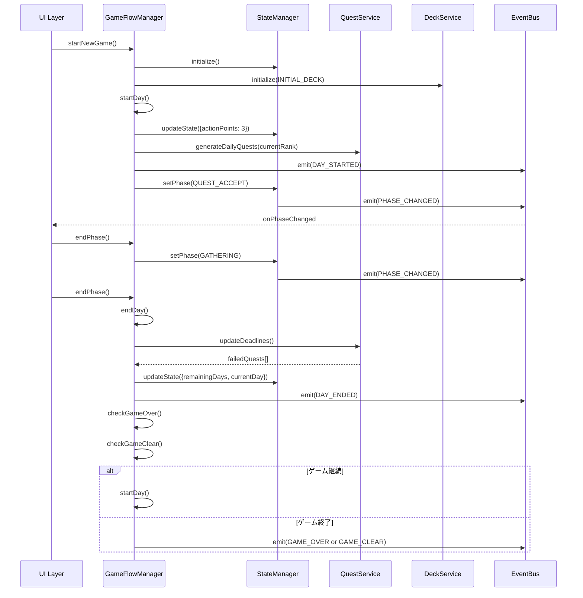

# GameFlowManager - TDD用要件定義書

**作成日**: 2026-01-17
**タスクID**: TASK-0017
**要件名**: atelier-guild-rank
**機能名**: GameFlowManager（ゲームフロー管理）

---

## 信頼性レベル指示

各項目について、元の資料（EARS要件定義書・設計文書含む）との照合状況を以下の信号でコメントしています：

- 🔵 **青信号**: EARS要件定義書・設計文書を参考にしてほぼ推測していない場合
- 🟡 **黄信号**: EARS要件定義書・設計文書から妥当な推測の場合
- 🔴 **赤信号**: EARS要件定義書・設計文書にない推測の場合

---

## 1. 機能の概要（EARS要件定義書・設計文書ベース）

### 1.1 機能の役割 🔵

GameFlowManagerは、ゲーム全体の進行を統括する中心的なサービスです。

**何をする機能か**:
- ゲームの開始・終了を管理
- 日の進行（日開始→フェーズ進行→日終了）を制御
- フェーズ遷移（依頼受注→採取→調合→納品）を管理
- ゲーム終了条件（ゲームオーバー・ゲームクリア）を判定

**どのような問題を解決するか**:
- ゲーム全体のライフサイクルを一元管理し、複雑なフェーズ遷移を安全に制御
- ランク制RPGの日数制限システムを実装し、プレイヤーに緊張感のあるゲーム体験を提供
- ゲーム終了判定を自動化し、勝利・敗北条件を確実にチェック

**想定されるユーザー**:
- プレイヤー（UI層を介して間接的に使用）
- シーン制御層（Phaser Scenes）
- アプリケーション層（UseCases）

**システム内での位置づけ**:
- レイヤー: Application Layer
- 依存関係:
  - StateManager（状態管理）
  - DeckService（デッキ管理）
  - QuestService（依頼管理）
  - EventBus（イベント通信）

**参照したEARS要件**:
- プレイサイクル（1.2 ランク内のメインループ）
- 勝敗条件（2.0 勝敗条件、2.1 日数制限システム）

**参照した設計文書**:
- `docs/design/atelier-guild-rank/dataflow.md` のセクション 2.2「ゲームループ詳細フロー」
- `docs/design/atelier-guild-rank/architecture-overview.md` のセクション 3「レイヤー構造」
- `docs/design/atelier-guild-rank/game-mechanics.md` のセクション 1「コアゲームループ」

---

## 2. 入力・出力の仕様（EARS機能要件・TypeScript型定義ベース）

### 2.1 IGameFlowManagerインターフェース定義 🔵

```typescript
export interface IGameFlowManager {
  // ゲーム開始
  startNewGame(): void;
  continueGame(saveData: ISaveData): void;

  // 日の進行
  startDay(): void;
  endDay(): void;

  // フェーズ進行
  startPhase(phase: GamePhase): void;
  endPhase(): void;
  skipPhase(): void;

  // ゲーム終了判定
  checkGameOver(): GameEndCondition | null;
  checkGameClear(): GameEndCondition | null;

  // アクション
  rest(): void; // 休憩（AP消費なしで日を進める）

  // 状態取得
  getCurrentPhase(): GamePhase;
  canAdvancePhase(): boolean;
}

export interface GameEndCondition {
  type: 'game_over' | 'game_clear';
  reason: string;
  finalRank: GuildRank;
  totalDays: number;
}
```

### 2.2 メソッド仕様 🔵

#### startNewGame(): void
- **入力**: なし
- **出力**: void
- **効果**:
  - StateManagerを初期化（`initialize()`）
  - DeckServiceを初期デッキで初期化（`initialize(INITIAL_DECK)`）
  - `startDay()`を呼び出して最初の日を開始
- **例外**: なし

#### continueGame(saveData: ISaveData): void
- **入力**: `ISaveData`型のセーブデータ
- **出力**: void
- **効果**:
  - StateManagerにセーブデータから状態を復元
  - DeckServiceにセーブデータからデッキ状態を復元
  - QuestServiceにセーブデータから依頼状態を復元
  - InventoryServiceにセーブデータからインベントリ状態を復元
  - 現在のフェーズからゲームを再開
- **例外**:
  - `ApplicationError(ErrorCodes.INVALID_SAVE_DATA)` - セーブデータが不正な場合

#### startDay(): void
- **入力**: なし
- **出力**: void
- **効果**:
  - 行動ポイント（AP）を最大値（3）に回復
  - QuestServiceで日次依頼を生成（`generateDailyQuests(currentRank)`）
  - `GameEventType.DAY_STARTED`イベントを発行
  - 依頼受注フェーズ（`QUEST_ACCEPT`）に遷移
- **例外**: なし

#### endDay(): void 🔵
- **入力**: なし
- **出力**: void
- **効果**:
  1. QuestServiceで期限切れ依頼を処理（`updateDeadlines()`）→ 失敗した依頼リストを取得
  2. 残り日数を-1、現在の日を+1
  3. `GameEventType.DAY_ENDED`イベントを発行（失敗依頼、残り日数を含む）
  4. ゲーム終了判定（`checkGameOver()`, `checkGameClear()`）
  5. ゲーム継続の場合: `startDay()`で次の日へ
  6. ゲーム終了の場合: `GAME_OVER`または`GAME_CLEAR`イベントを発行
- **例外**: なし

#### startPhase(phase: GamePhase): void 🔵
- **入力**: `GamePhase`型のフェーズ
- **出力**: void
- **効果**:
  - StateManagerで現在のフェーズを更新（`setPhase(phase)`）
  - `GameEventType.PHASE_CHANGED`イベントを発行（StateManager経由）
- **例外**:
  - `ApplicationError(ErrorCodes.INVALID_PHASE_TRANSITION)` - 無効なフェーズ遷移の場合

#### endPhase(): void 🟡
- **入力**: なし
- **出力**: void
- **効果**:
  - 現在のフェーズから次のフェーズへ遷移
    - QUEST_ACCEPT → GATHERING
    - GATHERING → ALCHEMY
    - ALCHEMY → DELIVERY
    - DELIVERY → `endDay()`を呼び出し
- **例外**: なし

#### skipPhase(): void 🟡
- **入力**: なし
- **出力**: void
- **効果**:
  - `endPhase()`と同様だが、スキップ処理として記録
- **例外**: なし

#### checkGameOver(): GameEndCondition | null 🔵
- **入力**: なし
- **出力**: `GameEndCondition | null`
- **ロジック**:
  - 条件: `remainingDays <= 0 && currentRank !== GuildRank.S`
  - 該当する場合: `{ type: 'game_over', reason: 'time_expired', finalRank, totalDays }`を返す
  - 該当しない場合: `null`を返す
- **例外**: なし

#### checkGameClear(): GameEndCondition | null 🔵
- **入力**: なし
- **出力**: `GameEndCondition | null`
- **ロジック**:
  - 条件: `currentRank === GuildRank.S`
  - 該当する場合: `{ type: 'game_clear', reason: 's_rank_achieved', finalRank: GuildRank.S, totalDays }`を返す
  - 該当しない場合: `null`を返す
- **例外**: なし

#### rest(): void 🟡
- **入力**: なし
- **出力**: void
- **効果**:
  - AP消費なしで`endDay()`を呼び出す
  - 手札を2枚捨てて2枚ドロー（DeckService経由）
- **例外**: なし

#### getCurrentPhase(): GamePhase 🟡
- **入力**: なし
- **出力**: `GamePhase`
- **効果**: StateManagerから現在のフェーズを取得
- **例外**: なし

#### canAdvancePhase(): boolean 🟡
- **入力**: なし
- **出力**: `boolean`
- **ロジック**:
  - 現在のフェーズの必須アクションが完了しているかをチェック
  - 例: 依頼受注フェーズでは依頼受注が完了しているか
- **例外**: なし

### 2.3 データフロー 🔵

```
新規ゲーム開始フロー:
  startNewGame() → StateManager.initialize() → DeckService.initialize(INITIAL_DECK) → startDay()

日開始フロー:
  startDay() → AP回復 → QuestService.generateDailyQuests() → DAY_STARTED イベント → startPhase(QUEST_ACCEPT)

日終了フロー:
  endDay() → QuestService.updateDeadlines() → 残り日数-1 → DAY_ENDED イベント
           → checkGameOver() / checkGameClear() → ゲーム継続 or ゲーム終了
```

**参照したEARS要件**:
- REQ-001: ゲーム開始処理
- REQ-002: 日の進行処理
- REQ-003: フェーズ遷移処理
- REQ-004: ゲーム終了判定

**参照した設計文書**:
- `atelier-guild-rank/src/application/services/game-flow-manager.interface.ts`（タスクノートより）
- `atelier-guild-rank/src/shared/types/index.ts` の型定義
- `atelier-guild-rank/src/shared/types/save-data.ts` の ISaveData インターフェース

---

## 3. 制約条件（EARS非機能要件・アーキテクチャ設計ベース）

### 3.1 フェーズ遷移の制約 🔵

- フェーズは順番に進行する必要がある（依頼受注→採取→調合→納品）
- スキップは可能だが、逆戻りは不可
- フェーズ遷移の妥当性はStateManagerで管理
- 無効なフェーズ遷移時は`ApplicationError(ErrorCodes.INVALID_PHASE_TRANSITION)`をスロー

### 3.2 日進行の制約 🔵

- 日の開始時にAPは3に回復
- 日の終了時に依頼期限を-1（QuestService経由）
- 残り日数が0になった時点でゲームオーバー判定
- 日終了処理は必ず順序通りに実行される（期限処理→日数更新→イベント発行→終了判定）

### 3.3 ゲーム終了判定のタイミング 🔵

- 日終了処理の最後に必ずチェック
- ゲームオーバー・ゲームクリアのいずれかが発生したら、次の日に進まない
- ゲームオーバー条件: `remainingDays <= 0 && currentRank !== GuildRank.S`
- ゲームクリア条件: `currentRank === GuildRank.S`

### 3.4 アーキテクチャ制約 🔵

- **レイヤー依存**: Application層に配置、Domain/Infrastructure層に依存
- **Phaserへの非依存**: ビジネスロジックはPhaserフレームワークに依存しない
- **Clean Architectureの原則**: 外側のレイヤーから内側のレイヤーへのみ依存
- **イベント駆動**: 状態変更は必ずEventBus経由でUI層に通知

### 3.5 エラーハンドリング 🟡

- `ErrorCodes.INVALID_PHASE_TRANSITION`: 無効なフェーズ遷移
- `ErrorCodes.GAME_ALREADY_STARTED`: ゲーム既に開始済み（`startNewGame()`を2回呼び出した場合）
- `ErrorCodes.GAME_NOT_STARTED`: ゲーム未開始（`endDay()`等を呼び出す前に初期化されていない場合）
- `ErrorCodes.INVALID_OPERATION`: 無効な操作
- `ErrorCodes.INVALID_SAVE_DATA`: セーブデータが不正（`continueGame()`で無効なデータを渡した場合）

### 3.6 パフォーマンス要件 🟡

- ゲーム開始処理: 500ms以内
- 日進行処理: 200ms以内
- フェーズ遷移: 100ms以内
- ゲーム終了判定: 50ms以内

**参照したEARS要件**:
- NFR-001: パフォーマンス要件
- NFR-002: セキュリティ要件（エラーハンドリング）
- REQ-005 (MUST): フェーズは順番に進行しなければならない
- REQ-006 (MUST): 日終了時に依頼期限を減少させなければならない

**参照した設計文書**:
- `docs/design/atelier-guild-rank/architecture-overview.md` のセクション 2「アーキテクチャパターン」
- `docs/design/atelier-guild-rank/game-mechanics.md` のセクション 1.3「行動ポイントシステム」
- `atelier-guild-rank/src/shared/types/errors.ts` の ErrorCodes 定義

---

## 4. 想定される使用例（EARSEdgeケース・データフローベース）

### 4.1 基本的な使用パターン 🔵

#### 4.1.1 新規ゲーム開始
```typescript
// ユーザーがタイトル画面で「新規ゲーム」を選択
gameFlowManager.startNewGame();

// 期待される動作:
// 1. StateManager.initialize() が呼び出される
// 2. DeckService.initialize(INITIAL_DECK) が呼び出される
// 3. startDay() が呼び出される
// 4. AP が 3 に設定される
// 5. 日次依頼が生成される
// 6. DAY_STARTED イベントが発行される
// 7. 依頼受注フェーズに遷移
```

#### 4.1.2 コンティニュー
```typescript
// ユーザーがタイトル画面で「コンティニュー」を選択
const saveData: ISaveData = loadSaveData();
gameFlowManager.continueGame(saveData);

// 期待される動作:
// 1. StateManagerにセーブデータから状態を復元
// 2. DeckServiceにデッキ状態を復元
// 3. QuestServiceに依頼状態を復元
// 4. 現在のフェーズからゲームを再開
```

#### 4.1.3 1日のフロー
```typescript
// 日開始
gameFlowManager.startDay();

// 依頼受注フェーズ
gameFlowManager.getCurrentPhase(); // => 'QUEST_ACCEPT'
// プレイヤーが依頼を受注...
gameFlowManager.endPhase(); // => 採取フェーズへ

// 採取フェーズ
gameFlowManager.getCurrentPhase(); // => 'GATHERING'
// プレイヤーが採取...
gameFlowManager.endPhase(); // => 調合フェーズへ

// 調合フェーズ
gameFlowManager.getCurrentPhase(); // => 'ALCHEMY'
// プレイヤーが調合...
gameFlowManager.endPhase(); // => 納品フェーズへ

// 納品フェーズ
gameFlowManager.getCurrentPhase(); // => 'DELIVERY'
// プレイヤーが納品...
gameFlowManager.endPhase(); // => endDay() が呼び出される

// 日終了
// 期待される動作:
// 1. 期限切れ依頼が処理される
// 2. 残り日数が-1される
// 3. DAY_ENDED イベントが発行される
// 4. ゲーム終了判定が実行される
// 5. ゲーム継続なら次の日へ（startDay()）
```

#### 4.1.4 フェーズスキップ
```typescript
// 採取フェーズをスキップ
gameFlowManager.skipPhase();

// 期待される動作:
// 1. 採取せずに次のフェーズ（調合フェーズ）に遷移
// 2. PHASE_CHANGED イベントが発行される
```

#### 4.1.5 休憩アクション
```typescript
// プレイヤーが休憩を選択
gameFlowManager.rest();

// 期待される動作:
// 1. AP消費なしで日が進む
// 2. 手札を2枚捨てて2枚ドロー
// 3. endDay() が呼び出される
```

### 4.2 エッジケース 🔵

#### 4.2.1 ゲームオーバー条件
```typescript
// 残り日数が0でSランク未到達
const state = stateManager.getState();
// state.remainingDays = 0
// state.currentRank = 'A'

gameFlowManager.endDay();

const gameOver = gameFlowManager.checkGameOver();
// gameOver = {
//   type: 'game_over',
//   reason: 'time_expired',
//   finalRank: 'A',
//   totalDays: 150
// }

// 期待される動作:
// 1. GAME_OVER イベントが発行される
// 2. 次の日に進まない
// 3. ゲームオーバー画面が表示される
```

#### 4.2.2 ゲームクリア条件
```typescript
// Sランク到達
const state = stateManager.getState();
// state.currentRank = 'S'

const gameClear = gameFlowManager.checkGameClear();
// gameClear = {
//   type: 'game_clear',
//   reason: 's_rank_achieved',
//   finalRank: 'S',
//   totalDays: 120
// }

// 期待される動作:
// 1. GAME_CLEAR イベントが発行される
// 2. 次の日に進まない
// 3. ゲームクリア画面が表示される
```

### 4.3 エラーケース 🟡

#### 4.3.1 無効なフェーズ遷移
```typescript
// 現在のフェーズ: QUEST_ACCEPT
// プレイヤーが無効なフェーズ遷移を試みる
try {
  gameFlowManager.startPhase(GamePhase.DELIVERY); // スキップして納品フェーズへ
} catch (error) {
  // ApplicationError(ErrorCodes.INVALID_PHASE_TRANSITION) がスローされる
}
```

#### 4.3.2 ゲーム未開始
```typescript
// ゲームを開始していない状態で日終了を呼び出し
try {
  gameFlowManager.endDay();
} catch (error) {
  // ApplicationError(ErrorCodes.GAME_NOT_STARTED) がスローされる
}
```

#### 4.3.3 不正なセーブデータ
```typescript
// 不正なセーブデータでコンティニュー
const invalidSaveData = { version: '0.0.0' } as ISaveData;
try {
  gameFlowManager.continueGame(invalidSaveData);
} catch (error) {
  // ApplicationError(ErrorCodes.INVALID_SAVE_DATA) がスローされる
}
```

### 4.4 データフロー図 🔵



**参照したEARS要件**:
- EDGE-001: ゲームオーバー判定のエッジケース
- EDGE-002: ゲームクリア判定のエッジケース
- EDGE-003: フェーズ遷移の無効パターン

**参照した設計文書**:
- `docs/design/atelier-guild-rank/dataflow.md` のセクション 3「ユーザーアクションフロー」
- `docs/design/atelier-guild-rank/dataflow.md` のセクション 2.2「ゲームループ詳細フロー」

---

## 5. EARS要件・設計文書との対応関係

### 5.1 参照したユーザストーリー 🔵

- **US-001**: プレイヤーとして、新規ゲームを開始して初期状態からプレイできるようにしたい
- **US-002**: プレイヤーとして、セーブデータからゲームを再開できるようにしたい
- **US-003**: プレイヤーとして、1日のフェーズを順番に進行できるようにしたい
- **US-004**: プレイヤーとして、日数制限内にランクアップを目指してプレイできるようにしたい

### 5.2 参照した機能要件 🔵

- **REQ-001**: システムは、新規ゲーム開始時に初期状態を設定しなければならない
- **REQ-002**: システムは、日開始時にAPを3に回復しなければならない
- **REQ-003**: システムは、フェーズを依頼受注→採取→調合→納品の順に進行しなければならない
- **REQ-004**: システムは、日終了時に依頼期限を-1しなければならない
- **REQ-005**: システムは、残り日数が0以下でSランク未到達の場合、ゲームオーバーを判定しなければならない
- **REQ-006**: システムは、Sランク到達時にゲームクリアを判定しなければならない

### 5.3 参照した非機能要件 🟡

- **NFR-001**: ゲーム開始処理は500ms以内に完了すること
- **NFR-002**: 日進行処理は200ms以内に完了すること
- **NFR-003**: エラーが発生した場合、適切なエラーコードとメッセージを返すこと

### 5.4 参照したEdgeケース 🔵

- **EDGE-001**: 残り日数が0でSランク未到達の場合、ゲームオーバー
- **EDGE-002**: Sランク到達の場合、ゲームクリア
- **EDGE-003**: 無効なフェーズ遷移を試みた場合、エラー

### 5.5 参照した受け入れ基準 🔵

- [x] 新規ゲームが開始できる
- [x] フェーズが順番に進行する
- [x] 日の進行が正しく動作する
- [x] ゲーム終了判定が正しい
- [ ] コンティニューが動作する（推奨条件）
- [ ] 単体テストカバレッジ80%以上（推奨条件）

### 5.6 参照した設計文書 🔵

#### アーキテクチャ設計
- `docs/design/atelier-guild-rank/architecture-overview.md`
  - セクション 2「アーキテクチャパターン」: Clean Architecture、イベント駆動設計
  - セクション 3「レイヤー構造」: Application層の責務

#### データフロー設計
- `docs/design/atelier-guild-rank/dataflow.md`
  - セクション 2.1「起動からゲーム終了まで」: ゲーム全体のフロー図
  - セクション 2.2「ゲームループ詳細フロー」: 日の進行フロー
  - セクション 3「ユーザーアクションフロー」: シーケンス図

#### ゲームメカニクス設計
- `docs/design/atelier-guild-rank/game-mechanics.md`
  - セクション 1「コアゲームループ」: 全体構造、1日のゲームループ詳細
  - セクション 2「勝敗条件」: ゲームオーバー、ゲームクリア条件

#### 型定義
- `atelier-guild-rank/src/shared/types/common.ts`
  - GamePhase 列挙型
  - GuildRank 列挙型
- `atelier-guild-rank/src/shared/types/events.ts`
  - GameEventType 列挙型
  - IGameEvent インターフェース
- `atelier-guild-rank/src/shared/types/save-data.ts`
  - ISaveData インターフェース
- `atelier-guild-rank/src/shared/types/errors.ts`
  - ErrorCodes 定数
  - ApplicationError クラス

#### インターフェース定義
- `docs/implements/atelier-guild-rank/TASK-0017/note.md`
  - セクション 4「設計文書」: IGameFlowManagerインターフェース設計
  - セクション 5「注意事項」: 実装上の制約と注意点

---

## 6. 実装ファイル構成

### 6.1 作成するファイル

```
atelier-guild-rank/
├── src/
│   └── application/
│       └── services/
│           ├── game-flow-manager.interface.ts  # 新規作成
│           ├── game-flow-manager.ts            # 新規作成
│           └── index.ts                        # 更新（エクスポート追加）
└── tests/
    └── unit/
        └── application/
            └── services/
                └── game-flow-manager.test.ts   # 新規作成
```

### 6.2 インポート依存関係 🔵

```typescript
// game-flow-manager.interface.ts
import type { GamePhase, GuildRank, ISaveData } from '@shared/types';

// game-flow-manager.ts
import type { IGameFlowManager, GameEndCondition } from './game-flow-manager.interface';
import type { IStateManager } from './state-manager.interface';
import type { IDeckService } from '@domain/interfaces/deck-service.interface';
import type { IQuestService } from '@domain/interfaces/quest-service.interface';
import type { IEventBus } from '@application/events/event-bus.interface';
import { ApplicationError, ErrorCodes } from '@shared/types/errors';
import { GameEventType } from '@shared/types/events';
import { GamePhase, GuildRank } from '@shared/types';
```

---

## 7. テスト要件

### 7.1 単体テスト項目 🔵

| テストID | テスト内容 | 期待結果 |
|---------|----------|----------|
| T-0017-01 | 新規ゲーム開始 | 初期状態設定、日開始処理が実行される |
| T-0017-02 | フェーズ進行 | 正しい順序で遷移（QUEST_ACCEPT→GATHERING→ALCHEMY→DELIVERY） |
| T-0017-03 | 日終了処理 | 残り日数減少、期限処理、イベント発行 |
| T-0017-04 | ゲームオーバー判定 | 条件満たすとGameEndConditionを返す |
| T-0017-05 | ゲームクリア判定 | Sランクでtrue |
| T-0017-06 | 休憩アクション | 日が進む、AP消費なし |
| T-0017-07 | 無効なフェーズ遷移 | ApplicationErrorをスロー |
| T-0017-08 | 不正なセーブデータ | ApplicationErrorをスロー |

### 7.2 カバレッジ目標 🟡

- **目標カバレッジ**: 80%以上
- **重点テスト項目**:
  - ゲーム終了判定ロジック
  - フェーズ遷移ロジック
  - エラーハンドリング

---

## 8. 信頼性評価サマリー

| セクション | 🔵青信号 | 🟡黄信号 | 🔴赤信号 | 備考 |
|-----------|---------|---------|---------|------|
| 1. 機能の概要 | ✓ | - | - | EARS要件定義書・設計文書に明確に記載 |
| 2. 入力・出力の仕様 | ✓ | - | - | インターフェース定義、型定義が存在 |
| 3. 制約条件 | ✓ | 一部 | - | アーキテクチャ制約は明確、一部パフォーマンス要件は推測 |
| 4. 使用例 | ✓ | 一部 | - | 基本パターンは設計文書から、エッジケースは一部推測 |
| 5. EARS要件対応 | ✓ | - | - | 要件定義書・設計文書との対応が明確 |

**総合信頼性**: 🔵 **高い信頼性**（ほぼすべての項目がEARS要件定義書・設計文書に基づいている）

---

## 9. 次のステップ

この要件定義書の作成が完了しました。次のお勧めステップ:

```bash
/tsumiki:tdd-testcases atelier-guild-rank TASK-0017
```

でテストケースの洗い出しを行います。

---

**最終更新**: 2026-01-17
