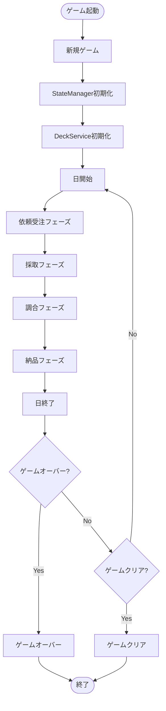
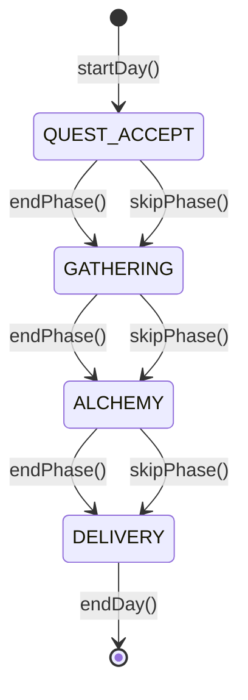
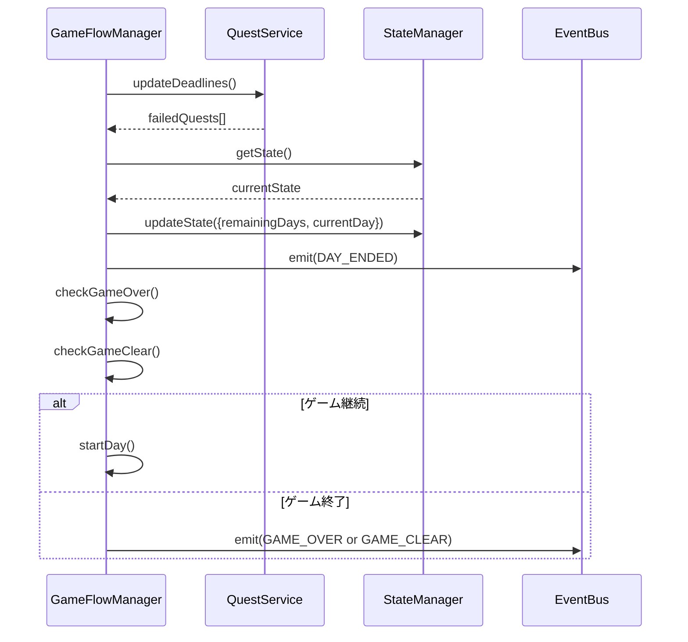

# TASK-0017: GameFlowManager実装 - 開発ノート

**作成日**: 2026-01-17
**タスクID**: TASK-0017
**要件名**: atelier-guild-rank
**フェーズ**: 2 - ドメイン層・コアサービス

---

## 1. 技術スタック

### 使用技術・フレームワーク
- **言語**: TypeScript 5.x
- **ゲームFW**: Phaser 3.87+
- **UIプラグイン**: rexUI（phaser3-rex-plugins 1.80+）
- **スタイリング**: Tailwind CSS 4.x
- **ビルド**: Vite 5.4.0
- **パッケージ管理**: pnpm 9.15.0
- **Lint/Format**: Biome 2.x
- **テスト**: Vitest 4.x（ユニットテスト）
- **E2Eテスト**: Playwright（最新）
- **Git Hooks**: Lefthook 2.x

### アーキテクチャパターン
- **Clean Architecture**: 4層構造（Presentation/Application/Domain/Infrastructure）
- **Entity-Based Design**: ドメインエンティティによるビジネスロジックのカプセル化
- **Service Layer Pattern**: ビジネスロジックをサービス層に集約
- **Repository Pattern**: データアクセスの抽象化
- **イベント駆動設計**: EventBusによる疎結合な通信

### 参照元
- `docs/design/atelier-guild-rank/architecture-overview.md`
- `docs/design/atelier-guild-rank/core-systems-core-services.md`
- `atelier-guild-rank/package.json`
- `CLAUDE.md`

---

## 2. 開発ルール

### プロジェクト固有ルール
- **応答は日本語で行う**
- **ずんだもん口調で喋る**（語尾は「なのだ。」）
- **Clean Architectureの原則に従う**
  - Domain/Application層はPhaserに依存しない
  - ビジネスロジックはフレームワークに依存しない
  - インターフェースはdomain/interfacesに配置
  - サービス実装はApplication層に配置
- **Biomeによる一貫したコードスタイル**
- **Lefthookによるコミット前の品質チェック自動化**

### コーディング規約
- **エクスポート形式**: 名前付きエクスポートを使用
- **エラーハンドリング**: ApplicationErrorを使用し、ErrorCodesで定義されたコードを使う
- **型安全性**: 厳密な型定義、unknown型の使用
- **不変性**: 状態更新時は新しいオブジェクトを作成（スプレッド演算子など）
- **クラス名**: PascalCase（例: `GameFlowManager`, `PhaseManager`）
- **インターフェース名**: `I`プレフィックスを使用（例: `IGameFlowManager`）
- **型定義の場所**: `src/shared/types/` に集約
- **コメント規約**: JSDoc形式で記載

### 参照元
- `CLAUDE.md`
- `docs/design/atelier-guild-rank/architecture-overview.md`
- `docs/design/atelier-guild-rank/core-systems-core-services.md`

---

## 3. 関連実装

### 類似機能の実装例

#### TASK-0005: StateManager実装（完了済み、参考にできる）
- **インターフェース**: `atelier-guild-rank/src/application/services/state-manager.interface.ts`
  - ゲーム状態の一元管理
  - フェーズ遷移管理
  - リソース管理（AP、ゴールド）
  - 日進行処理
- **実装**: `atelier-guild-rank/src/application/services/state-manager.ts`
  - コンストラクタでEventBusを注入
  - イベント発行によるUI連携
  - 状態変更時の自動通知

#### TASK-0009: DeckService実装（完了済み、参考にできる）
- **サービス実装**: `atelier-guild-rank/src/application/services/deck-service.ts`
  - インターフェースを実装
  - コンストラクタで依存注入
  - イベント発行によるUI連携
  - 初期化処理（initialize()メソッド）

#### TASK-0013: QuestService実装（完了済み、参考にできる）
- **サービス実装**: `atelier-guild-rank/src/application/services/quest-service.ts`
  - 日次依頼生成（generateDailyQuests()）
  - 依頼受注・キャンセル
  - 納品処理
  - 期限管理（updateDeadlines()）
  - イベント発行によるUI連携

#### TASK-0014: RankService実装（完了済み、参考にできる）
- **サービス実装**: `atelier-guild-rank/src/application/services/rank-service.ts`
  - ランク管理
  - 昇格判定（canPromote()）
  - 昇格処理（promote()）
  - 昇格試験管理

#### 既存のEventBus実装（参考パターン）
- **ファイル**: `atelier-guild-rank/src/application/events/event-bus.ts`
- **実装パターン**:
  - インターフェースを`src/application/events/event-bus.interface.ts`に定義
  - 実装を`src/application/events/event-bus.ts`に配置
  - 型安全なイベント発行・購読

### 参照元
- `atelier-guild-rank/src/application/services/state-manager.ts`
- `atelier-guild-rank/src/application/services/state-manager.interface.ts`
- `atelier-guild-rank/src/application/services/quest-service.ts`
- `atelier-guild-rank/src/application/services/deck-service.ts`
- `atelier-guild-rank/src/application/services/rank-service.ts`

---

## 4. 設計文書

### GameFlowManager概要 🔵

#### 責務
GameFlowManagerは、ゲーム全体の進行を統括する中心的なサービスです。

- **ゲーム開始・終了**: 新規ゲーム開始、コンティニュー、ゲーム終了判定
- **日の進行**: 日開始・日終了処理
- **フェーズ進行**: 依頼受注→採取→調合→納品のフェーズ遷移
- **ゲーム終了判定**: ゲームオーバー・ゲームクリア条件のチェック

### IGameFlowManagerインターフェース設計 🔵

```typescript
export interface IGameFlowManager {
  // ゲーム開始
  startNewGame(): void;
  continueGame(saveData: SaveData): void;

  // 日の進行
  startDay(): void;
  endDay(): void;

  // フェーズ進行
  startPhase(phase: GamePhase): void;
  endPhase(): void;
  skipPhase(): void;

  // ゲーム終了判定
  checkGameOver(): GameEndCondition | null;
  checkGameClear(): GameEndCondition | null;

  // アクション
  rest(): void; // 休憩（AP消費なしで日を進める）

  // 状態取得
  getCurrentPhase(): GamePhase;
  canAdvancePhase(): boolean;
}

export interface GameEndCondition {
  type: 'game_over' | 'game_clear';
  reason: string;
  finalRank: GuildRank;
  totalDays: number;
}
```

### フェーズ進行ロジック 🔵

```
日開始
  ↓
依頼受注フェーズ
  ↓
採取フェーズ
  ↓
調合フェーズ
  ↓
納品フェーズ
  ↓
日終了（期限チェック、ゲーム終了判定）
  ↓
次の日へ or ゲーム終了
```

### GameFlowManager実装設計 🔵

#### コンストラクタ
```typescript
constructor(
  private stateManager: IStateManager,
  private deckService: IDeckService,
  private questService: IQuestService,
  private eventBus: IEventBus,
) {}
```

#### 新規ゲーム開始
```typescript
startNewGame(): void {
  this.stateManager.initialize();
  this.deckService.initialize(INITIAL_DECK);
  this.startDay();
}
```

#### 日開始処理
```typescript
startDay(): void {
  this.stateManager.updateState({
    actionPoints: this.stateManager.getState().maxActionPoints,
  });
  this.questService.generateDailyQuests(
    this.stateManager.getState().currentRank
  );
  this.eventBus.emit(GameEventType.DAY_STARTED, {
    day: this.stateManager.getState().currentDay,
  });
  this.startPhase('quest_accept');
}
```

#### 日終了処理
```typescript
endDay(): void {
  // 期限切れ依頼処理
  const failedQuests = this.questService.updateDeadlines();

  // 残り日数減少
  const state = this.stateManager.getState();
  this.stateManager.updateState({
    remainingDays: state.remainingDays - 1,
    currentDay: state.currentDay + 1,
  });

  this.eventBus.emit(GameEventType.DAY_ENDED, {
    failedQuests,
    remainingDays: state.remainingDays - 1,
  });

  // ゲーム終了判定
  const gameOver = this.checkGameOver();
  const gameClear = this.checkGameClear();

  if (!gameOver && !gameClear) {
    this.startDay();
  }
}
```

### ゲーム終了条件 🔵

#### ゲームオーバー
- 残り日数が0以下でSランク未到達

```typescript
checkGameOver(): GameEndCondition | null {
  const state = this.stateManager.getState();

  if (state.remainingDays <= 0 && state.currentRank !== GuildRank.S) {
    return {
      type: 'game_over',
      reason: 'time_expired',
      finalRank: state.currentRank,
      totalDays: state.currentDay,
    };
  }

  return null;
}
```

#### ゲームクリア
- Sランク到達

```typescript
checkGameClear(): GameEndCondition | null {
  const state = this.stateManager.getState();

  if (state.currentRank === GuildRank.S) {
    return {
      type: 'game_clear',
      reason: 's_rank_achieved',
      finalRank: GuildRank.S,
      totalDays: state.currentDay,
    };
  }

  return null;
}
```

### 参照元
- `docs/spec/atelier-guild-rank-requirements.md`
- `docs/design/atelier-guild-rank/dataflow.md`
- `docs/design/atelier-guild-rank/game-mechanics.md`
- `docs/tasks/atelier-guild-rank/phase-2/TASK-0017.md`

---

## 5. 注意事項

### 技術的制約

#### フェーズ遷移の制約
- フェーズは順番に進行する必要がある（依頼受注→採取→調合→納品）
- スキップは可能だが、逆戻りは不可
- フェーズ遷移の妥当性はStateManagerで管理

#### 日進行の制約
- 日の開始時にAPは3に回復
- 日の終了時に依頼期限を-1
- 残り日数が0になった時点でゲームオーバー判定

#### ゲーム終了判定のタイミング
- 日終了処理の最後に必ずチェック
- ゲームオーバー・ゲームクリアのいずれかが発生したら、次の日に進まない

### エラーハンドリング

#### エラーコード
- `ErrorCodes.INVALID_PHASE_TRANSITION`: 無効なフェーズ遷移
- `ErrorCodes.GAME_ALREADY_STARTED`: ゲーム既に開始済み
- `ErrorCodes.GAME_NOT_STARTED`: ゲーム未開始
- `ErrorCodes.INVALID_OPERATION`: 無効な操作

### 実装上の注意

#### StateManagerとの連携
- StateManagerを介してゲーム状態を更新
- フェーズ遷移はStateManager.setPhase()を使用
- 日進行はStateManager.advanceDay()を使用

#### QuestServiceとの連携
- 日開始時にQuestService.generateDailyQuests()で依頼生成
- 日終了時にQuestService.updateDeadlines()で期限管理

#### DeckServiceとの連携
- ゲーム開始時にDeckService.initialize()でデッキ初期化
- 日終了時にDeckService.refillHand()で手札補充

#### イベント発行
- DAY_STARTED: 日開始時
- DAY_ENDED: 日終了時
- PHASE_CHANGED: フェーズ変更時（StateManager経由）
- GAME_OVER: ゲームオーバー時
- GAME_CLEAR: ゲームクリア時

### テスト要件（タスク定義より）

| テストID | テスト内容 | 期待結果 |
|---------|----------|----------|
| T-0017-01 | 新規ゲーム開始 | 初期状態設定 |
| T-0017-02 | フェーズ進行 | 正しい順序で遷移 |
| T-0017-03 | 日終了処理 | 残り日数減少 |
| T-0017-04 | ゲームオーバー判定 | 条件満たすとtrue |
| T-0017-05 | ゲームクリア判定 | Sランクでtrue |
| T-0017-06 | 休憩アクション | 日が進む、AP消費なし |

### 参照元
- `docs/design/atelier-guild-rank/game-mechanics.md`
- `docs/design/atelier-guild-rank/dataflow.md`
- `docs/tasks/atelier-guild-rank/phase-2/TASK-0017.md`

---

## 6. 実装ファイル一覧

### 作成するファイル

#### インターフェース
- `atelier-guild-rank/src/application/services/game-flow-manager.interface.ts` - **新規**

#### 実装
- `atelier-guild-rank/src/application/services/game-flow-manager.ts` - **新規**

#### インデックスファイル
- `atelier-guild-rank/src/application/services/index.ts` - **更新**（IGameFlowManager、GameFlowManagerエクスポート追加）

#### テスト
- `atelier-guild-rank/tests/unit/application/services/game-flow-manager.test.ts` - **新規**

### 参照元
- `docs/tasks/atelier-guild-rank/phase-2/TASK-0017.md`

---

## 7. 依存関係

### タスク依存
- **依存元**:
  - TASK-0005（StateManager実装） - **完了済み**
  - TASK-0009（カードエンティティ・DeckService実装） - **完了済み**
  - TASK-0011（GatheringService実装） - **完了済み**
  - TASK-0012（AlchemyService実装） - **完了済み**
  - TASK-0013（QuestService実装） - **完了済み**

### インポート依存

```typescript
// インターフェース（game-flow-manager.interface.ts）
import type { GamePhase, GuildRank, ISaveData } from '@shared/types';

// 実装（game-flow-manager.ts）
import type { IGameFlowManager, GameEndCondition } from './game-flow-manager.interface';
import type { IStateManager } from './state-manager.interface';
import type { IDeckService } from '@domain/interfaces/deck-service.interface';
import type { IQuestService } from '@domain/interfaces/quest-service.interface';
import type { IEventBus } from '@application/events/event-bus.interface';
import { ApplicationError, ErrorCodes } from '@shared/types/errors';
import { GameEventType } from '@shared/types/events';
import { GamePhase, GuildRank } from '@shared/types';
```

### 参照元
- `docs/tasks/atelier-guild-rank/phase-2/TASK-0017.md`

---

## 8. 実装チェックリスト

### 必須実装（信頼性レベル: 🔵）
- [ ] IGameFlowManagerインターフェース定義
  - [ ] startNewGame()メソッド
  - [ ] continueGame()メソッド
  - [ ] startDay()メソッド
  - [ ] endDay()メソッド
  - [ ] startPhase()メソッド
  - [ ] endPhase()メソッド
  - [ ] skipPhase()メソッド
  - [ ] checkGameOver()メソッド
  - [ ] checkGameClear()メソッド
  - [ ] rest()メソッド
  - [ ] getCurrentPhase()メソッド
  - [ ] canAdvancePhase()メソッド
- [ ] GameEndCondition型定義
- [ ] GameFlowManager実装
  - [ ] コンストラクタ（依存注入）
  - [ ] startNewGame()実装
  - [ ] continueGame()実装
  - [ ] startDay()実装
  - [ ] endDay()実装
  - [ ] startPhase()実装
  - [ ] endPhase()実装
  - [ ] skipPhase()実装
  - [ ] checkGameOver()実装
  - [ ] checkGameClear()実装
  - [ ] rest()実装
  - [ ] getCurrentPhase()実装
  - [ ] canAdvancePhase()実装
- [ ] 単体テスト
  - [ ] T-0017-01: 新規ゲーム開始
  - [ ] T-0017-02: フェーズ進行
  - [ ] T-0017-03: 日終了処理
  - [ ] T-0017-04: ゲームオーバー判定
  - [ ] T-0017-05: ゲームクリア判定
  - [ ] T-0017-06: 休憩アクション

### 推奨実装（信頼性レベル: 🟡）
- [ ] コンティニュー機能の完全実装
- [ ] エラーハンドリングの充実
- [ ] テストカバレッジ80%以上
- [ ] イベント発行の完全実装

---

## 9. 実装の流れ

1. **IGameFlowManagerインターフェースの定義**
   - `src/application/services/game-flow-manager.interface.ts`を作成
   - GameEndCondition型を定義
   - メソッドシグネチャを定義

2. **GameFlowManagerの実装**
   - `src/application/services/game-flow-manager.ts`を作成
   - コンストラクタと依存注入
   - 各メソッドを実装
     1. startNewGame()
     2. continueGame()
     3. startDay()
     4. endDay()
     5. startPhase()
     6. endPhase()
     7. skipPhase()
     8. checkGameOver()
     9. checkGameClear()
     10. rest()
     11. getCurrentPhase()
     12. canAdvancePhase()
   - `src/application/services/index.ts`にエクスポート追加

3. **テストの実装**
   - `tests/unit/application/services/game-flow-manager.test.ts`を作成
   - 全テストケース実装
   - カバレッジ確認

4. **動作確認**
   - `pnpm test`でユニットテスト実行
   - `pnpm lint`でコード品質確認

---

## 10. 参考リンク

### 設計文書
- ゲームメカニクス設計: `docs/design/atelier-guild-rank/game-mechanics.md`
- データフロー設計: `docs/design/atelier-guild-rank/dataflow.md`
- アーキテクチャ設計: `docs/design/atelier-guild-rank/architecture-overview.md`

### タスク定義
- TASK-0017定義: `docs/tasks/atelier-guild-rank/phase-2/TASK-0017.md`
- TASK-0005定義: `docs/tasks/atelier-guild-rank/phase-2/TASK-0005.md`

### 要件定義
- 要件定義書: `docs/spec/atelier-guild-rank-requirements.md`

### 既存実装
- StateManager: `atelier-guild-rank/src/application/services/state-manager.ts`
- QuestService: `atelier-guild-rank/src/application/services/quest-service.ts`
- DeckService: `atelier-guild-rank/src/application/services/deck-service.ts`
- RankService: `atelier-guild-rank/src/application/services/rank-service.ts`
- EventBus: `atelier-guild-rank/src/application/events/event-bus.ts`

### テスト参考
- StateManagerテスト: `atelier-guild-rank/tests/unit/application/services/state-manager.test.ts`
- QuestServiceテスト: `atelier-guild-rank/tests/unit/application/services/quest-service.test.ts`

---

## 11. 補足情報

### ゲーム全体のフロー図



### フェーズ遷移の状態図



### 日終了処理のシーケンス図



### 実装の具体例（startDay）

```typescript
startDay(): void {
  // APを最大値に回復
  const maxAP = this.stateManager.getState().maxActionPoints || 3;
  this.stateManager.updateState({
    actionPoints: maxAP,
  });

  // 日次依頼を生成
  const currentRank = this.stateManager.getState().currentRank;
  this.questService.generateDailyQuests(currentRank);

  // DAY_STARTEDイベント発行
  this.eventBus.emit(GameEventType.DAY_STARTED, {
    day: this.stateManager.getState().currentDay,
    remainingDays: this.stateManager.getState().remainingDays,
  });

  // 依頼受注フェーズに遷移
  this.stateManager.setPhase(GamePhase.QUEST_ACCEPT);
}
```

### 実装の具体例（endDay）

```typescript
endDay(): void {
  // 期限切れ依頼処理
  const failedQuests = this.questService.updateDeadlines();

  // 残り日数減少、日数増加
  const state = this.stateManager.getState();
  this.stateManager.updateState({
    remainingDays: state.remainingDays - 1,
    currentDay: state.currentDay + 1,
  });

  // DAY_ENDEDイベント発行
  this.eventBus.emit(GameEventType.DAY_ENDED, {
    failedQuests,
    remainingDays: state.remainingDays - 1,
    currentDay: state.currentDay + 1,
  });

  // ゲーム終了判定
  const gameOver = this.checkGameOver();
  const gameClear = this.checkGameClear();

  if (gameOver) {
    this.eventBus.emit(GameEventType.GAME_OVER, gameOver);
  } else if (gameClear) {
    this.eventBus.emit(GameEventType.GAME_CLEAR, gameClear);
  } else {
    // 次の日へ
    this.startDay();
  }
}
```

---

**最終更新**: 2026-01-17
