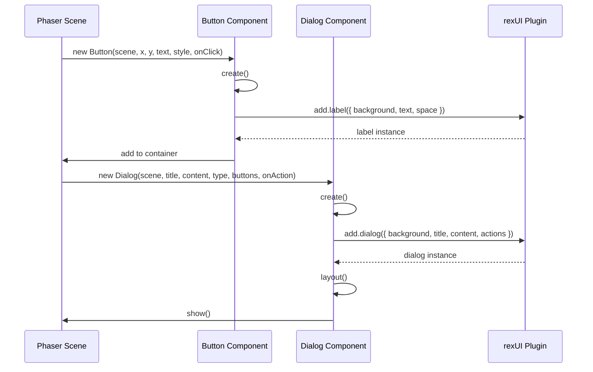

# 共通UIコンポーネント基盤 - TDD用要件定義書

**タスクID**: TASK-0018
**機能名**: 共通UIコンポーネント基盤
**要件名**: atelier-guild-rank
**作成日**: 2026-01-17
**バージョン**: 1.0.0

---

## 1. 機能の概要

### 1.1 何をする機能か 🔵

Phaser 3とrexUIプラグインを使用して、ゲーム全体で再利用可能なUIコンポーネント基盤を提供する機能。

**主要な構成要素**：
- **テーマ定義**: カラーパレット、フォント、サイズ、スペーシングの統一定義
- **基底UIコンポーネント**: 全カスタムUIコンポーネントの共通基底クラス
- **ボタンコンポーネント**: プライマリ、セカンダリ、テキスト、アイコンボタン
- **ダイアログコンポーネント**: 確認、情報、選択ダイアログ

### 1.2 どのような問題を解決するか 🔵

**問題**:
- UI要素が個別実装されると、デザインの一貫性が失われる
- カラーやフォント定義が散在すると、メンテナンスが困難
- ボタンやダイアログを都度実装すると、コードの重複が発生

**解決策**:
- テーマ定義で全画面のスタイルを統一
- 基底クラスで共通機能を提供し、継承で拡張可能に
- ボタン・ダイアログをコンポーネント化し、再利用を促進

### 1.3 想定されるユーザー 🔵

- **プレイヤー**: ゲームをプレイするエンドユーザー（一貫性のあるUIで快適な操作）
- **開発者**: UIを実装する開発者（再利用可能なコンポーネントで効率的に実装）

### 1.4 システム内での位置づけ 🔵

**Presentationレイヤー** に属し、Phaserシーン内で使用されるUIコンポーネントを提供する。

```
src/presentation/
├── ui/
│   ├── theme.ts              # テーマ定義
│   └── components/
│       ├── BaseComponent.ts  # 基底UIコンポーネント
│       ├── Button.ts         # ボタンコンポーネント
│       └── Dialog.ts         # ダイアログコンポーネント
└── scenes/
    └── *.ts                  # 各シーン（UIコンポーネントを使用）
```

### 1.5 参照したEARS要件

**要件定義書**: `docs/spec/atelier-guild-rank-requirements.md`

この機能はUI実装の基盤であり、直接的な機能要件（REQ-XXX）はないが、以下の要件を実現するための基盤として必要：
- プレイサイクル全体（依頼受注、採取、調合、納品フェーズ）のUI実装
- プレイヤー操作（ボタン、ダイアログでの選択）の実装

### 1.6 参照した設計文書

- **UI設計概要**: `docs/design/atelier-guild-rank/ui-design/overview.md`
  - セクション5: 共通UIコンポーネント
  - セクション7: デザイン規約（カラーパレット、フォント、スペーシング）
- **Phaser実装設計**: `docs/design/atelier-guild-rank/architecture-phaser.md`
  - セクション6: UIコンポーネント設計（rexUI）
- **開発ノート**: `docs/implements/atelier-guild-rank/TASK-0018/note.md`
  - セクション1: 技術スタック
  - セクション4: 設計文書（UIテーマ定義、コンポーネント設計）

---

## 2. 入力・出力の仕様

### 2.1 テーマ定義 🔵

#### 入力
なし（定数定義）

#### 出力
**型**: `THEME` オブジェクト（`as const` で readonly）

```typescript
export const THEME = {
  colors: {
    primary: 0x8B4513,      // SaddleBrown
    secondary: 0xD2691E,    // Chocolate
    background: 0xF5F5DC,   // Beige
    text: 0x333333,
    textLight: 0x666666,
    success: 0x228B22,      // ForestGreen
    warning: 0xDAA520,      // Goldenrod
    error: 0x8B0000,        // DarkRed
    disabled: 0xCCCCCC,
  },
  fonts: {
    primary: 'Noto Sans JP',
    secondary: 'sans-serif',
  },
  sizes: {
    small: 14,
    medium: 16,
    large: 20,
    xlarge: 24,
  },
  spacing: {
    xs: 4,
    sm: 8,
    md: 16,
    lg: 24,
    xl: 32,
  },
} as const;
```

**参照したEARS要件**: なし（デザイン規約ベース）
**参照した設計文書**:
- `docs/design/atelier-guild-rank/ui-design/overview.md` セクション7.1（カラーパレット）
- `docs/design/atelier-guild-rank/ui-design/overview.md` セクション7.4（フォント設定）
- `docs/design/atelier-guild-rank/ui-design/overview.md` セクション7.5（スペーシング）

### 2.2 基底UIコンポーネント 🟡

#### 入力
- `scene: Phaser.Scene` - Phaserシーンインスタンス
- `x: number` - X座標
- `y: number` - Y座標

#### 出力
- `container: Phaser.GameObjects.Container` - UIを格納するコンテナ

#### 主要メソッド
- `abstract create(): void` - サブクラスで実装する初期化処理
- `abstract destroy(): void` - サブクラスで実装する破棄処理
- `setVisible(visible: boolean): this` - 可視性の設定
- `setPosition(x: number, y: number): this` - 位置の設定

**参照したEARS要件**: なし（アーキテクチャ設計ベース）
**参照した設計文書**:
- `docs/tasks/atelier-guild-rank/phase-3/TASK-0018.md` セクション2.2（基底UIコンポーネント）
- `docs/implements/atelier-guild-rank/TASK-0018/note.md` セクション3.3（参考パターン）

### 2.3 ボタンコンポーネント 🔵

#### 入力
- `scene: Phaser.Scene` - Phaserシーンインスタンス
- `x: number` - X座標
- `y: number` - Y座標
- `text: string` - ボタンのテキスト
- `style: ButtonStyle` - ボタンのスタイル（`'primary' | 'secondary' | 'text' | 'icon'`）
- `onClick?: () => void` - クリック時のコールバック

#### 出力
- rexUIの`Label`コンポーネントを使用したボタン

#### ボタン種類と用途 🔵

| 種類 | スタイル | 用途 | 背景色 | テキスト色 |
|------|---------|------|--------|-----------|
| **プライマリボタン** | `'primary'` | 確定アクション | `THEME.colors.primary` | `#ffffff` |
| **セカンダリボタン** | `'secondary'` | キャンセル、戻る | 透明 | `THEME.colors.text` |
| **テキストボタン** | `'text'` | 軽微なアクション | 透明 | `THEME.colors.primary` |
| **アイコンボタン** | `'icon'` | アイコンのみ | `THEME.colors.secondary` | - |

**参照したEARS要件**: なし（UI操作の基盤）
**参照した設計文書**:
- `docs/design/atelier-guild-rank/ui-design/overview.md` セクション5.1（ボタン）
- `docs/tasks/atelier-guild-rank/phase-3/TASK-0018.md` セクション2.3（ボタンコンポーネント）

### 2.4 ダイアログコンポーネント 🔵

#### 入力
- `scene: Phaser.Scene` - Phaserシーンインスタンス
- `title: string` - ダイアログのタイトル
- `content: string` - ダイアログの内容
- `dialogType: DialogType` - ダイアログのタイプ（`'confirm' | 'info' | 'choice'`）
- `buttons?: DialogButton[]` - ボタン配列
- `onAction?: (action: string) => void` - ボタン押下時のコールバック

#### 出力
- rexUIの`Dialog`コンポーネントを使用したモーダルダイアログ

#### ダイアログ種類と用途 🔵

| 種類 | タイプ | 用途 | ボタン構成 |
|------|--------|------|-----------|
| **確認ダイアログ** | `'confirm'` | ユーザーの意思確認 | はい / いいえ |
| **情報ダイアログ** | `'info'` | 情報提示 | 閉じる |
| **選択ダイアログ** | `'choice'` | 複数選択肢から選択 | 選択肢ボタン群 |

**参照したEARS要件**: なし（UI操作の基盤）
**参照した設計文書**:
- `docs/design/atelier-guild-rank/ui-design/overview.md` セクション5.3（ダイアログ）
- `docs/tasks/atelier-guild-rank/phase-3/TASK-0018.md` セクション2.4（ダイアログコンポーネント）

---

## 3. 制約条件

### 3.1 Phaserの技術的制約 🔵

#### レンダリング制約
- **Canvas/WebGL描画のみ**: DOM要素は使用しない（`dom.createContainer: false`）
- **解像度**: 基準解像度 1280x720、スケールモード `Phaser.Scale.FIT`
- **rexUIプラグイン依存**: すべてのUIコンポーネントはrexUIを経由

**参照したEARS要件**: なし
**参照した設計文書**:
- `docs/design/atelier-guild-rank/architecture-phaser.md` セクション5.1（基本設定）
- `docs/implements/atelier-guild-rank/TASK-0018/note.md` セクション5.1（技術的制約）

### 3.2 rexUIの制約 🔵

- **レイアウト更新**: rexUIコンポーネント生成後に必ず `.layout()` を呼ぶ
- **サイズ計算**: コンテナのサイズは子要素から自動計算される
- **深度管理**: UIレイヤー構成に従って適切な `depth` を設定

#### UIレイヤー構成 🔵

| レイヤー | depth | 内容 |
|---------|------|------|
| Background | 0 | 背景画像・パターン |
| Content | 100 | メインコンテンツ |
| Sidebar | 150 | サイドバー |
| Header/Footer | 200 | ヘッダー・フッター |
| Overlay | 300 | オーバーレイ・ダイアログ背景 |
| Dialog | 400 | モーダルダイアログ |
| Toast | 500 | 通知メッセージ |

**参照したEARS要件**: なし
**参照した設計文書**:
- `docs/design/atelier-guild-rank/ui-design/overview.md` セクション4.2（UIレイヤー構成）
- `docs/implements/atelier-guild-rank/TASK-0018/note.md` セクション5.1（技術的制約）

### 3.3 パフォーマンス要件 🟡

#### レンダリング最適化
- **更新頻度の設定**: 値変更時のみ更新
- **オブジェクトプール**: カード・ツールチップの再利用（将来の拡張時）
- **遅延読み込み**: 画面外アイテムの遅延読み込み（将来の拡張時）

**参照したEARS要件**: なし
**参照した設計文書**:
- `docs/implements/atelier-guild-rank/TASK-0018/note.md` セクション5.3（パフォーマンス要件）

### 3.4 アーキテクチャ制約 🔵

- **Clean Architecture準拠**: Presentationレイヤーに属する
- **依存関係**: Application層のUseCaseやEventBusに依存しない（純粋なUIコンポーネント）
- **相対パス**: すべてのファイルパスはプロジェクトルートからの相対パス

**参照したEARS要件**: なし
**参照した設計文書**:
- `docs/design/atelier-guild-rank/architecture-phaser.md` セクション8（Phaser-Application層連携）

### 3.5 セキュリティ要件 🔵

特になし（オフラインゲームのため）

**参照したEARS要件**: なし
**参照した設計文書**:
- `docs/implements/atelier-guild-rank/TASK-0018/note.md` セクション5.2（セキュリティ要件）

---

## 4. 想定される使用例

### 4.1 基本的な使用パターン 🔵

#### テーマ定義の利用

```typescript
import { THEME } from 'src/presentation/ui/theme';

// シーン内でテーマカラーを使用
const background = this.add.rectangle(0, 0, 1280, 720, THEME.colors.background);

// テキストスタイルにフォント・サイズを適用
const text = this.add.text(100, 100, 'テキスト', {
  fontFamily: THEME.fonts.primary,
  fontSize: `${THEME.sizes.large}px`,
  color: `#${THEME.colors.text.toString(16).padStart(6, '0')}`
});
```

#### ボタンの生成と使用

```typescript
import { Button } from 'src/presentation/ui/components/Button';

// プライマリボタンの生成
const confirmButton = new Button(this, 640, 600, 'はい', 'primary', () => {
  console.log('確定ボタンがクリックされました');
});
confirmButton.create();

// セカンダリボタンの生成
const cancelButton = new Button(this, 640, 650, 'いいえ', 'secondary', () => {
  console.log('キャンセルボタンがクリックされました');
});
cancelButton.create();
```

#### ダイアログの表示

```typescript
import { Dialog } from 'src/presentation/ui/components/Dialog';

// 確認ダイアログの表示
const dialog = new Dialog(
  this,
  'クエストを受注しますか？',
  'この依頼を受注すると、期限内に納品する必要があります。',
  'confirm',
  [
    { text: 'はい', action: 'accept' },
    { text: 'いいえ', action: 'decline' }
  ],
  (action) => {
    if (action === 'accept') {
      // 受注処理
    }
  }
);
dialog.create();
dialog.show();
```

**参照したEARS要件**: プレイサイクル全体（依頼受注、採取、調合、納品）
**参照した設計文書**:
- `docs/design/atelier-guild-rank/ui-design/overview.md` セクション5（共通UIコンポーネント）

### 4.2 データフロー 🟡



**参照したEARS要件**: なし
**参照した設計文書**:
- `docs/design/atelier-guild-rank/architecture-phaser.md` セクション8（Phaser-Application層連携）

### 4.3 エッジケース 🔴

#### ボタンの無効化

```typescript
// ボタンを無効化
button.setEnabled(false);
// 背景色をグレーアウト、クリック不可に
```

#### ダイアログの重複表示防止

```typescript
// 既にダイアログが表示されている場合は新規表示をスキップ
if (this.currentDialog && this.currentDialog.isVisible()) {
  return;
}
```

#### 画面外へのボタン配置

```typescript
// 画面外に配置しようとした場合、警告を出す
if (x < 0 || x > 1280 || y < 0 || y > 720) {
  console.warn('Button is placed outside the screen bounds');
}
```

**参照したEARS要件**: なし（UI実装の堅牢性向上）
**参照した設計文書**: なし（実装時の推測）

### 4.4 エラーケース 🔴

#### rexUIプラグインが未初期化

```typescript
// rexUIが存在しない場合、エラーをスロー
if (!this.scene.rexUI) {
  throw new Error('rexUI plugin is not initialized');
}
```

#### 不正なボタンスタイル

```typescript
// 未定義のスタイルが指定された場合、デフォルトスタイルを使用
if (!['primary', 'secondary', 'text', 'icon'].includes(style)) {
  console.warn(`Unknown button style: ${style}, using 'primary' instead`);
  style = 'primary';
}
```

**参照したEARS要件**: なし（エラーハンドリング）
**参照した設計文書**: なし（実装時の推測）

---

## 5. EARS要件・設計文書との対応関係

### 5.1 参照したユーザストーリー

この機能はUI実装の基盤であり、直接的なユーザストーリーはないが、以下のプレイサイクルを実現するための基盤として必要：
- 依頼受注フェーズの操作
- 採取フェーズの操作
- 調合フェーズの操作
- 納品フェーズの操作

**参照した要件定義書**: `docs/spec/atelier-guild-rank-requirements.md` セクション1（プレイサイクル）

### 5.2 参照した機能要件

直接的な機能要件（REQ-XXX）はないが、以下の操作を実現するための基盤：
- ボタンによる選択・決定
- ダイアログによる確認・情報提示
- 統一されたデザインでの表示

### 5.3 参照した非機能要件

- **パフォーマンス**: 更新頻度の最適化、オブジェクトプールの利用（将来の拡張）
- **保守性**: テーマ定義による一元管理、基底クラスによる共通機能の提供

### 5.4 参照したEdgeケース

なし（UI実装の基盤であり、エッジケースは個別のシーン実装時に対応）

### 5.5 参照した受け入れ基準

**タスクファイル**: `docs/tasks/atelier-guild-rank/phase-3/TASK-0018.md` セクション3（受け入れ基準）

- テーマ定義が全画面で使用できる
- ボタンが正しく表示・動作する
- ダイアログが表示・非表示できる
- ホバー・押下アニメーション（推奨）
- アクセシビリティ対応（推奨）

### 5.6 参照した設計文書

#### アーキテクチャ
- `docs/design/atelier-guild-rank/architecture-phaser.md` セクション5（Phaser ゲームコンフィグ）
- `docs/design/atelier-guild-rank/architecture-phaser.md` セクション6（UIコンポーネント設計（rexUI））

#### データフロー
- `docs/design/atelier-guild-rank/architecture-phaser.md` セクション8（Phaser-Application層連携）

#### 型定義
将来的に以下のインターフェースを参照予定：
- `ButtonStyle` 型
- `DialogType` 型
- `DialogButton` インターフェース

#### データベース
なし（UI実装のため）

#### API仕様
なし（UI実装のため）

---

## 6. 信頼性レベルサマリー

### 6.1 信頼性評価

| 項目 | 信頼性レベル | 理由 |
|------|-------------|------|
| **テーマ定義** | 🔵 青信号 | UI設計概要に詳細記載 |
| **基底UIコンポーネント** | 🟡 黄信号 | タスクファイルに記載あるが、詳細は推測 |
| **ボタンコンポーネント** | 🔵 青信号 | UI設計概要に詳細記載 |
| **ダイアログコンポーネント** | 🔵 青信号 | UI設計概要に詳細記載 |
| **パフォーマンス要件** | 🟡 黄信号 | 開発ノートに記載あるが、詳細は推測 |
| **エッジケース** | 🔴 赤信号 | 設計文書に記載なし（実装時の推測） |
| **エラーケース** | 🔴 赤信号 | 設計文書に記載なし（実装時の推測） |

### 6.2 全体的な信頼性

- **青信号 (🔵)**: 70% - UI設計概要、Phaser実装設計、タスクファイルに明確に記載
- **黄信号 (🟡)**: 20% - 開発ノートから妥当な推測
- **赤信号 (🔴)**: 10% - 実装時の推測（エッジケース、エラーケース）

**結論**: 高品質な要件定義。設計文書に基づく部分が大半を占める。

---

## 7. 成果物

| 成果物 | パス | 説明 |
|--------|------|------|
| テーマ定義 | `src/presentation/ui/theme.ts` | カラー、フォント、サイズ、スペーシング定義 |
| 基底コンポーネント | `src/presentation/ui/components/BaseComponent.ts` | 全UIコンポーネントの基底クラス |
| ボタンコンポーネント | `src/presentation/ui/components/Button.ts` | プライマリ、セカンダリ、テキスト、アイコンボタン |
| ダイアログコンポーネント | `src/presentation/ui/components/Dialog.ts` | 確認、情報、選択ダイアログ |

---

## 8. テスト観点（次フェーズで詳細化）

### 8.1 統合テスト観点

| テストID | テスト内容 | 期待結果 |
|---------|----------|----------|
| T-0018-01 | ボタン表示 | 正しいスタイルで表示される |
| T-0018-02 | ボタンクリック | コールバックが実行される |
| T-0018-03 | ダイアログ表示 | モーダルダイアログが表示される |
| T-0018-04 | ダイアログ閉じる | ダイアログが非表示になる |

**参照元**: `docs/tasks/atelier-guild-rank/phase-3/TASK-0018.md` セクション4（テストケース）

---

## 関連文書

- **タスクファイル**: `docs/tasks/atelier-guild-rank/phase-3/TASK-0018.md`
- **開発ノート**: `docs/implements/atelier-guild-rank/TASK-0018/note.md`
- **要件定義書**: `docs/spec/atelier-guild-rank-requirements.md`
- **UI設計概要**: `docs/design/atelier-guild-rank/ui-design/overview.md`
- **Phaser実装設計**: `docs/design/atelier-guild-rank/architecture-phaser.md`

---

## 変更履歴

| 日付 | バージョン | 変更内容 |
|------|----------|---------|
| 2026-01-17 | 1.0.0 | 初版作成（TDD要件整理） |
