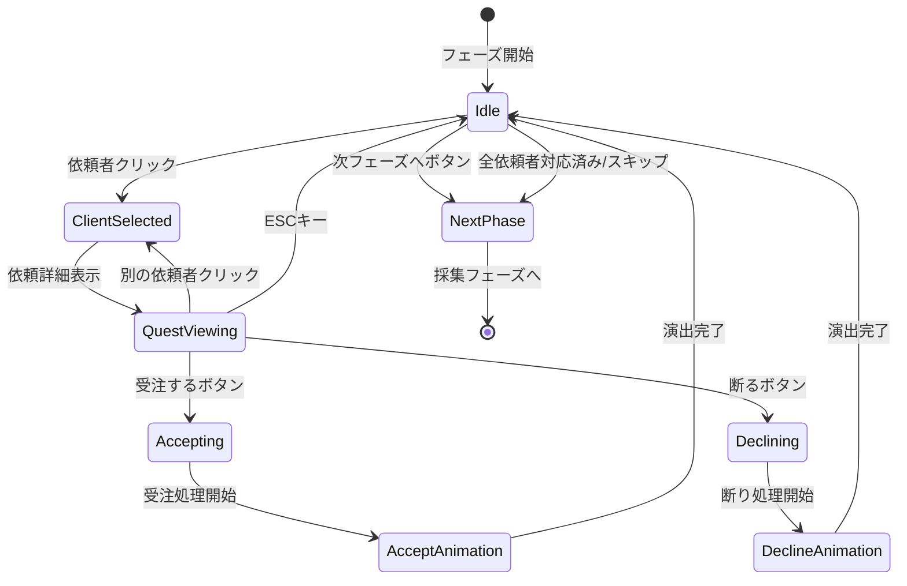

# TASK-0022: 依頼受注フェーズUI - TDDタスクノート

**作成日**: 2026-01-18
**タスクID**: TASK-0022
**タスク名**: 依頼受注フェーズUI
**見積時間**: 4時間（半日）
**担当レイヤー**: Presentation

---

## 1. 技術スタック

### 1.1 コア技術

| カテゴリ | 技術 | バージョン | 用途 |
|---------|------|-----------|------|
| **言語** | TypeScript | 5.7.0 | 型安全な開発 |
| **ゲームFW** | Phaser | 3.87+ | 2Dゲームエンジン |
| **UIプラグイン** | rexUI (phaser3-rex-plugins) | 1.80.0+ | ゲーム内UI（Canvas） |
| **ビルド** | Vite | 5.4.0+ | 高速ビルド・HMR |
| **テスト** | Vitest | 4.0.17 | ユニットテスト |

### 1.2 アーキテクチャパターン

| パターン | 説明 | 適用箇所 |
|---------|------|---------|
| **Clean Architecture** | 4層構造による責務分離 | 全体構造 |
| **Scene-based Architecture** | Phaserのシーン管理を活用 | Presentation層 |
| **イベント駆動設計** | EventBusによる疎結合な通信 | 層間通信 |
| **Component Pattern** | BaseComponentを継承した再利用可能なUI | UIコンポーネント |

### 1.3 パスエイリアス設定

```typescript
// vite.config.ts より
{
  '@domain': path.resolve(__dirname, './src/domain'),
  '@application': path.resolve(__dirname, './src/application'),
  '@infrastructure': path.resolve(__dirname, './src/infrastructure'),
  '@presentation': path.resolve(__dirname, './src/presentation'),
  '@shared': path.resolve(__dirname, './src/shared'),
}
```

---

## 2. 開発ルール

### 2.1 コーディング規約（Biome）

**設定ファイル**: `/home/user/atelier/atelier-guild-rank/biome.json`

| 項目 | 設定 |
|------|------|
| **Linter** | 有効、recommended ルール |
| **Formatter** | 有効、スペースインデント、幅2 |
| **行幅** | 100文字 |
| **クォート** | シングルクォート |
| **セミコロン** | 常に使用 |
| **トレイリングカンマ** | 常に使用 |

#### 特別なルール

- `noExplicitAny`: warn（anyは警告のみ、rexUIプラグインなど型定義がない場合に使用可能）
- `noForEach`: off（forEachの使用を許可）

### 2.2 テスト要件

| テスト種別 | ツール | カバレッジ目標 | 実施内容 |
|-----------|--------|---------------|----------|
| **ユニットテスト** | Vitest | 90%+ | コンポーネント単体テスト |
| **統合テスト** | Vitest | 80%+ | フェーズUI全体のテスト |

#### TDD開発フロー

1. **Red**: 失敗するテストケースを作成
2. **Green**: テストを通す最小限の実装
3. **Refactor**: コード品質改善、リファクタリング

### 2.3 コミット前チェック（Lefthook）

- Biomeによるリンター・フォーマッターチェック
- TypeScriptの型チェック
- ユニットテストの実行

---

## 3. 関連実装

### 3.1 既存のベースコンポーネント

#### BaseComponent (`/home/user/atelier/atelier-guild-rank/src/presentation/ui/components/BaseComponent.ts`)

**責務**:
- 全カスタムUIコンポーネントの共通基底クラス
- Phaserシーン、コンテナ、rexUIプラグインへのアクセスを提供

**主要メソッド**:
```typescript
abstract class BaseComponent {
  protected scene: Phaser.Scene;
  protected container: Phaser.GameObjects.Container;
  protected rexUI: any;

  constructor(scene: Phaser.Scene, x: number, y: number);
  abstract create(): void;
  abstract destroy(): void;
  setVisible(visible: boolean): this;
  setPosition(x: number, y: number): this;
}
```

**実装パターン**:
- コンストラクタで入力値検証（scene、座標の有効性確認）
- `create()`と`destroy()`をサブクラスで実装必須
- メソッドチェーン対応（`setVisible()`, `setPosition()`）

### 3.2 CardUIコンポーネント (`/home/user/atelier/atelier-guild-rank/src/presentation/ui/components/CardUI.ts`)

**責務**:
- カードの視覚的表現を提供
- カードタイプに応じた色分け、インタラクティブな操作、アニメーション効果

**設計パターン**:
```typescript
interface CardUIConfig {
  card: Card;
  x: number;
  y: number;
  interactive?: boolean;
  onClick?: (card: Card) => void;
}

class CardUI extends BaseComponent {
  private static readonly CARD_WIDTH = 120;
  private static readonly CARD_HEIGHT = 160;
  private static readonly ICON_SIZE = 80;
  private static readonly PADDING = 8;

  constructor(scene: Phaser.Scene, config: CardUIConfig);
  create(): void;
  destroy(): void;
}
```

**インタラクションパターン**:
- ホバー時: scale 1.1倍に拡大（100ms, Power2 easing）
- クリック時: `onClick` コールバック実行
- アニメーションはPhaserの`tweens`を使用

**参考ポイント**:
- 定数化による保守性向上（CARD_WIDTH, CARD_HEIGHT等）
- インタラクティブ機能のオプショナル化
- リソース管理（destroy時にすべてのGameObjectsを破棄）

### 3.3 MainSceneレイアウトコンポーネント

#### HeaderUI (`/home/user/atelier/atelier-guild-rank/src/presentation/ui/main/HeaderUI.ts`)

**責務**: ランク表示、昇格ゲージ、残り日数、所持金、行動ポイント表示

**実装パターン**:
```typescript
export class HeaderUI extends BaseComponent {
  private background: Phaser.GameObjects.Graphics | null = null;
  private rankText: Phaser.GameObjects.Text | null = null;

  constructor(scene: Phaser.Scene) {
    super(scene, HEADER_X, HEADER_Y);
  }

  create(): void {
    this.container.setDepth(200);
    this.container.add([]);
  }

  update(state: IGameState): void {
    // 状態に基づいてUI要素を更新
  }

  destroy(): void {
    this.destroyGameObjects();
    this.container.destroy();
  }
}
```

**重要パターン**:
- null許容型のプライベートフィールド（初期化安全性）
- `destroyGameObjects()` で個別にGameObjectsを破棄
- depth設定で描画順序を制御

#### SidebarUI (`/home/user/atelier/atelier-guild-rank/src/presentation/ui/main/SidebarUI.ts`)

**責務**: 受注依頼リスト、素材リスト、完成品リスト、保管容量、ショップボタン表示

**レイアウト定数**:
```typescript
const SIDEBAR_WIDTH = 200;
const SIDEBAR_HEIGHT = 500;
const SECTION_HEADER_OFFSETS = {
  quest: 0,
  material: 100,
  item: 200,
} as const;
```

**スタイル統一**:
```typescript
const SECTION_HEADER_STYLE: Phaser.Types.GameObjects.Text.TextStyle = {
  fontFamily: THEME.fonts.primary,
  fontSize: `${THEME.sizes.medium}px`,
  color: `#${THEME.colors.text.toString(16).padStart(6, '0')}`,
};
```

#### FooterUI (`/home/user/atelier/atelier-guild-rank/src/presentation/ui/main/FooterUI.ts`)

**責務**: フェーズインジケーター、手札表示エリア、休憩ボタン、次へボタン表示

**フェーズラベル定義**:
```typescript
const PHASE_LABELS: Record<GamePhase, string> = {
  QUEST_ACCEPT: '依頼受注フェーズ',
  GATHERING: '採集フェーズ',
  ALCHEMY: '調合フェーズ',
  DELIVERY: '納品フェーズ',
} as const;

const PHASE_COLORS: Record<GamePhase, number> = {
  QUEST_ACCEPT: THEME.colors.primary,
  GATHERING: THEME.colors.success,
  ALCHEMY: THEME.colors.secondary,
  DELIVERY: THEME.colors.warning,
} as const;
```

### 3.4 UIテーマ定義 (`/home/user/atelier/atelier-guild-rank/src/presentation/ui/theme.ts`)

**カラーパレット**:
```typescript
export const THEME = {
  colors: {
    primary: 0x8b4513,      // SaddleBrown
    secondary: 0xd2691e,    // Chocolate
    background: 0xf5f5dc,   // Beige
    text: 0x333333,         // ダークグレー
    success: 0x228b22,      // ForestGreen
    warning: 0xdaa520,      // Goldenrod
    error: 0x8b0000,        // DarkRed
    disabled: 0xcccccc,     // ライトグレー
  },
  fonts: {
    primary: 'Noto Sans JP',
    secondary: 'sans-serif',
  },
  sizes: {
    small: 14,
    medium: 16,
    large: 20,
    xlarge: 24,
  },
  spacing: {
    xs: 4,
    sm: 8,
    md: 16,
    lg: 24,
    xl: 32,
  },
} as const;
```

### 3.5 Domainエンティティ

#### Quest エンティティ (`/home/user/atelier/atelier-guild-rank/src/domain/entities/Quest.ts`)

**責務**: 依頼の実体を表す、納品可能判定、報酬計算

**主要メソッド**:
```typescript
export class Quest {
  constructor(
    public readonly data: IQuest,
    public readonly client: IClient,
  );

  get id(): QuestId;
  get clientId(): ClientId;
  get condition(): IQuestCondition;
  get baseContribution(): number;
  get baseGold(): number;
  get deadline(): number;
  get difficulty(): QuestDifficulty;

  canDeliver(item: ItemInstance): boolean;
  calculateContribution(item: ItemInstance): number;
  calculateGold(item: ItemInstance): number;
}
```

**依頼タイプ補正**:
```typescript
export const QUEST_TYPE_MULTIPLIER: Record<QuestType, number> = {
  SPECIFIC: 1.0,
  CATEGORY: 0.8,
  QUALITY: 1.2,
  QUANTITY: 0.7,
  ATTRIBUTE: 1.3,
  EFFECT: 1.3,
  MATERIAL: 1.5,
  COMPOUND: 1.8,
};
```

### 3.6 ApplicationサービスQuestService (`/home/user/atelier/atelier-guild-rank/src/application/services/quest-service.ts`)

**責務**: 依頼システムの統括管理

**主要メソッド**:
```typescript
export class QuestService implements IQuestService {
  generateDailyQuests(rank: GuildRank): DailyQuestResult;
  acceptQuest(questId: QuestId): boolean;
  cancelQuest(questId: QuestId): void;
  canDeliver(questId: QuestId, item: ItemInstance): boolean;
  deliver(questId: QuestId, item: ItemInstance, enhancementIds?: CardId[]): DeliveryResult;
  getActiveQuests(): IActiveQuest[];
  getAvailableQuests(): IQuest[];
  updateDeadlines(): FailedQuest[];
  getQuestLimit(): number;
}
```

**ランク別設定**:
```typescript
const QUEST_LIMIT_BY_RANK: Record<GuildRank, number> = {
  G: 2, F: 2, E: 3, D: 3, C: 4, B: 4, A: 5, S: 5,
};

const DAILY_QUEST_COUNT_BY_RANK: Record<GuildRank, number> = {
  G: 3, F: 4, E: 4, D: 5, C: 5, B: 6, A: 6, S: 7,
};

const CLIENT_COUNT_BY_RANK: Record<GuildRank, number> = {
  G: 2, F: 2, E: 3, D: 3, C: 3, B: 4, A: 4, S: 5,
};
```

---

## 4. 設計文書

### 4.1 アーキテクチャ概要 (`/home/user/atelier/docs/design/atelier-guild-rank/architecture-overview.md`)

**レイヤー構造**:

```
┌─────────────────────────────────────────────────────────────────────────┐
│                     Presentation Layer (Phaser)                          │
│  (Phaser Scenes, GameObjects, rexUI Components)                         │
└─────────────────────────────────────────────────────────────────────────┘
                              ↓↑ Events / Method Calls
┌─────────────────────────────────────────────────────────────────────────┐
│                        Application Layer                                 │
│  (ゲームフロー制御, 状態管理, イベント調整)                               │
│  PhaseManager, EventBus, StateManager, UseCases                         │
└─────────────────────────────────────────────────────────────────────────┘
                              ↓↑ Method Calls
┌─────────────────────────────────────────────────────────────────────────┐
│                          Domain Layer                                    │
│  (ビジネスロジック, ドメインサービス, エンティティ)                       │
│  QuestService, DeckService, GatheringService, AlchemyService            │
└─────────────────────────────────────────────────────────────────────────┘
                              ↓↑ Data Access
┌─────────────────────────────────────────────────────────────────────────┐
│                       Infrastructure Layer                               │
│  (データアクセス, 外部システム連携, ユーティリティ)                       │
│  SaveDataRepo, MasterLoader, RandomGen, StorageAdapter                  │
└─────────────────────────────────────────────────────────────────────────┘
```

**依存性の方向**: Presentation → Application → Domain → Infrastructure Interface

### 4.2 依頼受注フェーズ詳細設計 (`/home/user/atelier/docs/design/atelier-guild-rank/ui-design/screens/quest-accept.md`)

#### ワイヤーフレーム

```
┌───────────────────────────────────────────────────────────┐
│                    今日の依頼者                           │
├───────────────────────────────────────────────────────────┤
│                                                           │
│   ┌─────────┐     ┌─────────┐     ┌─────────┐           │
│   │ 👤村人  │     │ 🗡冒険者│     │         │           │
│   │   [選択中]    │         │     │ (空き)  │           │
│   └─────────┘     └─────────┘     └─────────┘           │
│                                                           │
├───────────────────────────────────────────────────────────┤
│                   村人の依頼                              │
│  ┌─────────────────────────────────────────────────────┐ │
│  │ 「何か薬が欲しいんだ」                              │ │
│  │                                                     │ │
│  │ ┌─────────────────────────────────────────────────┐ │ │
│  │ │ 依頼タイプ: カテゴリ（薬）                      │ │ │
│  │ │ 報酬:                                           │ │ │
│  │ │   貢献度: 15                                    │ │ │
│  │ │   お金: 30G                                     │ │ │
│  │ │ 期限: 5日後                                     │ │ │
│  │ └─────────────────────────────────────────────────┘ │ │
│  │                                                     │ │
│  │          [受注する]    [断る]                       │ │
│  └─────────────────────────────────────────────────────┘ │
│                                                           │
│              [次のフェーズへ]                             │
└───────────────────────────────────────────────────────────┘
```

#### UIコンポーネント詳細

**依頼者スロット (`client-slots`)**:
- 配置: 水平方向、等間隔
- スロット数: 1〜3個（ランクに応じて増加）
- スロットサイズ: 120x120px
- 間隔: 24px

**依頼者カード (`client-card`)**:
```typescript
interface ClientCardProps {
  clientId: string;
  clientType: ClientType;
  icon: string;
  name: string;
  isSelected: boolean;
  hasActiveQuest: boolean;
}
```

**状態別スタイル**:
| 状態 | 背景色 | 枠線 | 追加要素 |
|------|-------|------|---------|
| 未選択 | #E0E0E0 | #999999 | - |
| 選択中 | #FFF8E1 | #FFC107 (3px) | 影あり |
| 受注済み | #C8E6C9 | #4CAF50 | チェックマーク |
| 空きスロット | #F5F5F5 | 点線 #CCCCCC | - |

**依頼詳細パネル (`quest-detail`)**:
- 幅: 親コンテナの80%
- 背景色: #FFFDE7
- 枠線: 2px solid #FFD54F
- 角丸: 8px
- パディング: 16px

#### 状態遷移



#### イベント定義

**入力イベント**:
| イベント名 | トリガー | 処理内容 |
|-----------|----------|----------|
| `OnClientClicked` | 依頼者カードクリック | 依頼者選択、詳細表示 |
| `OnAcceptClicked` | 受注ボタンクリック | 受注処理実行 |
| `OnDeclineClicked` | 断るボタンクリック | 断り処理実行 |
| `OnNextPhaseClicked` | 次フェーズボタンクリック | 採集フェーズへ遷移 |

**ビジネスイベント（EventBus）**:
| イベント名 | ペイロード | 発火タイミング |
|-----------|-----------|---------------|
| `QUEST_ACCEPTED` | `{ questId, clientId }` | 受注完了時 |
| `QUEST_DECLINED` | `{ clientId }` | 断り完了時 |
| `PHASE_TRANSITION_REQUESTED` | `{ from: 'quest_accept', to: 'gathering' }` | 次フェーズボタン押下時 |
| `CLIENT_SELECTED` | `{ clientId }` | 依頼者選択時 |

#### アニメーション詳細

**依頼者カード選択アニメーション**:
| プロパティ | 開始値 | 終了値 | 時間 | イージング |
|-----------|-------|-------|------|-----------|
| scale | 1.0 | 1.05 | 150ms | Quad.Out |
| y | 0 | -8 | 150ms | Quad.Out |
| shadow.blur | 4 | 12 | 150ms | Linear |

**依頼詳細パネル表示アニメーション**:
| プロパティ | 開始値 | 終了値 | 時間 | イージング |
|-----------|-------|-------|------|-----------|
| alpha | 0 | 1 | 200ms | Quad.Out |
| y | +30 | 0 | 200ms | Back.Out |
| scale | 0.95 | 1.0 | 200ms | Back.Out |

#### データモデル

```typescript
// 依頼者データ
interface Client {
  id: string;
  type: ClientType;
  name: string;
  icon: string;
  quest: Quest;
}

enum ClientType {
  VILLAGER = 'villager',     // 村人
  ADVENTURER = 'adventurer', // 冒険者
  MERCHANT = 'merchant',     // 商人
  NOBLE = 'noble',           // 貴族
}

// 依頼データ
interface Quest {
  id: string;
  clientId: string;
  type: QuestType;
  targetId?: string;
  targetCategory?: string;
  targetTag?: string;
  dialogue: string;
  rewardContribution: number;
  rewardGold: number;
  deadline: number;
  acceptedDay?: number;
  status: QuestStatus;
}

// フェーズ状態データ
interface QuestAcceptPhaseState {
  clients: Client[];
  selectedClientId: string | null;
  acceptedQuestIds: string[];
  canProceed: boolean;
}
```

---

## 5. 注意事項

### 5.1 技術的制約

#### Phaser関連

| 制約 | 詳細 | 対処方法 |
|------|------|---------|
| **rexUIの型定義** | 型定義が複雑・不完全 | `any`型を使用（Biomeで警告は許可） |
| **イベントリスナーのリーク** | Phaserのイベントは自動削除されない | `shutdown()`で必ず購読解除 |
| **GameObjectsのメモリ管理** | 破棄しないとメモリリーク | `destroy()`で全GameObjectsを破棄 |
| **Tweenの再利用** | Tweenオブジェクトの使い回し | パフォーマンス最適化のため推奨 |

#### Clean Architecture制約

| 制約 | 詳細 | 対処方法 |
|------|------|---------|
| **Presentation層の責務** | ビジネスロジックを含めない | UseCaseを経由してDomain層を呼び出す |
| **イベント駆動通信** | 層をまたぐ場合はEventBusを使用 | 直接メソッド呼び出しを避ける |
| **依存性の方向** | 下位レイヤーへの依存のみ許可 | インターフェースを介した依存性注入 |

### 5.2 セキュリティ要件

| 要件 | 詳細 | 実装 |
|------|------|------|
| **入力値検証** | コンストラクタの引数検証 | BaseComponentで実装済み |
| **XSS対策** | ユーザー入力のサニタイズ | 該当箇所なし（マスターデータのみ） |
| **データ改ざん防止** | セーブデータのチェックサム検証 | 将来実装（現時点では不要） |

### 5.3 パフォーマンス要件

#### 目標値

| 指標 | 目標値 |
|------|--------|
| **フェーズ初期化** | < 100ms |
| **カード選択反応** | < 16ms（60fps維持） |
| **受注処理完了** | < 500ms |
| **メモリ使用量** | < 10MB（フェーズ単体） |

#### 最適化ポイント

| 項目 | 対策 |
|------|------|
| **依頼者カード生成** | オブジェクトプール使用 |
| **アニメーション** | Tween再利用 |
| **イベントリスナー** | フェーズ終了時に必ず解除 |
| **メモリリーク** | destroy時にすべての参照をクリア |

### 5.4 アクセシビリティ

#### キーボード操作（推奨）

| キー | 動作 |
|------|------|
| `1-3` | 対応する位置の依頼者を選択 |
| `Enter` | 選択中の依頼を受注 |
| `Escape` | 選択解除/詳細閉じる |
| `D` | 選択中の依頼を断る |
| `N` | 次のフェーズへ |

### 5.5 エラーハンドリング

| エラー | 原因 | 対処 |
|--------|------|------|
| **受注上限超過** | 受注できる依頼数を超えている | Toast表示「これ以上依頼を受けられません」 |
| **受注処理失敗** | サービスエラー等 | Toast表示「受注に失敗しました」、リトライ可能 |
| **データ不整合** | 依頼者データが不正 | 空きスロットとして表示、ログ出力 |

---

## 6. 実装成果物

### 6.1 ファイル構成

```
atelier-guild-rank/
├── src/
│   └── presentation/
│       └── ui/
│           ├── phases/
│           │   └── QuestAcceptPhaseUI.ts   # 依頼受注フェーズUI（メイン）
│           └── components/
│               ├── QuestCardUI.ts          # 依頼カードUI
│               └── ClientSlotUI.ts         # 依頼者スロットUI（オプション）
└── tests/
    └── presentation/
        └── ui/
            └── phases/
                ├── QuestAcceptPhaseUI.test.ts
                ├── QuestCardUI.test.ts
                └── ClientSlotUI.test.ts
```

### 6.2 主要クラス設計

#### QuestAcceptPhaseUI

```typescript
export class QuestAcceptPhaseUI extends BaseComponent {
  private questCards: QuestCardUI[] = [];
  private acceptedList!: ScrollablePanel;

  constructor(scene: Phaser.Scene) {
    super(scene, 160, 80);
  }

  create(): void {
    this.createTitle();
    this.createQuestList();
    this.createAcceptedList();
  }

  updateQuests(quests: Quest[]): void {
    // 依頼リストを更新
  }

  private onAcceptQuest(quest: Quest): void {
    // 依頼受注処理
    this.eventBus.emit(GameEventType.QUEST_ACCEPTED, { quest });
  }

  destroy(): void {
    this.questCards.forEach(card => card.destroy());
    this.questCards = [];
    this.container.destroy();
  }
}
```

#### QuestCardUI

```typescript
export class QuestCardUI extends BaseComponent {
  private config: QuestCardConfig;
  private quest: Quest;
  private background!: Phaser.GameObjects.Rectangle;
  private clientNameText!: Phaser.GameObjects.Text;
  private dialogueText!: Phaser.GameObjects.Text;
  private rewardText!: Phaser.GameObjects.Text;
  private acceptButton!: Phaser.GameObjects.Container;

  constructor(scene: Phaser.Scene, config: QuestCardConfig) {
    super(scene, config.x, config.y);
    this.quest = config.quest;
    this.create();
  }

  create(): void {
    this.createBackground();
    this.createClientName();
    this.createDialogue();
    this.createRewardInfo();
    this.createAcceptButton();
    this.setupInteraction();
  }

  destroy(): void {
    // すべてのGameObjectsを破棄
  }
}
```

---

## 7. テストケース概要

### 7.1 ユニットテスト（T-0022-01 〜 T-0022-04）

| テストID | テスト内容 | 期待結果 |
|---------|----------|----------|
| T-0022-01 | 依頼表示 | 日次依頼が表示される |
| T-0022-02 | 受注ボタン | 受注成功 |
| T-0022-03 | 受注後表示更新 | サイドバーに追加 |
| T-0022-04 | スキップ | 次フェーズへ遷移 |

### 7.2 テスト方針

- **Red**: 各テストケースを先に作成（失敗することを確認）
- **Green**: テストを通す最小限の実装
- **Refactor**: コード品質改善、定数抽出、リソース管理改善

---

## 8. 開発スケジュール（見積: 4時間）

| フェーズ | 時間 | 内容 |
|---------|------|------|
| **準備** | 30分 | 環境確認、依存関係整理 |
| **TDD Red** | 1時間 | テストケース作成 |
| **TDD Green** | 1.5時間 | 最小実装 |
| **TDD Refactor** | 1時間 | リファクタリング、コードレビュー対応 |

---

## 9. 関連リンク

### 9.1 タスク文書

- **タスクファイル**: `/home/user/atelier/docs/tasks/atelier-guild-rank/phase-3/TASK-0022.md`

### 9.2 設計文書

- **アーキテクチャ概要**: `/home/user/atelier/docs/design/atelier-guild-rank/architecture-overview.md`
- **依頼受注フェーズ詳細設計**: `/home/user/atelier/docs/design/atelier-guild-rank/ui-design/screens/quest-accept.md`

### 9.3 実装ファイル

- **BaseComponent**: `/home/user/atelier/atelier-guild-rank/src/presentation/ui/components/BaseComponent.ts`
- **CardUI**: `/home/user/atelier/atelier-guild-rank/src/presentation/ui/components/CardUI.ts`
- **HeaderUI**: `/home/user/atelier/atelier-guild-rank/src/presentation/ui/main/HeaderUI.ts`
- **SidebarUI**: `/home/user/atelier/atelier-guild-rank/src/presentation/ui/main/SidebarUI.ts`
- **FooterUI**: `/home/user/atelier/atelier-guild-rank/src/presentation/ui/main/FooterUI.ts`
- **Quest**: `/home/user/atelier/atelier-guild-rank/src/domain/entities/Quest.ts`
- **QuestService**: `/home/user/atelier/atelier-guild-rank/src/application/services/quest-service.ts`
- **THEME**: `/home/user/atelier/atelier-guild-rank/src/presentation/ui/theme.ts`

---

## 10. 変更履歴

| 日付 | バージョン | 変更内容 |
|------|----------|---------|
| 2026-01-18 | 1.0.0 | 初版作成 |
