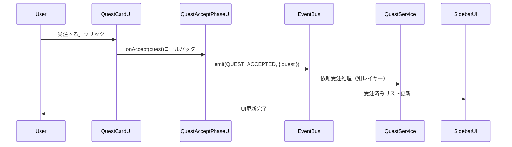
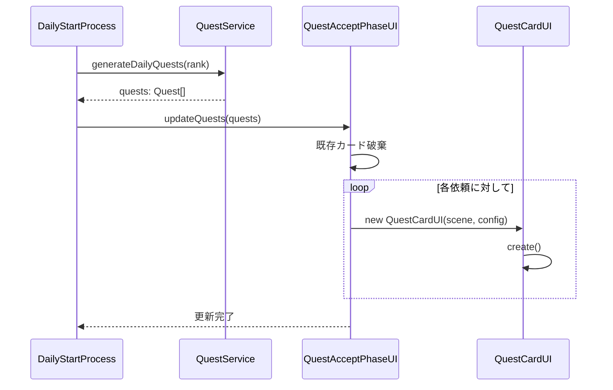

# TASK-0022: 依頼受注フェーズUI - TDD要件定義書

**バージョン**: 1.0.0
**作成日**: 2026-01-18
**タスクID**: TASK-0022
**タスク名**: 依頼受注フェーズUI
**見積時間**: 4時間（半日）
**担当レイヤー**: Presentation

---

## 1. 機能要件

### 1.1 QuestAcceptPhaseUIコンポーネント 🔵

**責務**: 依頼受注フェーズ全体のUI管理を担当

**必須機能**:

| 機能ID | 機能名 | 説明 | 信頼性 |
|--------|--------|------|--------|
| F-001 | フェーズUI初期化 | BaseComponentを継承し、依頼受注フェーズUIを初期化 | 🔵 |
| F-002 | タイトル表示 | 「📋 本日の依頼」タイトルをフェーズ上部に表示 | 🔵 |
| F-003 | 依頼リスト表示 | 日次依頼（Quest[]）を受け取り、QuestCardUIとして表示 | 🔵 |
| F-004 | 依頼リスト更新 | updateQuests(quests: Quest[])メソッドで依頼リストを動的更新 | 🔵 |
| F-005 | 受注済みリスト表示 | 受注済み依頼をサイドバーに表示するScrollablePanel | 🔵 |
| F-006 | 依頼受注イベント発行 | 依頼受注時にEventBusでQUEST_ACCEPTEDイベントを発行 | 🔵 |
| F-007 | リソース解放 | destroy()時にすべてのQuestCardUIとコンテナを破棄 | 🔵 |

**配置情報**:
- タイトル: `(container.x, container.y)` = `(160, 80)`
- 依頼カードグリッド: `(200 + (index % 3) * 300, 150 + Math.floor(index / 3) * 200)`
  - 横3列配置、横間隔300px、縦間隔200px

**UIレイアウト図**:
```
┌────────────────────────────────────────────────────────────┐
│ (160, 80)                                                  │
│ 📋 本日の依頼                                              │
│                                                            │
│   (200, 150)       (500, 150)       (800, 150)            │
│   ┌──────────┐     ┌──────────┐     ┌──────────┐         │
│   │ Quest 1  │     │ Quest 2  │     │ Quest 3  │         │
│   └──────────┘     └──────────┘     └──────────┘         │
│                                                            │
│   (200, 350)       (500, 350)       (800, 350)            │
│   ┌──────────┐     ┌──────────┐     ┌──────────┐         │
│   │ Quest 4  │     │ Quest 5  │     │ Quest 6  │         │
│   └──────────┘     └──────────┘     └──────────┘         │
│                                                            │
│ ┌──────────────────────────────────────────────────────┐  │
│ │ 受注済みリスト (ScrollablePanel)                     │  │
│ │   - Quest 1                                          │  │
│ │   - Quest 3                                          │  │
│ └──────────────────────────────────────────────────────┘  │
└────────────────────────────────────────────────────────────┘
```

### 1.2 QuestCardUIコンポーネント 🔵

**責務**: 個別依頼をカード形式で表示し、受注操作を提供

**必須機能**:

| 機能ID | 機能名 | 説明 | 信頼性 |
|--------|--------|------|--------|
| F-101 | カードUI初期化 | BaseComponentを継承し、依頼情報を表示するカードUIを初期化 | 🔵 |
| F-102 | 依頼者名表示 | 依頼者（Client）の名前を表示 | 🔵 |
| F-103 | セリフ表示 | 依頼のフレーバーテキスト（dialogue）を表示 | 🔵 |
| F-104 | 依頼内容表示 | 依頼タイプ、必要アイテム、期限を表示 | 🔵 |
| F-105 | 報酬情報表示 | 報酬（貢献度、ゴールド）を表示 | 🔵 |
| F-106 | 受注ボタン表示 | 「受注する」ボタンを表示し、クリック時にonAcceptコールバック実行 | 🔵 |
| F-107 | インタラクション | クリック、ホバー時のインタラクティブ動作 | 🟡 |
| F-108 | リソース解放 | destroy()時にすべてのGameObjectsを破棄 | 🔵 |

**カードレイアウト**:
```
┌─────────────────────────────────────┐
│  👤 村人の依頼                      │  ← 依頼者名
│                                     │
│  依頼内容: 回復薬 ×1（C品質以上）   │  ← 依頼内容
│  期限: 3日                          │  ← 期限
│  報酬: 50G / 貢献度 +10             │  ← 報酬
│                                     │
│  [受注する]                         │  ← 受注ボタン
└─────────────────────────────────────┘
```

**カード定数**:
- カード幅: 280px（推奨）
- カード高さ: 180px（推奨）
- パディング: 12px
- 背景色: #FFFDE7（THEME.colors.backgroundベース）
- 枠線: 2px solid #FFD54F

### 1.3 依頼受注処理 🔵

**処理フロー**:
```
1. ユーザーが「受注する」ボタンをクリック
   ↓
2. QuestCardUIがonAcceptコールバックを実行
   ↓
3. QuestAcceptPhaseUIがonAcceptQuest(quest: Quest)を実行
   ↓
4. EventBusでQUEST_ACCEPTEDイベントを発行
   payload: { quest: Quest }
   ↓
5. 受注済みリスト（SidebarUI）が更新される（別レイヤーで処理）
```

**EventBus連携**:
```typescript
this.eventBus.emit(GameEventType.QUEST_ACCEPTED, { quest });
```

**EventBusの取得方法**:
```typescript
// scene.dataからEventBusインスタンスを取得
const eventBus = this.scene.data.get('eventBus');
if (!eventBus) {
  console.warn('EventBus is not available in scene.data');
}
```

### 1.4 受注済みリストの更新 🔵

**責務**: SidebarUIに受注済み依頼を表示

**実装方針**:
- QuestAcceptPhaseUI内でScrollablePanelとして実装（簡易版）
- SidebarUIとの連携はEventBus経由（QUEST_ACCEPTEDイベント購読）

**表示内容**:
- 受注済み依頼のID
- 依頼タイトル
- 残り期限

---

## 2. 非機能要件

### 2.1 パフォーマンス要件 🟡

| 指標 | 目標値 | 測定方法 |
|------|--------|----------|
| フェーズ初期化時間 | < 100ms | create()開始から終了までの時間 |
| カード選択反応時間 | < 16ms | クリックからUI反応までの時間（60fps維持） |
| 受注処理完了時間 | < 500ms | ボタンクリックからイベント発行までの時間 |
| メモリ使用量 | < 10MB | フェーズ単体のメモリ使用量 |

**最適化ポイント**:
- QuestCardUIはオブジェクトプールを使用しない（カード数が少ないため）
- destroy()時にすべてのGameObjectsを確実に破棄
- イベントリスナーのリーク防止（destroy時に解除）

### 2.2 ユーザビリティ要件 🟡

**必須条件**:
- 依頼カードは視覚的にクリック可能であることを示す（ホバー時に変化）
- 受注ボタンは明確に識別可能（プライマリカラーを使用）
- 依頼内容は一目で理解可能（アイコン、色分け）

**推奨条件**:
- キーボード操作対応（`1-3`キーで依頼選択、`Enter`で受注）
- ホバー時にカードを拡大（scale: 1.05）
- 受注成功時にアニメーション演出

### 2.3 保守性要件 🔵

**コーディング規約**:
- Biome設定に準拠（スペースインデント2、行幅100、シングルクォート）
- コメントは日本語で記載
- 定数は`UPPER_SNAKE_CASE`で定義
- インターフェース名は`I`プレフィックス（IQuestCardConfig等）

**テスタビリティ**:
- public メソッドはすべてテスト対象
- private メソッドは間接的にテスト
- モックを使用してEventBusをテスト

**ドキュメント**:
- JSDocコメントを各メソッドに記載
- 信頼性レベル（🔵/🟡/🔴）を明記

---

## 3. 制約条件

### 3.1 技術的制約 🔵

#### 3.1.1 継承関係

| 項目 | 制約 |
|------|------|
| 基底クラス | BaseComponentを継承必須 |
| create()実装 | 必須（抽象メソッド） |
| destroy()実装 | 必須（抽象メソッド） |

#### 3.1.2 Phaserフレームワーク制約

| 項目 | 制約 | 対処方法 |
|------|------|---------|
| rexUIの型定義 | 型定義が不完全 | `any`型を使用（Biomeで警告許可） |
| イベントリスナーのリーク | 自動削除されない | destroy()で必ず購読解除 |
| GameObjectsのメモリ管理 | 破棄しないとメモリリーク | destroy()で全GameObjectsを破棄 |
| Tweenの再利用 | パフォーマンス最適化 | Tweenオブジェクトを使い回す |

#### 3.1.3 Clean Architecture制約

| 項目 | 制約 | 理由 |
|------|------|------|
| ビジネスロジック禁止 | Presentation層にビジネスロジックを含めない | Application/Domain層の責務 |
| 層間通信 | EventBusを使用 | 疎結合な設計を維持 |
| 依存性の方向 | 上位→下位のみ | 依存性逆転の原則 |

### 3.2 依存関係 🔵

#### 3.2.1 必須依存

| 依存先 | パス | 用途 |
|--------|------|------|
| BaseComponent | `@presentation/ui/components/BaseComponent` | 基底クラス |
| Quest | `@domain/entities/Quest` | 依頼エンティティ |
| GameEventType | `@shared/types/events` | イベント種別定義 |
| THEME | `@presentation/ui/theme` | UIテーマ定義 |

#### 3.2.2 間接依存（EventBus経由）

| 依存先 | イベント | 用途 |
|--------|----------|------|
| QuestService | `QUEST_ACCEPTED` | 依頼受注処理 |
| SidebarUI | `QUEST_ACCEPTED` | 受注済みリスト更新 |

#### 3.2.3 事前実装済みタスク

| タスクID | タスク名 | 内容 |
|---------|---------|------|
| TASK-0020 | MainScene共通レイアウト | HeaderUI、SidebarUI、FooterUI実装済み |
| TASK-0013 | 依頼エンティティ・QuestService | Quest、QuestService実装済み |
| TASK-0018 | 共通UIコンポーネント基盤 | BaseComponent実装済み |

### 3.3 入力値検証 🟡

**QuestAcceptPhaseUI**:
- `scene`: null/undefined チェック（BaseComponentで実施）
- `quests`: 空配列許容、nullチェック推奨

**QuestCardUI**:
- `config`: null/undefined チェック
- `config.quest`: Questエンティティであることを確認
- `config.x, config.y`: 有限数チェック（BaseComponentで実施）
- `config.onAccept`: 関数型チェック推奨

---

## 4. 受け入れ基準

### 4.1 必須条件 🔵

| 基準ID | 基準 | 検証方法 |
|--------|------|----------|
| AC-001 | 日次依頼が表示される | QuestAcceptPhaseUIにQuest[]を渡すと、すべてのQuestCardUIが表示される |
| AC-002 | 依頼を受注できる | QuestCardUIの「受注する」ボタンをクリックすると、QUEST_ACCEPTEDイベントが発行される |
| AC-003 | 受注後にリストが更新される | QUEST_ACCEPTEDイベント発行後、受注済みリスト（ScrollablePanel）に依頼が追加される |
| AC-004 | 次フェーズへ進める | 「次のフェーズへ」ボタンをクリックすると、PHASE_TRANSITION_REQUESTEDイベントが発行される |

### 4.2 推奨条件 🟡

| 基準ID | 基準 | 検証方法 |
|--------|------|----------|
| AC-101 | 依頼詳細モーダル | カードクリックで詳細モーダルが表示される（今回は実装しない） |
| AC-102 | 受注アニメーション | 受注成功時にカードにチェックマーク表示、フェードアニメーション |

### 4.3 テストケース（TASK-0022）

| テストID | テスト内容 | 期待結果 | テスト種別 |
|---------|----------|----------|-----------|
| T-0022-01 | 依頼表示 | 日次依頼が表示される | 統合テスト |
| T-0022-02 | 受注ボタン | 受注成功 | 統合テスト |
| T-0022-03 | 受注後表示更新 | サイドバーに追加 | 統合テスト |
| T-0022-04 | スキップ | 次フェーズへ遷移 | 統合テスト |

---

## 5. インターフェース定義

### 5.1 QuestAcceptPhaseUI

```typescript
/**
 * 依頼受注フェーズUIコンポーネント
 *
 * @責務 依頼受注フェーズ全体のUI管理
 * @信頼性 🔵
 */
export class QuestAcceptPhaseUI extends BaseComponent {
  /** 依頼カードリスト */
  private questCards: QuestCardUI[] = [];

  /** 受注済みリスト（ScrollablePanel） */
  private acceptedList!: ScrollablePanel;

  /** EventBus参照 */
  private eventBus: IEventBus;

  /**
   * コンストラクタ
   *
   * @param scene - Phaserシーンインスタンス
   */
  constructor(scene: Phaser.Scene);

  /**
   * UIコンポーネント初期化
   * タイトル、依頼リスト、受注済みリストを作成
   */
  create(): void;

  /**
   * タイトル表示作成
   * 「📋 本日の依頼」を表示
   */
  private createTitle(): void;

  /**
   * 依頼リスト作成
   * QuestCardUIを配置
   */
  private createQuestList(): void;

  /**
   * 受注済みリスト作成
   * ScrollablePanelを配置
   */
  private createAcceptedList(): void;

  /**
   * 依頼リスト更新
   *
   * @param quests - 更新する依頼リスト
   */
  updateQuests(quests: Quest[]): void;

  /**
   * 依頼受注処理
   * QUEST_ACCEPTEDイベントを発行
   *
   * @param quest - 受注する依頼
   */
  private onAcceptQuest(quest: Quest): void;

  /**
   * リソース解放
   * すべてのQuestCardUIとコンテナを破棄
   */
  destroy(): void;
}
```

### 5.2 QuestCardUI

```typescript
/**
 * 依頼カードUI設定インターフェース
 */
export interface QuestCardUIConfig {
  /** 依頼エンティティ */
  quest: Quest;

  /** X座標 */
  x: number;

  /** Y座標 */
  y: number;

  /** インタラクティブ有効化（デフォルト: true） */
  interactive?: boolean;

  /** 受注ボタンクリック時のコールバック */
  onAccept?: (quest: Quest) => void;
}

/**
 * 依頼カードUIコンポーネント
 *
 * @責務 個別依頼をカード形式で表示し、受注操作を提供
 * @信頼性 🔵
 */
export class QuestCardUI extends BaseComponent {
  /** カード幅 */
  private static readonly CARD_WIDTH = 280;

  /** カード高さ */
  private static readonly CARD_HEIGHT = 180;

  /** パディング */
  private static readonly PADDING = 12;

  /** 依頼カード設定 */
  private config: QuestCardUIConfig;

  /** 依頼エンティティ */
  private quest: Quest;

  /** 背景 */
  private background!: Phaser.GameObjects.Rectangle;

  /** 依頼者名テキスト */
  private clientNameText!: Phaser.GameObjects.Text;

  /** セリフテキスト */
  private dialogueText!: Phaser.GameObjects.Text;

  /** 報酬情報テキスト */
  private rewardText!: Phaser.GameObjects.Text;

  /** 受注ボタン */
  private acceptButton!: Phaser.GameObjects.Container;

  /**
   * コンストラクタ
   *
   * @param scene - Phaserシーンインスタンス
   * @param config - 依頼カード設定
   * @throws {Error} configがnullまたはundefinedの場合
   * @throws {Error} config.questがnullまたはundefinedの場合
   */
  constructor(scene: Phaser.Scene, config: QuestCardUIConfig);

  /**
   * UIコンポーネント初期化
   * 背景、依頼者名、セリフ、報酬情報、受注ボタンを作成
   */
  create(): void;

  /**
   * 背景作成
   */
  private createBackground(): void;

  /**
   * 依頼者名作成
   */
  private createClientName(): void;

  /**
   * セリフ作成
   */
  private createDialogue(): void;

  /**
   * 報酬情報作成
   */
  private createRewardInfo(): void;

  /**
   * 受注ボタン作成
   */
  private createAcceptButton(): void;

  /**
   * インタラクション設定
   * ホバー、クリック時の動作を設定
   */
  private setupInteraction(): void;

  /**
   * リソース解放
   * すべてのGameObjectsを破棄
   */
  destroy(): void;
}
```

### 5.3 EventBusイベントペイロード

```typescript
/**
 * QUEST_ACCEPTEDイベントペイロード
 */
export interface QuestAcceptedEventPayload {
  /** 受注した依頼 */
  quest: Quest;
}

/**
 * PHASE_TRANSITION_REQUESTEDイベントペイロード
 */
export interface PhaseTransitionRequestedEventPayload {
  /** 遷移元フェーズ */
  from: 'quest_accept';

  /** 遷移先フェーズ */
  to: 'gathering';
}
```

---

## 6. データフロー

### 6.1 依頼受注フロー



### 6.2 依頼リスト更新フロー



---

## 7. セキュリティ要件 🟡

| 要件 | 詳細 | 実装 |
|------|------|------|
| 入力値検証 | コンストラクタの引数検証 | BaseComponentで実施、追加検証をサブクラスで実施 |
| XSS対策 | ユーザー入力のサニタイズ | 該当箇所なし（マスターデータのみ使用） |
| データ改ざん防止 | セーブデータのチェックサム検証 | 将来実装（現時点では不要） |

---

## 8. エラーハンドリング 🟡

### 8.1 エラーケース

| エラー | 原因 | 対処 | 実装方法 |
|--------|------|------|---------|
| 受注上限超過 | 受注できる依頼数を超えている | Toast表示「これ以上依頼を受けられません」 | EventBus経由でToast表示イベント発行 |
| 受注処理失敗 | サービスエラー等 | Toast表示「受注に失敗しました」、リトライ可能 | EventBus経由でToast表示イベント発行 |
| データ不整合 | 依頼者データが不正 | 空きスロットとして表示、ログ出力 | console.errorでログ出力 |
| EventBus未初期化 | scene.dataにEventBusが存在しない | console.warnで警告、処理スキップ | 初期化時にチェック |

### 8.2 エラー表示例

```typescript
// 受注上限超過エラー
this.eventBus.emit('TOAST_SHOW', {
  message: 'これ以上依頼を受けられません',
  type: 'warning',
  duration: 3000,
});

// データ不整合エラー
console.error('QuestAcceptPhaseUI: Invalid quest data', quest);
```

---

## 9. アニメーション仕様 🟡（推奨）

### 9.1 カードホバーアニメーション

| プロパティ | 開始値 | 終了値 | 時間 | イージング |
|-----------|-------|-------|------|-----------|
| scale | 1.0 | 1.05 | 150ms | Quad.Out |

### 9.2 受注成功アニメーション

```typescript
// 受注成功時のアニメーションシーケンス（推奨）
private async playAcceptAnimation(card: QuestCardUI): Promise<void> {
  // 1. カードにチェックマーク表示
  const checkmark = this.scene.add.text(
    card.container.x,
    card.container.y,
    '✓',
    { fontSize: '48px', color: '#4CAF50' }
  );

  // 2. チェックマーク拡大アニメーション
  await this.scene.tweens.add({
    targets: checkmark,
    scale: { from: 0, to: 1 },
    alpha: { from: 0, to: 1 },
    duration: 300,
    ease: 'Back.Out',
  });

  // 3. カードフェードアウト
  await this.scene.tweens.add({
    targets: card.container,
    alpha: 0.5,
    duration: 200,
    ease: 'Quad.Out',
  });
}
```

---

## 10. 実装優先順位

### 10.1 TDD実装順序

| フェーズ | 実装内容 | 見積時間 |
|---------|---------|---------|
| **Phase 1: Red** | テストケース作成（T-0022-01 〜 T-0022-04） | 1時間 |
| **Phase 2: Green** | 最小実装（QuestAcceptPhaseUI、QuestCardUI） | 1.5時間 |
| **Phase 3: Refactor** | リファクタリング、定数抽出、コメント追加 | 1時間 |
| **Phase 4: Review** | コードレビュー対応、ドキュメント更新 | 30分 |

### 10.2 最小実装スコープ（Green）

**必須実装**:
- QuestAcceptPhaseUI基本実装
- QuestCardUI基本実装
- 依頼リスト表示
- 受注ボタンクリック処理
- QUEST_ACCEPTEDイベント発行
- destroy()によるリソース解放

**推奨実装（時間に余裕があれば）**:
- ホバーアニメーション
- 受注成功アニメーション
- キーボード操作対応

**今回実装しない**:
- 依頼詳細モーダル（AC-101）
- 断るボタン機能
- 複雑なアニメーション演出

---

## 11. 関連文書

### 11.1 タスク文書

- **タスクファイル**: `/home/user/atelier/docs/tasks/atelier-guild-rank/phase-3/TASK-0022.md`
- **タスクノート**: `/home/user/atelier/docs/implements/atelier-guild-rank/TASK-0022/note.md`

### 11.2 設計文書

- **アーキテクチャ概要**: `/home/user/atelier/docs/design/atelier-guild-rank/architecture-overview.md`
- **依頼受注フェーズ詳細設計**: `/home/user/atelier/docs/design/atelier-guild-rank/ui-design/screens/quest-accept.md`

### 11.3 実装ファイル

- **BaseComponent**: `/home/user/atelier/atelier-guild-rank/src/presentation/ui/components/BaseComponent.ts`
- **Quest**: `/home/user/atelier/atelier-guild-rank/src/domain/entities/Quest.ts`
- **QuestService**: `/home/user/atelier/atelier-guild-rank/src/application/services/quest-service.ts`
- **GameEventType**: `/home/user/atelier/atelier-guild-rank/src/shared/types/events.ts`
- **THEME**: `/home/user/atelier/atelier-guild-rank/src/presentation/ui/theme.ts`

---

## 12. 変更履歴

| 日付 | バージョン | 変更内容 |
|------|----------|---------|
| 2026-01-18 | 1.0.0 | 初版作成 |
