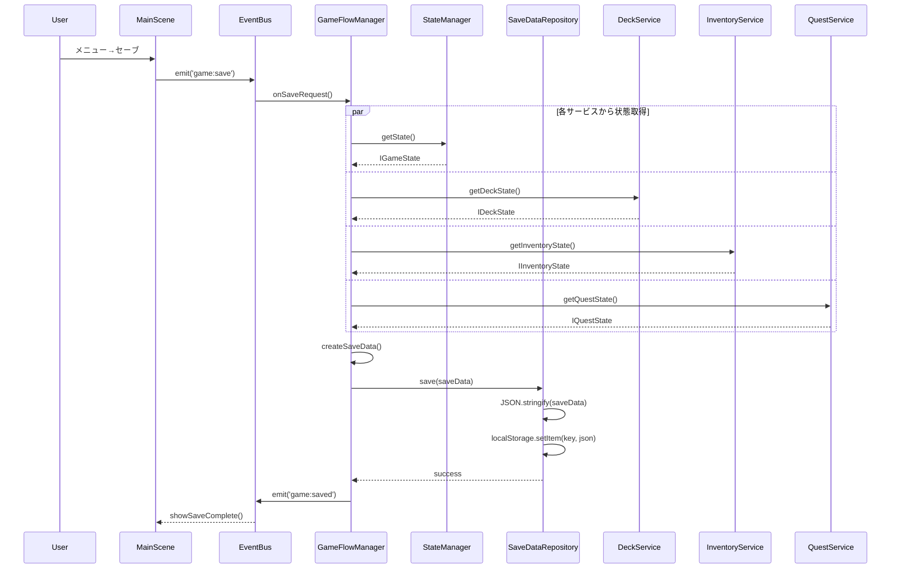
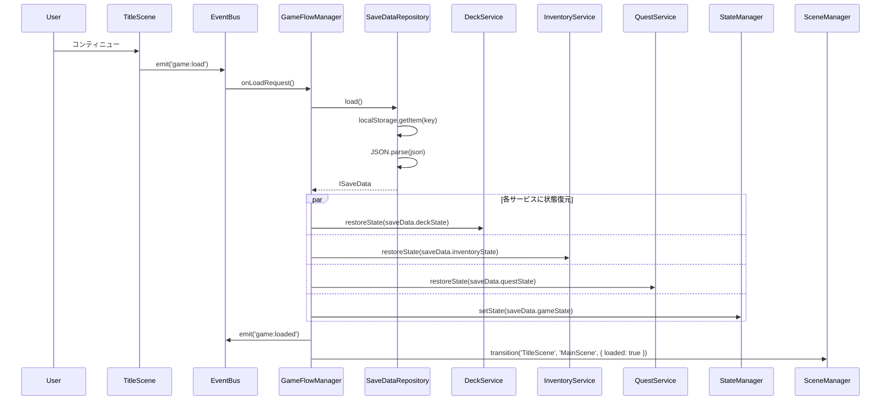

# TASK-0029: セーブ/ロード機能統合 - 開発ノート

**作成日**: 2026-01-18
**タスクID**: TASK-0029
**要件名**: atelier-guild-rank
**フェーズ**: 4 - 統合・テスト

---

## 1. 技術スタック

### 使用技術・フレームワーク
- **言語**: TypeScript 5.x
- **ゲームFW**: Phaser 3.87+
- **UIプラグイン**: rexUI（最新）
- **ビルド**: Vite 6.x
- **パッケージ管理**: pnpm 9.x
- **Lint/Format**: Biome 2.x
- **テスト**: Vitest（ユニットテスト）
- **E2Eテスト**: Playwright（最新）
- **データ永続化**: localStorage

### アーキテクチャパターン
- **Clean Architecture**: 4層構造（Presentation/Application/Domain/Infrastructure）
- **Repository Pattern**: データアクセスの抽象化
- **イベント駆動設計**: EventBusによる疎結合な通信
- **DI（依存性注入）**: Containerによるサービス管理

### 参照元
- `docs/design/atelier-guild-rank/architecture-overview.md`
- `docs/design/atelier-guild-rank/dataflow.md`

---

## 2. 開発ルール

### プロジェクト固有ルール
- **応答は日本語で行う**
- **ずんだもん口調で喋る**（語尾は「なのだ。」）
- **Clean Architectureの原則に従う**
  - Domain層はInfrastructure層のインターフェースにのみ依存
  - ビジネスロジックはフレームワークに依存しない
- **Biomeによる一貫したコードスタイル**
- **Lefthookによるコミット前の品質チェック自動化**

### コーディング規約
- **エクスポート形式**: 名前付きエクスポートを使用
- **エラーハンドリング**: ApplicationErrorを使用し、ErrorCodesで定義されたコードを使う
- **型安全性**: 厳密な型定義、unknown型の使用
- **不変性**: 状態更新時は新しいオブジェクトを作成
- **インターフェース名**: `I`プレフィックスを使用（例: `ISaveLoadService`）
- **型定義の場所**: `src/shared/types/` に集約

### 参照元
- `CLAUDE.md`
- `docs/design/atelier-guild-rank/architecture-overview.md`

---

## 3. 依存タスク

### TASK-0007: セーブデータリポジトリ実装（完了済み）
- **実装ファイル**: `src/infrastructure/repositories/local-storage-save-repository.ts`
- **インターフェース**: `src/domain/interfaces/save-data-repository.interface.ts`
- **提供機能**:
  - `save(data: ISaveData): Promise<void>` - セーブデータの保存
  - `load(): Promise<ISaveData | null>` - セーブデータの読み込み
  - `exists(): boolean` - 存在チェック
  - `delete(): Promise<void>` - 削除
  - `getLastSavedTime(): Date | null` - 最終保存時刻取得
- **ストレージキー**: `atelier-guild-rank-save`

### TASK-0028: サービス統合・DI設定（完了済み）
- **DIコンテナ**: `src/infrastructure/di/container.ts`
- **サービスセットアップ**: `src/infrastructure/di/setup.ts`
- **ServiceKeys定義**:
  ```typescript
  export const ServiceKeys = {
    EventBus: 'EventBus',
    StateManager: 'StateManager',
    MasterDataRepository: 'MasterDataRepository',
    SaveDataRepository: 'SaveDataRepository',
    DeckService: 'DeckService',
    MaterialService: 'MaterialService',
    GatheringService: 'GatheringService',
    AlchemyService: 'AlchemyService',
    QuestService: 'QuestService',
    InventoryService: 'InventoryService',
    ShopService: 'ShopService',
    ArtifactService: 'ArtifactService',
    RankService: 'RankService',
    GameFlowManager: 'GameFlowManager',
  } as const;
  ```

### 参照元
- `docs/tasks/atelier-guild-rank/phase-1/TASK-0007.md`
- `docs/tasks/atelier-guild-rank/phase-4/TASK-0028.md`
- `docs/implements/atelier-guild-rank/TASK-0007/note.md`

---

## 4. 設計文書

### SaveLoadServiceの責務
セーブ/ロード機能を統合し、各サービスからの状態収集と復元を担当する。

### SaveLoadServiceインターフェース設計
```typescript
export interface ISaveLoadService {
  save(): Promise<void>;
  load(): Promise<boolean>;
  hasSaveData(): boolean;
  deleteSaveData(): Promise<void>;
}

export class SaveLoadService implements ISaveLoadService {
  constructor(
    private saveRepo: ISaveDataRepository,
    private stateManager: IStateManager,
    private deckService: IDeckService,
    private inventoryService: IInventoryService,
    private questService: IQuestService,
  ) {}
}
```

### セーブデータ構造（data-schema-save.mdより）
```json
{
  "version": "1.0.0",
  "lastSaved": "2026-01-01T12:00:00.000Z",
  "gameState": {
    "currentRank": "G",
    "promotionGauge": 35,
    "requiredContribution": 100,
    "remainingDays": 28,
    "currentDay": 3,
    "currentPhase": "GATHERING",
    "gold": 150,
    "comboCount": 2,
    "actionPoints": 2,
    "isPromotionTest": false,
    "promotionTestRemainingDays": null
  },
  "deckState": {
    "deck": ["gathering_nearby_forest", "recipe_healing_potion"],
    "hand": ["gathering_backyard", "enhance_sage_catalyst"],
    "discard": ["gathering_riverside"],
    "ownedCards": ["gathering_nearby_forest", "gathering_backyard"]
  },
  "inventoryState": {
    "materials": [
      { "materialId": "herb", "quality": "C", "quantity": 5 }
    ],
    "craftedItems": [
      {
        "itemId": "healing_potion",
        "quality": "B",
        "attributeValues": [{ "attribute": "WATER", "value": 8 }],
        "effectValues": [{ "type": "HP_RECOVERY", "value": 45 }],
        "usedMaterials": [
          { "materialId": "herb", "quantity": 2, "quality": "C", "isRare": false }
        ]
      }
    ],
    "storageLimit": 20
  },
  "questState": {
    "activeQuests": [
      {
        "quest": { "id": "quest_001", "clientId": "villager", ... },
        "remainingDays": 4,
        "acceptedDay": 2
      }
    ],
    "todayClients": ["villager", "adventurer"],
    "todayQuests": [...],
    "questLimit": 3
  },
  "artifacts": ["artifact_id_1", "artifact_id_2"]
}
```

### 各サービスのセーブ/ロードインターフェース

#### StateManager
```typescript
interface IStateManager {
  getState(): IGameState;
  loadFromSaveData(saveData: ISaveData): void;
}
```

#### DeckService
```typescript
interface IDeckService {
  getDeck(): string[];
  getHand(): string[];
  getDiscard(): string[];
  loadFromSaveData(deckState: IDeckState): void;
}
```

#### InventoryService
```typescript
interface IInventoryService {
  getMaterials(): IMaterialInstance[];
  getItems(): ICraftedItem[];
  getArtifacts(): IArtifactId[];
  loadFromSaveData(inventoryState: IInventoryState): void;
}
```

#### QuestService
```typescript
interface IQuestService {
  getAcceptedQuests(): IActiveQuest[];
  getAvailableQuests(): IQuest[];
  loadFromSaveData(questState: IQuestState): void;
}
```

### 参照元
- `docs/design/atelier-guild-rank/data-schema-save.md`
- `docs/design/atelier-guild-rank/dataflow.md` (セクション7: セーブ・ロードフロー)
- `docs/tasks/atelier-guild-rank/phase-4/TASK-0029.md`

---

## 5. データフロー

### セーブフロー（dataflow.mdより）


### ロードフロー（dataflow.mdより）


---

## 6. 注意事項

### 技術的制約
- **localStorage容量制限**: 5-10MB（ブラウザによる）
- **JSONシリアライズ制限**: 循環参照不可、関数は保存不可
- **非同期API**: `save()`, `load()`は`Promise`を返す
- **バージョン互換性**: 将来的なマイグレーション対応のため`version`フィールドを必ずチェック

### エラーハンドリング
- **致命的エラー**: 非互換バージョン → `Error('Incompatible save data version')`をthrow
- **回復可能エラー**: 破損データ → `null`を返却し、ロード失敗として扱う
- **エラーコード**:
  - `ErrorCodes.SAVE_FAILED`: 保存失敗
  - `ErrorCodes.LOAD_FAILED`: 読み込み失敗
  - `ErrorCodes.INVALID_SAVE_DATA`: データ破損

### バージョンチェック
```typescript
private isCompatibleVersion(version: string): boolean {
  const [major] = version.split('.');
  const [currentMajor] = CURRENT_VERSION.split('.');
  return major === currentMajor; // メジャーバージョンが一致すれば互換
}
```

### 参照元
- `docs/design/atelier-guild-rank/architecture-overview.md` (セキュリティ考慮事項)
- `docs/tasks/atelier-guild-rank/phase-4/TASK-0029.md` (受け入れ基準、テストケース)

---

## 7. 実装ファイル一覧

### 作成するファイル

#### SaveLoadService
- `src/application/services/save-load-service.ts` - **新規**

#### インターフェース
- `src/domain/interfaces/save-load-service.interface.ts` - **新規**（必要に応じて）

#### テスト
- `tests/integration/save-load.test.ts` - **新規**

### 更新するファイル

#### DIコンテナ
- `src/infrastructure/di/setup.ts` - SaveLoadServiceの登録追加
- `src/infrastructure/di/container.ts` - ServiceKeysにSaveLoadServiceを追加

#### 既存サービスの拡張
- 各サービスに`loadFromSaveData()`メソッドが必要な場合は追加

---

## 8. テスト戦略

### 統合テスト（タスク定義より）

| テストID | テスト内容 | 期待結果 |
|---------|----------|----------|
| T-0029-01 | セーブ実行 | データ保存成功 |
| T-0029-02 | ロード実行 | 状態復元成功 |
| T-0029-03 | 存在チェック | 正しい結果 |
| T-0029-04 | 削除実行 | データ削除成功 |
| T-0029-05 | 非互換バージョン | エラー発生 |

### テスト実装方針
- **モック**: 各サービス（StateManager, DeckService, InventoryService, QuestService）をモック化
- **SaveDataRepository**: 実際のlocalStorageではなく、モックまたはメモリ内実装を使用
- **バージョンチェック**: 異なるバージョンのセーブデータでエラーが発生することを確認

### テストパターン（vitestを使用）
```typescript
import { describe, test, expect, beforeEach, vi } from 'vitest';

describe('SaveLoadService', () => {
  let saveLoadService: SaveLoadService;
  let mockSaveRepo: ISaveDataRepository;
  let mockStateManager: IStateManager;
  let mockDeckService: IDeckService;
  let mockInventoryService: IInventoryService;
  let mockQuestService: IQuestService;

  beforeEach(() => {
    mockSaveRepo = {
      save: vi.fn().mockResolvedValue(undefined),
      load: vi.fn().mockResolvedValue(null),
      exists: vi.fn().mockReturnValue(false),
      delete: vi.fn().mockResolvedValue(undefined),
      getLastSavedTime: vi.fn().mockReturnValue(null),
    };
    // 他のモック設定...
  });

  test('セーブ実行 - データ保存成功', async () => {
    await saveLoadService.save();
    expect(mockSaveRepo.save).toHaveBeenCalled();
  });

  // 他のテストケース...
});
```

---

## 9. オートセーブ機能（推奨条件）

### タイミング
- **日終了時**: 1日の終わりに自動セーブ
- **フェーズ終了時**: 各フェーズの完了時に自動セーブ

### 実装方針
- EventBusで`day:end`や`phase:complete`イベントを購読
- セーブインジケーター表示（将来実装）

```typescript
// GameFlowManagerでのイベント購読例
eventBus.on('day:end', async () => {
  await this.saveLoadService.save();
  eventBus.emit('game:saved');
});
```

---

## 10. 実装チェックリスト

### 必須実装
- [ ] `ISaveLoadService`インターフェース定義（必要に応じて）
- [ ] `SaveLoadService`実装
  - [ ] `save()`メソッド - 各サービスから状態を収集してセーブ
  - [ ] `load()`メソッド - セーブデータから各サービスに状態を復元
  - [ ] `hasSaveData()`メソッド - 存在チェック
  - [ ] `deleteSaveData()`メソッド - セーブデータ削除
  - [ ] `isCompatibleVersion()`メソッド - バージョンチェック
- [ ] DIコンテナへの登録
- [ ] 統合テスト
  - [ ] T-0029-01: セーブ実行
  - [ ] T-0029-02: ロード実行
  - [ ] T-0029-03: 存在チェック
  - [ ] T-0029-04: 削除実行
  - [ ] T-0029-05: 非互換バージョン

### 推奨実装
- [ ] オートセーブ機能
- [ ] セーブインジケーター表示

---

## 11. 実装の流れ

1. **インターフェース定義**（必要に応じて）
   - `src/domain/interfaces/save-load-service.interface.ts`を作成

2. **SaveLoadService実装**
   - `src/application/services/save-load-service.ts`を作成
   - 各サービスからの状態収集ロジック実装
   - 各サービスへの状態復元ロジック実装
   - バージョンチェックロジック実装

3. **DIコンテナ更新**
   - `src/infrastructure/di/container.ts`にServiceKeys追加
   - `src/infrastructure/di/setup.ts`にSaveLoadService初期化追加

4. **統合テスト**
   - `tests/integration/save-load.test.ts`を作成
   - 全テストケース実装

---

## 12. 参考リンク

### 設計文書
- データスキーマ設計: `docs/design/atelier-guild-rank/data-schema-save.md`
- データフロー設計: `docs/design/atelier-guild-rank/dataflow.md`
- アーキテクチャ設計: `docs/design/atelier-guild-rank/architecture-overview.md`
- コンポーネント設計: `docs/design/atelier-guild-rank/architecture-components.md`

### タスク定義
- TASK-0029定義: `docs/tasks/atelier-guild-rank/phase-4/TASK-0029.md`
- TASK-0007定義: `docs/tasks/atelier-guild-rank/phase-1/TASK-0007.md`
- TASK-0028定義: `docs/tasks/atelier-guild-rank/phase-4/TASK-0028.md`

### 既存実装
- セーブデータリポジトリ: `src/infrastructure/repositories/local-storage-save-repository.ts`
- DIコンテナ: `src/infrastructure/di/container.ts`
- サービスセットアップ: `src/infrastructure/di/setup.ts`

---

## 補足情報

### SaveLoadService実装例（タスク定義より）
```typescript
export class SaveLoadService {
  constructor(
    private saveRepo: ISaveDataRepository,
    private stateManager: IStateManager,
    private deckService: IDeckService,
    private inventoryService: IInventoryService,
    private questService: IQuestService,
  ) {}

  async save(): Promise<void> {
    const saveData: SaveData = {
      version: '1.0.0',
      lastSaved: new Date().toISOString(),
      gameState: this.stateManager.getState(),
      deckState: {
        deck: this.deckService.getDeck().map(c => c.id),
        hand: this.deckService.getHand().map(c => c.id),
        discard: this.deckService.getDiscard().map(c => c.id),
      },
      inventoryState: {
        materials: this.inventoryService.getMaterials(),
        items: this.inventoryService.getItems(),
        artifacts: this.inventoryService.getArtifacts(),
      },
      questState: {
        acceptedQuests: this.questService.getAcceptedQuests(),
        dailyQuests: this.questService.getAvailableQuests(),
      },
    };

    await this.saveRepo.save(saveData);
  }

  async load(): Promise<boolean> {
    const saveData = await this.saveRepo.load();
    if (!saveData) return false;

    // バージョンチェック
    if (!this.isCompatibleVersion(saveData.version)) {
      throw new Error('Incompatible save data version');
    }

    // 状態復元
    this.stateManager.loadFromSaveData(saveData);
    this.deckService.loadFromSaveData(saveData.deckState);
    this.inventoryService.loadFromSaveData(saveData.inventoryState);
    this.questService.loadFromSaveData(saveData.questState);

    return true;
  }

  hasSaveData(): boolean {
    return this.saveRepo.exists();
  }

  async deleteSaveData(): Promise<void> {
    await this.saveRepo.delete();
  }

  private isCompatibleVersion(version: string): boolean {
    const [major] = version.split('.');
    const currentVersion = '1.0.0';
    const [currentMajor] = currentVersion.split('.');
    return major === currentMajor;
  }
}
```

---

**最終更新**: 2026-01-18
