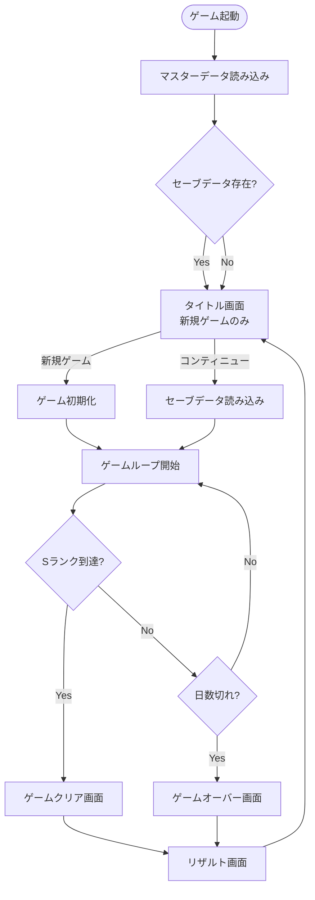
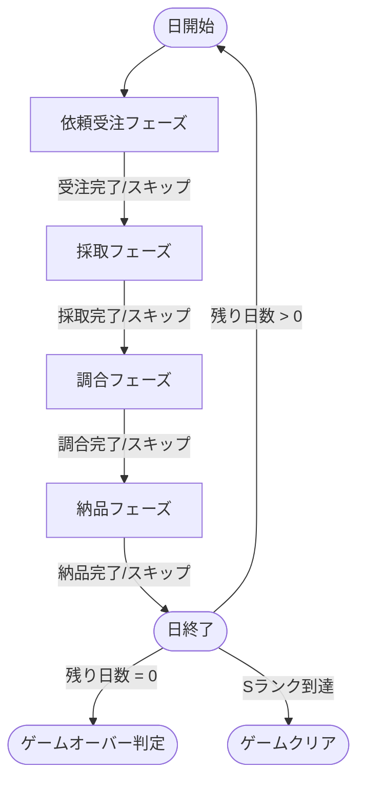

# TASK-0030: E2Eテスト・デバッグ - 開発ノート

**作成日**: 2026-01-18
**タスクID**: TASK-0030
**要件名**: atelier-guild-rank
**フェーズ**: 4 - 統合・テスト

---

## 1. 技術スタック

### 使用技術・フレームワーク
- **言語**: TypeScript 5.x
- **ゲームFW**: Phaser 3.87+
- **UIプラグイン**: rexUI（最新）
- **ビルド**: Vite 5.x
- **パッケージ管理**: pnpm 9.x
- **Lint/Format**: Biome 2.x
- **テスト**: Vitest（ユニットテスト）
- **E2Eテスト**: Playwright 1.57+
- **データ永続化**: localStorage

### アーキテクチャパターン
- **Clean Architecture**: 4層構造（Presentation/Application/Domain/Infrastructure）
- **Scene-based Architecture**: Phaserのシーン管理を活用
- **イベント駆動設計**: EventBusによる疎結合な通信
- **State Machine**: フェーズ管理
- **DI（依存性注入）**: Containerによるサービス管理

### 参照元
- `docs/design/atelier-guild-rank/architecture-overview.md`
- `docs/design/atelier-guild-rank/dataflow.md`

---

## 2. 開発ルール

### プロジェクト固有ルール
- **応答は日本語で行う**
- **ずんだもん口調で喋る**（語尾は「なのだ。」）
- **Clean Architectureの原則に従う**
  - Domain層はInfrastructure層のインターフェースにのみ依存
  - ビジネスロジックはフレームワークに依存しない
- **Biomeによる一貫したコードスタイル**
- **Lefthookによるコミット前の品質チェック自動化**

### コーディング規約
- **エクスポート形式**: 名前付きエクスポートを使用
- **エラーハンドリング**: ApplicationErrorを使用し、ErrorCodesで定義されたコードを使う
- **型安全性**: 厳密な型定義、unknown型の使用
- **不変性**: 状態更新時は新しいオブジェクトを作成
- **インターフェース名**: `I`プレフィックスを使用（例: `IStateManager`）
- **型定義の場所**: `src/shared/types/` に集約

### 参照元
- `CLAUDE.md`
- `docs/design/atelier-guild-rank/architecture-overview.md`

---

## 3. 依存タスク

### TASK-0037: Playwright E2E設定（完了済み）
- **設定ファイル**: `playwright.config.ts`
- **テストディレクトリ**: `e2e/`
- **提供機能**:
  - `pnpm test:e2e` - E2Eテスト実行
  - `pnpm test:e2e:ui` - UI付きテスト実行
  - `pnpm test:e2e:headed` - ブラウザ表示付きテスト実行
  - `pnpm test:e2e:report` - テストレポート表示

### TASK-0028: サービス統合・DI設定（完了済み）
- **DIコンテナ**: `src/infrastructure/di/container.ts`
- **サービスセットアップ**: `src/infrastructure/di/setup.ts`
- **全サービスがDI経由でアクセス可能**

### TASK-0029: セーブ/ロード機能統合（完了済み）
- **SaveLoadService**: セーブ/ロード機能の統合
- **状態の永続化**: localStorage経由で保存

### 参照元
- `docs/tasks/atelier-guild-rank/phase-1/TASK-0037.md`
- `docs/tasks/atelier-guild-rank/phase-4/TASK-0028.md`
- `docs/tasks/atelier-guild-rank/phase-4/TASK-0029.md`

---

## 4. Playwright E2E設定の確認

### 設定ファイル（playwright.config.ts）
```typescript
import { defineConfig, devices } from '@playwright/test';

export default defineConfig({
  testDir: './e2e',
  fullyParallel: true,
  forbidOnly: !!process.env.CI,
  retries: process.env.CI ? 2 : 0,
  workers: process.env.CI ? 1 : undefined,
  reporter: [['html', { outputFolder: 'playwright-report' }], ['list']],
  use: {
    baseURL: 'http://localhost:3000',
    trace: 'on-first-retry',
    screenshot: 'only-on-failure',
    video: 'on-first-retry',
  },
  projects: [
    {
      name: 'chromium',
      use: { ...devices['Desktop Chrome'] },
    },
  ],
  webServer: {
    command: 'pnpm dev',
    url: 'http://localhost:3000',
    reuseExistingServer: !process.env.CI,
    timeout: 120 * 1000,
  },
});
```

### 現在のテストスクリプト（package.json）
```json
{
  "scripts": {
    "test:e2e": "playwright test",
    "test:e2e:ui": "playwright test --ui",
    "test:e2e:headed": "playwright test --headed",
    "test:e2e:report": "playwright show-report"
  }
}
```

### テストディレクトリ構造
```
e2e/
├── fixtures/           # テスト用フィクスチャ
│   └── game.fixture.ts # Phaserゲームページのフィクスチャ
├── pages/              # ページオブジェクト
│   └── game.page.ts    # ゲームページのPage Object
└── specs/              # テストスペック
    └── boot.spec.ts    # 起動テスト（既存）
```

---

## 5. 既存E2Eテストのパターン

### テストフィクスチャ（game.fixture.ts）
```typescript
import { test as base, type Page } from '@playwright/test';

export interface GameFixtures {
  gamePage: Page;
}

export const test = base.extend<GameFixtures>({
  gamePage: async ({ page }, use) => {
    await page.goto('/');
    await page.waitForSelector('#game-container canvas', { timeout: 10000 });
    await use(page);
  },
});

export { expect } from '@playwright/test';
```

### ページオブジェクト（game.page.ts）
```typescript
import type { Locator, Page } from '@playwright/test';

export class GamePage {
  readonly page: Page;
  readonly canvas: Locator;
  readonly gameContainer: Locator;

  constructor(page: Page) {
    this.page = page;
    this.gameContainer = page.locator('#game-container');
    this.canvas = page.locator('#game-container canvas');
  }

  async waitForGameLoad(): Promise<void> {
    await this.canvas.waitFor({ state: 'visible', timeout: 10000 });
  }

  async getCanvasSize(): Promise<{ width: number; height: number }> {
    const boundingBox = await this.canvas.boundingBox();
    return {
      width: boundingBox?.width ?? 0,
      height: boundingBox?.height ?? 0,
    };
  }

  async clickCanvas(x: number, y: number): Promise<void> {
    await this.canvas.click({ position: { x, y } });
  }

  async takeScreenshot(name: string): Promise<void> {
    await this.page.screenshot({ path: `e2e/screenshots/${name}.png` });
  }
}
```

### 既存テストケース（boot.spec.ts）
- T-0008-01: ゲームが正常に起動する
- キャンバスサイズのテスト
- コンソールエラーがないことのテスト
- T-0008-02: BootSceneからTitleSceneへ遷移する
- T-0008-03: rexUIプラグインが利用可能
- 最小解像度（960x540）でのスケーリングテスト
- 4K解像度（3840x2160）でのスケーリングテスト
- アスペクト比21:9（ウルトラワイド）でのスケーリングテスト

---

## 6. ゲームフローの確認（依頼受注→採取→調合→納品）

### 全体フロー（dataflow.mdより）


### 1日のサイクル（フェーズ遷移）


### 各フェーズの主要操作

#### 依頼受注フェーズ
- 依頼者・依頼が表示される（1〜3件）
- プレイヤーが依頼を選択して受注
- フェーズ終了ボタンで次へ

#### 採取フェーズ
- 手札から採取地カードを選択
- 素材選択ループ（ドラフト形式）
- 獲得した素材がインベントリに追加

#### 調合フェーズ
- レシピカードを選択
- 素材を選択
- 強化カードを選択（任意）
- 調合実行で調合アイテム作成

#### 納品フェーズ
- 受注済み依頼を選択
- 調合アイテムを選択
- 強化カードを選択（任意）
- 納品実行で貢献度・報酬獲得

---

## 7. デバッグツールの設計方針

### DebugTools設計（TASK-0030定義より）
```typescript
// src/shared/utils/debug.ts
export class DebugTools {
  static setRank(rank: GuildRank): void {
    // ランク即時変更
  }

  static addGold(amount: number): void {
    // ゴールド追加
  }

  static skipToDay(day: number): void {
    // 指定日にスキップ
  }

  static unlockAllCards(): void {
    // 全カード解放
  }

  static logState(): void {
    // 現在状態をコンソール出力
  }
}
```

### 実装方針
- **目的**: テストとデバッグを効率化
- **条件付き有効化**: 本番環境では無効化
  ```typescript
  const isDev = import.meta.env.DEV;
  if (isDev) {
    window.debug = DebugTools;
  }
  ```
- **DIコンテナ経由のサービスアクセス**: 各メソッドはContainer経由でサービスを取得

### デバッグコマンド一覧

| コマンド | 説明 | 用途 |
|---------|------|------|
| `setRank(rank)` | ランク即時変更 | ゲームクリア/オーバーのテスト |
| `addGold(amount)` | ゴールド追加 | ショップ購入のテスト |
| `skipToDay(day)` | 指定日にスキップ | 日数制限のテスト |
| `unlockAllCards()` | 全カード解放 | カード機能のテスト |
| `logState()` | 状態コンソール出力 | 状態確認 |
| `setActionPoints(ap)` | 行動ポイント設定 | フェーズ操作のテスト |
| `clearSaveData()` | セーブデータ削除 | 初期状態からのテスト |

---

## 8. テストヘルパーの設計方針

### E2Eテストヘルパー構造
```
e2e/
├── fixtures/
│   └── game.fixture.ts    # 既存
├── pages/
│   ├── game.page.ts       # 既存
│   ├── title.page.ts      # 追加: タイトル画面操作
│   ├── main.page.ts       # 追加: メイン画面操作
│   └── result.page.ts     # 追加: リザルト画面操作
├── helpers/
│   ├── game-state.helper.ts  # 追加: ゲーム状態セットアップ
│   ├── mock-service.ts       # 追加: モックサービス
│   └── test-data.ts          # 追加: テストデータ
└── specs/
    ├── boot.spec.ts       # 既存
    └── game-flow.test.ts  # 追加: ゲームフローE2E
```

### ページオブジェクト拡張

#### TitlePage
```typescript
export class TitlePage {
  async clickNewGame(): Promise<void>;
  async clickContinue(): Promise<void>;
  async waitForTitleLoad(): Promise<void>;
  isContinueEnabled(): Promise<boolean>;
}
```

#### MainPage
```typescript
export class MainPage {
  // 状態確認
  async getCurrentPhase(): Promise<string>;
  async getRemainingDays(): Promise<number>;
  async getGold(): Promise<number>;
  async getCurrentRank(): Promise<string>;

  // フェーズ操作
  async skipPhase(): Promise<void>;
  async endDay(): Promise<void>;

  // 依頼受注フェーズ
  async selectQuest(index: number): Promise<void>;
  async acceptQuest(): Promise<void>;

  // 採取フェーズ
  async selectGatheringCard(cardId: string): Promise<void>;
  async selectMaterial(index: number): Promise<void>;
  async endGathering(): Promise<void>;

  // 調合フェーズ
  async selectRecipeCard(cardId: string): Promise<void>;
  async selectMaterials(materialIds: string[]): Promise<void>;
  async craft(): Promise<void>;

  // 納品フェーズ
  async selectQuestForDelivery(questId: string): Promise<void>;
  async selectItemForDelivery(itemId: string): Promise<void>;
  async deliver(): Promise<void>;
}
```

### ゲーム状態セットアップヘルパー
```typescript
// e2e/helpers/game-state.helper.ts
export class GameStateHelper {
  constructor(private page: Page) {}

  /**
   * ゲーム状態を直接設定（ブラウザ内で実行）
   */
  async setGameState(state: Partial<IGameState>): Promise<void> {
    await this.page.evaluate((state) => {
      // window.debug経由で状態設定
      window.debug?.setState(state);
    }, state);
  }

  /**
   * Sランク状態をセットアップ
   */
  async setupSRankState(): Promise<void> {
    await this.setGameState({
      currentRank: 'S',
      promotionGauge: 100,
    });
  }

  /**
   * ゲームオーバー直前状態をセットアップ
   */
  async setupGameOverState(): Promise<void> {
    await this.setGameState({
      remainingDays: 1,
      currentRank: 'G',
    });
  }

  /**
   * リソース豊富な状態をセットアップ
   */
  async setupRichState(): Promise<void> {
    await this.setGameState({
      gold: 10000,
      actionPoints: 10,
    });
  }
}
```

---

## 9. E2Eテストシナリオ

### テストファイル: game-flow.test.ts

```typescript
// e2e/specs/game-flow.test.ts
import { expect, test } from '../fixtures/game.fixture';
import { GamePage } from '../pages/game.page';
import { TitlePage } from '../pages/title.page';
import { MainPage } from '../pages/main.page';
import { GameStateHelper } from '../helpers/game-state.helper';

test.describe('ゲームフロー E2E', () => {
  test.describe('新規ゲーム開始', () => {
    test('T-0030-01: タイトル画面から新規ゲームを開始できる', async ({ gamePage }) => {
      // 1. タイトル画面表示
      // 2. 新規ゲームボタンクリック
      // 3. MainScene遷移確認
      // 4. 初期状態確認（G rank, 30日, 100G）
    });
  });

  test.describe('1日のサイクル', () => {
    test('T-0030-02: 依頼受注→採取→調合→納品が完了できる', async ({ gamePage }) => {
      // 1. 依頼受注フェーズ（依頼選択、受注）
      // 2. 採取フェーズ（カードプレイ、素材選択）
      // 3. 調合フェーズ（レシピ選択、調合実行）
      // 4. 納品フェーズ（アイテム納品）
      // 5. 日終了、翌日開始確認
    });
  });

  test.describe('セーブ/ロード', () => {
    test('T-0030-03: セーブ→ロードで状態が復元される', async ({ gamePage }) => {
      // 1. ゲーム進行（数ターン）
      // 2. セーブ実行
      // 3. ページリロード
      // 4. コンティニュー選択
      // 5. 状態復元確認
    });
  });

  test.describe('ゲームクリア', () => {
    test('T-0030-04: Sランク到達でゲームクリアになる', async ({ gamePage }) => {
      // 1. Sランク状態をセットアップ（デバッグツール使用）
      // 2. ゲームクリア画面遷移確認
    });
  });

  test.describe('ゲームオーバー', () => {
    test('T-0030-05: 残り日数0でゲームオーバーになる', async ({ gamePage }) => {
      // 1. 残り日数1、非Sランク状態をセットアップ
      // 2. 日終了処理
      // 3. ゲームオーバー画面遷移確認
    });
  });
});
```

---

## 10. パフォーマンステスト

### 計測項目

| 項目 | 目標値 | 計測方法 |
|------|--------|----------|
| フレームレート | 60fps安定 | Chromeの開発者ツール |
| メモリ使用量 | 100MB以下 | `performance.memory` |
| 起動時間 | 2秒以内 | DOMContentLoaded〜ゲーム表示 |
| シーン遷移時間 | 500ms以内 | シーン変更〜表示完了 |

### パフォーマンステストヘルパー
```typescript
// e2e/helpers/performance.helper.ts
export class PerformanceHelper {
  constructor(private page: Page) {}

  async measureFrameRate(duration: number): Promise<number> {
    return await this.page.evaluate(async (duration) => {
      let frameCount = 0;
      const startTime = performance.now();

      return new Promise<number>((resolve) => {
        function countFrames() {
          frameCount++;
          if (performance.now() - startTime < duration) {
            requestAnimationFrame(countFrames);
          } else {
            resolve(frameCount / (duration / 1000));
          }
        }
        requestAnimationFrame(countFrames);
      });
    }, duration);
  }

  async getMemoryUsage(): Promise<number> {
    return await this.page.evaluate(() => {
      return (performance as any).memory?.usedJSHeapSize || 0;
    });
  }
}
```

---

## 11. 注意事項

### 技術的制約
- **Phaserゲームはキャンバス内にUIを描画**: 通常のDOM操作でのテストが困難
- **キャンバス座標でのテスト**: クリック位置の計算が必要
- **非同期処理**: アニメーション完了を待機する必要あり
- **開発サーバー依存**: webServerオプションで自動起動

### テスト実行時の注意
- **ヘッドレスモード**: CI環境ではヘッドレスで実行
- **タイムアウト**: Phaserの初期化に時間がかかる場合がある
- **スクリーンショット**: 失敗時に自動保存される
- **ビデオ録画**: リトライ時に自動録画される

### デバッグツールの注意
- **本番環境では無効化**: `import.meta.env.DEV`で判定
- **グローバルオブジェクト**: `window.debug`に登録
- **型安全性**: グローバル型定義が必要

---

## 12. 実装ファイル一覧

### 作成するファイル

#### E2Eテスト
- `e2e/specs/game-flow.test.ts` - **新規**: ゲームフローE2E
- `e2e/pages/title.page.ts` - **新規**: タイトル画面ページオブジェクト
- `e2e/pages/main.page.ts` - **新規**: メイン画面ページオブジェクト
- `e2e/pages/result.page.ts` - **新規**: リザルト画面ページオブジェクト
- `e2e/helpers/game-state.helper.ts` - **新規**: ゲーム状態セットアップ
- `e2e/helpers/performance.helper.ts` - **新規**: パフォーマンス計測

#### デバッグツール
- `src/shared/utils/debug.ts` - **新規**: デバッグツール

#### テストヘルパー
- `tests/helpers/` - **新規ディレクトリ**: ユニットテスト用ヘルパー

### 更新するファイル
- `src/main.ts` - デバッグツールのグローバル登録（開発時のみ）

---

## 13. テストケース一覧

### E2Eテスト（タスク定義より）

| テストID | テスト内容 | 期待結果 |
|---------|----------|----------|
| T-0030-01 | 新規ゲーム開始 | MainScene表示 |
| T-0030-02 | 1日サイクル完了 | 翌日開始 |
| T-0030-03 | セーブ→ロード | 状態復元 |
| T-0030-04 | ゲームクリア | クリア画面表示 |
| T-0030-05 | ゲームオーバー | オーバー画面表示 |

### 受け入れ基準

#### 必須条件
- [ ] 主要ゲームフローのE2Eテストが通る
- [ ] クリティカルパスに問題がない
- [ ] コンソールエラーがない

#### 推奨条件
- [ ] デバッグツールが動作する
- [ ] パフォーマンスが許容範囲内

---

## 14. 実装の流れ

1. **デバッグツール実装**
   - `src/shared/utils/debug.ts`を作成
   - グローバル登録コードを`main.ts`に追加

2. **ページオブジェクト拡張**
   - TitlePage, MainPage, ResultPageを作成
   - 各画面の操作メソッドを実装

3. **テストヘルパー実装**
   - GameStateHelperを作成
   - PerformanceHelperを作成

4. **E2Eテスト実装**
   - `game-flow.test.ts`を作成
   - 各テストシナリオを実装

5. **動作確認**
   - `pnpm test:e2e`で全テスト実行
   - `pnpm test:e2e:ui`でUI付きテスト確認
   - `pnpm test:e2e:headed`でブラウザ表示確認

---

## 15. 参考リンク

### 設計文書
- データフロー設計: `docs/design/atelier-guild-rank/dataflow.md`
- アーキテクチャ設計: `docs/design/atelier-guild-rank/architecture-overview.md`
- コンポーネント設計: `docs/design/atelier-guild-rank/architecture-components.md`

### タスク定義
- TASK-0030定義: `docs/tasks/atelier-guild-rank/phase-4/TASK-0030.md`
- TASK-0037定義: `docs/tasks/atelier-guild-rank/phase-1/TASK-0037.md`
- TASK-0028定義: `docs/tasks/atelier-guild-rank/phase-4/TASK-0028.md`
- TASK-0029定義: `docs/tasks/atelier-guild-rank/phase-4/TASK-0029.md`

### 既存実装
- Playwright設定: `playwright.config.ts`
- テストフィクスチャ: `e2e/fixtures/game.fixture.ts`
- ページオブジェクト: `e2e/pages/game.page.ts`
- 既存テスト: `e2e/specs/boot.spec.ts`
- DIコンテナ: `src/infrastructure/di/container.ts`
- StateManager: `src/application/services/state-manager.ts`

---

## 16. Phaserゲームのテスト戦略

### Canvasベーステストの課題と対策

| 課題 | 対策 |
|------|------|
| DOM要素が少ない | ゲーム状態をwindow経由で公開 |
| クリック座標の計算が必要 | ページオブジェクトで抽象化 |
| アニメーション待機 | `waitForSelector`や固定時間待機 |
| 状態確認が困難 | デバッグツールで状態取得 |

### 状態公開パターン
```typescript
// 開発時のみ、ゲーム状態をwindowに公開
if (import.meta.env.DEV) {
  window.gameState = () => container.resolve<IStateManager>(ServiceKeys.StateManager).getState();
  window.debug = DebugTools;
}
```

### E2Eテストでの状態取得
```typescript
const state = await page.evaluate(() => window.gameState?.());
expect(state.currentPhase).toBe('GATHERING');
```

---

**最終更新**: 2026-01-18
