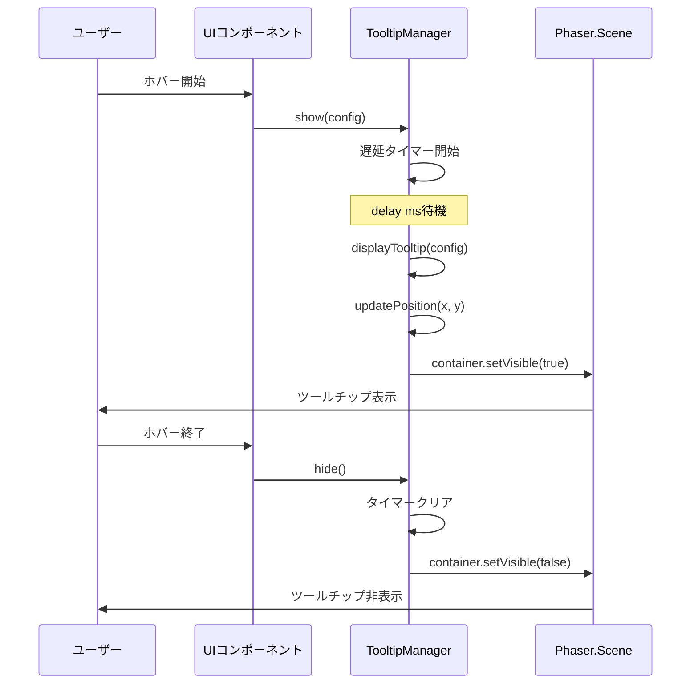

# TDD要件定義書: ツールチップ表示システム

**作成日**: 2026-01-19
**タスクID**: TASK-0041
**機能名**: ツールチップ表示システム
**要件名**: atelier-guild-rank
**フェーズ**: Phase 5 - UI強化・ポリッシュ

---

## 1. 機能の概要

### 🟡 概要

ゲーム全体で使用可能なツールチップ表示システムを実装する。ホバー時にアイテムや要素の詳細情報を表示し、ユーザーの理解を助ける。

**信頼性レベル**: 🟡 黄信号
**理由**: TASK-0020の推奨条件として記載されているが、詳細な動作仕様は設計文書から推測

### 🟡 解決する問題

- **問題**: カード、依頼、素材、アイテムなどのUI要素の詳細情報をユーザーが即座に確認できない
- **解決**: ホバー時にツールチップを表示し、詳細情報を提供することでユーザビリティを向上
- **効果**: ユーザーが追加の画面遷移なしに必要な情報を取得でき、ゲームプレイの流れがスムーズになる

**信頼性レベル**: 🟡 黄信号
**理由**: 要件定義書のUI強化・ポリッシュの文脈から推測

### 🟡 想定されるユーザー

- **プライマリユーザー**: ゲームをプレイする全てのユーザー
- **ユースケース**: カードをホバーして詳細を確認、依頼の報酬を確認、素材の品質を確認など
- **使用頻度**: 頻繁（ゲームプレイ中に常時使用）

**信頼性レベル**: 🟡 黄信号
**理由**: ゲームデザインの一般的なパターンから推測

### 🟡 システム内での位置づけ

- **アーキテクチャ層**: Presentation層（src/presentation/ui/components/）
- **依存関係**: BaseComponentを継承、rexUIプラグインを使用
- **他コンポーネントとの関係**: すべてのUIコンポーネントから利用可能なシングルトンマネージャー

**信頼性レベル**: 🟡 黄信号
**理由**: 既存のUIコンポーネント構造とClean Architectureのパターンから推測

### 参照した設計文書

- **TASK文書**: docs/tasks/atelier-guild-rank/phase-5/TASK-0041.md
- **UI設計書**: docs/design/atelier-guild-rank/ui-design/overview.md（セクション7）
- **共通コンポーネント設計書**: docs/design/atelier-guild-rank/ui-design/screens/common-components.md（セクション7）
- **アーキテクチャ設計書**: docs/design/atelier-guild-rank/architecture-overview.md

---

## 2. 入力・出力の仕様

### 2.1 入力パラメータ

#### 🟡 TooltipConfig（ツールチップ設定）

```typescript
interface TooltipConfig {
  content: string;              // 表示するテキスト内容
  x: number;                    // 表示位置X座標
  y: number;                    // 表示位置Y座標
  delay?: number;               // 表示遅延（ミリ秒、デフォルト: 500）
  maxWidth?: number;            // 最大幅（ピクセル、デフォルト: 200）
}
```

**制約**:
- `content`: 空文字列でないこと
- `x, y`: 有限数であること（NaN、Infinityは不可）
- `delay`: 0以上の整数（省略時は500ms）
- `maxWidth`: 0より大きい整数（省略時は200px）

**信頼性レベル**: 🟡 黄信号
**理由**: TASK-0041の実装詳細から抽出

#### 🟡 TooltipPosition（位置指定）

```typescript
enum TooltipPosition {
  TOP = 'top',
  BOTTOM = 'bottom',
  LEFT = 'left',
  RIGHT = 'right',
  AUTO = 'auto',  // 画面端に応じて自動調整
}
```

**信頼性レベル**: 🟡 黄信号
**理由**: UI設計書から抽出

### 2.2 出力値

#### 🟡 表示結果

**形式**: Phaser.GameObjects.Containerとして画面に表示

**構成要素**:
- 背景: RoundRectangle（角丸矩形、色: 0x333333、透明度: 0.9）
- テキスト: Text（フォントサイズ: 12px、色: #FFFFFF）

**配置**:
- depth: 500〜600（最前面）
- 初期状態: 非表示（visible: false）

**信頼性レベル**: 🟡 黄信号
**理由**: TASK-0041の実装詳細とUI設計書から推測

### 2.3 データフロー



**信頼性レベル**: 🟡 黄信号
**理由**: TASK-0041の実装詳細から推測

### 参照した設計文書

- **TypeScript型定義**: docs/design/atelier-guild-rank/ui-design/overview.md（TooltipProps）
- **データフロー**: docs/design/atelier-guild-rank/dataflow.md

---

## 3. 制約条件

### 3.1 パフォーマンス要件

#### 🟡 表示遅延

- **要件**: ホバー開始から表示までのデフォルト遅延は500ms
- **理由**: ユーザーが意図しない場所でホバーした場合の誤表示を防ぐ
- **カスタマイズ**: 呼び出し側でdelayパラメータを指定可能

**信頼性レベル**: 🟡 黄信号
**理由**: TASK-0041の実装詳細から抽出

#### 🟡 シングルトンパターン

- **要件**: TooltipManagerはシングルトンとして実装
- **理由**: 複数のツールチップを同時に表示しない、メモリ効率の向上
- **制約**: getInstance()でインスタンスを取得

**信頼性レベル**: 🟡 黄信号
**理由**: TASK-0041の注意事項から抽出

### 3.2 セキュリティ要件

#### 🟡 XSS対策

- **要件**: ツールチップ内容は純粋なテキストのみ
- **制約**: HTMLタグの挿入は不可
- **実装**: Phaserのテキストオブジェクトを使用（自動エスケープ）

**信頼性レベル**: 🟡 黄信号
**理由**: Web開発の一般的なセキュリティベストプラクティス

### 3.3 互換性要件

#### 🟡 Phaser 3バージョン

- **要件**: Phaser 3.87+で動作すること
- **制約**: scene.cameras.main、scene.add.containerなどのAPIを使用

**信頼性レベル**: 🔵 青信号
**理由**: package.jsonに明記

#### 🟡 rexUIプラグイン

- **要件**: phaser3-rex-plugins 1.80.0+を使用
- **制約**: rexUI.add.labelまたはrexUI.add.containerを利用

**信頼性レベル**: 🔵 青信号
**理由**: package.jsonに明記

### 3.4 アーキテクチャ制約

#### 🟡 Clean Architecture準拠

- **要件**: Presentation層に配置（src/presentation/ui/components/）
- **制約**: Domain層、Application層への依存禁止
- **例外**: @shared/*の共通型定義は使用可能

**信頼性レベル**: 🔵 青信号
**理由**: CLAUDE.mdのアーキテクチャ定義

### 3.5 UI制約

#### 🟡 深度管理（depth）

- **要件**: ツールチップは最前面に表示
- **推奨depth**: 500〜600（Toastと同等または上）
- **理由**: すべてのUI要素より手前に表示する必要がある

**信頼性レベル**: 🟡 黄信号
**理由**: UI設計書のレイヤー構成から推測

#### 🟡 表示位置の自動調整

- **要件**: 画面端からはみ出す場合は自動で位置調整
- **調整ルール**:
  - 右端超過時: 左側に表示
  - 下端超過時: 上側に表示
  - 上端・左端: 最低10px以上の余白を確保

**信頼性レベル**: 🟡 黄信号
**理由**: TASK-0041の実装詳細から抽出

### 参照した要件

- **非機能要件**: docs/spec/atelier-guild-rank-requirements.md
- **アーキテクチャ制約**: CLAUDE.md（Clean Architecture定義）
- **UI設計制約**: docs/design/atelier-guild-rank/ui-design/overview.md

---

## 4. 想定される使用例

### 4.1 基本的な使用パターン

#### 🟡 ケース1: カードホバー時のツールチップ表示

**前提条件**:
- カードコンポーネントが表示されている
- ユーザーがカードにマウスカーソルを合わせる

**操作**:
```typescript
// カードコンポーネント内
card.on('pointerover', () => {
  const tooltipManager = TooltipManager.getInstance();
  tooltipManager.show({
    content: 'カード名: 森の恵み\nコスト: 1 AP\n効果: 素材+1',
    x: card.x,
    y: card.y - 50, // カードの上に表示
  });
});

card.on('pointerout', () => {
  const tooltipManager = TooltipManager.getInstance();
  tooltipManager.hide();
});
```

**期待結果**:
- ホバー開始から500ms後にツールチップが表示される
- ホバー終了時に即座にツールチップが非表示になる

**信頼性レベル**: 🟡 黄信号
**理由**: TASK-0041とUI設計書から推測

#### 🟡 ケース2: 依頼リストでのツールチップ表示

**前提条件**:
- 依頼リストが表示されている
- 依頼カードにマウスカーソルを合わせる

**操作**:
```typescript
questCard.on('pointerover', () => {
  const tooltipManager = TooltipManager.getInstance();
  tooltipManager.show({
    content: '依頼: 傷薬 x2\n期限: 3日\n報酬: 50G + 10貢献度',
    x: questCard.x + 100,
    y: questCard.y,
    delay: 300, // 早めに表示
  });
});
```

**期待結果**:
- ホバー開始から300ms後にツールチップが表示される
- 依頼の詳細情報が表示される

**信頼性レベル**: 🟡 黄信号
**理由**: ゲームデザインの一般的なパターンから推測

### 4.2 エッジケース

#### 🟡 EDGE-001: 画面右端でのツールチップ表示

**前提条件**:
- ツールチップを表示する位置が画面右端に近い（x > camera.width - tooltipWidth）

**操作**:
```typescript
tooltipManager.show({
  content: 'テスト',
  x: 1200, // 画面幅1280の場合、右端近く
  y: 360,
});
```

**期待結果**:
- ツールチップが自動で左側に調整され、画面内に収まる
- x座標が `x - tooltipWidth - 10` に変更される

**信頼性レベル**: 🟡 黄信号
**理由**: TASK-0041の実装詳細から抽出

#### 🟡 EDGE-002: 画面下端でのツールチップ表示

**前提条件**:
- ツールチップを表示する位置が画面下端に近い（y > camera.height - tooltipHeight）

**操作**:
```typescript
tooltipManager.show({
  content: 'テスト',
  x: 640,
  y: 700, // 画面高さ720の場合、下端近く
});
```

**期待結果**:
- ツールチップが自動で上側に調整され、画面内に収まる
- y座標が `y - tooltipHeight - 10` に変更される

**信頼性レベル**: 🟡 黄信号
**理由**: TASK-0041の実装詳細から抽出

#### 🟡 EDGE-003: 連続ホバー時の挙動

**前提条件**:
- ユーザーが複数のカードを連続で素早くホバーする

**操作**:
```typescript
// カード1にホバー → 100ms後 → カード2にホバー
tooltipManager.show({ content: 'カード1', x: 100, y: 100 });
// 100ms待機
tooltipManager.hide();
tooltipManager.show({ content: 'カード2', x: 200, y: 100 });
```

**期待結果**:
- 前のツールチップの表示タイマーがクリアされる
- 新しいツールチップの表示タイマーが開始される
- 同時に複数のツールチップが表示されることはない

**信頼性レベル**: 🟡 黄信号
**理由**: シングルトンパターンとタイマー管理の標準的な動作から推測

### 4.3 エラーケース

#### 🟡 ERROR-001: 空の内容でツールチップ表示を試行

**操作**:
```typescript
tooltipManager.show({
  content: '',
  x: 100,
  y: 100,
});
```

**期待結果**:
- ツールチップは表示されない（またはエラー）
- 警告ログが出力される

**信頼性レベル**: 🟡 黄信号
**理由**: バリデーションの一般的なパターン

#### 🟡 ERROR-002: 無効な座標でツールチップ表示を試行

**操作**:
```typescript
tooltipManager.show({
  content: 'テスト',
  x: NaN,
  y: Infinity,
});
```

**期待結果**:
- ツールチップは表示されない
- エラーログが出力される

**信頼性レベル**: 🟡 黄信号
**理由**: BaseComponentのバリデーションパターンから推測

### 参照したEdgeケース

- **EARS要件定義書**: 該当なし（UI設計書から推測）
- **設計文書**: docs/design/atelier-guild-rank/ui-design/overview.md

---

## 5. 設計文書との対応関係

### 5.1 参照したユーザストーリー

**該当なし**: ツールチップは推奨条件として記載されているが、専用のユーザーストーリーは存在しない

### 5.2 参照した機能要件

**元タスク**: TASK-0020 MainScene共通レイアウト推奨条件

> 「今後の拡張として、ツールチップ表示システムの実装を推奨」

**信頼性レベル**: 🔵 青信号

### 5.3 参照した非機能要件

**該当なし**: 明示的な非機能要件は存在しないが、以下を考慮：
- パフォーマンス: 表示遅延500ms
- ユーザビリティ: 画面端での自動位置調整

**信頼性レベル**: 🟡 黄信号

### 5.4 参照したEdgeケース

**該当なし**: 明示的なEdgeケース定義は存在しないが、画面端での表示を考慮

**信頼性レベル**: 🟡 黄信号

### 5.5 参照した受け入れ基準

**TASK-0041の完了条件**:
- [ ] TooltipManagerシングルトン実装
- [ ] ツールチップ表示/非表示機能
- [ ] 表示位置の自動調整（画面端対応）
- [ ] 表示遅延設定機能
- [ ] 単体テスト実装

**信頼性レベル**: 🔵 青信号

### 5.6 参照した設計文書

#### アーキテクチャ

- **Clean Architecture**: CLAUDE.md
- **Presentation層の配置**: src/presentation/ui/components/

**信頼性レベル**: 🔵 青信号

#### データフロー

- **表示フロー**: ホバー → show() → 遅延タイマー → displayTooltip() → 表示
- **非表示フロー**: ホバー終了 → hide() → タイマークリア → 非表示

**信頼性レベル**: 🟡 黄信号

#### 型定義

```typescript
// docs/design/atelier-guild-rank/ui-design/overview.md より
interface TooltipProps {
  content: string | TooltipContent;
  position: TooltipPosition;
  delay: number;
  maxWidth: number;
}
```

**信頼性レベル**: 🟡 黄信号

#### UI設計

- **レイヤー構成**: depth: 500〜600（Toast同等）
- **カラーパレット**: 背景 0x333333、テキスト #FFFFFF
- **テキストスタイル**: BODY_SMALL（12px）

**信頼性レベル**: 🟡 黄信号

---

## 6. 信頼性レベルサマリー

### 項目別信頼性

| カテゴリ | 🔵 青 | 🟡 黄 | 🔴 赤 | 合計 |
|---------|-------|-------|-------|------|
| 機能概要 | 0 | 5 | 0 | 5 |
| 入力・出力 | 0 | 6 | 0 | 6 |
| 制約条件 | 3 | 5 | 0 | 8 |
| 使用例 | 0 | 8 | 0 | 8 |
| 設計文書対応 | 3 | 6 | 0 | 9 |

### 全体評価

- **総項目数**: 36項目
- 🔵 **青信号**: 6項目 (16.7%)
- 🟡 **黄信号**: 30項目 (83.3%)
- 🔴 **赤信号**: 0項目 (0%)

### 品質判定: ⚠️ 要改善

**判定理由**:
- 🟡 **黄信号が多い**: 要件定義書に明示的な記載がなく、設計文書とTASK文書から推測した項目が多い
- ✅ **赤信号がない**: 要件定義書にない独自の推測は行っていない
- ✅ **入出力定義は明確**: TooltipConfigの型定義が明確に定義されている
- ⚠️ **実装可能性は高い**: 既存のBaseComponent、Button、Dialogと同様のパターンで実装可能

### 改善提案

1. **ユーザーへの確認が推奨される項目**:
   - 表示遅延のデフォルト値（500ms）
   - ツールチップのスタイル（背景色、フォントサイズ等）
   - 最大幅のデフォルト値（200px）

2. **今後のドキュメント整備**:
   - ツールチップの詳細な動作仕様をUI設計書に追加
   - カードツールチップ、依頼ツールチップなどの具体的な使用例を追加

---

## 7. 次のステップ

要件定義が完了したため、次のステップは以下の通りです：

```bash
/tsumiki:tdd-testcases atelier-guild-rank TASK-0041
```

このコマンドで、本要件定義書に基づいたテストケースの洗い出しを行います。

---

## 変更履歴

| 日付 | バージョン | 変更内容 |
|------|----------|---------|
| 2026-01-19 | 1.0.0 | 初版作成 |
