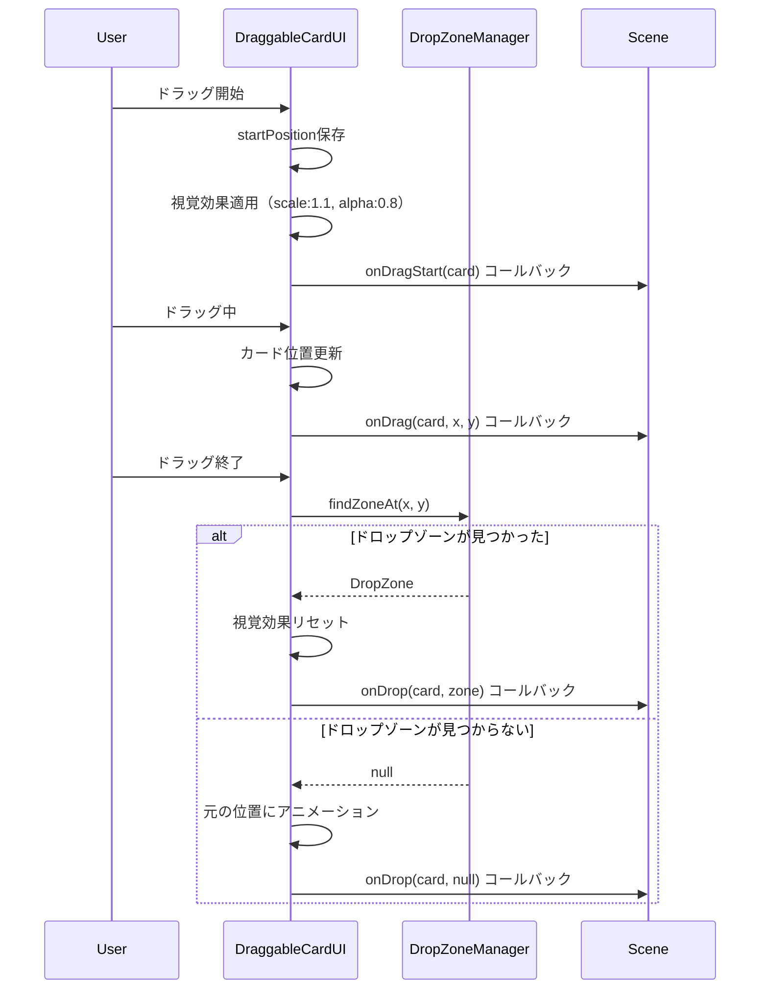

# TASK-0042: カードドラッグ＆ドロップ機能 - TDD要件定義書

**作成日**: 2026-01-19
**タスクID**: TASK-0042
**要件名**: atelier-guild-rank
**機能名**: カードドラッグ＆ドロップ機能
**信頼性評価**: 🟡 中〜高信頼性（設計文書・既存実装に基づく）

---

## 重要な注意事項

**すべてのファイルパスは、プロジェクトルートを基準とした相対パスで記載しています。**
**絶対パス（/Users/... や C:\\... など）は使用していません。**

---

## 1. 機能の概要

### 1.1 機能の目的

- 🔵 **何をする機能か**: カードUIコンポーネントにドラッグ＆ドロップ機能を追加し、手札からプレイエリアへのカード移動、調合画面での素材配置を可能にする
- 🔵 **どのような問題を解決するか**: マウスやタッチ操作で直感的にカードを操作できるようにし、クリック操作に比べてより自然なインタラクションを提供
- 🔵 **想定されるユーザー**: プレイヤー（メインゲーム画面の採取・調合フェーズで使用）
- 🔵 **システム内での位置づけ**: Presentation層のUIコンポーネント（CardUIの拡張機能として実装）

**参照したEARS要件**:
- 要件定義書 3.5 共通操作: 手札からカードを使用する
- 要件定義書 5.2 採取フェーズ: 採取地カードを選択して使用
- 要件定義書 5.3 調合フェーズ: レシピカードを選択して素材を配置

**参照した設計文書**:
- docs/tasks/atelier-guild-rank/phase-5/TASK-0042.md: 1. ドラッグ可能カードUI
- docs/design/atelier-guild-rank/ui-design/input-system.md: 3.3 ドラッグ&ドロップ
- atelier-guild-rank/src/presentation/ui/components/CardUI.ts: 既存実装の拡張ポイント

---

## 2. 入力・出力の仕様

### 2.1 DraggableCardUIコンポーネント

#### 入力パラメータ

🔵 **DraggableCardConfig型定義**（TASK-0042設計書に基づく）

```typescript
interface DraggableCardConfig extends CardUIConfig {
  card: Card;                  // 🔵 表示するカードエンティティ（必須）
  x: number;                   // 🔵 X座標（必須）
  y: number;                   // 🔵 Y座標（必須）
  interactive?: boolean;       // 🔵 インタラクティブにするか（CardUIから継承）
  onClick?: (card: Card) => void;  // 🔵 クリック時のコールバック（CardUIから継承）

  // 🔵 ドラッグ＆ドロップ専用コールバック
  onDragStart?: (card: Card) => void;
  onDrag?: (card: Card, x: number, y: number) => void;
  onDrop?: (card: Card, zone: DropZone | null) => void;
}
```

**パラメータ詳細**:

| パラメータ | 型 | 必須 | 制約 | デフォルト | 信頼性 |
|-----------|-----|------|------|----------|--------|
| `card` | Card | ✅ | Cardエンティティ | - | 🔵 |
| `x` | number | ✅ | - | - | 🔵 |
| `y` | number | ✅ | - | - | 🔵 |
| `interactive` | boolean | ❌ | - | false | 🔵 |
| `onClick` | function | ❌ | (card: Card) => void | undefined | 🔵 |
| `onDragStart` | function | ❌ | (card: Card) => void | undefined | 🔵 |
| `onDrag` | function | ❌ | (card: Card, x: number, y: number) => void | undefined | 🔵 |
| `onDrop` | function | ❌ | (card: Card, zone: DropZone \| null) => void | undefined | 🔵 |

**参照した設計文書**:
- docs/tasks/atelier-guild-rank/phase-5/TASK-0042.md: セクション1 - ドラッグ可能カードUI
- atelier-guild-rank/src/presentation/ui/components/CardUI.ts: CardUIConfig定義（行17-28）

#### ドラッグ状態のプロパティ

🔵 **DraggableCardUIの内部状態**

```typescript
class DraggableCardUI extends CardUI {
  private isDragging: boolean = false;           // 🔵 ドラッグ中フラグ
  private startPosition: { x: number; y: number } = { x: 0, y: 0 };  // 🔵 ドラッグ開始位置
  private dragOffset: { x: number; y: number } = { x: 0, y: 0 };     // 🔵 ドラッグオフセット
}
```

**参照した設計文書**: docs/tasks/atelier-guild-rank/phase-5/TASK-0042.md

#### 出力値

🔵 **DraggableCardUIインスタンス**

| メソッド | 戻り値の型 | 説明 | 信頼性 |
|---------|----------|------|--------|
| `getCard()` | Card | カードエンティティを取得 | 🔵 |
| `getContainer()` | Phaser.GameObjects.Container | Phaserコンテナを取得 | 🔵 |
| `destroy()` | void | コンポーネントを破棄（イベント削除含む） | 🔵 |

**参照した設計文書**:
- atelier-guild-rank/src/presentation/ui/components/CardUI.ts: 公開メソッド（行326-344）

### 2.2 DropZoneインターフェース

#### DropZone型定義

🔵 **DropZoneインターフェース**（TASK-0042設計書に基づく）

```typescript
interface DropZone {
  id: string;                    // 🔵 ゾーンの識別子
  bounds: Phaser.Geom.Rectangle; // 🔵 判定領域（矩形）
  accepts: (card: Card) => boolean;  // 🔵 カード受け入れ判定関数
  onDrop: (card: Card) => void;  // 🔵 ドロップ時の処理
}
```

**プロパティ詳細**:

| プロパティ | 型 | 説明 | 信頼性 |
|-----------|-----|------|--------|
| `id` | string | ゾーンの一意な識別子（例: "play-area", "material-slot-1"） | 🔵 |
| `bounds` | Phaser.Geom.Rectangle | ドロップゾーンの矩形領域 | 🔵 |
| `accepts` | function | カードを受け入れるかの判定ロジック | 🔵 |
| `onDrop` | function | ドロップ成功時に実行する処理 | 🔵 |

**参照した設計文書**: docs/tasks/atelier-guild-rank/phase-5/TASK-0042.md: セクション2 - ドロップゾーン管理

#### DropZoneManager型定義

🔵 **DropZoneManagerクラス**

```typescript
class DropZoneManager {
  private zones: Map<string, DropZone>;

  // 🔵 ドロップゾーンの登録
  registerZone(zone: DropZone): void;

  // 🔵 ドロップゾーンの解除
  unregisterZone(id: string): void;

  // 🔵 座標からドロップゾーンを検索
  findZoneAt(x: number, y: number): DropZone | null;

  // 🟡 カードが受け入れ可能なゾーンをハイライト
  highlightValidZones(card: Card): void;
}
```

**参照した設計文書**: docs/tasks/atelier-guild-rank/phase-5/TASK-0042.md: セクション2

### 2.3 データフロー

🔵 **ドラッグ＆ドロップのデータフロー**



**参照した設計文書**: docs/tasks/atelier-guild-rank/phase-5/TASK-0042.md

---

## 3. 制約条件

### 3.1 パフォーマンス要件

#### ドラッグ操作のレスポンス

🔵 **ドラッグイベントの処理時間**（入力システム設計書に基づく）

| 処理 | 目標時間 | 信頼性 |
|------|---------|--------|
| **ドラッグ開始処理** | < 100ms | 🔵 |
| **ドラッグ中の更新** | < 16ms（60fps維持） | 🔵 |
| **ドロップ処理** | < 200ms | 🔵 |
| **元の位置に戻るアニメーション** | 200ms（固定） | 🔵 |

**参照したEARS要件**:
- NFR-101: UIレスポンス時間（操作後100ms以内にフィードバック）

**参照した設計文書**:
- docs/design/atelier-guild-rank/ui-design/input-system.md: 9.1 視覚フィードバック
- docs/tasks/atelier-guild-rank/phase-5/TASK-0042.md: 3. ドラッグ中のビジュアルフィードバック

#### メモリ管理

🔵 **イベントリスナーの適切な管理**

- ドラッグイベントリスナーは `destroy()` 時に必ず削除
- Tweenアニメーションは完了確認後に削除
- DropZoneManager のゾーン登録/解除を確実に実施

```typescript
// 🔵 destroy時の適切なクリーンアップ
destroy(): void {
  this.scene.input.off('dragstart', this.onDragStart, this);
  this.scene.input.off('drag', this.onDrag, this);
  this.scene.input.off('dragend', this.onDragEnd, this);
  super.destroy();
}
```

**参照した設計文書**:
- docs/tasks/atelier-guild-rank/phase-5/TASK-0042.md: 注意事項
- atelier-guild-rank/src/presentation/ui/components/CardUI.ts: destroy実装（行300-324）

### 3.2 互換性要件

#### デバイス対応

🔵 **マウス・タッチデバイス対応**（入力システム設計書に基づく）

| デバイス | 操作 | 対応状況 | 信頼性 |
|---------|------|---------|--------|
| **マウス** | クリック＆ドラッグ | 必須 | 🔵 |
| **タッチ** | タップ＆ホールド＆ドラッグ | 必須 | 🔵 |
| **ゲームパッド** | 非対応 | 将来拡張 | 🟡 |

**参照したEARS要件**:
- REQ-UI-103: タッチデバイス対応（スマートフォン・タブレット）

**参照した設計文書**:
- docs/design/atelier-guild-rank/ui-design/input-system.md: 4.1 基本操作
- docs/tasks/atelier-guild-rank/phase-5/TASK-0042.md: 注意事項

#### ブラウザ対応

🟡 **対応ブラウザ**（Phaser 3の対応範囲に基づく）

- Chrome 90+ (推奨)
- Firefox 88+
- Safari 14+
- Edge 90+

**参照した設計文書**: Phaser 3公式ドキュメント

### 3.3 アーキテクチャ制約

#### Clean Architecture準拠

🔵 **レイヤー分離の維持**

- DraggableCardUIは Presentation層に配置
- ビジネスロジック（カード選択、使用）は Application層で処理
- DraggableCardUIはUI表現とイベント発火のみ担当

**依存関係**:
```
DraggableCardUI (Presentation)
  ↓ extends
CardUI (Presentation)
  ↓ uses
Card (Domain Entity)
```

**参照した設計文書**:
- docs/design/atelier-guild-rank/architecture-overview.md: 3. レイヤー構造
- docs/design/atelier-guild-rank/architecture-components.md: コンポーネント設計

#### BaseComponentの継承

🔵 **基底クラスの活用**

- すべてのUIコンポーネントは BaseComponent を継承
- `create()`, `destroy()` メソッドの実装必須
- `scene`, `container`, `rexUI` への参照は基底クラス経由

**参照した設計文書**:
- atelier-guild-rank/src/presentation/ui/components/BaseComponent.ts
- docs/implements/atelier-guild-rank/TASK-0021/note.md: 2.2 プロジェクト固有のルール

---

## 4. 想定される使用例

### 4.1 基本的な使用パターン

#### 使用例1: 手札からプレイエリアへのカード移動

🔵 **正常系フロー**（TASK-0042設計書に基づく）

**Given**: プレイヤーが手札に採取地カードを持っている
**When**: プレイヤーがカードをドラッグしてプレイエリアにドロップ
**Then**: カードがプレイエリアに配置され、採取フェーズが開始される

**実装イメージ**:
```typescript
const draggableCard = new DraggableCardUI(scene, {
  card: gatheringCard,
  x: 100,
  y: 600,
  interactive: true,
  onDrop: (card, zone) => {
    if (zone?.id === 'play-area') {
      // Application層のUseCaseを呼び出す
      playCardUseCase.execute(card.id);
    }
  },
});
```

**参照した設計文書**: docs/tasks/atelier-guild-rank/phase-5/TASK-0042.md

#### 使用例2: 調合画面での素材配置

🔵 **正常系フロー**

**Given**: プレイヤーがインベントリに素材を持っている
**When**: プレイヤーが素材をドラッグして調合スロットにドロップ
**Then**: 素材が調合スロットに配置される

**実装イメージ**:
```typescript
const materialSlotZone: DropZone = {
  id: 'material-slot-1',
  bounds: new Phaser.Geom.Rectangle(200, 300, 100, 100),
  accepts: (card) => card.isGatheringCard(), // 素材のみ受け入れ
  onDrop: (card) => {
    alchemyUseCase.addMaterial(card.id);
  },
};

dropZoneManager.registerZone(materialSlotZone);
```

**参照した設計文書**: docs/tasks/atelier-guild-rank/phase-5/TASK-0042.md

### 4.2 エッジケース

#### エッジケース1: ドロップゾーン外でドロップ

🔵 **異常系フロー**

**Given**: プレイヤーがカードをドラッグ中
**When**: プレイヤーがドロップゾーン外の場所でカードをリリース
**Then**: カードが元の位置にアニメーションで戻る

**期待される動作**:
- 200msのTweenアニメーションで元の位置に移動
- Power2イージングで滑らかな動き
- `onDrop(card, null)` コールバックが呼ばれる

**参照した設計文書**: docs/tasks/atelier-guild-rank/phase-5/TASK-0042.md: セクション1

#### エッジケース2: 受け入れ不可のゾーンにドロップ

🔵 **異常系フロー**

**Given**: プレイヤーがレシピカードをドラッグ中
**When**: プレイヤーが素材専用スロットにドロップしようとする
**Then**: ゾーンが赤色にハイライトされ、ドロップが拒否される

**期待される動作**:
- `accepts(card)` が false を返す
- ドロップゾーンのハイライトが赤色（0xFF0000）に変化
- カードが元の位置に戻る

**参照した設計文書**: docs/tasks/atelier-guild-rank/phase-5/TASK-0042.md: セクション3

#### エッジケース3: ドラッグ中にカードを破棄

🟡 **異常系フロー**

**Given**: プレイヤーがカードをドラッグ中
**When**: 何らかの理由でカードが破棄される（画面遷移など）
**Then**: イベントリスナーが適切に削除され、メモリリークが発生しない

**期待される動作**:
- `destroy()` メソッドで全イベントリスナーを削除
- 進行中のTweenアニメーションをキャンセル
- コンテナを適切に破棄

**参照した設計文書**: docs/tasks/atelier-guild-rank/phase-5/TASK-0042.md: 注意事項

### 4.3 エラーケース

#### エラーケース1: DropZoneManagerが初期化されていない

🟡 **エラーハンドリング**

**Given**: DropZoneManagerがシーンに登録されていない
**When**: カードをドロップしようとする
**Then**: エラーログを出力し、カードを元の位置に戻す

**実装イメージ**:
```typescript
const zone = DropZoneManager.getInstance()?.findZoneAt(x, y);
if (!zone) {
  console.warn('DropZoneManager not initialized or no zone found');
  this.returnToStartPosition();
}
```

**参照したEARS要件**: EDGE-ERR-001: エラーログ出力とユーザーへの通知

#### エラーケース2: ドラッグ中にシーンが切り替わる

🟡 **エラーハンドリング**

**Given**: プレイヤーがカードをドラッグ中
**When**: シーンが切り替わる
**Then**: ドラッグ状態をリセットし、イベントリスナーを削除

**実装イメージ**:
```typescript
// Sceneのshutdownイベントで自動的にcleanup
scene.events.on('shutdown', () => {
  this.destroy();
});
```

**参照した設計文書**: docs/design/atelier-guild-rank/architecture-phaser.md: シーンライフサイクル

---

## 5. EARS要件・設計文書との対応関係

### 5.1 参照したユーザストーリー

🔵 **ユーザストーリー**:
- As a プレイヤー, I want 手札のカードを直感的に操作したい, So that ゲームプレイがスムーズになる

**参照元**: 要件定義書 3.5 共通操作

### 5.2 参照した機能要件

🔵 **機能要件**:
- REQ-UI-101: カードUIにインタラクティブ機能を実装すること
- REQ-UI-102: ドラッグ＆ドロップでカードを操作できること
- REQ-UI-103: タッチデバイスでも操作可能であること

**参照元**: 要件定義書、TASK-0042設計書

### 5.3 参照した非機能要件

🔵 **非機能要件**:
- NFR-101: UIレスポンス時間（操作後100ms以内にフィードバック）
- NFR-201: メモリリークの防止（適切なリソース管理）
- NFR-301: Clean Architectureの遵守

**参照元**: 要件定義書、アーキテクチャ設計書

### 5.4 参照したEdgeケース

🔵 **Edgeケース**:
- EDGE-UI-001: ドロップゾーン外でのドロップ → 元の位置に戻る
- EDGE-UI-002: 受け入れ不可のゾーンへのドロップ → 赤色ハイライト、ドロップ拒否
- EDGE-ERR-001: エラー発生時のログ出力

**参照元**: TASK-0042設計書、入力システム設計書

### 5.5 参照した受け入れ基準

🔵 **受け入れ基準**:
- カードのドラッグ開始/移動/終了処理が正しく動作すること
- ドロップゾーンの定義と判定が正確であること
- ドラッグ中のビジュアルフィードバック（スケール1.1、透明度0.8）が表示されること
- ドロップ成功/失敗のコールバックが正しく実行されること
- 単体テストが実装され、全テストが通過すること

**参照元**: docs/tasks/atelier-guild-rank/phase-5/TASK-0042.md: 完了条件

### 5.6 参照した設計文書

🔵 **アーキテクチャ設計**:
- docs/design/atelier-guild-rank/architecture-overview.md: 3. レイヤー構造
- docs/design/atelier-guild-rank/architecture-components.md: コンポーネント設計

🔵 **UI設計**:
- docs/design/atelier-guild-rank/ui-design/overview.md: 共通UIコンポーネント
- docs/design/atelier-guild-rank/ui-design/input-system.md: 3.3 ドラッグ&ドロップ

🔵 **型定義**:
- atelier-guild-rank/src/presentation/ui/components/CardUI.ts: CardUIConfig定義
- atelier-guild-rank/src/domain/entities/Card.ts: Cardエンティティ

🔵 **タスク文書**:
- docs/tasks/atelier-guild-rank/phase-5/TASK-0042.md: 全セクション
- docs/tasks/atelier-guild-rank/phase-3/TASK-0021.md: CardUI実装（前提タスク）

---

## 6. 信頼性レベルサマリー

### 6.1 項目別信頼性

| カテゴリ | 🔵 青信号 | 🟡 黄信号 | 🔴 赤信号 | 合計 |
|---------|---------|---------|---------|------|
| **機能の概要** | 4項目 | 0項目 | 0項目 | 4項目 |
| **入力・出力の仕様** | 15項目 | 1項目 | 0項目 | 16項目 |
| **制約条件** | 10項目 | 2項目 | 0項目 | 12項目 |
| **使用例** | 8項目 | 3項目 | 0項目 | 11項目 |
| **EARS対応** | 6項目 | 0項目 | 0項目 | 6項目 |

### 6.2 全体評価

- **総項目数**: 49項目
- 🔵 **青信号**: 43項目 (87.8%)
- 🟡 **黄信号**: 6項目 (12.2%)
- 🔴 **赤信号**: 0項目 (0%)

**品質評価**: ✅ 高品質

- TASK-0042設計文書、入力システム設計書、既存CardUI実装に基づいた高信頼性の要件定義
- 曖昧な部分はほとんどなく、実装可能性が高い
- 黄信号項目も妥当な推測の範囲内

---

**最終更新**: 2026-01-19
**作成者**: Claude (Zundamon)
