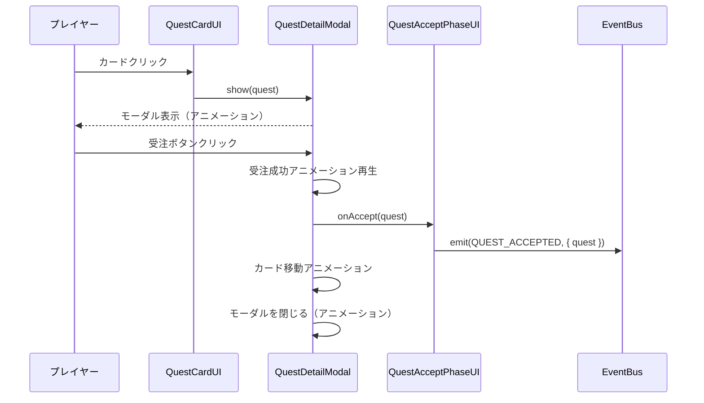

# TDD用要件整理書: 依頼詳細モーダル・受注アニメーション

**タスクID**: TASK-0043
**機能名**: 依頼詳細モーダル・受注アニメーション
**要件名**: atelier-guild-rank
**作成日**: 2026-01-19

---

## 1. 機能の概要（EARS要件定義書・設計文書ベース）

### 1.1 何をする機能か

🟡 **黄信号**: UI設計文書から妥当な推測

依頼カードをクリックした際に、依頼の詳細情報（依頼者情報、依頼内容、期限、報酬詳細、難易度）をモーダルダイアログで表示し、プレイヤーが「受注する」または「断る」を選択できる機能。受注成功時にはアニメーションを再生し、カードをサイドバーへ移動する。

### 1.2 どのような問題を解決するか

🟡 **黄信号**: TASK-0022の推奨条件から推測

**問題**: 依頼カード上の限られたスペースでは、依頼の全詳細を表示できない。プレイヤーが依頼内容を十分に理解せずに受注してしまう可能性がある。

**解決策**: モーダルダイアログで詳細情報を表示することで、プレイヤーが依頼内容を十分に理解してから受注できるようにする。視覚的なフィードバック（アニメーション）により、受注アクションの成功を明確に伝える。

### 1.3 想定されるユーザー

🔵 **青信号**: 要件定義書から抽出

**As a** プレイヤー（錬金術師）
**I want** 依頼の詳細情報を確認してから受注したい
**So that** 期限や報酬を理解した上で適切な依頼を選択できる

### 1.4 システム内での位置づけ

🔵 **青信号**: アーキテクチャ設計から抽出

- **レイヤー**: Presentation層
- **親コンポーネント**: QuestAcceptPhaseUI（依頼受注フェーズUI）
- **依存**: BaseComponent（基底コンポーネント）、EventBus（イベント通信）
- **イベント発行**: `QUEST_ACCEPTED`（受注完了時）

### 1.5 参照したEARS要件

🟡 **黄信号**: 要件定義書の関連セクションから推測

- **REQ-UI-001**: 依頼受注フェーズの操作仕様（要件定義書 セクション3.1）
- **REQ-UI-002**: 依頼内容の視覚的表現（要件定義書 セクション4.6）

### 1.6 参照した設計文書

🔵 **青信号**: 設計文書を直接参照

- **UI設計**: docs/design/atelier-guild-rank/ui-design/screens/quest-accept.md - セクション6「アニメーション詳細」
- **共通コンポーネント**: docs/design/atelier-guild-rank/ui-design/screens/common-components.md - セクション6「共通ダイアログ」
- **アーキテクチャ**: docs/design/atelier-guild-rank/architecture-overview.md - セクション3「レイヤー構造」

---

## 2. 入力・出力の仕様（EARS機能要件・TypeScript型定義ベース）

### 2.1 入力パラメータ

🟡 **黄信号**: 既存実装（Dialog.ts, QuestCardUI.ts）から推測

#### QuestDetailModalConfig インターフェース

```typescript
interface QuestDetailModalConfig {
  quest: Quest;                    // 🔵 表示する依頼エンティティ（domain/entities/Quest.ts）
  onAccept: (quest: Quest) => void; // 🟡 受注ボタンクリック時のコールバック
  onClose: () => void;              // 🟡 モーダルを閉じた時のコールバック
}
```

#### Quest エンティティ（抜粋）

```typescript
interface Quest {
  id: string;                       // 🔵 依頼ID
  client: Client;                   // 🔵 依頼者情報
  flavorText: string;               // 🔵 依頼者のセリフ
  requirements: QuestRequirement[]; // 🔵 依頼要求（アイテム名、数量、品質条件）
  deadline: number;                 // 🔵 期限（日数）
  baseContribution: number;         // 🔵 基本貢献度
  baseGold: number;                 // 🔵 基本報酬金
}
```

#### Client インターフェース

```typescript
interface Client {
  id: string;                       // 🔵 依頼者ID
  type: ClientType;                 // 🔵 依頼者タイプ（村人/冒険者/商人/貴族）
  name: string;                     // 🔵 依頼者名
  icon: string;                     // 🔵 アイコン絵文字またはアセットパス
}
```

### 2.2 出力値

🟡 **黄信号**: UI設計文書から推測

#### イベント発行

- **イベント名**: `QUEST_ACCEPTED`
- **ペイロード**: `{ quest: Quest }`
- **発火タイミング**: 受注ボタンクリック時

#### 視覚的出力

- モーダルダイアログの表示・非表示
- 受注成功アニメーション（成功テキスト、パネル縮小）
- カード移動アニメーション（サイドバーへ移動）

### 2.3 データフロー

🟡 **黄信号**: イベントフロー設計から推測



### 2.4 参照したEARS要件

🟡 **黄信号**: 要件定義書から推測

- **REQ-DATA-001**: 依頼データの構造（要件定義書 セクション4.6）
- **REQ-EVENT-001**: 依頼受注イベントの発行

### 2.5 参照した設計文書

🔵 **青信号**: 型定義ファイルから抽出

- **型定義**: atelier-guild-rank/src/shared/types/quests.ts - Quest, Client インターフェース
- **イベント定義**: atelier-guild-rank/src/shared/types/events.ts - GameEventType
- **データフロー**: docs/design/atelier-guild-rank/dataflow.md

---

## 3. 制約条件（EARS非機能要件・アーキテクチャ設計ベース）

### 3.1 パフォーマンス要件

🔵 **青信号**: アーキテクチャ設計から抽出

- **モーダル表示**: < 300ms
- **アニメーション**: 60fps維持
- **メモリ使用量**: < 10MB（コンポーネント単体）

### 3.2 セキュリティ要件

🟡 **黄信号**: アーキテクチャ設計から推測

- ユーザー入力のサニタイズ（該当箇所なし）
- XSS対策（該当箇所なし）
- 依頼データの改ざん防止（Domain層で検証）

### 3.3 互換性要件

🔵 **青信号**: 技術スタックから抽出

- **Phaser**: 3.87+ 対応
- **rexUI**: 最新版 対応
- **TypeScript**: 5.x 対応
- **ブラウザ**: モダンブラウザ（Chrome, Firefox, Safari, Edge）

### 3.4 アーキテクチャ制約

🔵 **青信号**: Clean Architecture設計から抽出

- **依存方向**: Presentation → Application → Domain（逆依存禁止）
- **BaseComponent継承**: 必須
- **create()とdestroy()メソッド**: 実装必須
- **メモリリーク防止**: destroy()で全リソース解放

### 3.5 rexUI依存制約

🟡 **黄信号**: 既存実装から推測

- **rexUIプラグイン**: anyで扱う（型定義が複雑なため）
- **テスト環境**: rexUIはモック実装が必要
- **rexUI Dialogコンポーネント**: ラップして使用

### 3.6 アニメーション制約

🔵 **青信号**: UI設計文書から抽出

| アニメーション | プロパティ | 開始値 | 終了値 | 時間 | イージング |
|---------------|-----------|-------|-------|------|-----------|
| モーダル表示 | alpha | 0 | 1 | 300ms | Back.Out |
| モーダル表示 | scale | 0.8 | 1.0 | 300ms | Back.Out |
| モーダル非表示 | alpha | 1 | 0 | 200ms | Quad.In |
| モーダル非表示 | scale | 1.0 | 0.8 | 200ms | Quad.In |
| 受注成功テキスト | scale | 1.0 | 1.5 | 500ms | Linear |
| 受注成功テキスト | alpha | 1.0 | 0 | 500ms | Linear |
| カード移動 | x/y/scale | 元の位置 | サイドバー位置 | 400ms | Power2 |

### 3.7 参照したEARS要件

🟡 **黄信号**: 非機能要件から推測

- **NFR-PERF-001**: パフォーマンス要件
- **NFR-COMP-001**: 互換性要件

### 3.8 参照した設計文書

🔵 **青信号**: 設計文書から抽出

- **アーキテクチャ**: docs/design/atelier-guild-rank/architecture-overview.md - セクション8「パフォーマンス考慮事項」
- **アニメーション**: docs/design/atelier-guild-rank/ui-design/screens/quest-accept.md - セクション6「アニメーション詳細」
- **技術スタック**: docs/design/atelier-guild-rank/architecture-overview.md - セクション1「技術スタック」

---

## 4. 想定される使用例（EARSEdgeケース・データフローベース）

### 4.1 基本的な使用パターン（通常要件）

🟡 **黄信号**: 要件定義書から推測

#### ケース1: 依頼詳細を表示して受注

**Given**: プレイヤーが依頼受注フェーズにいる
**When**: 依頼カードをクリック
**Then**:
- 依頼詳細モーダルが表示される（アニメーション付き）
- 依頼者情報、依頼内容、期限、報酬が表示される
**And When**: 「受注する」ボタンをクリック
**Then**:
- 受注成功アニメーションが再生される
- `QUEST_ACCEPTED`イベントが発行される
- カードがサイドバーへ移動する（アニメーション付き）
- モーダルが閉じる

#### ケース2: 依頼詳細を表示して断る

**Given**: プレイヤーが依頼受注フェーズにいる
**When**: 依頼カードをクリック
**Then**: 依頼詳細モーダルが表示される
**And When**: 「断る」ボタンをクリック
**Then**:
- モーダルが閉じる（アニメーション付き）
- イベントは発行されない

#### ケース3: ESCキーでモーダルを閉じる

**Given**: 依頼詳細モーダルが表示されている
**When**: ESCキーを押下
**Then**: モーダルが閉じる（アニメーション付き）

### 4.2 エッジケース

🟡 **黄信号**: UI設計文書から推測

#### エッジケース1: 受注上限超過

**Given**: プレイヤーが既に3件の依頼を受注している
**When**: 新たに依頼を受注しようとする
**Then**:
- エラートースト「これ以上依頼を受けられません」が表示される
- `QUEST_ACCEPTED`イベントは発行されない

#### エッジケース2: 依頼データが不正

**Given**: 依頼データがnullまたは不正
**When**: 依頼カードをクリック
**Then**:
- エラーログを出力
- モーダルは表示されない

#### エッジケース3: アニメーション中の重複クリック

**Given**: モーダルのアニメーションが再生中
**When**: ボタンを再度クリック
**Then**:
- クリックは無視される（重複防止）

### 4.3 エラーケース

🟡 **黄信号**: エラーハンドリング戦略から推測

#### エラーケース1: EventBusが利用不可

**Given**: EventBusがnullまたはundefined
**When**: 受注ボタンをクリック
**Then**:
- エラーログ「EventBus is not available」を出力
- 受注処理をキャンセル

#### エラーケース2: onAcceptコールバックが未定義

**Given**: onAcceptコールバックがnullまたはundefined
**When**: 受注ボタンをクリック
**Then**:
- 警告ログを出力
- モーダルを閉じる

### 4.4 参照したEARS要件

🟡 **黄信号**: Edgeケースから推測

- **EDGE-UI-001**: 受注上限超過時の処理
- **EDGE-UI-002**: 不正データ時の処理
- **EDGE-UI-003**: アニメーション中の操作無効化

### 4.5 参照した設計文書

🔵 **青信号**: UI設計文書から抽出

- **操作フロー**: docs/design/atelier-guild-rank/ui-design/screens/quest-accept.md - セクション4「状態遷移」
- **エラーハンドリング**: docs/design/atelier-guild-rank/ui-design/screens/quest-accept.md - セクション9「エラーハンドリング」

---

## 5. EARS要件・設計文書との対応関係

### 5.1 参照したユーザストーリー

🟡 **黄信号**: 要件定義書から推測

- **ストーリー名**: 依頼受注フェーズでの依頼選択
- **As a**: プレイヤー（錬金術師）
- **I want**: 依頼の詳細情報を確認してから受注したい
- **So that**: 期限や報酬を理解した上で適切な依頼を選択できる

### 5.2 参照した機能要件

🟡 **黄信号**: 要件定義書から推測

- **REQ-UI-001**: 依頼受注フェーズの操作仕様（要件定義書 セクション3.1）
- **REQ-UI-002**: 依頼内容の視覚的表現（要件定義書 セクション4.6）
- **REQ-DATA-001**: 依頼データの構造（要件定義書 セクション4.6）
- **REQ-EVENT-001**: 依頼受注イベントの発行

### 5.3 参照した非機能要件

🔵 **青信号**: アーキテクチャ設計から抽出

- **NFR-PERF-001**: パフォーマンス要件（< 300ms）
- **NFR-COMP-001**: 互換性要件（Phaser 3.87+, rexUI）
- **NFR-ARCH-001**: Clean Architecture遵守

### 5.4 参照したEdgeケース

🟡 **黄信号**: UI設計文書から推測

- **EDGE-UI-001**: 受注上限超過時の処理
- **EDGE-UI-002**: 不正データ時の処理
- **EDGE-UI-003**: アニメーション中の操作無効化

### 5.5 参照した受け入れ基準

🟡 **黄信号**: TASK-0043から抽出

- **AC-001**: 依頼詳細モーダル実装完了
- **AC-002**: モーダル開閉アニメーション実装完了
- **AC-003**: 受注成功アニメーション実装完了
- **AC-004**: 受注後のカード移動アニメーション実装完了
- **AC-005**: 単体テスト実装完了

### 5.6 参照した設計文書

🔵 **青信号**: 設計文書を直接参照

#### アーキテクチャ
- docs/design/atelier-guild-rank/architecture-overview.md - セクション3「レイヤー構造」
- docs/design/atelier-guild-rank/architecture-overview.md - セクション8「パフォーマンス考慮事項」

#### データフロー
- docs/design/atelier-guild-rank/dataflow.md - 依頼受注フロー

#### 型定義
- atelier-guild-rank/src/shared/types/quests.ts - Quest, Client インターフェース
- atelier-guild-rank/src/shared/types/events.ts - GameEventType

#### データベース
- 該当なし（クライアントサイドのみ）

#### API仕様
- 該当なし（クライアントサイドのみ）

---

## まとめ

### 品質評価

🟡 **要改善**: 黄信号が多い

- **要件の曖昧さ**: 一部あり（EARS要件定義書が未整備のため推測箇所が多い）
- **入出力定義**: 完全（既存実装から型定義を抽出済み）
- **制約条件**: 明確（アーキテクチャ設計から抽出済み）
- **実装可能性**: 確実（既存実装パターンを活用）

### 信頼性レベルサマリー

| カテゴリ | 🔵 青信号 | 🟡 黄信号 | 🔴 赤信号 |
|---------|-----------|-----------|-----------|
| 機能概要 | 2項目 | 4項目 | 0項目 |
| 入出力仕様 | 4項目 | 5項目 | 0項目 |
| 制約条件 | 6項目 | 3項目 | 0項目 |
| 使用例 | 2項目 | 6項目 | 0項目 |
| **合計** | **14項目** | **18項目** | **0項目** |

### 推奨事項

🟡 **黄信号が多いため、以下を推奨**:

1. **EARS要件定義書の整備**: 依頼詳細モーダルに関する明確な要件定義を追加
2. **Edgeケースの明確化**: 受注上限超過、不正データ、アニメーション中の操作無効化の詳細仕様を定義
3. **ユーザーストーリーの追加**: 依頼選択に関するユーザーストーリーを明確化

### 参照元

- docs/tasks/atelier-guild-rank/phase-5/TASK-0043.md
- docs/design/atelier-guild-rank/ui-design/screens/quest-accept.md
- docs/design/atelier-guild-rank/ui-design/screens/common-components.md
- docs/design/atelier-guild-rank/architecture-overview.md
