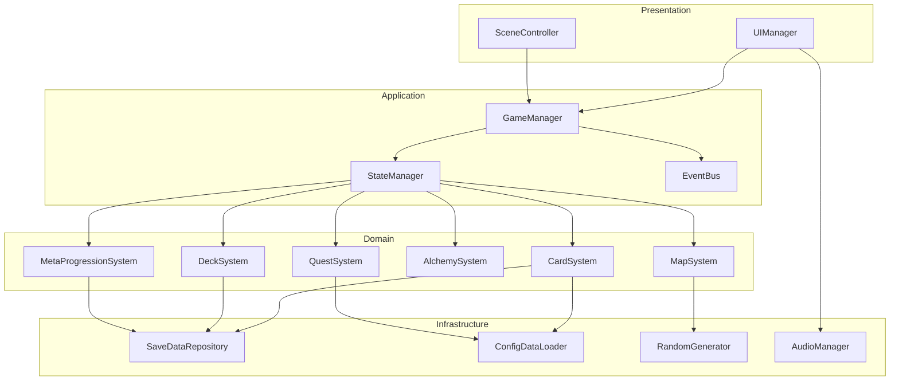
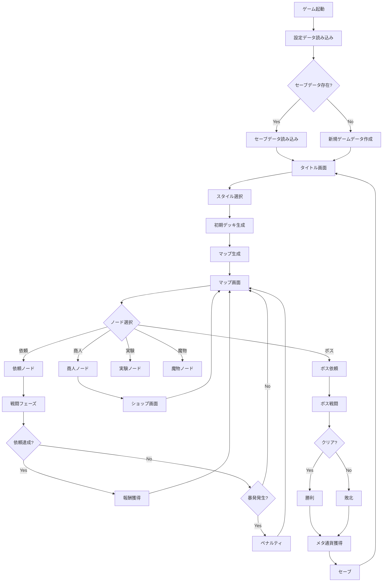
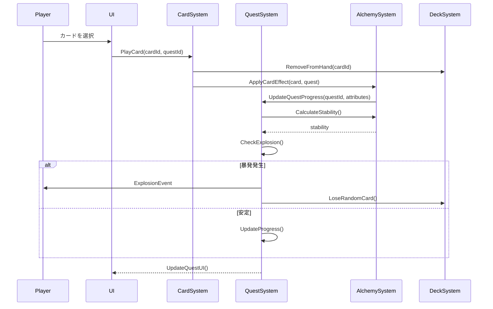
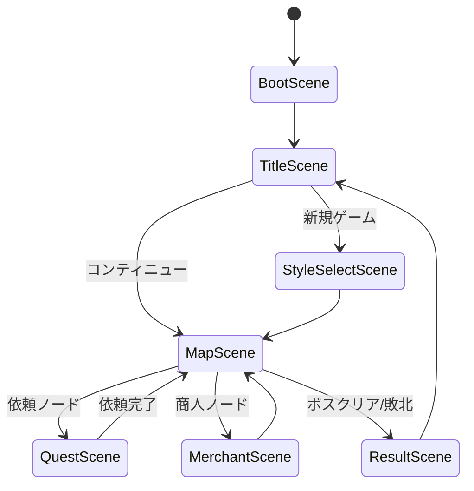

# アトリエ錬金術ゲーム 技術設計書

## 概要

本ドキュメントは、錬金術×ローグライク×デッキ構築ゲーム「アトリエ」の技術設計を記載するのだ。
Unity (C#) を使用した実装を前提とし、要件定義書に基づいた具体的な設計を提供するのだ。

**ターゲットプラットフォーム**: Windows 10以降
**開発環境**: Unity 2021.3 LTS以降
**解像度**: 1920x1080 (フルHD固定)
**アートスタイル**: 2Dドット絵

---

## 目次

1. [システムアーキテクチャ](#システムアーキテクチャ)
2. [データフロー図](#データフロー図)
3. [Unityシーン構成](#unityシーン構成)
4. [C# クラス設計](#c-クラス設計)
5. [データスキーマ (JSON)](#データスキーマ-json)
6. [状態管理・イベントシステム](#状態管理イベントシステム)
7. [セーブデータ構造](#セーブデータ構造)
8. [パフォーマンス設計](#パフォーマンス設計)
9. [セキュリティ設計](#セキュリティ設計)

---

## システムアーキテクチャ

### レイヤー構造

```
┌─────────────────────────────────────────────┐
│          Presentation Layer                 │
│  (UI/View/MonoBehaviour Components)         │
│  - SceneControllers                         │
│  - UIViews                                  │
│  - AnimationControllers                     │
└─────────────────────────────────────────────┘
                    ↓↑
┌─────────────────────────────────────────────┐
│         Application Layer                   │
│  (Game Logic/State Management)              │
│  - GameManager                              │
│  - StateManager                             │
│  - EventBus                                 │
└─────────────────────────────────────────────┘
                    ↓↑
┌─────────────────────────────────────────────┐
│           Domain Layer                      │
│  (Business Logic/Core Systems)              │
│  - CardSystem                               │
│  - QuestSystem (顧客依頼)                   │
│  - DeckSystem                               │
│  - AlchemySystem (錬金システム)              │
│  - MapSystem                                │
│  - MetaProgressionSystem                    │
└─────────────────────────────────────────────┘
                    ↓↑
┌─────────────────────────────────────────────┐
│      Infrastructure Layer                   │
│  (Data Access/External Systems)             │
│  - SaveDataRepository                       │
│  - ConfigDataLoader                         │
│  - RandomGenerator (シード管理)              │
│  - AudioManager                             │
└─────────────────────────────────────────────┘
```

### コンポーネント図



---

## データフロー図

### ゲーム全体のデータフロー



### カードプレイのデータフロー



---

## Unityシーン構成

### シーン一覧

| シーン名 | 説明 | 主要な要素 |
|---------|------|-----------|
| **BootScene** | 初期化・ロード画面 | - 設定データ読み込み<br>- セーブデータ確認<br>- DontDestroyOnLoad のマネージャー生成 |
| **TitleScene** | タイトル画面 | - 新規ゲーム<br>- コンティニュー<br>- 設定<br>- メタアンロック画面 |
| **StyleSelectScene** | スタイル選択 | - スタイル一覧表示<br>- 初期デッキプレビュー |
| **MapScene** | マップ進行 | - ノード配置<br>- ルート選択<br>- 現在位置表示 |
| **QuestScene** | 依頼達成(戦闘) | - 依頼ボード(3件)<br>- 手札表示<br>- デッキ/捨て札状態<br>- 錬金釜エリア |
| **MerchantScene** | 商人ノード | - カード購入<br>- カード強化<br>- カード削除 |
| **ResultScene** | リザルト画面 | - 獲得報酬表示<br>- メタ通貨獲得<br>- 統計情報 |

### シーン遷移図



---

## C# クラス設計

### コアインターフェース

```csharp
// ============================================
// コアインターフェース定義
// ============================================

namespace Atelier.Core
{
    /// <summary>
    /// カードの基本インターフェース
    /// </summary>
    public interface ICard
    {
        string Id { get; }
        string Name { get; }
        CardType Type { get; }
        int Cost { get; }
        CardAttributes Attributes { get; }
        int Stability { get; }
        string Description { get; }

        void Play(IQuest targetQuest);
        bool CanPlay(int currentEnergy);
    }

    /// <summary>
    /// 依頼の基本インターフェース
    /// </summary>
    public interface IQuest
    {
        string Id { get; }
        string CustomerName { get; }
        QuestDifficulty Difficulty { get; }
        QuestRequirements Requirements { get; }
        QuestProgress Progress { get; }

        void ApplyCard(ICard card);
        bool IsCompleted();
        bool HasExploded();
    }

    /// <summary>
    /// デッキ管理インターフェース
    /// </summary>
    public interface IDeckManager
    {
        List<ICard> DrawPile { get; }
        List<ICard> Hand { get; }
        List<ICard> DiscardPile { get; }
        int HandSize { get; }

        void DrawCards(int count);
        void PlayCard(ICard card);
        void DiscardCard(ICard card);
        void Shuffle();
        void AddCardToDeck(ICard card);
        void RemoveCardFromDeck(string cardId);
    }

    /// <summary>
    /// セーブデータ管理インターフェース
    /// </summary>
    public interface ISaveDataRepository
    {
        SaveData LoadSaveData(int slotIndex);
        void SaveGameData(SaveData data, int slotIndex);
        bool HasSaveData(int slotIndex);
        void DeleteSaveData(int slotIndex);
    }
}
```

### 主要クラス

```csharp
// ============================================
// ゲームマネージャー (Application Layer)
// ============================================

namespace Atelier.Application
{
    using Atelier.Core;
    using Atelier.Domain;
    using UnityEngine;

    /// <summary>
    /// ゲーム全体を管理するシングルトンマネージャー
    /// </summary>
    public class GameManager : MonoBehaviour
    {
        public static GameManager Instance { get; private set; }

        public GameStateManager StateManager { get; private set; }
        public EventBus EventBus { get; private set; }
        public CardSystem CardSystem { get; private set; }
        public QuestSystem QuestSystem { get; private set; }
        public DeckManager DeckManager { get; private set; }
        public MapSystem MapSystem { get; private set; }
        public MetaProgressionSystem MetaSystem { get; private set; }

        private void Awake()
        {
            if (Instance != null && Instance != this)
            {
                Destroy(gameObject);
                return;
            }

            Instance = this;
            DontDestroyOnLoad(gameObject);

            InitializeSystems();
        }

        private void InitializeSystems()
        {
            EventBus = new EventBus();
            StateManager = new GameStateManager();
            CardSystem = new CardSystem(EventBus);
            QuestSystem = new QuestSystem(EventBus);
            DeckManager = new DeckManager(EventBus);
            MapSystem = new MapSystem(EventBus);
            MetaSystem = new MetaProgressionSystem(EventBus);
        }

        public void StartNewGame(AlchemyStyle style, int? seed = null)
        {
            // 新規ゲーム開始処理
            MapSystem.GenerateMap(seed);
            DeckManager.InitializeDeck(style.InitialCards);
            StateManager.TransitionTo(GameState.Map);
        }

        public void LoadGame(int slotIndex)
        {
            // セーブデータ読み込み処理
            var saveRepo = new SaveDataRepository();
            var saveData = saveRepo.LoadSaveData(slotIndex);
            RestoreGameState(saveData);
        }

        private void RestoreGameState(SaveData data)
        {
            // ゲーム状態の復元
            DeckManager.RestoreDeck(data.DeckData);
            MapSystem.RestoreMap(data.MapData);
            MetaSystem.RestoreMetaData(data.MetaData);
        }
    }
}

// ============================================
// カードシステム (Domain Layer)
// ============================================

namespace Atelier.Domain
{
    using System.Collections.Generic;
    using Atelier.Core;

    /// <summary>
    /// カードデータ構造
    /// </summary>
    [System.Serializable]
    public class Card : ICard
    {
        public string Id { get; set; }
        public string Name { get; set; }
        public CardType Type { get; set; }
        public int Cost { get; set; }
        public CardAttributes Attributes { get; set; }
        public int Stability { get; set; }
        public string Description { get; set; }
        public int Level { get; set; }
        public List<CardEffect> Effects { get; set; }

        public bool CanPlay(int currentEnergy)
        {
            return Cost <= currentEnergy;
        }

        public void Play(IQuest targetQuest)
        {
            targetQuest.ApplyCard(this);

            // エフェクト適用
            foreach (var effect in Effects)
            {
                effect.Apply(targetQuest);
            }
        }
    }

    /// <summary>
    /// カード属性
    /// </summary>
    [System.Serializable]
    public class CardAttributes
    {
        public int Fire { get; set; }
        public int Water { get; set; }
        public int Earth { get; set; }
        public int Wind { get; set; }
        public int Poison { get; set; }
        public int Quality { get; set; }

        public CardAttributes()
        {
            Fire = 0;
            Water = 0;
            Earth = 0;
            Wind = 0;
            Poison = 0;
            Quality = 0;
        }

        public static CardAttributes operator +(CardAttributes a, CardAttributes b)
        {
            return new CardAttributes
            {
                Fire = a.Fire + b.Fire,
                Water = a.Water + b.Water,
                Earth = a.Earth + b.Earth,
                Wind = a.Wind + b.Wind,
                Poison = a.Poison + b.Poison,
                Quality = a.Quality + b.Quality
            };
        }
    }

    /// <summary>
    /// カードタイプ
    /// </summary>
    public enum CardType
    {
        Material,    // 素材カード
        Operation,   // 操作カード
        Catalyst,    // 触媒カード
        Knowledge,   // 知識カード
        Special,     // 特殊カード
        Artifact     // アーティファクト
    }

    /// <summary>
    /// カード効果の基底クラス
    /// </summary>
    public abstract class CardEffect
    {
        public string EffectName { get; set; }
        public string Description { get; set; }

        public abstract void Apply(IQuest quest);
    }

    /// <summary>
    /// カードシステム管理クラス
    /// </summary>
    public class CardSystem
    {
        private Dictionary<string, Card> cardDatabase;
        private EventBus eventBus;

        public CardSystem(EventBus eventBus)
        {
            this.eventBus = eventBus;
            LoadCardDatabase();
        }

        private void LoadCardDatabase()
        {
            // JSONからカードデータを読み込み
            var config = ConfigDataLoader.LoadCardConfig();
            cardDatabase = new Dictionary<string, Card>();

            foreach (var cardData in config.Cards)
            {
                cardDatabase[cardData.Id] = cardData;
            }
        }

        public Card GetCard(string cardId)
        {
            if (cardDatabase.TryGetValue(cardId, out var card))
            {
                return card;
            }
            throw new System.Exception($"Card not found: {cardId}");
        }

        public Card CreateCardInstance(string cardId)
        {
            var original = GetCard(cardId);
            // Deep copy
            return new Card
            {
                Id = original.Id,
                Name = original.Name,
                Type = original.Type,
                Cost = original.Cost,
                Attributes = new CardAttributes
                {
                    Fire = original.Attributes.Fire,
                    Water = original.Attributes.Water,
                    Earth = original.Attributes.Earth,
                    Wind = original.Attributes.Wind,
                    Poison = original.Attributes.Poison,
                    Quality = original.Attributes.Quality
                },
                Stability = original.Stability,
                Description = original.Description,
                Level = original.Level,
                Effects = new List<CardEffect>(original.Effects)
            };
        }

        public void EvolveCard(Card card)
        {
            // カード進化ロジック
            card.Level++;
            card.Attributes.Quality += 10;
            eventBus.Publish(new CardEvolvedEvent(card));
        }
    }
}

// ============================================
// 依頼システム (Domain Layer)
// ============================================

namespace Atelier.Domain
{
    using System.Collections.Generic;
    using Atelier.Core;

    /// <summary>
    /// 依頼データ構造
    /// </summary>
    [System.Serializable]
    public class Quest : IQuest
    {
        public string Id { get; set; }
        public string CustomerName { get; set; }
        public QuestDifficulty Difficulty { get; set; }
        public QuestRequirements Requirements { get; set; }
        public QuestProgress Progress { get; set; }

        private int currentStability;

        public void ApplyCard(ICard card)
        {
            // 属性値の加算
            Progress.CurrentAttributes += card.Attributes;

            // 安定値の計算
            currentStability += card.Stability;

            // 暴発チェック
            if (currentStability < 0)
            {
                TriggerExplosion();
            }
        }

        public bool IsCompleted()
        {
            return Requirements.IsMetBy(Progress.CurrentAttributes) &&
                   !Progress.HasExploded;
        }

        public bool HasExploded()
        {
            return Progress.HasExploded;
        }

        private void TriggerExplosion()
        {
            Progress.HasExploded = true;
            // ペナルティ処理
        }
    }

    /// <summary>
    /// 依頼の必要条件
    /// </summary>
    [System.Serializable]
    public class QuestRequirements
    {
        public CardAttributes RequiredAttributes { get; set; }
        public int MinQuality { get; set; }
        public int MinStability { get; set; }

        public bool IsMetBy(CardAttributes current)
        {
            return current.Fire >= RequiredAttributes.Fire &&
                   current.Water >= RequiredAttributes.Water &&
                   current.Earth >= RequiredAttributes.Earth &&
                   current.Wind >= RequiredAttributes.Wind &&
                   current.Quality >= MinQuality;
        }
    }

    /// <summary>
    /// 依頼の進行状況
    /// </summary>
    [System.Serializable]
    public class QuestProgress
    {
        public CardAttributes CurrentAttributes { get; set; }
        public int CurrentStability { get; set; }
        public bool HasExploded { get; set; }
        public float SatisfactionGauge { get; set; }

        public QuestProgress()
        {
            CurrentAttributes = new CardAttributes();
            CurrentStability = 0;
            HasExploded = false;
            SatisfactionGauge = 0f;
        }
    }

    /// <summary>
    /// 依頼難易度
    /// </summary>
    public enum QuestDifficulty
    {
        OneStar = 1,
        TwoStar = 2,
        ThreeStar = 3,
        FourStar = 4,
        FiveStar = 5
    }

    /// <summary>
    /// 依頼システム管理クラス
    /// </summary>
    public class QuestSystem
    {
        private List<Quest> activeQuests;
        private Dictionary<string, Quest> questDatabase;
        private EventBus eventBus;
        private const int MaxActiveQuests = 3;

        public QuestSystem(EventBus eventBus)
        {
            this.eventBus = eventBus;
            activeQuests = new List<Quest>();
            LoadQuestDatabase();
        }

        private void LoadQuestDatabase()
        {
            var config = ConfigDataLoader.LoadQuestConfig();
            questDatabase = new Dictionary<string, Quest>();

            foreach (var questData in config.Quests)
            {
                questDatabase[questData.Id] = questData;
            }
        }

        public void GenerateQuests(int mapLevel, System.Random rng)
        {
            activeQuests.Clear();

            for (int i = 0; i < MaxActiveQuests; i++)
            {
                var quest = GenerateRandomQuest(mapLevel, rng);
                activeQuests.Add(quest);
            }

            eventBus.Publish(new QuestsGeneratedEvent(activeQuests));
        }

        private Quest GenerateRandomQuest(int level, System.Random rng)
        {
            // ランダムな依頼生成ロジック
            var difficulty = (QuestDifficulty)(rng.Next(1, 6));

            return new Quest
            {
                Id = System.Guid.NewGuid().ToString(),
                CustomerName = GetRandomCustomer(rng),
                Difficulty = difficulty,
                Requirements = GenerateRequirements(difficulty),
                Progress = new QuestProgress()
            };
        }

        private QuestRequirements GenerateRequirements(QuestDifficulty difficulty)
        {
            int multiplier = (int)difficulty;

            return new QuestRequirements
            {
                RequiredAttributes = new CardAttributes
                {
                    Fire = 5 * multiplier,
                    Water = 3 * multiplier,
                    Quality = 10 * multiplier
                },
                MinQuality = 10 * multiplier,
                MinStability = 0
            };
        }

        private string GetRandomCustomer(System.Random rng)
        {
            var customers = new List<string> { "村人A", "魔法使い", "騎士", "商人", "錬金術師" };
            return customers[rng.Next(customers.Count)];
        }

        public List<Quest> GetActiveQuests()
        {
            return new List<Quest>(activeQuests);
        }

        public void CompleteQuest(string questId)
        {
            var quest = activeQuests.Find(q => q.Id == questId);
            if (quest != null && quest.IsCompleted())
            {
                activeQuests.Remove(quest);
                eventBus.Publish(new QuestCompletedEvent(quest));
            }
        }
    }
}

// ============================================
// デッキマネージャー (Domain Layer)
// ============================================

namespace Atelier.Domain
{
    using System.Collections.Generic;
    using System.Linq;
    using Atelier.Core;

    /// <summary>
    /// デッキ管理クラス
    /// </summary>
    public class DeckManager : IDeckManager
    {
        public List<ICard> DrawPile { get; private set; }
        public List<ICard> Hand { get; private set; }
        public List<ICard> DiscardPile { get; private set; }
        public int HandSize { get; private set; }

        private int currentEnergy;
        private const int MaxEnergy = 10;
        private const int EnergyPerTurn = 3;
        private const int DefaultHandSize = 5;

        private EventBus eventBus;
        private System.Random rng;

        public DeckManager(EventBus eventBus)
        {
            this.eventBus = eventBus;
            DrawPile = new List<ICard>();
            Hand = new List<ICard>();
            DiscardPile = new List<ICard>();
            HandSize = DefaultHandSize;
        }

        public void InitializeDeck(List<string> initialCardIds)
        {
            DrawPile.Clear();
            Hand.Clear();
            DiscardPile.Clear();

            var cardSystem = GameManager.Instance.CardSystem;
            foreach (var cardId in initialCardIds)
            {
                var card = cardSystem.CreateCardInstance(cardId);
                DrawPile.Add(card);
            }

            Shuffle();
        }

        public void StartTurn()
        {
            // ターン開始時の処理
            currentEnergy = System.Math.Min(currentEnergy + EnergyPerTurn, MaxEnergy);

            // 手札を規定枚数まで補充
            int cardsToDraw = HandSize - Hand.Count;
            DrawCards(cardsToDraw);

            eventBus.Publish(new TurnStartedEvent(currentEnergy));
        }

        public void DrawCards(int count)
        {
            for (int i = 0; i < count; i++)
            {
                if (DrawPile.Count == 0)
                {
                    // 捨て札をシャッフルして山札に戻す
                    DrawPile.AddRange(DiscardPile);
                    DiscardPile.Clear();
                    Shuffle();
                }

                if (DrawPile.Count > 0)
                {
                    var card = DrawPile[0];
                    DrawPile.RemoveAt(0);
                    Hand.Add(card);
                    eventBus.Publish(new CardDrawnEvent(card));
                }
            }
        }

        public void PlayCard(ICard card)
        {
            if (!Hand.Contains(card))
            {
                throw new System.InvalidOperationException("Card not in hand");
            }

            if (!card.CanPlay(currentEnergy))
            {
                throw new System.InvalidOperationException("Not enough energy");
            }

            Hand.Remove(card);
            currentEnergy -= card.Cost;
            DiscardPile.Add(card);

            eventBus.Publish(new CardPlayedEvent(card, currentEnergy));
        }

        public void DiscardCard(ICard card)
        {
            if (Hand.Contains(card))
            {
                Hand.Remove(card);
                DiscardPile.Add(card);
                eventBus.Publish(new CardDiscardedEvent(card));
            }
        }

        public void Shuffle()
        {
            if (rng == null)
            {
                rng = new System.Random();
            }

            // Fisher-Yates shuffle
            for (int i = DrawPile.Count - 1; i > 0; i--)
            {
                int j = rng.Next(i + 1);
                var temp = DrawPile[i];
                DrawPile[i] = DrawPile[j];
                DrawPile[j] = temp;
            }
        }

        public void AddCardToDeck(ICard card)
        {
            DrawPile.Add(card);
            eventBus.Publish(new CardAddedToDeckEvent(card));
        }

        public void RemoveCardFromDeck(string cardId)
        {
            var card = DrawPile.FirstOrDefault(c => c.Id == cardId);
            if (card != null)
            {
                DrawPile.Remove(card);
                eventBus.Publish(new CardRemovedFromDeckEvent(card));
            }
        }

        public void RestoreDeck(DeckData data)
        {
            // セーブデータからデッキを復元
            DrawPile = data.DrawPile.Select(id =>
                GameManager.Instance.CardSystem.CreateCardInstance(id)).ToList<ICard>();
            Hand = data.Hand.Select(id =>
                GameManager.Instance.CardSystem.CreateCardInstance(id)).ToList<ICard>();
            DiscardPile = data.DiscardPile.Select(id =>
                GameManager.Instance.CardSystem.CreateCardInstance(id)).ToList<ICard>();
        }
    }
}

// ============================================
// マップシステム (Domain Layer)
// ============================================

namespace Atelier.Domain
{
    using System.Collections.Generic;
    using Atelier.Core;

    /// <summary>
    /// マップノードタイプ
    /// </summary>
    public enum NodeType
    {
        Quest,       // 依頼ノード
        Merchant,    // 商人ノード
        Experiment,  // 実験ノード
        Monster,     // 魔物ノード
        Boss         // ボスノード
    }

    /// <summary>
    /// マップノード
    /// </summary>
    [System.Serializable]
    public class MapNode
    {
        public string Id { get; set; }
        public NodeType Type { get; set; }
        public int Level { get; set; }
        public Vector2Int Position { get; set; }
        public List<string> ConnectedNodeIds { get; set; }
        public bool IsVisited { get; set; }
        public bool IsAvailable { get; set; }

        public MapNode()
        {
            ConnectedNodeIds = new List<string>();
            IsVisited = false;
            IsAvailable = false;
        }
    }

    /// <summary>
    /// マップシステム
    /// </summary>
    public class MapSystem
    {
        private List<MapNode> nodes;
        private MapNode currentNode;
        private EventBus eventBus;
        private System.Random rng;

        private const int MinNodes = 30;
        private const int MaxNodes = 50;
        private const int NodesPerLevel = 5;

        public MapSystem(EventBus eventBus)
        {
            this.eventBus = eventBus;
            nodes = new List<MapNode>();
        }

        public void GenerateMap(int? seed = null)
        {
            rng = seed.HasValue ? new System.Random(seed.Value) : new System.Random();

            nodes.Clear();
            int totalNodes = rng.Next(MinNodes, MaxNodes + 1);
            int levels = totalNodes / NodesPerLevel;

            // レベルごとにノードを生成
            for (int level = 0; level < levels; level++)
            {
                GenerateNodesForLevel(level);
            }

            // 最終ボスノードを追加
            AddBossNode(levels);

            // ノード間の接続を生成
            ConnectNodes();

            // 開始ノードを設定
            currentNode = nodes[0];
            currentNode.IsAvailable = true;

            eventBus.Publish(new MapGeneratedEvent(nodes));
        }

        private void GenerateNodesForLevel(int level)
        {
            int nodeCount = NodesPerLevel;

            for (int i = 0; i < nodeCount; i++)
            {
                var node = new MapNode
                {
                    Id = System.Guid.NewGuid().ToString(),
                    Type = GetRandomNodeType(level),
                    Level = level,
                    Position = new Vector2Int(i, level)
                };

                nodes.Add(node);
            }
        }

        private NodeType GetRandomNodeType(int level)
        {
            // レベルに応じてノードタイプの出現確率を調整
            int roll = rng.Next(100);

            if (roll < 50)
                return NodeType.Quest;
            else if (roll < 70)
                return NodeType.Merchant;
            else if (roll < 85)
                return NodeType.Experiment;
            else
                return NodeType.Monster;
        }

        private void AddBossNode(int level)
        {
            var bossNode = new MapNode
            {
                Id = System.Guid.NewGuid().ToString(),
                Type = NodeType.Boss,
                Level = level,
                Position = new Vector2Int(2, level)
            };

            nodes.Add(bossNode);
        }

        private void ConnectNodes()
        {
            // 各ノードを次のレベルのノードと接続
            for (int level = 0; level < nodes.Max(n => n.Level); level++)
            {
                var currentLevelNodes = nodes.Where(n => n.Level == level).ToList();
                var nextLevelNodes = nodes.Where(n => n.Level == level + 1).ToList();

                foreach (var node in currentLevelNodes)
                {
                    // 2〜3個の次ノードに接続
                    int connectionCount = rng.Next(2, 4);
                    var shuffled = nextLevelNodes.OrderBy(x => rng.Next()).ToList();

                    for (int i = 0; i < System.Math.Min(connectionCount, shuffled.Count); i++)
                    {
                        node.ConnectedNodeIds.Add(shuffled[i].Id);
                    }
                }
            }
        }

        public void MoveToNode(string nodeId)
        {
            var node = nodes.FirstOrDefault(n => n.Id == nodeId);

            if (node == null || !node.IsAvailable)
            {
                throw new System.InvalidOperationException("Node not available");
            }

            currentNode.IsVisited = true;
            currentNode = node;
            currentNode.IsVisited = true;

            // 接続されたノードを利用可能にする
            foreach (var connectedId in currentNode.ConnectedNodeIds)
            {
                var connectedNode = nodes.FirstOrDefault(n => n.Id == connectedId);
                if (connectedNode != null)
                {
                    connectedNode.IsAvailable = true;
                }
            }

            eventBus.Publish(new NodeVisitedEvent(currentNode));
        }

        public List<MapNode> GetAvailableNodes()
        {
            return nodes.Where(n => n.IsAvailable && !n.IsVisited).ToList();
        }

        public MapNode GetCurrentNode()
        {
            return currentNode;
        }

        public void RestoreMap(MapData data)
        {
            nodes = data.Nodes;
            currentNode = nodes.FirstOrDefault(n => n.Id == data.CurrentNodeId);
        }
    }
}

// ============================================
// メタ進行システム (Domain Layer)
// ============================================

namespace Atelier.Domain
{
    using Atelier.Core;

    /// <summary>
    /// メタ進行データ
    /// </summary>
    [System.Serializable]
    public class MetaProgressionData
    {
        public int Fame { get; set; }
        public int KnowledgePoints { get; set; }
        public int AscensionLevel { get; set; }
        public List<string> UnlockedCards { get; set; }
        public List<string> UnlockedMaterials { get; set; }
        public List<string> UnlockedCustomers { get; set; }
        public Dictionary<string, int> WorkshopLevels { get; set; }

        public MetaProgressionData()
        {
            Fame = 0;
            KnowledgePoints = 0;
            AscensionLevel = 0;
            UnlockedCards = new List<string>();
            UnlockedMaterials = new List<string>();
            UnlockedCustomers = new List<string>();
            WorkshopLevels = new Dictionary<string, int>();
        }
    }

    /// <summary>
    /// メタ進行システム
    /// </summary>
    public class MetaProgressionSystem
    {
        private MetaProgressionData data;
        private EventBus eventBus;

        public MetaProgressionSystem(EventBus eventBus)
        {
            this.eventBus = eventBus;
            data = new MetaProgressionData();
        }

        public void AddFame(int amount)
        {
            data.Fame += amount;
            eventBus.Publish(new FameGainedEvent(amount, data.Fame));
        }

        public void AddKnowledgePoints(int amount)
        {
            data.KnowledgePoints += amount;
            eventBus.Publish(new KnowledgeGainedEvent(amount, data.KnowledgePoints));
        }

        public bool UnlockCard(string cardId, int cost)
        {
            if (data.KnowledgePoints >= cost && !data.UnlockedCards.Contains(cardId))
            {
                data.KnowledgePoints -= cost;
                data.UnlockedCards.Add(cardId);
                eventBus.Publish(new CardUnlockedEvent(cardId));
                return true;
            }
            return false;
        }

        public void IncreaseAscensionLevel()
        {
            data.AscensionLevel++;
            eventBus.Publish(new AscensionLevelIncreasedEvent(data.AscensionLevel));
        }

        public MetaProgressionData GetData()
        {
            return data;
        }

        public void RestoreMetaData(MetaProgressionData savedData)
        {
            data = savedData;
        }
    }
}

// ============================================
// イベントバス (Application Layer)
// ============================================

namespace Atelier.Application
{
    using System;
    using System.Collections.Generic;

    /// <summary>
    /// イベントバス - Pub/Subパターン
    /// </summary>
    public class EventBus
    {
        private Dictionary<Type, List<Delegate>> eventHandlers;

        public EventBus()
        {
            eventHandlers = new Dictionary<Type, List<Delegate>>();
        }

        public void Subscribe<T>(Action<T> handler) where T : GameEvent
        {
            var eventType = typeof(T);

            if (!eventHandlers.ContainsKey(eventType))
            {
                eventHandlers[eventType] = new List<Delegate>();
            }

            eventHandlers[eventType].Add(handler);
        }

        public void Unsubscribe<T>(Action<T> handler) where T : GameEvent
        {
            var eventType = typeof(T);

            if (eventHandlers.ContainsKey(eventType))
            {
                eventHandlers[eventType].Remove(handler);
            }
        }

        public void Publish<T>(T gameEvent) where T : GameEvent
        {
            var eventType = typeof(T);

            if (eventHandlers.ContainsKey(eventType))
            {
                foreach (var handler in eventHandlers[eventType])
                {
                    (handler as Action<T>)?.Invoke(gameEvent);
                }
            }
        }
    }

    /// <summary>
    /// ゲームイベントの基底クラス
    /// </summary>
    public abstract class GameEvent
    {
        public DateTime Timestamp { get; }

        protected GameEvent()
        {
            Timestamp = DateTime.Now;
        }
    }

    // イベントクラス例
    public class CardPlayedEvent : GameEvent
    {
        public ICard Card { get; }
        public int RemainingEnergy { get; }

        public CardPlayedEvent(ICard card, int remainingEnergy)
        {
            Card = card;
            RemainingEnergy = remainingEnergy;
        }
    }

    public class QuestCompletedEvent : GameEvent
    {
        public IQuest Quest { get; }

        public QuestCompletedEvent(IQuest quest)
        {
            Quest = quest;
        }
    }
}
```

---

## データスキーマ (JSON)

### カード定義 (card_config.json)

```json
{
  "cards": [
    {
      "id": "card_fire_ore_001",
      "name": "火の鉱石",
      "type": "Material",
      "cost": 1,
      "attributes": {
        "fire": 5,
        "water": 0,
        "earth": 2,
        "wind": 0,
        "poison": 0,
        "quality": 3
      },
      "stability": 2,
      "description": "燃え盛る鉱石。火属性を大きく高める。",
      "level": 1,
      "effects": [],
      "rarity": "Common",
      "sprite": "cards/fire_ore_001"
    },
    {
      "id": "card_catalyst_flame_001",
      "name": "火炎触媒",
      "type": "Catalyst",
      "cost": 2,
      "attributes": {
        "fire": 0,
        "water": 0,
        "earth": 0,
        "wind": 0,
        "poison": 0,
        "quality": 0
      },
      "stability": -1,
      "description": "火属性を2倍にする触媒。安定性が低下する。",
      "level": 1,
      "effects": [
        {
          "type": "MultiplyAttribute",
          "target": "fire",
          "multiplier": 2.0
        }
      ],
      "rarity": "Uncommon",
      "sprite": "cards/catalyst_flame_001"
    }
  ]
}
```

### 依頼定義 (quest_config.json)

```json
{
  "quests": [
    {
      "id": "quest_beginner_potion_001",
      "customerName": "村人A",
      "customerType": "Villager",
      "difficulty": 1,
      "requirements": {
        "requiredAttributes": {
          "fire": 0,
          "water": 10,
          "earth": 0,
          "wind": 0,
          "poison": 0,
          "quality": 5
        },
        "minQuality": 5,
        "minStability": 0
      },
      "rewards": {
        "gold": 50,
        "fame": 1,
        "cardChoices": [
          "card_water_herb_001",
          "card_water_herb_002",
          "card_operation_mix_001"
        ]
      },
      "description": "簡単な回復薬を作ってほしい。",
      "sprite": "customers/villager_001"
    }
  ]
}
```

### 錬金スタイル定義 (alchemy_style_config.json)

```json
{
  "styles": [
    {
      "id": "style_fire_alchemist",
      "name": "火の錬金術師",
      "description": "火属性に特化した攻撃的なスタイル",
      "initialCards": [
        "card_fire_ore_001",
        "card_fire_ore_001",
        "card_fire_herb_001",
        "card_operation_heat_001",
        "card_operation_mix_001",
        "card_operation_mix_001",
        "card_catalyst_flame_001",
        "card_material_coal_001",
        "card_material_coal_001",
        "card_material_coal_001"
      ],
      "startingGold": 100,
      "specialAbility": {
        "name": "火炎強化",
        "description": "火属性カードのコストが1減少する",
        "effect": "ReduceFireCardCost"
      },
      "sprite": "styles/fire_alchemist"
    }
  ]
}
```

### マップ生成設定 (map_generation_config.json)

```json
{
  "mapGeneration": {
    "minNodes": 30,
    "maxNodes": 50,
    "nodesPerLevel": 5,
    "nodeTypeWeights": {
      "Quest": 50,
      "Merchant": 20,
      "Experiment": 15,
      "Monster": 15
    },
    "levelScaling": {
      "baseDifficulty": 1,
      "difficultyIncrease": 0.2
    }
  }
}
```

---

## 状態管理・イベントシステム

### ゲーム状態遷移

```csharp
namespace Atelier.Application
{
    public enum GameState
    {
        Boot,           // 起動中
        Title,          // タイトル画面
        StyleSelect,    // スタイル選択
        Map,            // マップ画面
        Quest,          // 依頼(戦闘)
        Merchant,       // 商人
        Experiment,     // 実験
        Monster,        // 魔物
        Result          // リザルト
    }

    public class GameStateManager
    {
        private GameState currentState;
        private Stack<GameState> stateHistory;

        public GameStateManager()
        {
            stateHistory = new Stack<GameState>();
            currentState = GameState.Boot;
        }

        public void TransitionTo(GameState newState)
        {
            stateHistory.Push(currentState);
            currentState = newState;

            OnStateEnter(newState);
        }

        public void TransitionBack()
        {
            if (stateHistory.Count > 0)
            {
                var previousState = stateHistory.Pop();
                currentState = previousState;
                OnStateEnter(previousState);
            }
        }

        private void OnStateEnter(GameState state)
        {
            // 状態ごとの初期化処理
            switch (state)
            {
                case GameState.Quest:
                    InitializeQuestState();
                    break;
                case GameState.Map:
                    InitializeMapState();
                    break;
                // ... 他の状態
            }
        }

        private void InitializeQuestState()
        {
            var questSystem = GameManager.Instance.QuestSystem;
            var mapNode = GameManager.Instance.MapSystem.GetCurrentNode();

            if (mapNode.Type == NodeType.Quest)
            {
                questSystem.GenerateQuests(mapNode.Level, new System.Random());
            }

            var deckManager = GameManager.Instance.DeckManager;
            deckManager.StartTurn();
        }

        private void InitializeMapState()
        {
            // マップの更新など
        }

        public GameState GetCurrentState()
        {
            return currentState;
        }
    }
}
```

---

## セーブデータ構造

### セーブデータクラス

```csharp
namespace Atelier.Infrastructure
{
    using System.Collections.Generic;
    using Atelier.Domain;

    /// <summary>
    /// セーブデータのルート構造
    /// </summary>
    [System.Serializable]
    public class SaveData
    {
        public int Version { get; set; }
        public string SaveDate { get; set; }
        public int SlotIndex { get; set; }

        public RunData CurrentRun { get; set; }
        public MetaProgressionData MetaData { get; set; }
        public SettingsData Settings { get; set; }

        public SaveData()
        {
            Version = 1;
            SaveDate = System.DateTime.Now.ToString("yyyy-MM-dd HH:mm:ss");
            CurrentRun = new RunData();
            MetaData = new MetaProgressionData();
            Settings = new SettingsData();
        }
    }

    /// <summary>
    /// 1プレイ分のデータ
    /// </summary>
    [System.Serializable]
    public class RunData
    {
        public string StyleId { get; set; }
        public int? Seed { get; set; }
        public int CurrentFloor { get; set; }
        public int Gold { get; set; }

        public DeckData DeckData { get; set; }
        public MapData MapData { get; set; }
        public List<string> AcquiredArtifacts { get; set; }

        public RunData()
        {
            DeckData = new DeckData();
            MapData = new MapData();
            AcquiredArtifacts = new List<string>();
        }
    }

    /// <summary>
    /// デッキデータ
    /// </summary>
    [System.Serializable]
    public class DeckData
    {
        public List<string> DrawPile { get; set; }
        public List<string> Hand { get; set; }
        public List<string> DiscardPile { get; set; }

        public DeckData()
        {
            DrawPile = new List<string>();
            Hand = new List<string>();
            DiscardPile = new List<string>();
        }
    }

    /// <summary>
    /// マップデータ
    /// </summary>
    [System.Serializable]
    public class MapData
    {
        public List<MapNode> Nodes { get; set; }
        public string CurrentNodeId { get; set; }

        public MapData()
        {
            Nodes = new List<MapNode>();
        }
    }

    /// <summary>
    /// 設定データ
    /// </summary>
    [System.Serializable]
    public class SettingsData
    {
        public float BgmVolume { get; set; }
        public float SeVolume { get; set; }
        public bool FullScreen { get; set; }

        public SettingsData()
        {
            BgmVolume = 0.7f;
            SeVolume = 0.8f;
            FullScreen = true;
        }
    }

    /// <summary>
    /// セーブデータリポジトリ
    /// </summary>
    public class SaveDataRepository : ISaveDataRepository
    {
        private const string SaveDirectory = "SaveData";
        private const string SaveFilePrefix = "save_slot_";
        private const string SaveFileExtension = ".json";

        public SaveData LoadSaveData(int slotIndex)
        {
            string filePath = GetSaveFilePath(slotIndex);

            if (!System.IO.File.Exists(filePath))
            {
                throw new System.IO.FileNotFoundException($"Save data not found: {filePath}");
            }

            try
            {
                string json = System.IO.File.ReadAllText(filePath);
                var saveData = UnityEngine.JsonUtility.FromJson<SaveData>(json);
                return saveData;
            }
            catch (System.Exception ex)
            {
                UnityEngine.Debug.LogError($"Failed to load save data: {ex.Message}");
                throw;
            }
        }

        public void SaveGameData(SaveData data, int slotIndex)
        {
            string directory = GetSaveDirectory();

            if (!System.IO.Directory.Exists(directory))
            {
                System.IO.Directory.CreateDirectory(directory);
            }

            string filePath = GetSaveFilePath(slotIndex);
            data.SlotIndex = slotIndex;
            data.SaveDate = System.DateTime.Now.ToString("yyyy-MM-dd HH:mm:ss");

            try
            {
                string json = UnityEngine.JsonUtility.ToJson(data, true);
                System.IO.File.WriteAllText(filePath, json);
            }
            catch (System.Exception ex)
            {
                UnityEngine.Debug.LogError($"Failed to save game data: {ex.Message}");
                throw;
            }
        }

        public bool HasSaveData(int slotIndex)
        {
            string filePath = GetSaveFilePath(slotIndex);
            return System.IO.File.Exists(filePath);
        }

        public void DeleteSaveData(int slotIndex)
        {
            string filePath = GetSaveFilePath(slotIndex);

            if (System.IO.File.Exists(filePath))
            {
                System.IO.File.Delete(filePath);
            }
        }

        private string GetSaveDirectory()
        {
            return System.IO.Path.Combine(UnityEngine.Application.persistentDataPath, SaveDirectory);
        }

        private string GetSaveFilePath(int slotIndex)
        {
            return System.IO.Path.Combine(GetSaveDirectory(), $"{SaveFilePrefix}{slotIndex}{SaveFileExtension}");
        }
    }
}
```

---

## パフォーマンス設計

### パフォーマンス目標

| 項目 | 目標値 | 測定方法 |
|------|--------|---------|
| 起動時間 | 5秒以内 | Unity Profiler |
| フレームレート | 60 FPS以上 | Unity Profiler |
| メモリ使用量 | 2GB以下 | Unity Profiler |
| CPU使用率 | 50%以下 | Unity Profiler |
| カード操作応答時間 | 100ms以内 | カスタム計測 |

### 最適化戦略

#### 1. オブジェクトプーリング

```csharp
namespace Atelier.Infrastructure
{
    using System.Collections.Generic;
    using UnityEngine;

    /// <summary>
    /// オブジェクトプール
    /// </summary>
    public class ObjectPool<T> where T : Component
    {
        private Queue<T> pool;
        private T prefab;
        private Transform parent;

        public ObjectPool(T prefab, int initialSize, Transform parent = null)
        {
            this.prefab = prefab;
            this.parent = parent;
            pool = new Queue<T>();

            for (int i = 0; i < initialSize; i++)
            {
                var obj = Object.Instantiate(prefab, parent);
                obj.gameObject.SetActive(false);
                pool.Enqueue(obj);
            }
        }

        public T Get()
        {
            if (pool.Count > 0)
            {
                var obj = pool.Dequeue();
                obj.gameObject.SetActive(true);
                return obj;
            }
            else
            {
                var obj = Object.Instantiate(prefab, parent);
                return obj;
            }
        }

        public void Return(T obj)
        {
            obj.gameObject.SetActive(false);
            pool.Enqueue(obj);
        }
    }
}
```

#### 2. 遅延読み込み

- カードデータはシーン遷移時に必要分のみ読み込む
- アセットはAddressablesを使用して動的ロード
- UIスプライトは表示時に読み込み、非表示時に解放

#### 3. バッチング

- UIは可能な限りスプライトアトラスにまとめる
- カードスプライトは1つのアトラスに統合
- Static Batching を有効化

---

## セキュリティ設計

### セキュリティ方針

要件定義により、以下の方針を採用するのだ:

- **セーブデータ暗号化**: 不要 (REQ-013, NFR-004)
- **チート対策**: 不要 (オフラインゲームのため)
- **データ整合性**: 最小限のバリデーション

### エラーハンドリング

```csharp
namespace Atelier.Infrastructure
{
    using System;
    using UnityEngine;

    /// <summary>
    /// エラーハンドラー
    /// </summary>
    public static class ErrorHandler
    {
        public static void HandleSaveError(Exception ex)
        {
            Debug.LogError($"Save Error: {ex.Message}");
            // ユーザーにエラーメッセージを表示
            ShowErrorDialog("セーブデータの保存に失敗しました。ディスク容量を確認してください。");
        }

        public static void HandleLoadError(Exception ex)
        {
            Debug.LogError($"Load Error: {ex.Message}");
            // セーブデータ破損時の処理
            ShowErrorDialog("セーブデータが破損しています。新規ゲームとして開始します。");
        }

        private static void ShowErrorDialog(string message)
        {
            // UIマネージャー経由でエラーダイアログを表示
            // (実装は省略)
        }
    }
}
```

---

## Vector2Int 定義

```csharp
namespace Atelier.Domain
{
    /// <summary>
    /// 2D整数ベクトル (Unity標準のVector2Intの代替)
    /// </summary>
    [System.Serializable]
    public struct Vector2Int
    {
        public int X { get; set; }
        public int Y { get; set; }

        public Vector2Int(int x, int y)
        {
            X = x;
            Y = y;
        }

        public static Vector2Int Zero => new Vector2Int(0, 0);

        public override string ToString()
        {
            return $"({X}, {Y})";
        }
    }
}
```

---

## ConfigDataLoader 実装

```csharp
namespace Atelier.Infrastructure
{
    using UnityEngine;
    using System.Collections.Generic;
    using Atelier.Domain;

    /// <summary>
    /// 設定データローダー
    /// </summary>
    public static class ConfigDataLoader
    {
        private const string ConfigPath = "Config/";

        public static CardConfig LoadCardConfig()
        {
            var jsonAsset = Resources.Load<TextAsset>($"{ConfigPath}card_config");
            if (jsonAsset == null)
            {
                Debug.LogError("Failed to load card_config.json");
                return new CardConfig();
            }

            return JsonUtility.FromJson<CardConfig>(jsonAsset.text);
        }

        public static QuestConfig LoadQuestConfig()
        {
            var jsonAsset = Resources.Load<TextAsset>($"{ConfigPath}quest_config");
            if (jsonAsset == null)
            {
                Debug.LogError("Failed to load quest_config.json");
                return new QuestConfig();
            }

            return JsonUtility.FromJson<QuestConfig>(jsonAsset.text);
        }

        public static AlchemyStyleConfig LoadAlchemyStyleConfig()
        {
            var jsonAsset = Resources.Load<TextAsset>($"{ConfigPath}alchemy_style_config");
            if (jsonAsset == null)
            {
                Debug.LogError("Failed to load alchemy_style_config.json");
                return new AlchemyStyleConfig();
            }

            return JsonUtility.FromJson<AlchemyStyleConfig>(jsonAsset.text);
        }
    }

    [System.Serializable]
    public class CardConfig
    {
        public List<Card> Cards;
    }

    [System.Serializable]
    public class QuestConfig
    {
        public List<Quest> Quests;
    }

    [System.Serializable]
    public class AlchemyStyleConfig
    {
        public List<AlchemyStyle> Styles;
    }

    [System.Serializable]
    public class AlchemyStyle
    {
        public string Id;
        public string Name;
        public string Description;
        public List<string> InitialCards;
        public int StartingGold;
        public string Sprite;
    }
}
```

---

## 変更履歴

| 日付 | バージョン | 変更内容 |
|------|----------|---------|
| 2025-11-08 | 1.0 | 初版作成 |

---

## 補足事項

### 開発フェーズ

#### MVP (最小限の製品)
- BootScene, TitleScene, StyleSelectScene, MapScene, QuestScene の実装
- 基本的なカードシステム
- 1つの錬金スタイル
- 5種類の顧客タイプ
- セーブ・ロード機能

#### 正式リリース
- MerchantScene, ResultScene の追加
- 全5スタイルの実装
- 20種類以上の顧客タイプ
- メタ進行システム
- アセンション難易度
- チュートリアル
- BGM/SE実装

### 技術的な注意点

1. **Unityバージョン**: Unity 2021.3 LTS 以降を推奨
2. **C#バージョン**: .NET Standard 2.1 準拠
3. **依存パッケージ**:
   - TextMeshPro (UI表示)
   - Addressables (アセット管理) ※将来的に
4. **プラットフォーム**: Windows Standalone (IL2CPP)

---

このドキュメントは要件定義書 (atelier-requirements.md) に基づいて作成されたのだ。
実装時は本設計書を参考に、段階的に機能を追加していくのだ！
