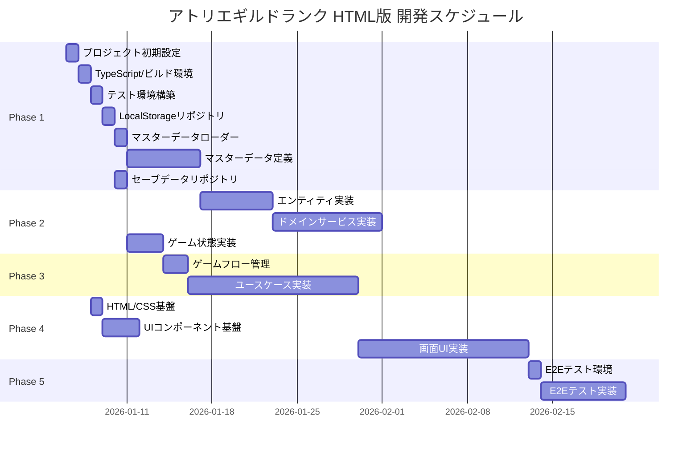

# アトリエギルドランク HTML版 - タスク概要

**作成日**: 2026-01-02
**ステータス**: 計画中
**総タスク数**: 72タスク（TASK-0072 〜 TASK-0143）
**推定総工数**: 576時間（約72日）
**推定期間**: 約4ヶ月（1日8時間換算）

---

## 全体進捗

- [ ] Phase 1: 基盤・インフラストラクチャ層（0/12タスク完了）
- [ ] Phase 2: ドメイン層（0/18タスク完了）
- [ ] Phase 3: アプリケーション層（0/16タスク完了）
- [ ] Phase 4: プレゼンテーション層（0/18タスク完了）
- [ ] Phase 5: 統合・E2Eテスト（0/8タスク完了）

---

## プロジェクト概要

錬金術師となってギルドランクを上げていくローグライクデッキビルディングゲームのHTML版実装。

### 技術スタック
- **言語**: TypeScript
- **UI**: HTML/CSS
- **永続化**: localStorage
- **アーキテクチャ**: Clean Architecture（4層）

### アーキテクチャ層
1. **Infrastructure層**: データ永続化、マスターデータ読み込み
2. **Domain層**: ゲームルール、エンティティ、バリューオブジェクト
3. **Application層**: ユースケース、ゲームフロー制御
4. **Presentation層**: UI、入力処理、画面遷移

---

## フェーズ構成

| フェーズ | 内容 | タスク数 | 推定時間 |
|---------|------|---------|---------|
| Phase 1 | 基盤・インフラストラクチャ層 | 12タスク | 96時間 |
| Phase 2 | ドメイン層 | 18タスク | 144時間 |
| Phase 3 | アプリケーション層 | 16タスク | 128時間 |
| Phase 4 | プレゼンテーション層 | 18タスク | 144時間 |
| Phase 5 | 統合・E2Eテスト | 8タスク | 64時間 |
| **合計** | | **72タスク** | **576時間** |

---

## タスク一覧（サマリー）

### Phase 1: 基盤・インフラストラクチャ層（TASK-0072 〜 TASK-0083）

| タスクID | タスク名 | 種別 | 依存 |
|---------|---------|------|------|
| TASK-0072 | プロジェクト初期設定 | DIRECT | - |
| TASK-0073 | TypeScript/ビルド環境構築 | DIRECT | TASK-0072 |
| TASK-0074 | テスト環境構築（Vitest） | DIRECT | TASK-0073 |
| TASK-0075 | LocalStorageリポジトリ基盤 | TDD | TASK-0074 |
| TASK-0076 | マスターデータローダー | TDD | TASK-0075 |
| TASK-0077 | カードマスターデータ定義 | TDD | TASK-0076 |
| TASK-0078 | 素材マスターデータ定義 | TDD | TASK-0076 |
| TASK-0079 | アイテムマスターデータ定義 | TDD | TASK-0076 |
| TASK-0080 | 依頼マスターデータ定義 | TDD | TASK-0076 |
| TASK-0081 | ランクマスターデータ定義 | TDD | TASK-0076 |
| TASK-0082 | アーティファクトマスターデータ定義 | TDD | TASK-0076 |
| TASK-0083 | セーブデータリポジトリ | TDD | TASK-0075 |

### Phase 2: ドメイン層（TASK-0084 〜 TASK-0101）

| タスクID | タスク名 | 種別 | 依存 |
|---------|---------|------|------|
| TASK-0084 | カードエンティティ | TDD | TASK-0077 |
| TASK-0085 | 素材エンティティ | TDD | TASK-0078 |
| TASK-0086 | アイテムエンティティ | TDD | TASK-0079 |
| TASK-0087 | 依頼エンティティ | TDD | TASK-0080 |
| TASK-0088 | ランクエンティティ | TDD | TASK-0081 |
| TASK-0089 | アーティファクトエンティティ | TDD | TASK-0082 |
| TASK-0090 | デッキドメインサービス | TDD | TASK-0084 |
| TASK-0091 | インベントリドメインサービス | TDD | TASK-0085, TASK-0086 |
| TASK-0092 | ドラフト採取ドメインサービス | TDD | TASK-0084, TASK-0085 |
| TASK-0093 | 調合ドメインサービス | TDD | TASK-0084, TASK-0085, TASK-0086 |
| TASK-0094 | 品質計算ドメインサービス | TDD | TASK-0093 |
| TASK-0095 | 依頼判定ドメインサービス | TDD | TASK-0087, TASK-0086 |
| TASK-0096 | ランク管理ドメインサービス | TDD | TASK-0088 |
| TASK-0097 | 昇格試験ドメインサービス | TDD | TASK-0096 |
| TASK-0098 | ショップドメインサービス | TDD | TASK-0084, TASK-0089 |
| TASK-0099 | ゲーム状態エンティティ | TDD | TASK-0083 |
| TASK-0100 | プレイヤー状態エンティティ | TDD | TASK-0099 |
| TASK-0101 | ゲームイベント定義 | TDD | TASK-0099 |

### Phase 3: アプリケーション層（TASK-0102 〜 TASK-0117）

| タスクID | タスク名 | 種別 | 依存 |
|---------|---------|------|------|
| TASK-0102 | ゲームフローマネージャー | TDD | TASK-0099, TASK-0101 |
| TASK-0103 | ステートマネージャー | TDD | TASK-0099 |
| TASK-0104 | ニューゲームユースケース | TDD | TASK-0102, TASK-0083 |
| TASK-0105 | ゲーム再開ユースケース | TDD | TASK-0102, TASK-0083 |
| TASK-0106 | 依頼受注ユースケース | TDD | TASK-0087, TASK-0103 |
| TASK-0107 | ドラフト採取ユースケース | TDD | TASK-0092, TASK-0103 |
| TASK-0108 | 調合実行ユースケース | TDD | TASK-0093, TASK-0094, TASK-0103 |
| TASK-0109 | 納品ユースケース | TDD | TASK-0095, TASK-0103 |
| TASK-0110 | フェーズ遷移ユースケース | TDD | TASK-0102 |
| TASK-0111 | 日数経過ユースケース | TDD | TASK-0096, TASK-0103 |
| TASK-0112 | ショップ購入ユースケース | TDD | TASK-0098, TASK-0103 |
| TASK-0113 | 昇格試験開始ユースケース | TDD | TASK-0097, TASK-0103 |
| TASK-0114 | 昇格試験判定ユースケース | TDD | TASK-0097, TASK-0103 |
| TASK-0115 | ゲームクリア判定ユースケース | TDD | TASK-0096, TASK-0103 |
| TASK-0116 | ゲームオーバー判定ユースケース | TDD | TASK-0096, TASK-0103 |
| TASK-0117 | オートセーブユースケース | TDD | TASK-0083, TASK-0103 |

### Phase 4: プレゼンテーション層（TASK-0118 〜 TASK-0135）

| タスクID | タスク名 | 種別 | 依存 |
|---------|---------|------|------|
| TASK-0118 | HTML/CSSベースレイアウト | DIRECT | TASK-0073 |
| TASK-0119 | UIコンポーネント基盤 | TDD | TASK-0118 |
| TASK-0120 | 入力システム（InputManager） | TDD | TASK-0119 |
| TASK-0121 | 画面遷移システム | TDD | TASK-0119 |
| TASK-0122 | タイトル画面UI | TDD | TASK-0121, TASK-0104, TASK-0105 |
| TASK-0123 | メイン画面レイアウト | TDD | TASK-0121 |
| TASK-0124 | ヘッダーUI（ランク・日数・ゴールド） | TDD | TASK-0123 |
| TASK-0125 | 依頼受注フェーズUI | TDD | TASK-0123, TASK-0106 |
| TASK-0126 | ドラフト採取フェーズUI | TDD | TASK-0123, TASK-0107 |
| TASK-0127 | 調合フェーズUI | TDD | TASK-0123, TASK-0108 |
| TASK-0128 | 納品フェーズUI | TDD | TASK-0123, TASK-0109 |
| TASK-0129 | ショップ画面UI | TDD | TASK-0121, TASK-0112 |
| TASK-0130 | 昇格試験画面UI | TDD | TASK-0121, TASK-0113, TASK-0114 |
| TASK-0131 | リザルト画面UI（クリア） | TDD | TASK-0121, TASK-0115 |
| TASK-0132 | リザルト画面UI（ゲームオーバー） | TDD | TASK-0121, TASK-0116 |
| TASK-0133 | カードコンポーネント | TDD | TASK-0119 |
| TASK-0134 | ダイアログコンポーネント | TDD | TASK-0119 |
| TASK-0135 | アニメーションシステム | TDD | TASK-0119 |

### Phase 5: 統合・E2Eテスト（TASK-0136 〜 TASK-0143）

| タスクID | タスク名 | 種別 | 依存 |
|---------|---------|------|------|
| TASK-0136 | E2Eテスト環境構築 | DIRECT | TASK-0135 |
| TASK-0137 | タイトル→ゲーム開始E2E | TDD | TASK-0136, TASK-0122 |
| TASK-0138 | 1ターンサイクルE2E | TDD | TASK-0136, TASK-0128 |
| TASK-0139 | ショップ購入E2E | TDD | TASK-0136, TASK-0129 |
| TASK-0140 | 昇格試験E2E | TDD | TASK-0136, TASK-0130 |
| TASK-0141 | ゲームクリアE2E | TDD | TASK-0136, TASK-0131 |
| TASK-0142 | ゲームオーバーE2E | TDD | TASK-0136, TASK-0132 |
| TASK-0143 | セーブ・ロードE2E | TDD | TASK-0136, TASK-0117 |

---

## 信頼性インジケーター

各タスクには設計文書からの信頼性レベルを付与：

- 🔵 **青信号**: 要件定義書・設計書に明確に記載されている
- 🟡 **黄信号**: 要件定義書・設計書から妥当に推測できる
- 🔴 **赤信号**: 要件定義書・設計書にない推測（実装時に確認必要）

---

## タスク番号管理

| 項目 | 値 |
|------|-----|
| **使用済みタスク番号** | TASK-0001 〜 TASK-0071（別プロジェクト） |
| **本プロジェクト使用番号** | TASK-0072 〜 TASK-0143 |
| **次回開始番号** | TASK-0144 |

---

## マイルストーン

| マイルストーン | 完了条件 | 対象フェーズ |
|--------------|---------|-------------|
| M1: 開発環境完成 | プロジェクト設定、ビルド、テスト環境が動作 | Phase 1（TASK-0072〜0074） |
| M2: データ層完成 | マスターデータ・セーブデータの読み書きが可能 | Phase 1（TASK-0075〜0083） |
| M3: ドメインロジック完成 | 全ゲームルールがテスト済み | Phase 2（TASK-0084〜0101） |
| M4: ユースケース完成 | 全ゲームフローが動作 | Phase 3（TASK-0102〜0117） |
| M5: UI完成 | 全画面が操作可能 | Phase 4（TASK-0118〜0135） |
| M6: リリース準備完了 | E2Eテスト全通過 | Phase 5（TASK-0136〜0143） |

---

## クリティカルパス

最長依存チェーン（ボトルネック）：

```
TASK-0072 → TASK-0073 → TASK-0074 → TASK-0075 → TASK-0076 → TASK-0077 → TASK-0084 → TASK-0090 → TASK-0092 → TASK-0107 → TASK-0126
（プロジェクト設定 → ビルド環境 → テスト環境 → ストレージ基盤 → データローダー → カードマスター → カードエンティティ → デッキサービス → ドラフト採取サービス → ドラフト採取ユースケース → ドラフト採取UI）
```

---

## 実行順序（Mermaidガントチャート）



---

## 関連文書

- **要件定義**: [../requirements/atelier-guild-rank.md](../requirements/atelier-guild-rank.md)
- **技術設計**: [../design/atelier-guild-rank/architecture.md](../design/atelier-guild-rank/architecture.md)
- **インターフェース定義**: [../design/atelier-guild-rank/interfaces.ts](../design/atelier-guild-rank/interfaces.ts)
- **UI設計**: [../design/atelier-guild-rank/ui-design/overview.md](../design/atelier-guild-rank/ui-design/overview.md)

---

## フェーズ別詳細ファイル

- [Phase 1: 基盤・インフラストラクチャ層](./atelier-guild-rank-phase1.md)
- [Phase 2: ドメイン層](./atelier-guild-rank-phase2.md)
- [Phase 3: アプリケーション層](./atelier-guild-rank-phase3.md)
- [Phase 4: プレゼンテーション層](./atelier-guild-rank-phase4.md)
- [Phase 5: 統合・E2Eテスト](./atelier-guild-rank-phase5.md)

---

## 変更履歴

| 日付 | バージョン | 変更内容 |
|------|-----------|---------|
| 2026-01-02 | 1.0.0 | 初版作成 |
