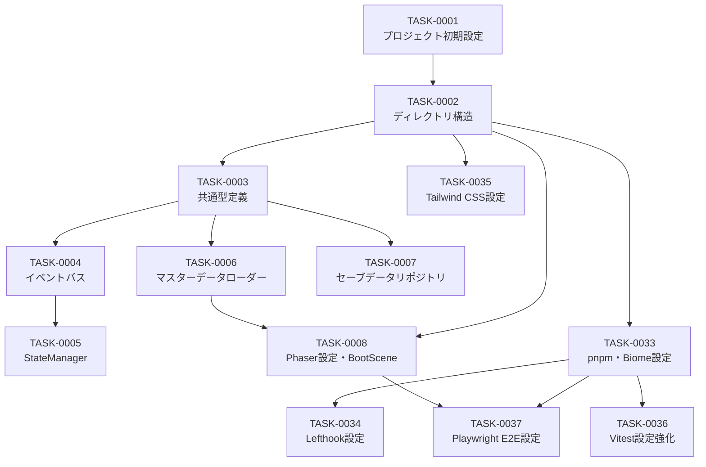
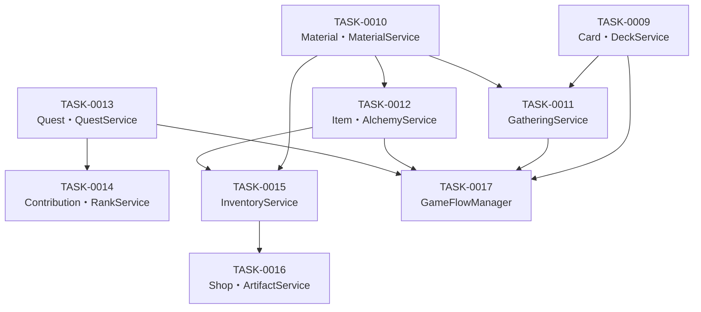
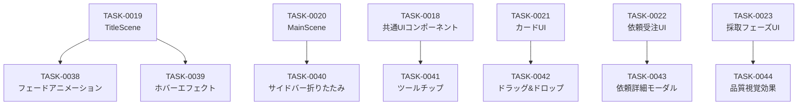

# atelier-guild-rank タスク一覧

**作成日**: 2026-01-16
**バージョン**: 1.0.0
**タスク粒度**: 半日単位（4時間）
**総タスク数**: 44タスク
**総見積時間**: 174時間（約22日）

---

## 概要

「atelier-guild-rank」プロジェクトの実装タスク一覧。
Phaser 3 + rexUI + TypeScriptによるギルドランク制デッキ構築RPGの開発タスクを
5フェーズに分割して管理する。

### プロジェクト情報

| 項目 | 値 |
|------|-----|
| **フレームワーク** | Phaser 3.87+ / rexUI |
| **言語** | TypeScript 5.x |
| **ビルドツール** | Vite 5.x |
| **アーキテクチャ** | Clean Architecture（4層） |
| **テストカバレッジ目標** | 80%以上 |

---

## フェーズ一覧

| フェーズ | 名称 | タスク数 | 見積時間 | 説明 |
|---------|------|---------|---------|------|
| Phase 1 | 基盤構築 | 13 | 50時間 | プロジェクト設定、インフラ層構築、開発環境整備 |
| Phase 2 | ドメイン層・コアサービス | 9 | 36時間 | エンティティ、サービス実装 |
| Phase 3 | UI層 | 10 | 40時間 | シーン、UIコンポーネント実装 |
| Phase 4 | 統合・テスト | 5 | 20時間 | 統合、テスト、デプロイ |
| Phase 5 | UI強化・ポリッシュ | 7 | 28時間 | UIアニメーション、UX改善 |

---

## Phase 1: 基盤構築（50時間）

プロジェクトの土台となる設定とインフラ層の構築、開発環境整備。

| タスクID | タスク名 | 見積 | 依存 | 状態 |
|---------|---------|-----|------|------|
| [TASK-0001](./phase-1/TASK-0001.md) | プロジェクト初期設定 | 4h | - | ✅ |
| [TASK-0002](./phase-1/TASK-0002.md) | ディレクトリ構造作成 | 4h | TASK-0001 | ✅ |
| [TASK-0003](./phase-1/TASK-0003.md) | 共通型定義 | 4h | TASK-0002 | ✅ |
| [TASK-0004](./phase-1/TASK-0004.md) | イベントバス実装 | 4h | TASK-0003 | ✅ |
| [TASK-0005](./phase-1/TASK-0005.md) | StateManager実装 | 4h | TASK-0004 | ✅ |
| [TASK-0006](./phase-1/TASK-0006.md) | マスターデータローダー実装 | 4h | TASK-0003 | ✅ |
| [TASK-0007](./phase-1/TASK-0007.md) | セーブデータリポジトリ実装 | 4h | TASK-0003 | ✅ |
| [TASK-0008](./phase-1/TASK-0008.md) | Phaser基本設定とBootScene | 4h | TASK-0002, TASK-0006 | ✅ |
| [TASK-0033](./phase-1/TASK-0033.md) | pnpm移行とBiome設定 | 4h | TASK-0002 | ✅ |
| [TASK-0034](./phase-1/TASK-0034.md) | Lefthook設定 | 2h | TASK-0033 | ✅ |
| [TASK-0035](./phase-1/TASK-0035.md) | Tailwind CSS設定 | 4h | TASK-0002 | ✅ |
| [TASK-0036](./phase-1/TASK-0036.md) | Vitest設定強化 | 4h | TASK-0033 | ✅ |
| [TASK-0037](./phase-1/TASK-0037.md) | Playwright E2E設定 | 4h | TASK-0033, TASK-0008 | ✅ |

### Phase 1 依存関係図



---

## Phase 2: ドメイン層・コアサービス（36時間）

ゲームロジックの中核となるエンティティとサービスの実装。

| タスクID | タスク名 | 見積 | 依存 | 状態 |
|---------|---------|-----|------|------|
| [TASK-0009](./phase-2/TASK-0009.md) | カードエンティティ・DeckService | 4h | TASK-0003, TASK-0004 | ✅ |
| [TASK-0010](./phase-2/TASK-0010.md) | 素材エンティティ・MaterialService | 4h | TASK-0003, TASK-0004 | ✅ |
| [TASK-0011](./phase-2/TASK-0011.md) | GatheringService（ドラフト採取） | 4h | TASK-0009, TASK-0010 | ✅ |
| [TASK-0012](./phase-2/TASK-0012.md) | アイテムエンティティ・AlchemyService | 4h | TASK-0010 | ✅ |
| [TASK-0013](./phase-2/TASK-0013.md) | 依頼エンティティ・QuestService | 4h | TASK-0003, TASK-0004 | ✅ |
| [TASK-0014](./phase-2/TASK-0014.md) | ContributionCalculator・RankService | 4h | TASK-0005, TASK-0013 | ✅ |
| [TASK-0015](./phase-2/TASK-0015.md) | InventoryService | 4h | TASK-0010, TASK-0012 | ✅ |
| [TASK-0016](./phase-2/TASK-0016.md) | ShopService・ArtifactService | 4h | TASK-0005, TASK-0015 | ✅ |
| [TASK-0017](./phase-2/TASK-0017.md) | GameFlowManager | 4h | TASK-0005, TASK-0009〜TASK-0013 | ✅ |

### Phase 2 依存関係図



---

## Phase 3: UI層（40時間）

ユーザーインターフェースの実装。

| タスクID | タスク名 | 見積 | 依存 | 状態 |
|---------|---------|-----|------|------|
| [TASK-0018](./phase-3/TASK-0018.md) | 共通UIコンポーネント基盤 | 4h | TASK-0008 | ✅ |
| [TASK-0019](./phase-3/TASK-0019.md) | TitleScene | 4h | TASK-0008, TASK-0018 | ✅ |
| [TASK-0020](./phase-3/TASK-0020.md) | MainScene共通レイアウト | 4h | TASK-0018, TASK-0017 | ✅ |
| [TASK-0021](./phase-3/TASK-0021.md) | カードUIコンポーネント | 4h | TASK-0018, TASK-0009 | ✅ |
| [TASK-0022](./phase-3/TASK-0022.md) | 依頼受注フェーズUI | 4h | TASK-0020, TASK-0013 | ✅ |
| [TASK-0023](./phase-3/TASK-0023.md) | 採取フェーズUI（ドラフト採取） | 4h | TASK-0020, TASK-0021, TASK-0011 | ✅ |
| [TASK-0024](./phase-3/TASK-0024.md) | 調合フェーズUI | 4h | TASK-0020, TASK-0021, TASK-0012 | ✅ |
| [TASK-0025](./phase-3/TASK-0025.md) | 納品フェーズUI | 4h | TASK-0020, TASK-0013, TASK-0014 | ✅ |
| [TASK-0026](./phase-3/TASK-0026.md) | ショップ画面・昇格試験画面 | 4h | TASK-0018, TASK-0016 | ✅ |
| [TASK-0027](./phase-3/TASK-0027.md) | リザルト画面（GameOver/GameClear） | 4h | TASK-0018, TASK-0017 | ✅ |

---

## Phase 4: 統合・テスト（20時間）

システム統合とテスト、デプロイ準備。

| タスクID | タスク名 | 見積 | 依存 | 状態 |
|---------|---------|-----|------|------|
| [TASK-0028](./phase-4/TASK-0028.md) | サービス統合・DI設定 | 4h | TASK-0009〜TASK-0017 | ✅ |
| [TASK-0029](./phase-4/TASK-0029.md) | セーブ/ロード機能統合 | 4h | TASK-0007, TASK-0028 | ✅ |
| [TASK-0030](./phase-4/TASK-0030.md) | E2Eテスト・デバッグ | 4h | TASK-0028, TASK-0029 | ✅ |
| [TASK-0031](./phase-4/TASK-0031.md) | バランス調整・マスターデータ整備 | 4h | TASK-0030 | ✅ |
| [TASK-0032](./phase-4/TASK-0032.md) | ビルド・デプロイ設定 | 4h | TASK-0030, TASK-0031 | ✅ |

---

## Phase 5: UI強化・ポリッシュ（28時間）

既存UIの推奨条件として定義されていた機能を実装し、ユーザー体験を向上させる。

| タスクID | タスク名 | 見積 | 依存 | 状態 | タイプ |
|---------|---------|-----|------|------|-------|
| [TASK-0038](./phase-5/TASK-0038.md) | フェードイン・アウトアニメーション | 4h | TASK-0019 | ✅ | DIRECT |
| [TASK-0039](./phase-5/TASK-0039.md) | ボタンホバーエフェクト強化 | 4h | TASK-0019 | ✅ | DIRECT |
| [TASK-0040](./phase-5/TASK-0040.md) | サイドバー折りたたみアニメーション | 4h | TASK-0020 | ✅ | DIRECT |
| [TASK-0041](./phase-5/TASK-0041.md) | ツールチップ表示システム | 4h | TASK-0018 | ⬜ | TDD |
| [TASK-0042](./phase-5/TASK-0042.md) | カードドラッグ＆ドロップ機能 | 4h | TASK-0021 | ⬜ | TDD |
| [TASK-0043](./phase-5/TASK-0043.md) | 依頼詳細モーダル・受注アニメーション | 4h | TASK-0022 | ⬜ | TDD |
| [TASK-0044](./phase-5/TASK-0044.md) | 品質に応じた視覚効果 | 4h | TASK-0023 | ⬜ | DIRECT |

### Phase 5 依存関係図



---

## クリティカルパス

プロジェクト完了までの最長経路:

```
TASK-0001 → TASK-0002 → TASK-0003 → TASK-0004 → TASK-0005
    ↓
TASK-0013 → TASK-0014 → TASK-0017 → TASK-0020 → TASK-0025
    ↓
TASK-0028 → TASK-0029 → TASK-0030 → TASK-0031 → TASK-0032
```

**クリティカルパス上の総時間**: 約60時間（15タスク × 4時間）

---

## 並列実行可能なタスク

以下のタスクは並列実行が可能:

### Phase 1
- TASK-0006, TASK-0007（共にTASK-0003完了後）

### Phase 2
- TASK-0009, TASK-0010, TASK-0013（共にPhase 1完了後）
- TASK-0012, TASK-0015（依存関係が独立）

### Phase 3
- TASK-0022, TASK-0023, TASK-0024, TASK-0025（共にTASK-0020完了後）

---

## 凡例

| 状態 | 意味 |
|------|-----|
| ⬜ | 未着手 |
| 🔄 | 進行中 |
| ✅ | 完了 |
| ⏸️ | 保留 |

---

## 関連文書

- **アーキテクチャ設計書**: [../design/atelier-guild-rank/architecture-overview.md](../design/atelier-guild-rank/architecture-overview.md)
- **ゲームメカニクス設計**: [../design/atelier-guild-rank/game-mechanics.md](../design/atelier-guild-rank/game-mechanics.md)
- **UI設計概要**: [../design/atelier-guild-rank/ui-design/overview.md](../design/atelier-guild-rank/ui-design/overview.md)
- **インターフェース定義**: [../design/atelier-guild-rank/interfaces.ts](../design/atelier-guild-rank/interfaces.ts)

---

## 変更履歴

| 日付 | バージョン | 変更内容 |
|------|----------|---------|
| 2026-01-16 | 1.0.0 | 初版作成（32タスク、4フェーズ構成） |
| 2026-01-16 | 1.1.0 | 開発環境タスク追加（TASK-0033～0037: pnpm, Biome, Lefthook, Tailwind, Vitest, Playwright） |
| 2026-01-18 | 1.2.0 | タスク進捗更新: TASK-0011(GatheringService)完了、TASK-0018(共通UIコンポーネント基盤)完了、TASK-0019(TitleScene)完了、TASK-0013(QuestService)完了、TASK-0014(RankService)完了、TASK-0015(InventoryService)完了 |
| 2026-01-18 | 1.3.0 | タスク進捗更新: TASK-0021(カードUIコンポーネント)完了 - TDD開発完了、29テストケース全通過 |
| 2026-01-18 | 1.4.0 | タスク進捗更新: Phase 2完了（TASK-0016, TASK-0017）、Phase 3完了（TASK-0020, TASK-0022〜TASK-0027） - 全UI層実装完了 |
| 2026-01-18 | 1.5.0 | タスク進捗更新: TASK-0029（セーブ/ロード機能統合）完了 - TDD開発完了、29テストケース全通過 |
| 2026-01-18 | 1.6.0 | Phase 5追加: UI強化・ポリッシュ（7タスク、28時間）- TASK-0038～0044作成 |
| 2026-01-18 | 1.7.0 | タスク進捗更新: TASK-0030（E2Eテスト・デバッグ）完了 - DebugTools実装、ページオブジェクト作成、17テストケース全通過 |
| 2026-01-18 | 1.8.0 | タスク進捗更新: TASK-0031（バランス調整・マスターデータ整備）完了 - 全マスターデータ7ファイル整備 |
| 2026-01-19 | 1.9.0 | タスク進捗更新: TASK-0032（ビルド・デプロイ設定）完了 - Phase 4全タスク完了、Vite設定・GitHub Actions設定、ビルドサイズ2.4MB |
