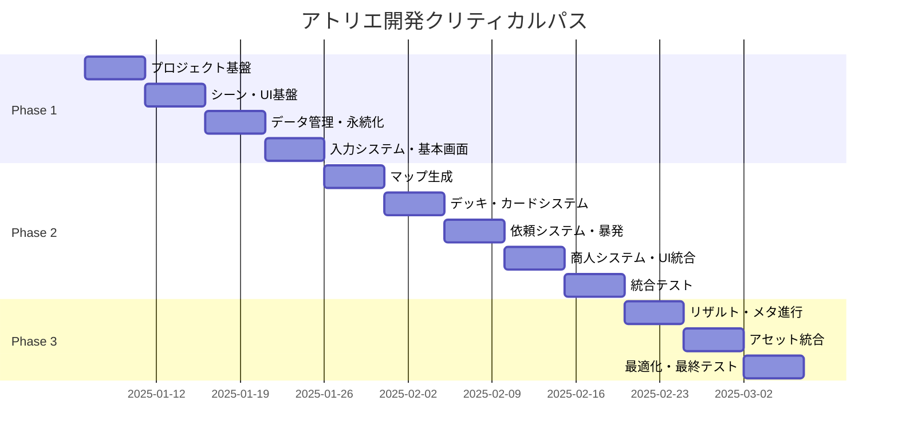

# アトリエ タスク概要

## プロジェクト情報

| 項目 | 値 |
|------|-----|
| プロジェクト名 | アトリエ（錬金術×ローグライク×デッキ構築ゲーム） |
| 要件名 | atelier |
| 技術スタック | Unity 2021.3 LTS, C# (.NET Standard 2.1), JSON, Unity UI (uGUI) |
| アーキテクチャ | Clean Architecture (4層構造) |
| 総推定期間 | 約3ヶ月（60営業日） |
| 総タスク数 | 66タスク |
| 総工数 | 約480時間 |

---

## フェーズ構成

| フェーズ | 期間 | タスク数 | 工数 | ファイル | 状態 |
|---------|------|---------|------|----------|------|
| Phase 1: 基盤構築 | 20日 | 23タスク | 160時間 | [atelier-phase1.md](atelier-phase1.md) | ⬜ 未着手 |
| Phase 2: ゲームシステム | 25日 | 28タスク | 200時間 | [atelier-phase2.md](atelier-phase2.md) | ⬜ 未着手 |
| Phase 3: 仕上げ・最適化 | 15日 | 15タスク | 120時間 | [atelier-phase3.md](atelier-phase3.md) | ⬜ 未着手 |

---

## タスク番号管理

### 使用済み番号
| 番号範囲 | 状態 | 備考 |
|---------|------|------|
| TASK-0001 〜 TASK-0005 | 実装済み | ConfigDataLoader, RandomGenerator等 |

### 割り当て済み番号
| 番号範囲 | フェーズ | 備考 |
|---------|---------|------|
| TASK-0006 〜 TASK-0028 | Phase 1 | 基盤構築 (23タスク) |
| TASK-0029 〜 TASK-0056 | Phase 2 | ゲームシステム (28タスク) |
| TASK-0057 〜 TASK-0071 | Phase 3 | 仕上げ・最適化 (15タスク) |

### 次回開始番号
- **TASK-0072** から使用可能

---

## 全体進捗

### Phase 1: ゲーム基盤部分の作成
- [ ] Week 1: プロジェクト基盤・アーキテクチャ構築 (5タスク)
- [ ] Week 2: シーン管理・UI基盤 (6タスク)
- [ ] Week 3: データ管理・永続化 (6タスク)
- [ ] Week 4: 入力システム・基本画面 (6タスク)

### Phase 2: ゲームシステム実装
- [ ] Week 1: マップ生成・ナビゲーション (6タスク)
- [ ] Week 2: デッキ管理・カードシステム (6タスク)
- [ ] Week 3: 依頼システム・暴発判定 (6タスク)
- [ ] Week 4: 商人システム・UI統合 (8タスク)
- [ ] Week 5: 統合テスト・バグ修正 (2タスク)

### Phase 3: 仕上げと最適化
- [ ] Week 1: リザルト・メタ進行 (4タスク)
- [ ] Week 2: アセット統合・ポリッシュ (4タスク)
- [ ] Week 3: 最適化・バランス調整・最終テスト (7タスク)

---

## マイルストーン

| マイルストーン | 目標日 | 成果物 | 状態 |
|---------------|--------|--------|------|
| M1: 基盤完成 | Phase 1 完了時 | タイトル〜スタイル選択画面動作 | ⬜ |
| M2: コアループ完成 | Phase 2 Week 3 | 依頼→カードプレイ→達成/暴発フロー | ⬜ |
| M3: ゲームプレイ可能 | Phase 2 完了時 | マップ〜商人含む全画面動作 | ⬜ |
| M4: MVP完成 | Phase 3 完了時 | バランス調整済み完成版 | ⬜ |

---

## クリティカルパス

### クリティカルパス詳細

1. **基盤構築 → シーン管理 → データ管理 → 入力システム**
   - 全ての後続タスクの前提となる基盤

2. **マップ生成 → デッキシステム → 依頼システム**
   - ゲームコアループの主要経路

3. **依頼システム → 商人システム → 統合テスト**
   - ゲームプレイ可能な状態への経路

---

## タスクタイプ定義

### TDD タスク
コーディング、ビジネスロジック実装、UI実装など開発作業

**プロセス**:
1. `/tdd-requirements` - 詳細要件定義
2. `/tdd-testcases` - テストケース作成
3. `/tdd-red` - テスト実装（失敗）
4. `/tdd-green` - 最小実装
5. `/tdd-refactor` - リファクタリング
6. `/tdd-verify-complete` - 品質確認

### DIRECT タスク
環境構築、設定ファイル作成、ドキュメント作成など準備作業

**プロセス**:
1. `/direct-setup` - 直接実装・設定
2. `/direct-verify` - 動作確認・品質確認

---

## 信頼性レベル

各タスクに付与される信号:
- 🔵 **青信号**: EARS要件定義書・設計文書を参考にしてほぼ推測していない
- 🟡 **黄信号**: EARS要件定義書・設計文書から妥当な推測
- 🔴 **赤信号**: EARS要件定義書・設計文書にない推測

---

## 設計文書参照

| 文書 | パス |
|------|------|
| システムアーキテクチャ | docs/design/atelier/architecture.md |
| コアシステム設計 | docs/design/atelier/core-systems.md |
| データフロー設計 | docs/design/atelier/dataflow.md |
| データスキーマ設計 | docs/design/atelier/data-schema.md |
| ゲームメカニクス | docs/design/atelier/game-mechanics.md |
| バランス設計 | docs/design/atelier/balance-design.md |
| オーディオ設計 | docs/design/atelier/audio-design.md |
| UI設計概要 | docs/design/atelier/ui-design/overview.md |
| 入力システム | docs/design/atelier/ui-design/input-system.md |
| タイトル画面 | docs/design/atelier/ui-design/screens/title.md |
| スタイル選択画面 | docs/design/atelier/ui-design/screens/style-select.md |
| マップ画面 | docs/design/atelier/ui-design/screens/map.md |
| 依頼画面 | docs/design/atelier/ui-design/screens/quest.md |
| 商人画面 | docs/design/atelier/ui-design/screens/merchant.md |
| リザルト画面 | docs/design/atelier/ui-design/screens/result.md |

---

## 変更履歴

| 日付 | バージョン | 変更内容 |
|------|----------|---------|
| 2025-12-21 | 1.0 | 初版作成 |
